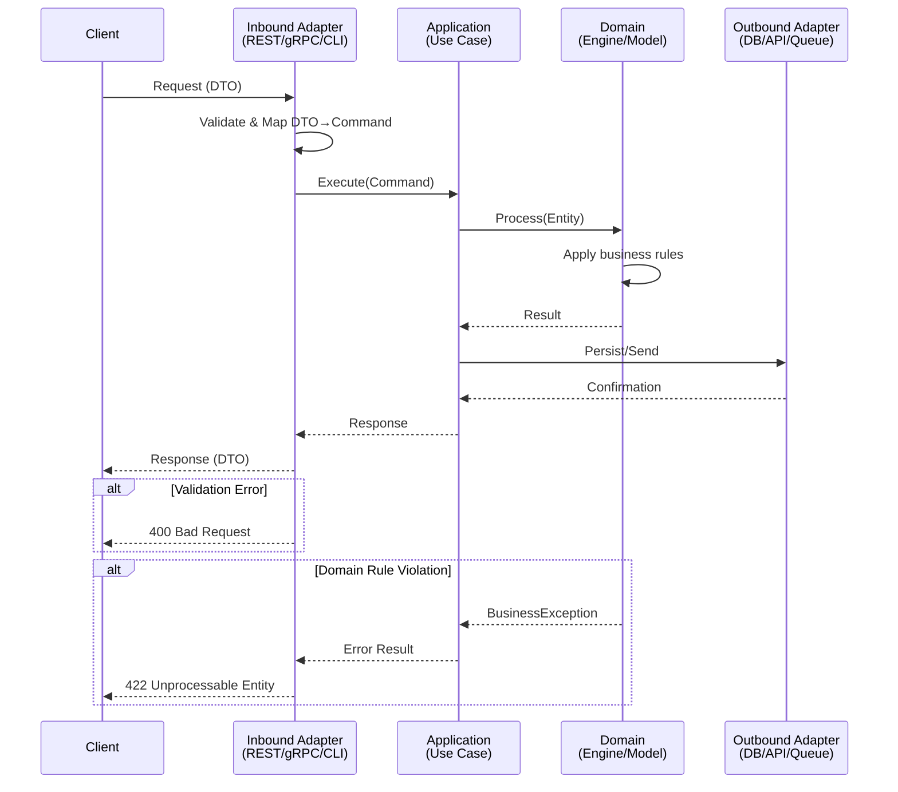

# Create Stories from Epic and System Specification

This skill generates individual story files — the implementable work items that developers
pick up and build. Each story is self-contained: a developer should be able to implement it
without going back to the original spec.

## Why Self-Contained Stories Matter

A story that says "implement the main operation" is useless without the data contract,
the field mappings, the validation rules, and the error codes. Developers shouldn't
need to context-switch between the story and the spec. The story IS the spec for that slice
of work — precise, testable, and complete.

## Prerequisites

Read the following files before starting:

**Template (output structure):**
- `resources/templates/_TEMPLATE-STORY.md` — The exact structure to follow

**Decomposition philosophy (sizing and boundary heuristics):**
- `.github/skills/x-story-epic-full/SKILL.md`

**Gherkin completeness requirements:**
- `.github/skills/story-planning/SKILL.md` — Rule 13, section SD-02 (mandatory scenario categories and TPP ordering)

**Required inputs from the user:**
- The system specification file (original spec)
- The Epic file (with story index and rules table) — generated by `x-story-epic` skill

## Workflow

### Step 1: Read the Epic and Spec

Read both files completely. From the Epic, extract:
- The story index (IDs, titles, dependencies)
- The rules table (RULE-001..N) — stories will reference these by ID
- The DoD (copied into each story for quick reference)

From the spec, understand the full technical context: journeys, data contracts, protocol
mappings, state machines, error codes, metrics.

### Step 2: Generate Each Story

For each story in the Epic's index, create a file following `_TEMPLATE-STORY.md`. Process
stories in dependency order (foundations first, then core, then extensions).

#### Section 1 — Dependencies

| Blocked By | Blocks |
| :--- | :--- |
| Stories this one depends on | Stories that depend on this one |

Must be consistent with the Epic's index. Cross-check: if story-0001-0003 lists story-0001-0002 as
blocker, then story-0001-0002 must list story-0001-0003 in its Blocks column.

#### Section 2 — Applicable Cross-Cutting Rules

Reference only the rules from the Epic that impact this specific story. Don't list rules
that are irrelevant to this story's scope.

#### Section 3 — Description

Start with user story format: "Como **<Persona>**, eu quero <capability>, garantindo que <outcome>."

Follow with 2-3 paragraphs of technical context: why this story exists, how it fits in the
epic, what architectural patterns it establishes or reuses. Include specific protocol details,
component names, and design decisions from the spec.

Add numbered subsections (3.1, 3.2, ...) for each distinct technical requirement. Be specific:
protocol details, framing formats, concurrency requirements, timeout values — everything a
developer needs.

#### Section 4 — Local Quality Definitions

**Local DoR**: Specific preconditions for this story. Use checkboxes `- [ ]`.
Examples: "TCP port defined", "Table X schema created", "Decision on Y made".

**Local DoD**: Specific acceptance criteria for this story. Use checkboxes.
Examples: "TCP server accepting connections", "Handler X functional", "Load test validated".

**Global DoD**: Copy from the Epic verbatim. This is for quick reference during code review.

#### Section 5 — Data Contracts

This is the most critical section. Data contracts must be copy-paste precise.

For protocol-based stories (binary protocols, gRPC, etc.), use the format:

| Campo | Formato | Request | Response | Origem / Regra |
| :--- | :--- | :--- | :--- | :--- |
| `field_name` | type format | M/O/- | M/O/- | Generate/Echo/Derive — description |

For REST-based stories, use:

| Campo | Tipo | Obrigatório | Descrição |
| :--- | :--- | :--- | :--- |
| `field_name` | type | Sim/Não/Condicional | description |

**Precision rules:**
- Field names must match the spec exactly (same casing, same naming)
- Types must include format details (n 6, LLVAR z..37, VARCHAR(64))
- M/O flags must reflect the actual contract, not guesses
- Derivation rules must explain exactly how values are computed

#### Section 6 — Diagrams

Create Mermaid sequence diagrams showing the complete flow for this story's main operation.
Use the actual component names from the spec (not generic "Service A", "Service B").

Include:
- The trigger (client request, Kafka event, timer)
- Validation steps
- Business logic (decision engine, routing)
- Persistence (DB writes, cache updates)
- Async operations (Kafka publish, logging)
- Response construction
- Error paths (at least one error scenario)

##### Diagram Requirement Matrix

| Story Type | Sequence Diagram | Deployment Diagram | Activity Diagram |
|:---|:---|:---|:---|
| Request→Response flow (REST, gRPC, TCP) | **MANDATORY** | — | Recommended if 3+ branches |
| Event-driven flow (producer→broker→consumer) | **MANDATORY** | — | Recommended if 3+ branches |
| Infrastructure / deployment change | — | **MANDATORY** | — |
| Complex business logic (3+ decision branches) | Recommended | — | **MANDATORY** |
| Documentation / configuration only | Not required | Not required | Not required |
| Refactoring (no behavior change) | Recommended | — | — |

Rules:
- A story involving data flow between 2+ components MUST include a sequence diagram.
- A story altering infrastructure MUST include a deployment diagram.
- A story with no data flow and no infrastructure change MAY omit diagrams but should note "Diagram not required for this story type."

##### Inter-Layer Sequence Diagram Template

Use this template as the starting point for stories involving request→response flows:



Participant naming rules:
- Use actual component names from the spec (not generic "Service A").
- Must show at least: trigger → validation → business logic → persistence → response.
- Must include at least 1 error scenario with `alt` block.

##### Diagram Validation Checklist

- [ ] Participants use real component names (not "Service A", "Service B")
- [ ] Diagram shows at least 3 architecture layers (e.g., Inbound → Application → Domain)
- [ ] At least 1 error path is shown using `alt` block
- [ ] All data transformations are visible (DTO→Command, Entity→Domain)
- [ ] Async operations (if any) are distinguished from sync calls
- [ ] Response construction path is complete (from domain result back to client)

#### Section 7 — Acceptance Criteria (Gherkin)

Write Gherkin scenarios in Portuguese (DADO/QUANDO/ENTÃO/E/MAS).

**Mandatory scenario categories (TPP order):**
1. **Degenerate cases** (first): null input, empty collection, zero value, missing required field — at least 1 scenario
2. **Happy path**: Main success flow with concrete values — at least 1 scenario
3. **Error paths**: Each documented error type must have a corresponding scenario with expected error code/message — at least 1 per error type
4. **Boundary values**: Triplet pattern for each bounded input — (at-minimum, at-maximum, past-maximum) — at least 1 triplet
5. **Complex edge cases** (if applicable): Combinations, race conditions, state transitions

**Minimum floor:** 4 scenarios per story (degenerate + happy + error + boundary/edge). If fewer than 4, add scenarios from under-represented categories or emit a warning.

**TPP ordering rationale:** Scenarios ordered from simplest (degenerate/null guards) to most complex (edge cases) to match the natural TDD red-green-refactor cycle. Degenerate cases MUST appear before happy paths.

**Boundary value triplet pattern:**
When a story involves bounded inputs (numeric ranges, string lengths, collection sizes), generate three scenarios per bound:
- At-minimum (e.g., value = 1 for range [1, 100])
- At-maximum (e.g., value = 100)
- Past-maximum (e.g., value = 101)
If the story has no naturally bounded inputs, boundary scenarios may be omitted but the 4-scenario minimum must still be met.

**Quality rules for Gherkin:**
- Use concrete values, not abstractions ("valor de R$ 100,50" not "um valor qualquer")
- Each scenario should be independently testable
- Avoid overlapping scenarios — each tests a distinct behavior
- Include field-level assertions ("o campo DE 39 deve ser '00'")

#### Section 8 — Sub-tasks

Break the story into granular tasks, each estimable at 2-4 hours:

- `[Dev]` — Implementation tasks (handler, service, repository, migration)
- `[Test]` — Test tasks (unit, integration, E2E, performance)
- `[Doc]` — Documentation tasks (diagrams, wiki, API docs)

Use checkboxes `- [ ]` for tracking.

### Step 2.X: Optional Jira Integration (per story)

After generating each story's markdown content but before saving, optionally create the
story in Jira.

#### Mode A: Cascaded from Orchestrator

If a `jiraContext` was provided by the orchestrator (`x-story-epic-full`) with
`jiraContext.enabled == true` and `jiraContext.cascadeToStories == true`:

For each story (no additional user prompting needed):
1. Call `mcp__atlassian__createJiraIssue` to create a Story issue:
   - `cloudId`: `jiraContext.cloudId`
   - `projectKey`: `jiraContext.projectKey`
   - `issueTypeName`: "Story"
   - `summary`: the story title
   - `description`: the user story text from Section 3 (the "Como **Persona**..." paragraph)
   - `contentFormat`: "markdown"
   - `parent` (optional): `jiraContext.epicIssueKey` — include only if `jiraContext.epicIssueKey` is present; omit entirely when absent (e.g., epic creation failed in Phase B) to avoid MCP errors and maintain non-blocking behavior
   - `additional_fields`: `{ "labels": [{ "name": "generated-by-ia-dev-env" }] }`
2. Capture the returned Jira issue key
3. Replace `<CHAVE-JIRA>` in the story markdown with the actual key
4. Store the mapping `{ storyId -> jiraKey }` for later dependency linking

If creation fails for a story: log a warning, set `<CHAVE-JIRA>` to `—`, continue
with remaining stories.

#### Mode B: Standalone Invocation

If no `jiraContext` was provided (skill invoked directly, not via orchestrator):

1. Check if `mcp__atlassian__createJiraIssue` is available. If not available, skip Jira
   integration entirely — replace all `<CHAVE-JIRA>` with `—`.

2. Present the user with a text prompt in chat:
   ```
   Deseja criar as histórias no Jira?

   1. Sim, criar no Jira — Criar cada história como issue no Jira via MCP
   2. Não, apenas markdown — Gerar apenas os arquivos markdown sem integração com Jira

   Responda com o número da opção (1 ou 2):
   ```

   Wait for the user's response in the next chat turn.

3. If "1" (Sim):
   a. Ask for the Jira project key via text prompt:
      ```
      Qual a chave do projeto Jira? (ex: PROJ, MYAPP, TEAM)
      ```
   b. Discover the `cloudId` by calling `mcp__atlassian__getAccessibleAtlassianResources`.
      Use the first available site's `id` as the `cloudId`. If the call fails or returns
      no sites, warn the user and skip Jira integration (replace all `<CHAVE-JIRA>` with `—`).
   c. Ask if there is a parent epic in Jira via text prompt:
      ```
      Existe um épico pai no Jira para vincular as histórias?
      Se sim, informe a chave (ex: PROJ-123). Caso não exista, responda "Não".
      ```
      If the user informs a non-empty value different from "Não", use it as the `parent`.
      If the answer is empty or "Não", create the stories without a parent link.
   d. For each story, call `mcp__atlassian__createJiraIssue`:
      - `cloudId`: the discovered `cloudId`
      - `projectKey`: the user-provided project key
      - `issueTypeName`: "Story"
      - `summary`: the story title
      - `description`: the user story text from Section 3
      - `contentFormat`: "markdown"
      - `parent` (optional): the epic key from step c, if provided
      - `additional_fields`: `{ "labels": [{ "name": "generated-by-ia-dev-env" }] }`

4. If "2" (Não): replace all `<CHAVE-JIRA>` with `—` and continue

#### Jira Dependency Linking (second pass)

After ALL stories are created and have Jira keys, perform a second pass to create
dependency links in Jira:

For each story's "Blocked By" list:
- If the blocking story has a Jira key, call `mcp__atlassian__createIssueLink`:
  - `cloudId`: the discovered `cloudId` (or `jiraContext.cloudId`)
  - `type`: "Blocks"
  - `inwardIssue`: the blocker's Jira key (the issue that blocks)
  - `outwardIssue`: the current story's Jira key (the issue that is blocked)
- If linking fails: log a warning, continue

This step is best-effort. Report: "N dependency links criados no Jira"

### Step 3: Save and Report

Save each story as `story-XXXX-YYYY.md` in the same directory as the Epic (inside `docs/stories/epic-XXXX/`).
The XXXX is the epic number (extracted from the Epic file) and YYYY is the story sequence (from the Epic's index).
Report: total stories generated, dependency graph summary, any inconsistencies found.

If Jira integration was active, also report:
- Stories created in Jira: N of M
- Dependency links created: K
- Failures: list any failed items

## Language Rules

- All generated content must be in **Brazilian Portuguese (pt-BR)**
- Technical terms in English stay in English: cache, timeout, handler, endpoint, state machine, request, response
- Code identifiers and field names stay in English
- Gherkin keywords in Portuguese: `Cenario`, `DADO`, `QUANDO`, `ENTÃO`, `E`, `MAS`
- Story IDs: `story-XXXX-YYYY` (composite format: epic number + story sequence)
- Epic IDs: `epic-XXXX` (kebab-case)

## Sizing Heuristics

**Too big** (split it):
- More than 2 endpoints in one story
- More than 1 protocol flow (e.g., X200 + X420)
- More than 8 Gherkin scenarios
- More than 10 sub-tasks

**Too small** (merge it):
- No testable endpoint or flow
- Less than 4 Gherkin scenarios
- Could be a sub-task of another story

**Just right**:
- 1 clear capability, 4-8 Gherkin scenarios, 4-8 sub-tasks
- Produces testable artifacts (endpoint, handler, migration)

## Common Mistakes

- **Vague data contracts**: "Send card data" is useless. The contract must list every field with type, format, and mandatory flag
- **Abstract Gherkin**: "DADO que o sistema está funcionando" tests nothing. Use concrete preconditions
- **Missing error scenarios**: Every story should have at least 2 error Gherkin scenarios
- **Inconsistent dependencies**: If story-0001-0003 says "Blocked By: story-0001-0002" but story-0001-0002 doesn't list story-0001-0003 in Blocks, there's a bug
- **Copy-paste from spec without adaptation**: The spec describes the system. The story describes the work. Reframe the spec's content from "the system does X" to "implement X so that Y"
- **Missing degenerate cases**: Every story must test null/empty/zero inputs. If the story has parameters, there must be at least one degenerate scenario
- **Boundary values without triplet**: A single "big number" test is insufficient. Use the triplet pattern: at-min, at-max, past-max
- **Happy-path-first ordering**: Degenerate cases must appear before happy paths (TPP ordering). Reorder if needed
- **Under-counting scenarios**: The minimum is 4 scenarios per story. If you only have happy + 1 error, add degenerate and boundary scenarios

## Detailed References

For in-depth guidance, see:
- `.github/skills/x-story-create/SKILL.md`
- `.github/skills/x-story-epic-full/SKILL.md`
