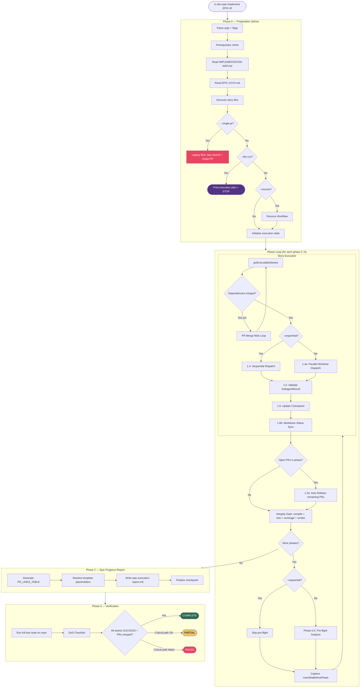
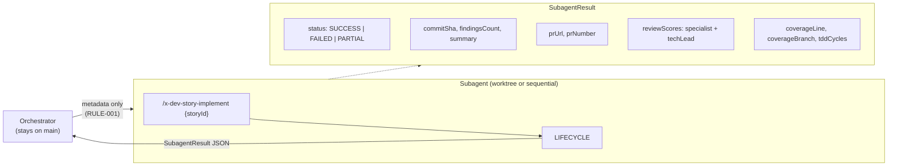
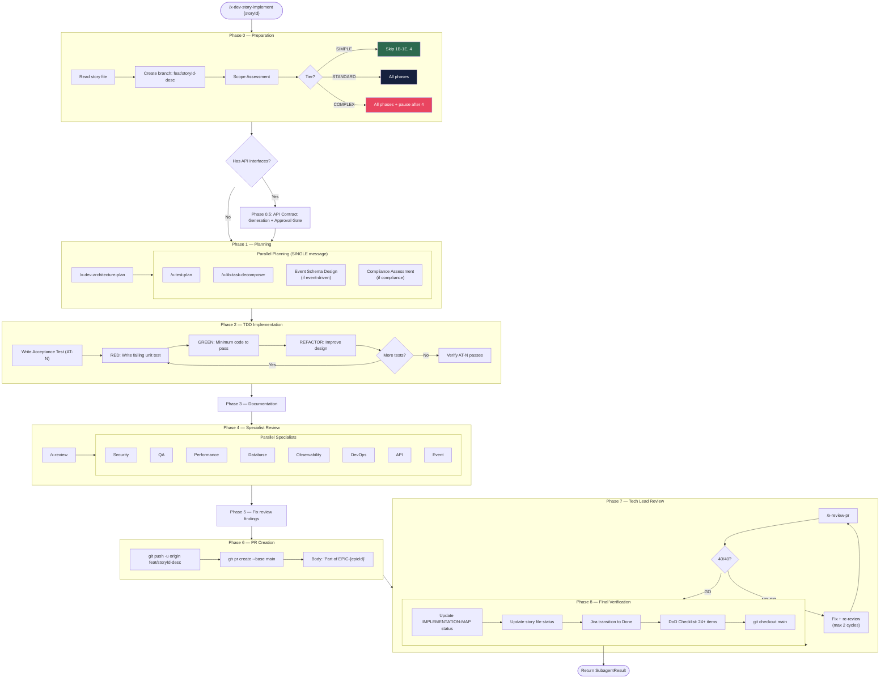
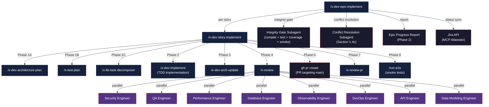
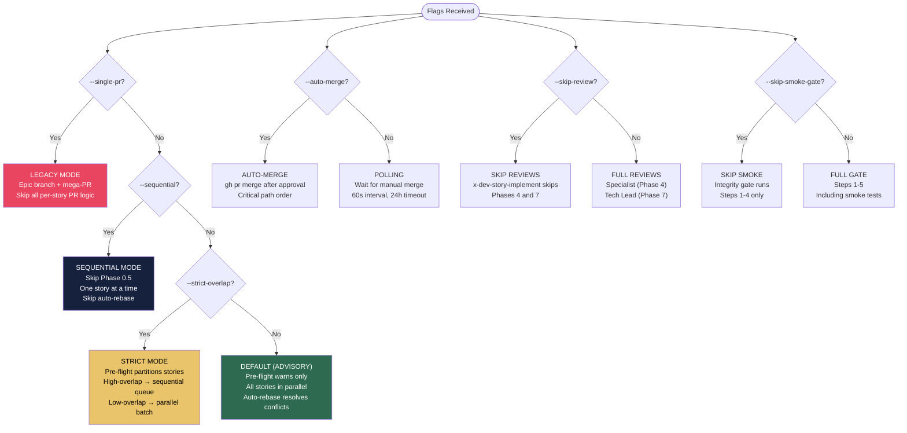
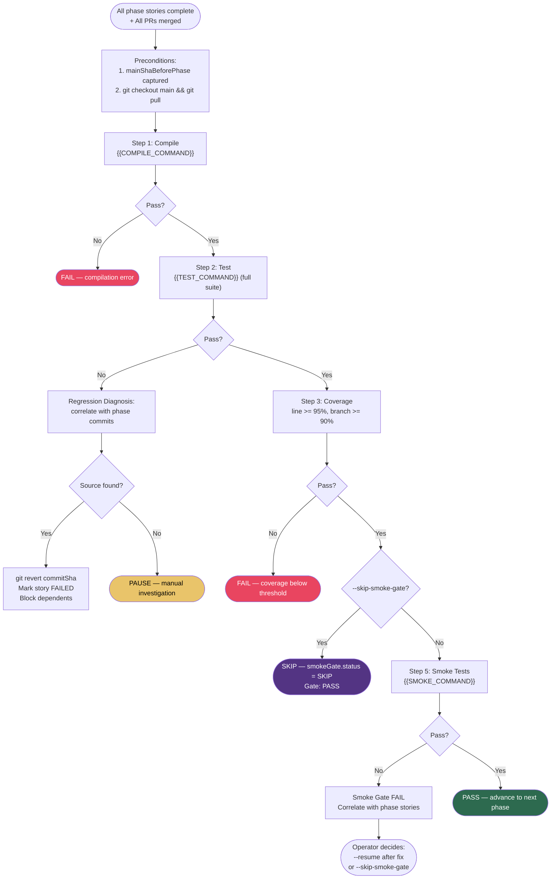
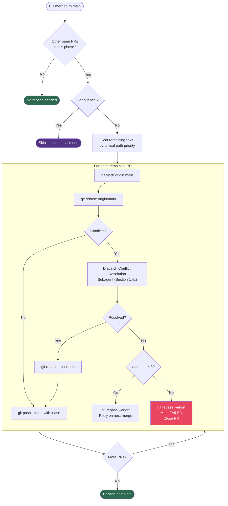
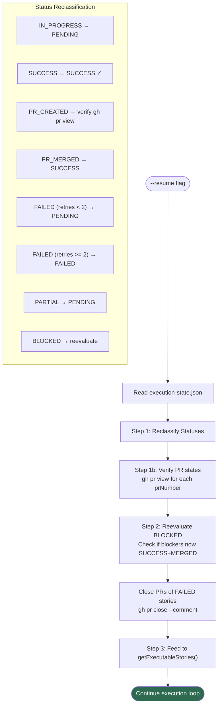

# x-dev-epic-implement — Execution Flow

> Visual reference for the complete orchestration flow, skill invocations, and decision points.

## 1. High-Level Orchestration Flow



## 2. Per-Story Subagent Dispatch



## 3. x-dev-story-implement — Per-Story Execution (9 Phases)

This is what happens **inside each subagent** when a story is dispatched.



## 4. Complete Skills Dependency Graph



## 5. Flag Decision Matrix



## 6. Integrity Gate Flow



## 7. Auto-Rebase Flow (Section 1.4e)



## 8. Resume Workflow



## 9. Summary Table — Skills Chain

| Layer | Skill | Invoked By | Purpose |
|-------|-------|------------|---------|
| **Orchestrator** | `/x-dev-epic-implement` | User | Epic-level orchestration, phase management |
| **Per-Story** | `/x-dev-story-implement` | Epic orchestrator subagent | Full 9-phase development cycle per story |
| **Planning** | `/x-dev-architecture-plan` | Lifecycle Phase 1A | Architecture plan with diagrams + ADRs |
| **Planning** | `/x-test-plan` | Lifecycle Phase 1B | Double-Loop TDD test plan with TPP |
| **Planning** | `/x-lib-task-decomposer` | Lifecycle Phase 1C | Task breakdown from test plan |
| **Implementation** | `/x-dev-implement` | Lifecycle Phase 2 | TDD Red-Green-Refactor per scenario |
| **Documentation** | `/x-dev-arch-update` | Lifecycle Phase 3 | Update architecture document |
| **Review** | `/x-review` | Lifecycle Phase 4 | 8 specialist engineers in parallel |
| **Review** | `/x-review-pr` | Lifecycle Phase 7 | Tech Lead 40-point holistic review |
| **Testing** | `/run-e2e` | Lifecycle Phase 8 | Smoke tests / post-deploy verification |
| **Infra** | Integrity Gate | Epic orchestrator | Compile + test + coverage + smoke between phases |
| **Infra** | Conflict Resolution | Epic orchestrator (1.4c) | Resolve rebase conflicts automatically |
| **Infra** | Jira API | Epic orchestrator (1.6b) | Transition stories/epic to Done |

## 10. Per-Story PR Flow (Default Model)

```
Orchestrator (main)          Story Subagent (worktree)          GitHub
─────────────────           ──────────────────────────         ────────
                                                                
  dispatch story ──────────►  /x-dev-story-implement                  
                              │                                 
                              ├─ Phase 0: create branch         
                              ├─ Phase 1: plan                  
                              ├─ Phase 2: implement (TDD)       
                              ├─ Phase 3: document              
                              ├─ Phase 4: /x-review ───────────► specialist reviews
                              ├─ Phase 5: fix findings          
                              ├─ Phase 6: gh pr create ────────► PR #N (→ main)
                              │           "Part of EPIC-{id}"   
                              ├─ Phase 7: /x-review-pr ────────► tech lead 40/40
                              ├─ Phase 8: finalize              
                              │                                 
  ◄─── SubagentResult ──────  return {prUrl, prNumber, ...}     
  │                                                             
  ├─ update checkpoint                                          
  ├─ update story markdown                                      
  ├─ update IMPLEMENTATION-MAP                                  
  │                                                             
  ├─ wait for PR merge ────────────────────────────────────────► PR merged ✓
  │  (auto-merge or polling)                                    
  │                                                             
  ├─ auto-rebase other PRs                                      
  │  (Section 1.4e)                                             
  │                                                             
  └─ integrity gate                                             
     (compile + test + coverage + smoke on main)                
```
