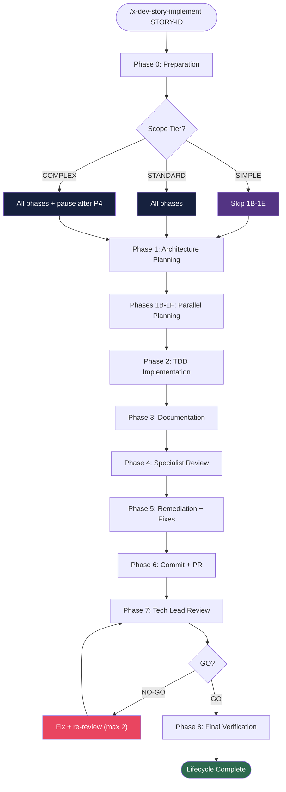

# x-dev-story-implement

> Orchestrates the complete feature implementation cycle: branch creation, planning, task decomposition, implementation, parallel review, fixes, PR creation, and final verification. Delegates heavy phases to subagents for context efficiency.

| | |
|---|---|
| **Category** | Orchestrator |
| **Invocation** | `/x-dev-story-implement [STORY-ID or feature-name]` |
| **Delegates to** | `x-dev-architecture-plan`, `x-test-plan`, `x-lib-task-decomposer`, `x-dev-implement`, `x-dev-arch-update`, `x-review`, `x-review-pr`, `x-git-push`, `run-e2e` |

> **Spec**: See [SKILL.md](./SKILL.md) for the complete execution specification.

## Overview

Runs the full 9-phase development lifecycle for a single story or feature: preparation, architecture planning, parallel planning (test plan, task decomposition, security, compliance), TDD implementation, documentation, specialist review, remediation + PR creation, Tech Lead review, and final verification. Each heavy phase is delegated to a subagent or skill invocation to preserve orchestrator context. Scope assessment (SIMPLE / STANDARD / COMPLEX) adapts which phases execute.

## Execution Flow

## Phases

| # | Phase | Description | Delegated To |
|---|-------|-------------|--------------|
| 0 | Preparation | Read story, check dependencies, artifact staleness, create branch, scope assessment | Inline |
| 0.5 | API Contract | Generate and validate API contracts (conditional: REST/gRPC/event interfaces) | Inline + `x-test-contract-lint` |
| 1 | Architecture Planning | Evaluate change scope, generate architecture plan | `x-dev-architecture-plan` |
| 1B-1F | Parallel Planning | Test plan, task decomposition, event schema, security, compliance (launched in single message) | `x-test-plan`, `x-lib-task-decomposer`, subagents |
| 2 | TDD Implementation | Double-Loop TDD: acceptance tests (outer), unit tests in TPP order (inner), compile checks | `x-dev-implement` (subagent) |
| 3 | Documentation | Interface-specific docs (CLI/REST/gRPC/event), changelog, architecture update | Inline + `x-dev-arch-update` |
| 4 | Specialist Review | 8 parallel specialist engineers review implementation | `x-review` |
| 5 | Remediation + Fixes | Fix all review findings with TDD discipline, update remediation tracker | Inline |
| 6 | Commit + PR | Push branch, create PR targeting develop with review summary | `x-git-push` |
| 7 | Tech Lead Review | 40-point holistic review, requires 40/40 GO (max 2 retry cycles) | `x-review-pr` |
| 8 | Final Verification | Update status files, Jira sync, DoD checklist (24+ items), smoke tests | Inline + `run-e2e` |

## Flags

| Flag | Default | Effect |
|------|---------|--------|
| `--full-lifecycle` | off | Force all phases regardless of scope tier (overrides SIMPLE) |

## Scope Tiers

| Tier | Criteria | Phase Behavior |
|------|----------|---------------|
| SIMPLE | ≤1 component, 0 endpoints, 0 schema changes | Skips phases 1B, 1C, 1D, 1E |
| STANDARD | 2-3 components or 1-2 new endpoints | All phases execute |
| COMPLEX | ≥4 components, schema changes, or compliance | All phases + pause after Phase 4 for stakeholder review |

## Prerequisites

- Story file exists with acceptance criteria and sub-tasks
- Predecessor stories (dependencies) are complete
- Epic directory structure: `plans/epic-XXXX/plans/`, `plans/epic-XXXX/reviews/`
- Git working tree is clean on the base branch

## Outputs

| Artifact | Path | Description |
|----------|------|-------------|
| Architecture Plan | `plans/epic-XXXX/plans/architecture-story-XXXX-YYYY.md` | Component diagrams, ADRs, constraints |
| Implementation Plan | `plans/epic-XXXX/plans/plan-story-XXXX-YYYY.md` | Layers, classes, method signatures, TDD strategy |
| Test Plan | `plans/epic-XXXX/plans/tests-story-XXXX-YYYY.md` | Double-Loop TDD scenarios in TPP order |
| Task Breakdown | `plans/epic-XXXX/plans/tasks-story-XXXX-YYYY.md` | RED/GREEN/REFACTOR tasks with parallelism markers |
| Security Assessment | `plans/epic-XXXX/plans/security-story-XXXX-YYYY.md` | Threat model, OWASP mapping |
| Compliance Assessment | `plans/epic-XXXX/plans/compliance-story-XXXX-YYYY.md` | Data classification, regulatory review (conditional) |
| Review Dashboard | `plans/epic-XXXX/reviews/dashboard-story-XXXX-YYYY.md` | Consolidated specialist + Tech Lead scores |
| Remediation Tracker | `plans/epic-XXXX/reviews/remediation-story-XXXX-YYYY.md` | Finding-to-fix mapping with status |
| Pull Request | GitHub PR targeting `develop` | TDD compliance summary, review scores |

## See Also

- [x-dev-epic-implement](../x-dev-epic-implement/) -- Epic-level orchestrator that dispatches this skill per story
- [x-dev-implement](../x-dev-implement/) -- TDD implementation engine used in Phase 2
- [x-test-plan](../x-test-plan/) -- Test plan generator used in Phase 1B
- [x-review](../x-review/) -- Parallel specialist review used in Phase 4
- [x-review-pr](../x-review-pr/) -- Tech Lead review used in Phase 7
- [x-dev-architecture-plan](../x-dev-architecture-plan/) -- Architecture plan generator used in Phase 1
