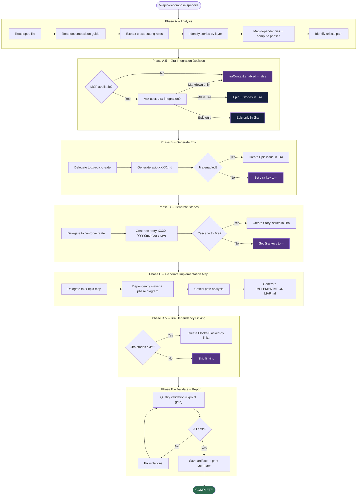

# x-epic-decompose

> Complete decomposition of a system specification into an Epic, individual Story files, and an Implementation Map with dependency graph and phased execution plan.

| | |
|---|---|
| **Category** | Orchestrator |
| **Invocation** | `/x-epic-decompose <spec-file>` |
| **Delegates to** | `/x-epic-create`, `/x-story-create`, `/x-epic-map` |

> **Spec**: See [SKILL.md](./SKILL.md) for the complete execution specification.

## Overview

This skill orchestrates the full spec-to-stories decomposition pipeline in a single pass. It reads a system specification document, extracts cross-cutting business rules, identifies stories using a layer-by-layer approach (foundation, core domain, extensions, compositions, cross-cutting), computes dependency phases, and produces three deliverables: an Epic file, individual Story files, and an Implementation Map. Optional Jira integration creates corresponding issues and dependency links automatically.

## Execution Flow

## Phases

| # | Phase | Description | Delegated To |
|---|-------|-------------|--------------|
| A | Analysis | Read spec, extract rules, identify stories by layer, map dependencies, compute phases, find critical path | Inline |
| A.5 | Jira Integration Decision | Check MCP availability, ask user preference, build jiraContext | Inline |
| B | Generate Epic | Determine epic number, extract rules table, build story index, define DoR/DoD, create Jira issue (optional) | `/x-epic-create` |
| C | Generate Stories | For each story: dependencies, data contracts, Mermaid diagrams, Gherkin scenarios, sub-tasks; create Jira issues (optional) | `/x-story-create` |
| D | Generate Implementation Map | Dependency matrix, phase diagram, critical path, Mermaid dependency graph, strategic observations | `/x-epic-map` |
| D.5 | Jira Dependency Linking | Create Blocks/Blocked-by links between Jira issues (best-effort) | Inline (MCP) |
| E | Validate and Report | 8-point quality gate, fix violations, save all artifacts, print summary with metrics | Inline |

## Prerequisites

- Specification file accessible and following the expected template format
- Templates present in `.claude/templates/`: `_TEMPLATE-EPIC.md`, `_TEMPLATE-STORY.md`, `_TEMPLATE-IMPLEMENTATION-MAP.md`
- Decomposition guide at `references/decomposition-guide.md` (bundled with this skill)
- Jira MCP tool available (optional -- degrades gracefully if absent)

## Outputs

| Artifact | Path | Description |
|----------|------|-------------|
| Epic | `plans/epic-XXXX/epic-XXXX.md` | Scope, cross-cutting rules, story index, DoR/DoD |
| Stories | `plans/epic-XXXX/story-XXXX-YYYY.md` | One file per story with contracts, Gherkin, diagrams, sub-tasks |
| Implementation Map | `plans/epic-XXXX/IMPLEMENTATION-MAP.md` | Phases, critical path, dependency graph, strategic analysis |
| Jira Issues | Jira project (remote) | Epic and Story issues with parent links and dependency links (optional) |

## Decomposition Layers

The skill follows a layer-by-layer decomposition philosophy when identifying stories from the spec:

| Layer | Name | Content |
|-------|------|---------|
| 0 | Foundation | Infrastructure -- servers, schemas, APIs, protocol adapters |
| 1 | Core Domain | Central operation establishing architectural patterns |
| 2 | Extensions | Additional operations reusing core patterns |
| 3 | Compositions | Stories combining multiple extension capabilities |
| 4 | Cross-Cutting | Testing, observability, security, tech debt |

## See Also

- [x-epic-create](../x-epic-create/SKILL.md) -- Epic generation from a spec
- [x-story-create](../x-story-create/SKILL.md) -- Individual story file generation
- [x-epic-map](../x-epic-map/SKILL.md) -- Implementation map with dependency analysis
- [x-epic-implement](../x-epic-implement/SKILL.md) -- Executes the stories produced by this skill
