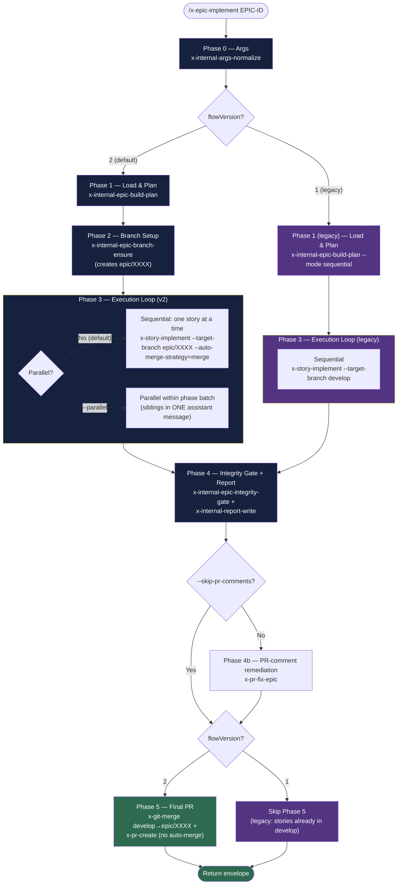
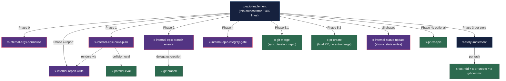
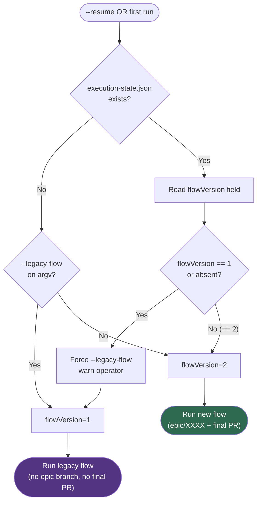

# x-epic-implement — Execution Flow (EPIC-0049 refactor)

> Visual reference for the thin-orchestrator flow delivered by story-0049-0018.
> The main SKILL.md is now ~460 lines and delegates every substantive
> responsibility to six specialized sub-skills. This README illustrates the
> delegation topology; prose specifics live in `SKILL.md` and
> `references/full-protocol.md`.

## 1. High-Level Orchestration Flow (new default)

## 2. Delegation Map

## 3. Flow Version Decision

## 4. Default-change summary

| Aspect | EPIC-0042 | EPIC-0049 (this refactor) |
|--------|-----------|---------------------------|
| SKILL.md size | ~2000 lines | ~460 lines (77% drop) |
| References size | ~1300 lines | ~280 lines |
| Parallelism | default on (`--sequential` opts out) | default off (`--parallel` opts in) |
| Auto-merge target | `develop` | `epic/<EPIC-ID>` |
| Final PR | N/A (every story merges to develop) | `epic/<EPIC-ID> → develop` (manual gate) |
| Inline `git`/`gh`/`jq`/`mvn` | present | **0** (only `Read`/`Glob` + `Skill`) |
| Backward compat | — | `--legacy-flow` + `flowVersion` auto-detect |

## 5. Error Code Catalogue

| Exit | Code | Phase | Cause |
|------|------|-------|-------|
| 1 | `ARGS_INVALID` | 0 | Normalizer rejects argv |
| 2 | `EPIC_DIR_MISSING` | 0 | `plans/epic-XXXX/` absent |
| 3 | `STORY_FAILED` | 3 | One or more stories FAILED |
| 4 | `INTEGRITY_GATE_FAILED` | 4 | Gate failed twice after recovery |
| 5 | `FINAL_PR_CONFLICTS` | 5 | `x-git-merge` sync conflicted |
| 6 | `BRANCH_ENSURE_FAILED` | 2 | `epic/<ID>` could not be ensured |
| 7 | `PLAN_BUILD_FAILED` | 1 | Plan build failed (non-cyclic) |
| 8 | `CYCLIC_DEPENDENCY` | 1 | DAG cycle detected |

## 6. References

- Main skill body: [`SKILL.md`](SKILL.md)
- Full protocol + retry/circuit-breaker/legacy semantics: [`references/full-protocol.md`](references/full-protocol.md)
- Args schema consumed by `x-internal-args-normalize`: [`references/args-schema.json`](references/args-schema.json)
- Parent story: `plans/epic-0049/story-0049-0018.md`
- ADR-0006 (file-conflict-aware parallelism), ADR-0010 (interactive gates), ADR-0012 (thin-skill pattern)
