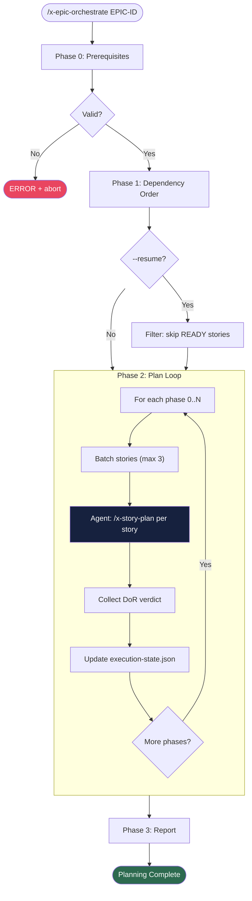

# x-epic-orchestrate

> Orchestrates multi-agent planning for all stories in an epic, respecting dependency order, with checkpoint and resume support.

| | |
|---|---|
| **Category** | Planning |
| **Invocation** | `/x-epic-orchestrate [EPIC-ID] [--resume] [--story story-XXXX-YYYY]` |
| **Delegates to** | `/x-story-plan` per story (which spawns 5 parallel subagents each) |

> **Spec**: See [SKILL.md](./SKILL.md) for the complete execution specification.

## Overview

Reads the implementation map to determine story dependencies and phase ordering, then invokes `/x-story-plan` for each story in dependency order. Stories within the same phase are dispatched in parallel (batches of 3). Tracks planning status in `execution-state.json` for checkpoint/resume support. Generates a readiness summary and updates the epic file with a `Planning` column.

## Usage Examples

```bash
# Plan all stories in epic 0028
/x-epic-orchestrate 0028

# Resume planning after interruption (skip already-READY stories)
/x-epic-orchestrate 0028 --resume

# Plan only a specific story (validates dependencies are satisfied)
/x-epic-orchestrate 0028 --story story-0028-0004
```

## Execution Flow



## Phases

| # | Phase | Description | Mode |
|---|-------|-------------|------|
| 0 | Prerequisites | Parse args, validate epic dir, map, story files | Inline |
| 1 | Dependency Order | Read implementation map, extract phase graph, order stories | Inline |
| 2 | Plan Loop | Invoke `/x-story-plan` per story in dependency order | Subagents (batches of 3) |
| 3 | Report | Generate readiness summary, update epic file | Inline |

## Flags

| Flag | Default | Effect |
|------|---------|--------|
| `--resume` | off | Skip stories with `planningStatus == "READY"`, reset `IN_PROGRESS`/`NOT_READY` to `PENDING` |
| `--story story-XXXX-YYYY` | off | Plan only the specified story (validates its dependencies are satisfied first) |

> `--resume` and `--story` are mutually exclusive.

## Output Artifacts

| Artifact | Path | Producer |
|----------|------|----------|
| Execution state (checkpoint) | `plans/epic-XXXX/execution-state.json` | x-epic-orchestrate |
| Epic planning report | `plans/epic-XXXX/reports/epic-planning-report-XXXX.md` | x-epic-orchestrate |
| Epic file update (Planning column) | `plans/epic-XXXX/EPIC-XXXX.md` | x-epic-orchestrate |
| Task breakdown (per story) | `plans/epic-XXXX/plans/tasks-story-XXXX-YYYY.md` | x-story-plan |
| Task plans (per task) | `plans/epic-XXXX/plans/task-plan-TASK-NNN-story-XXXX-YYYY.md` | x-story-plan |
| Planning report (per story) | `plans/epic-XXXX/plans/planning-report-story-XXXX-YYYY.md` | x-story-plan |
| DoR checklist (per story) | `plans/epic-XXXX/plans/dor-story-XXXX-YYYY.md` | x-story-plan |

## Checkpoint / Resume

- `execution-state.json` is updated after each story completes (atomic writes)
- On `--resume`: stories with `planningStatus == "READY"` are skipped
- On `--resume`: stories with `planningStatus == "IN_PROGRESS"` are reset to `PENDING`
- On `--resume`: stories with `planningStatus == "NOT_READY"` are reset to `PENDING` for re-attempt

## Prerequisites

- Epic directory exists: `plans/epic-XXXX/`
- Implementation map exists: `plans/epic-XXXX/IMPLEMENTATION-MAP.md`
- At least one story file: `plans/epic-XXXX/story-XXXX-*.md`

## See Also

- [x-story-plan](../x-story-plan/) -- Per-story multi-agent planning (invoked as subagent)
- [x-epic-implement](../x-epic-implement/) -- Epic implementation orchestrator (consumes `execution-state.json`)
- [x-epic-decompose](../x-epic-decompose/) -- Generates epic, stories, and implementation map
- [x-epic-map](../x-epic-map/) -- Generates implementation map with dependency graph
