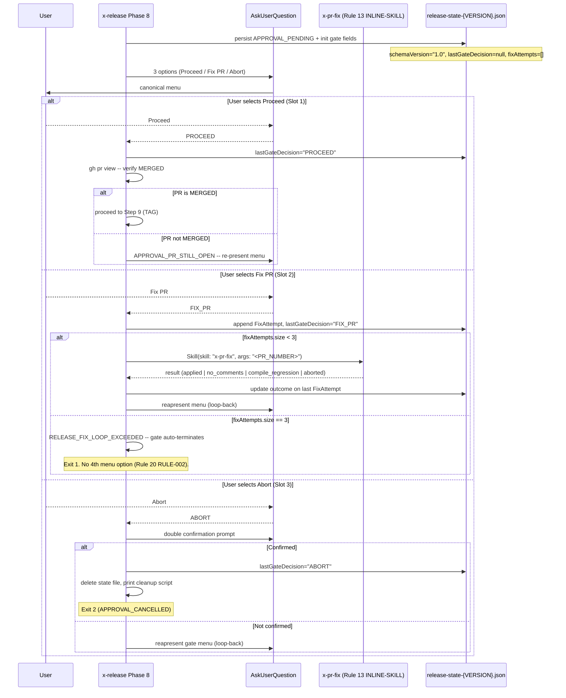

# Approval Gate Workflow

> Reference document for the **x-release** skill, Step 8 (APPROVAL-GATE).
> Describes default interactive behavior (since EPIC-0043), the `--non-interactive`
> opt-out for CI, state transitions, error codes, the FIX-PR loop-back mechanism,
> and the resume path via `--continue-after-merge`.
>
> **Related:** Rule 20 (`20-interactive-gates.md`) — canonical option menu contract.
> ADR-0010 — decision record for the interactive gates convention.

## Overview

The Approval Gate is the safety checkpoint between opening the release PR
(Step 7 OPEN-RELEASE-PR) and applying irreversible actions (tag,
back-merge). It ensures the human operator explicitly reviews and merges
the release PR before the skill creates the git tag.

As of EPIC-0043 (story-0043-0002), the gate **always** presents the canonical
3-option menu via `AskUserQuestion` by default. The only opt-out is
`--non-interactive`, which prints the legacy HALT text for CI/automation.

## Default Interactive Workflow (since EPIC-0043)



### State Transition (Default Interactive)

| Field | Before | After (first gate) |
|:---|:---|:---|
| `phase` | `PR_OPENED` | `APPROVAL_PENDING` |
| `phasesCompleted` | `[..., PR_OPENED]` | `[..., PR_OPENED, APPROVAL_GATE_REACHED]` |
| `lastGateDecision` | absent / `null` | `null` (set on user action) |
| `fixAttempts` | absent / `[]` | `[]` (populated on FIX-PR selection) |
| `schemaVersion` | absent or `"legacy"` | `"1.0"` |

### AskUserQuestion Options (Rule 20 Canonical Menu)

| Slot | `header` | `label` | Behavior |
|:---|:---|:---|:---|
| 1 -- PROCEED | `"Proceed"` | `"Continue (Recommended)"` | Verifies PR is MERGED via `gh pr view`, then proceeds to RESUME-AND-TAG (Step 9). If PR not merged: re-presents menu with `APPROVAL_PR_STILL_OPEN`. |
| 2 -- FIX-PR | `"Fix PR"` | `"Run x-pr-fix and retry"` | Invokes `Skill(skill: "x-pr-fix", args: "<PR_NUMBER>")` via Rule 13 Pattern 1 INLINE-SKILL. Records `FixAttempt` in state file. Reapresents menu on return. Capped at 3 attempts (see guard-rail). |
| 3 -- ABORT | `"Abort"` | `"Cancel the operation"` | Double confirmation. On confirm: deletes state file, prints manual cleanup script, exits 2. On back: re-presents gate menu. |

## `--non-interactive` Path (CI/Automation)

When `--non-interactive` is present, the gate skips `AskUserQuestion` entirely:

```
Step 8.1: Persist APPROVAL_PENDING + initialize gate fields (same as default)
          |
          v
Step 8.2: NON_INTERACTIVE=true -- print legacy HALT text
          - PR URL and number
          - Manual steps (review, CI, approve, merge)
          - Resume command: /x-release <VERSION> --continue-after-merge
          |
          v
Step 8.3: exit 0 (skill halts)
          |
     [operator reviews PR on GitHub]
     [operator merges PR when ready]
          |
          v
Re-invocation: /x-release <VERSION> --continue-after-merge
          |
          v
Step 0 detects APPROVAL_PENDING -> MODE = RESUME -> Phase 9
```

This is the path for CI pipelines and automation scripts that expect the
pre-EPIC-0043 textual output.

## Flag Separation (`--interactive` vs `--non-interactive`)

> **This distinction is critical. The two flags serve entirely different purposes.**

| Flag | Purpose | Effect at Phase 8 |
|:---|:---|:---|
| `--interactive` (without `--dry-run`) | **[DEPRECATED EPIC-0043]** Was the gate opt-in. Now emits deprecation warning and is a no-op. Gate opens normally. | Default 3-option menu |
| `--interactive --dry-run` | **PRESERVED** -- interactive dry-run simulation mode (story-0039-0013). Pauses before each of 13 phases for simulation. | Dry-run gate (distinct sub-modality) |
| `--non-interactive` | **NEW (EPIC-0043)** -- CI/automation opt-out from default menu. Prints HALT text. | No `AskUserQuestion` |
| (no flag) | Default since EPIC-0043 | Default 3-option menu |

## FIX-PR Loop-Back and Guard-Rail

### Normal FIX-PR Flow

1. Operator selects slot 2 (Fix PR).
2. Gate records the attempt in `fixAttempts[]`:
   ```json
   {
     "at": "<ISO-8601 UTC>",
     "delegateSkill": "x-pr-fix",
     "prNumber": "<PR_NUMBER>",
     "outcome": "pending"
   }
   ```
3. Gate invokes `x-pr-fix` via Rule 13 Pattern 1 INLINE-SKILL:
   ```
   Skill(skill: "x-pr-fix", args: "<PR_NUMBER>")
   ```
4. On return, `outcome` is updated in the last `FixAttempt`.
5. Gate **reapresents** the 3-option menu (unconditionally).

### Guard-Rail: 3 Consecutive FIX-PR Attempts

If `fixAttempts.size()` is already 3 when slot 2 is selected:

```
RELEASE_FIX_LOOP_EXCEEDED: 3 consecutive fix attempts did not resolve the gate.
Gate terminated automatically. To recover:
  1. Inspect PR #<N> manually and apply a direct fix.
  2. Resume the skill with --non-interactive to skip this gate.
  3. Or edit the state file: reset fixAttempts to [] and set lastGateDecision to null.
```

- No 4th option is added to the menu (Rule 20 RULE-002: exactly 3 slots always).
- Gate exits with code 1 (`RELEASE_FIX_LOOP_EXCEEDED`).
- The state file is preserved for manual recovery.

## State File Schema (EPIC-0043 Extension)

The gate writes the following fields to `release-state-{VERSION}.json`
(in addition to the pre-existing fields):

```json
{
  "phase": "APPROVAL_PENDING",
  "lastPhaseCompletedAt": "2026-04-19T14:00:00Z",
  "lastGateDecision": null,
  "fixAttempts": [],
  "schemaVersion": "1.0"
}
```

**Backward compatibility:** State files without `schemaVersion` (releases <=3.6.0)
are treated as legacy. On the first write during Phase 8, the gate:
- Emits `WARN [RELEASE_STATE_SCHEMA_LEGACY]`
- Writes `schemaVersion: "1.0"`, `lastGateDecision: null`, and `fixAttempts: []`
- Does NOT fail or abort; migration is transparent

## Error Codes

| Code | Condition | Message | Exit |
|:---|:---|:---|:---|
| `APPROVAL_PR_STILL_OPEN` | Slot 1 selected but `gh pr view` returns state != MERGED | `PR #N is still <state>. Merge the PR first, then select Proceed again.` | 1 (re-present menu) |
| `APPROVAL_CANCELLED` | Slot 3 confirmed | `Release cancelled by user.` | 2 |
| `RELEASE_FIX_LOOP_EXCEEDED` | Slot 2 selected when `fixAttempts.size == 3` | `3 consecutive fix attempts did not resolve the gate. Gate terminated automatically.` | 1 |
| `RELEASE_STATE_SCHEMA_LEGACY` | State file missing `schemaVersion` | `State file <path> has no schemaVersion; assuming legacy (<=3.6.0); migrating to 1.0 on next write.` | warn only |

## `--continue-after-merge` Resume Path

As of EPIC-0043, `--continue-after-merge` is equivalent to selecting
PROCEED without re-opening the gate:

```
Re-invocation: /x-release <VERSION> --continue-after-merge
          |
Step 0: detects phase: APPROVAL_PENDING + --continue-after-merge flag
          |
          v
MODE = RESUME -> jump to Phase 9 (RESUME-AND-TAG)
          (gate menu is NOT presented; PROCEED is implicit)
```

This preserves backward compatibility for automation scripts and human
operators who prefer the explicit two-step flow.

## Idempotency (RULE-003)

The Approval Gate is inherently idempotent:

1. On first execution, it writes `APPROVAL_PENDING` and presents the menu (or halts if `--non-interactive`).
2. On re-invocation **without** `--continue-after-merge`, Step 0 detects `phase: APPROVAL_PENDING`
   (which is not `COMPLETED`) and either resumes via smart-resume prompt or aborts with `STATE_CONFLICT`.
3. On re-invocation **with** `--continue-after-merge`, Step 0 validates the phase
   and jumps directly to RESUME-AND-TAG, bypassing the gate.

The gate never executes twice for the same release.

## Defense in Depth (RULE-004)

Even when the operator selects PROCEED (slot 1), the skill verifies the PR state
via `gh pr view` before advancing. This prevents accidental tagging when the PR
is still open.

## Cancel Path

When the operator confirms the Abort (slot 3):

1. State file is **deleted** (not just marked as cancelled).
2. The release PR and branch must be cleaned up manually.
3. The skill prints the exact commands needed for cleanup:
   - `gh pr close <PR_NUMBER>`
   - `git push origin --delete release/<VERSION>`
   - `git branch -d release/<VERSION>`

## Relationship to Other Phases

| Phase | Relationship |
|:---|:---|
| Step 7 (OPEN-RELEASE-PR) | Produces `PR_OPENED` state consumed by Step 8 |
| Step 8 (APPROVAL-GATE) | Produces `APPROVAL_PENDING` state + gate decision fields consumed by Step 0 on resume |
| Step 0 (RESUME-DETECT) | Detects `APPROVAL_PENDING` + `--continue-after-merge` to enter RESUME mode |
| Step 9+ (RESUME-AND-TAG) | Consumes the MERGED PR state to create the git tag |

---

## Historical Behavior (pre-EPIC-0043)

> This section is preserved for reference. The behavior below applied to
> `x-release` versions <=3.6.0 (before EPIC-0043 / story-0043-0002).

### Default Workflow (Non-Interactive, pre-EPIC-0043)

The default behavior was a HALT text exit -- no interactive menu.

```
Step 7 completes (PR_OPENED)
          |
          v
Step 8.1: Persist APPROVAL_PENDING in state file
          |
          v
Step 8.2: Print human-readable instructions
          - PR URL and number
          - Manual steps (review, CI, approve, merge)
          - Resume command: /x-release <VERSION> --continue-after-merge
          |
          v
Step 8.3: exit 0 (skill halts -- no menu)
          |
     [operator reviews PR on GitHub]
     [operator merges PR when ready]
          |
          v
Re-invocation: /x-release <VERSION> --continue-after-merge
```

### Interactive Workflow (`--interactive`, pre-EPIC-0043)

When `--interactive` was set, the skill used `AskUserQuestion` instead of exiting.
Without `--interactive` there was no menu -- the operator had to remember the
`--continue-after-merge` flag. Passing `--interactive` without `--dry-run` aborted
with `INTERACTIVE_REQUIRES_DRYRUN`.

The pre-EPIC-0043 menu options:

| # | Label | Behavior |
|:---|:---|:---|
| 1 | "PR merged, continue to tag (Recommended)" | Verifies PR state via `gh pr view $PR_NUMBER --json state`. If MERGED, proceeds. If OPEN, aborts with `APPROVAL_PR_STILL_OPEN`. |
| 2 | "Halt -- resume later with --continue-after-merge" | Identical to default non-interactive behavior. Exits 0. |
| 3 | "Cancel release entirely" | Double confirmation. Deletes state file. Exits 2. |

These options were replaced by the Rule 20 canonical menu in EPIC-0043.
No FIX-PR loop-back existed in the pre-EPIC-0043 gate.
