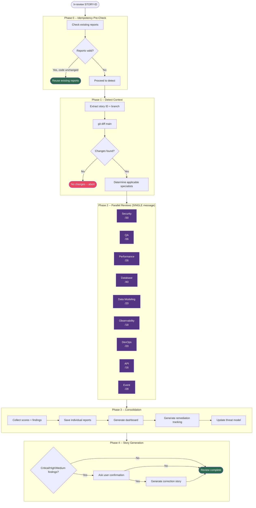

# x-review

> Parallel code review with specialist engineers (Security, QA, Performance, Database, Observability, DevOps, API, Event). Launches parallel subagents, each reading their own knowledge pack, then consolidates into a scored report. Use for pre-PR quality validation.

| | |
|---|---|
| **Category** | Orchestrator |
| **Invocation** | `/x-review [STORY-ID or --scope reviewer1,reviewer2]` |
| **Delegates to** | Security, QA, Performance, Database, Data Modeling, Observability, DevOps, API, Event specialist subagents |

> **Spec**: See [SKILL.md](./SKILL.md) for the complete execution specification.

## Overview

x-review orchestrates a multi-specialist code review by launching parallel subagents, each with its own knowledge pack and checklist. It detects the branch diff, determines which specialists are applicable based on the project stack, dispatches all reviews in a single message for true parallelism, then consolidates individual scores into a dashboard with remediation tracking. Optionally generates a correction story for critical findings.

## Execution Flow

## Specialists

| # | Specialist | Focus Area | Max Score | Condition |
|---|-----------|------------|-----------|-----------|
| 1 | Security | Input validation, auth, crypto, OWASP Top 10 | /30 | Always |
| 2 | QA | TDD compliance, coverage, test naming, TPP | /36 | Always |
| 3 | Performance | N+1, pooling, pagination, circuit breakers | /26 | Always |
| 4 | Database | Migrations, indexes, audit columns, locking | /40 | database != none |
| 5 | Data Modeling | Aggregates, value objects, repository patterns | /20 | database != none AND architecture in [hexagonal, ddd, cqrs] |
| 6 | Observability | Tracing, metrics, structured logging, health checks | /18 | observability != none |
| 7 | DevOps | Dockerfile, K8s manifests, probes, image scanning | /20 | container/orchestrator != none |
| 8 | API | RESTful URLs, status codes, RFC 7807, pagination | /16 | interfaces contain protocol types |
| 9 | Event | CloudEvents, idempotency, DLT, outbox pattern | /28 | event_driven or event interfaces |

## Scoring

Each specialist applies a checklist where every item scores 0 (fail), 1 (partial), or 2 (pass). **All items must score 2/2 for a specialist to be Approved.** Any item at 0 results in Rejected; any at 1 with none at 0 results in Partial. The overall status is Approved only when every active specialist is individually Approved.

Findings are classified by severity: `CRITICAL | HIGH | MEDIUM | LOW`. Any item scoring below 2 must be fixed before merge.

## Outputs

| Artifact | Path | Description |
|----------|------|-------------|
| Individual reports | `plans/epic-XXXX/reviews/review-{engineer}-story-XXXX-YYYY.md` | Per-specialist scored review |
| Consolidated dashboard | `plans/epic-XXXX/reviews/dashboard-story-XXXX-YYYY.md` | Aggregate scores, severity distribution, review history |
| Remediation tracking | `plans/epic-XXXX/reviews/remediation-story-XXXX-YYYY.md` | Finding tracker with status and fix commit references |
| Threat model update | `results/security/threat-model.md` | STRIDE-classified threats from security findings |
| Correction story | `plans/epic-XXXX/reviews/correction-story-XXXX-YYYY.md` | Generated only when user confirms (Phase 4) |

## See Also

- [x-review-pr](../x-review-pr/SKILL.md) -- Tech Lead holistic 45-point review (runs after x-review)
- [x-story-implement](../x-story-implement/SKILL.md) -- Full development cycle (invokes x-review in Phase 4)
- [x-epic-implement](../x-epic-implement/SKILL.md) -- Epic orchestrator (delegates stories to x-story-implement)
- [x-test-run](../x-test-run/SKILL.md) -- Coverage validation used during review verification
