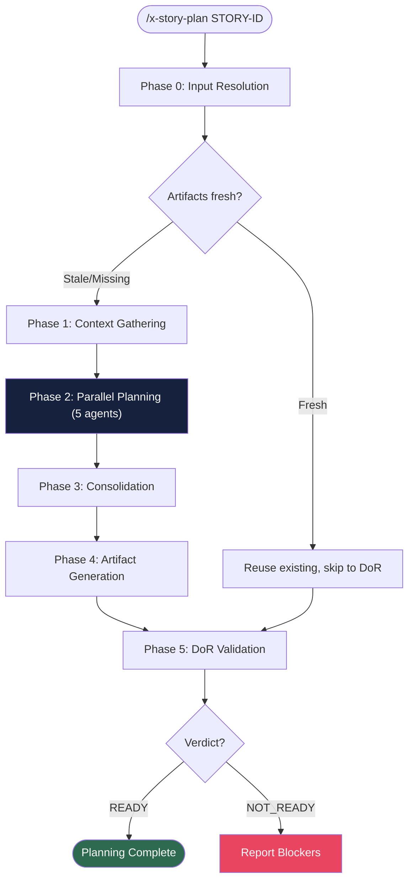

# x-story-plan

> Multi-agent story planning: launches 5 specialized agents (Architect, QA, Security, Tech Lead, Product Owner) in parallel to produce a consolidated task breakdown, individual task plans, planning report, and DoR validation for a story.

| | |
|---|---|
| **Category** | Planning |
| **Invocation** | `/x-story-plan [STORY-ID] [--force] [--skip-dor]` |
| **Delegates to** | 5 parallel subagents (Architect, QA Engineer, Security Engineer, Tech Lead, Product Owner) |

> **Spec**: See [SKILL.md](./SKILL.md) for the complete execution specification.

## Overview

Launches 5 specialized agents in a single message for true parallelism. Each agent analyzes the story from its perspective and produces TASK_PROPOSAL entries. The orchestrator consolidates proposals using deterministic merge rules (MERGE, AUGMENT, PAIR), resolves conflicts (Tech Lead wins over Architect, PO amends acceptance criteria), assigns sequential TASK-NNN IDs, generates all planning artifacts, and validates Definition of Ready with 12 checks.

## Execution Flow

## Phases

| # | Phase | Description | Mode |
|---|-------|-------------|------|
| 0 | Input Resolution | Parse story ID, resolve paths, staleness check | Inline |
| 1 | Context Gathering | Read story, epic, implementation map, existing plans | Inline |
| 2 | Parallel Planning | Launch 5 subagents in single message | 5 parallel subagents |
| 3 | Consolidation | Merge proposals with MERGE/AUGMENT/PAIR rules | Inline |
| 4 | Artifact Generation | Write task breakdown, task plans, planning report | Inline |
| 5 | DoR Validation | Run 12 checks (10 mandatory + 2 conditional) | Inline |

## Agents

| Agent | Model Hint | Prefix | Produces |
|-------|-----------|--------|----------|
| Architect | opus | ARCH-NNN | Architecture plan + implementation tasks |
| QA Engineer | opus | QA-NNN | Test plan + RED/GREEN test pairs (TPP ordered) |
| Security Engineer | adaptive | SEC-NNN | Security assessment + security control tasks |
| Tech Lead | adaptive | TL-NNN | Quality gate tasks |
| Product Owner | sonnet | PO-NNN | Acceptance criteria validation tasks |

## Flags

| Flag | Default | Effect |
|------|---------|--------|
| `--force` | off | Regenerate all artifacts even if fresh (bypass staleness check) |
| `--skip-dor` | off | Skip Phase 5 (DoR validation) |

## Output Artifacts

| Artifact | Path | Template |
|----------|------|----------|
| Task breakdown | `plans/epic-XXXX/plans/tasks-story-XXXX-YYYY.md` | `_TEMPLATE-TASK-BREAKDOWN.md` |
| Task plans (1 per task) | `plans/epic-XXXX/plans/task-plan-TASK-NNN-story-XXXX-YYYY.md` | `_TEMPLATE-TASK-PLAN.md` |
| Planning report | `plans/epic-XXXX/plans/planning-report-story-XXXX-YYYY.md` | `_TEMPLATE-STORY-PLANNING-REPORT.md` |
| DoR checklist | `plans/epic-XXXX/plans/dor-story-XXXX-YYYY.md` | `_TEMPLATE-DOR-CHECKLIST.md` |
| Story file update | `plans/epic-XXXX/story-XXXX-YYYY.md` (Section 8.1) | N/A |

## Consolidation Rules

| Rule | When | Action |
|------|------|--------|
| MERGE | Same component + same layer from different agents | Union DoD criteria into single task |
| AUGMENT | Implementation task touches security-sensitive component | Inject security DoD criteria |
| PAIR | GREEN task without RED counterpart | Create synthetic RED task before GREEN |

## Conflict Resolution

| Conflict | Winner | Rationale |
|----------|--------|-----------|
| Architect vs Tech Lead (approach) | Tech Lead | Final authority on implementation standards |
| Product Owner amendments | PO adds | Acceptance criteria completeness |

## Prerequisites

- Story file exists at `<EPIC_DIR>/story-XXXX-YYYY.md`
- Epic directory exists: `plans/epic-XXXX/` (also supports suffix variants like `plans/epic-XXXX-*`; resolved via glob in Phase 0)

## See Also

- [x-dev-lifecycle](../x-dev-lifecycle/) -- Full lifecycle orchestrator that can invoke this skill
- [x-test-plan](../x-test-plan/) -- Standalone test planning (QA agent provides similar output here)
- [x-dev-architecture-plan](../x-dev-architecture-plan/) -- Standalone architecture planning
- [x-story-create](../x-story-create/) -- Generates story files consumed by this skill
- [x-story-map](../x-story-map/) -- Generates implementation map for dependency context
- [references/planning-guide.md](./references/planning-guide.md) -- Detailed TASK_PROPOSAL format and consolidation rules
