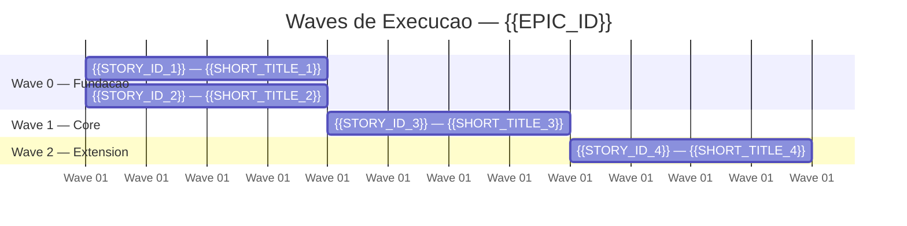

# Mapa de Implementacao — {{EPIC_ID}} ({{EPIC_TITLE}})

**Autor:** {{AUTHOR}}
**Data:** {{DATE}}
**Gerado a partir das dependencias BlockedBy/Blocks de cada historia do {{EPIC_ID}}.**

---

## 1. Dependency Matrix

| ID | Titulo | Blocked By | Blocks | Wave | Test Plan Status |
| :--- | :--- | :--- | :--- | :--- | :--- |
| {{STORY_ID_1}} | {{STORY_TITLE_1}} | -- | {{BLOCKS_1}} | 0 | Pending |
| {{STORY_ID_2}} | {{STORY_TITLE_2}} | {{STORY_ID_1}} | {{BLOCKS_2}} | 1 | Pending |
| {{STORY_ID_3}} | {{STORY_TITLE_3}} | {{STORY_ID_2}} | -- | 2 | Ready |

> **Instrucao:**
> - **Test Plan Status** deve conter um dos valores: `Pending` (test plan ainda nao gerado), `Ready` (test plan gerado e revisado), ou `N/A` (historia nao requer test plan)
> - **Wave** e calculada automaticamente a partir do grafo de dependencias (topological sort)
> - Validacoes obrigatorias:
>   - Toda historia do indice do epico deve aparecer na matriz
>   - Dependencias devem ser simetricas: se A bloqueia B, entao B deve listar A como blocker
>   - Nao pode haver dependencias circulares (A->B->C->A e invalido)
>   - Historias raiz (sem blockers) devem existir
> - Adicionar bloco `> **Nota:**` para dependencias implicitas nao declaradas nas historias

---

## 2. Wave Diagram



> **Instrucao:** O gantt chart visualiza as waves de execucao paralela.
> Historias na mesma wave podem executar em paralelo.
> Usar `after` para indicar dependencias entre waves.
> Datas sao ilustrativas — o foco e a ordenacao relativa, nao datas absolutas.

---

## 3. Fases de Implementacao

> As historias sao agrupadas em fases (waves). Dentro de cada fase, as historias podem ser implementadas **em paralelo**. Uma fase so pode iniciar quando todas as dependencias das fases anteriores estiverem concluidas.

```
+========================================================================+
|          FASE 0 -- {{PHASE_0_NAME}} (paralelo)                         |
|                                                                        |
|  +----------+  +----------+  +----------+                              |
|  | {{ID_1}} |  | {{ID_2}} |  | {{ID_3}} |                              |
|  | {{SCOPE}}|  | {{SCOPE}}|  | {{SCOPE}}|                              |
|  +----+-----+  +----+-----+  +----+-----+                              |
+========|=============|=============|====================================+
         |             |             |
         v             v             v
+========================================================================+
|          FASE 1 -- {{PHASE_1_NAME}}                                    |
|                                                                        |
|  +---------------------+                                               |
|  | {{ID_4}}            |                                               |
|  | {{SCOPE}}           |                                               |
|  +----------+----------+                                               |
+========================================================================+
```

> **Instrucao:** Usar caracteres box-drawing para fases e historias.
> Cada caixa de historia mostra: ID + descricao curta do escopo (max ~20 chars).
> Cada caixa de fase mostra: numero da fase + nome + "(paralelo)" se multiplas historias.

---

## 4. Caminho Critico

> O caminho critico (a sequencia mais longa de dependencias) determina o tempo minimo de implementacao do projeto.

```
{{CRITICAL_PATH_STORY_1}} --> {{CRITICAL_PATH_STORY_2}} --> {{CRITICAL_PATH_STORY_3}}
   Wave 0                       Wave 1                       Wave 2
```

**{{N}} fases no caminho critico, {{M}} historias na cadeia mais longa.**

{{CRITICAL_PATH_ANALYSIS}}

> **Instrucao:** Atrasos em qualquer historia do caminho critico impactam diretamente a data de conclusao do epico.
> Identificar os maiores gargalos e recomendar alocacao prioritaria.

---

## 5. Grafo de Dependencias (Mermaid)

```mermaid
graph TD
    {{NODE_1}}["{{STORY_ID_1}}<br/>{{SHORT_TITLE_1}}"]
    {{NODE_2}}["{{STORY_ID_2}}<br/>{{SHORT_TITLE_2}}"]
    {{NODE_3}}["{{STORY_ID_3}}<br/>{{SHORT_TITLE_3}}"]

    %% Wave 0 -> Wave 1
    {{NODE_1}} --> {{NODE_3}}

    %% Estilos por fase
    classDef fase0 fill:#1a1a2e,stroke:#e94560,color:#fff
    classDef fase1 fill:#16213e,stroke:#0f3460,color:#fff
    classDef fase2 fill:#533483,stroke:#e94560,color:#fff
    classDef fase3 fill:#e94560,stroke:#fff,color:#fff
    classDef faseQE fill:#0d7377,stroke:#14ffec,color:#fff
    classDef faseTD fill:#2d3436,stroke:#fdcb6e,color:#fff
    classDef faseCR fill:#6c5ce7,stroke:#a29bfe,color:#fff

    class {{NODE_1}},{{NODE_2}} fase0
    class {{NODE_3}} fase1
```

> **Instrucao:** Nomear nodes como `SXXXX_YYYY["story-XXXX-YYYY<br/>Short Title"]`.
> Se Jira keys estiverem disponiveis, incluir no label: `SXXXX_YYYY["story-XXXX-YYYY (PROJ-123)<br/>Short Title"]`.
> Agrupar edges por transicao de fase com comentario `%% Wave N -> N+1`.
> Atribuir classDef por fase.

---

## 6. Resumo por Fase

| Fase | Historias | Camada | Paralelismo | Pre-requisito |
| :--- | :--- | :--- | :--- | :--- |
| 0 | {{STORIES_PHASE_0}} | {{LAYER_0}} | {{PARALLEL_0}} paralelas | -- |
| 1 | {{STORIES_PHASE_1}} | {{LAYER_1}} | {{PARALLEL_1}} paralelas | Fase 0 concluida |

**Total: {{TOTAL_STORIES}} historias em {{TOTAL_PHASES}} fases.**

> **Instrucao:** Incluir notas sobre fases transversais (QE, Tech Debt) que podem executar independentemente das fases de negocio.

---

## 7. Detalhamento por Fase

### Fase 0 — {{PHASE_0_NAME}}

| Story | Escopo Principal | Artefatos Chave |
| :--- | :--- | :--- |
| {{STORY_ID_1}} | {{SCOPE_1}} | {{ARTIFACTS_1}} |

**Entregas da Fase 0:**

- {{DELIVERABLE_1}}
- {{DELIVERABLE_2}}

> **Instrucao:** Para cada fase, criar uma subsecao com tabela de escopo/artefatos e lista de entregas concretas.
> Ser especifico sobre artefatos: nomes de classes, tabelas, endpoints, configuracoes, infraestrutura de testes.

---

## 8. Observacoes Estrategicas

### Gargalo Principal

{{MAIN_BOTTLENECK_ANALYSIS}}

> **Instrucao:** Identificar qual historia bloqueia mais historias downstream e por que investir tempo extra nela compensa.

### Historias Folha (sem dependentes)

{{LEAF_STORIES_LIST}}

> **Instrucao:** Historias que nao bloqueiam nenhuma outra podem absorver atrasos sem impacto no caminho critico. Boas candidatas para desenvolvedores juniores ou streams paralelos.

### Otimizacao de Tempo

{{TIME_OPTIMIZATION_ANALYSIS}}

> **Instrucao:** Analisar: paralelismo maximo, historias imediatas sem risco, alocacao ideal de equipe.

### Dependencias Cruzadas

{{CROSS_DEPENDENCY_ANALYSIS}}

> **Instrucao:** Identificar pontos de convergencia onde historias de diferentes branches do grafo de dependencias se encontram.

### Marco de Validacao Arquitetural

{{ARCHITECTURAL_CHECKPOINT}}

> **Instrucao:** Identificar qual historia serve como checkpoint arquitetural antes de expandir escopo. O que ela valida (padroes, pipeline, integracao)?

---

## Execution Order

1. **Wave 0** (paralelo): {{WAVE_0_STORIES}}
2. **Wave 1** (apos Wave 0): {{WAVE_1_STORIES}}
3. **Wave 2** (apos Wave 1): {{WAVE_2_STORIES}}

> **Instrucao:** Lista ordenada por waves respeitando dependencias. Historias na mesma wave podem ser executadas em paralelo.
