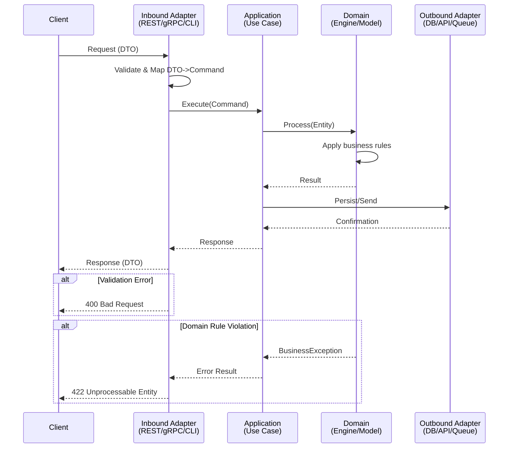

# Historia: {{TITLE}}

**ID:** {{STORY_ID}}
**Chave Jira:** {{JIRA_KEY}}

## 1. Dependencias

| Blocked By | Blocks |
| :--- | :--- |
| {{BLOCKED_BY}} | {{BLOCKS}} |

## 2. Regras Transversais Aplicaveis

| ID | Titulo |
| :--- | :--- |
| {{RULE_ID}} | {{RULE_TITLE}} |

> **Instrucao:** Referenciar apenas as regras do epico que impactam esta historia especifica. Nao listar regras irrelevantes ao escopo.

## 3. Descricao

Como **{{PERSONA}}**, eu quero {{CAPABILITY}}, para que {{OUTCOME}}.

### Contexto

{{TECHNICAL_CONTEXT}}

### 3.1 {{SUBSECTION_1_TITLE}}

{{SUBSECTION_1_CONTENT}}

### 3.2 {{SUBSECTION_2_TITLE}}

{{SUBSECTION_2_CONTENT}}

> **Instrucao:** Adicionar subsecoes numeradas (3.N) para cada requisito tecnico distinto. Incluir detalhes de protocolo, formatos, requisitos de concorrencia, valores de timeout — tudo que o desenvolvedor precisa.

## 3.5 Entrega de Valor

- **Valor Principal:** {{MAIN_VALUE}}
- **Metrica de Sucesso:** {{SUCCESS_METRIC}}
- **Impacto no Negocio:** {{BUSINESS_IMPACT}}

> **Regras (nao-negociaveis):**
> - Valor DEVE ser da perspectiva de negocio/usuario, NAO tecnica
> - PROIBIDO: "Migrar classes A, B, C para Java" (tarefa tecnica, sem valor de negocio)
> - CORRETO: "Endpoint de pagamento disponivel em Java, permitindo desligamento do servico legado"
> - Stories de camada 0 (fundacao) expressam valor de habilitacao
> - Stories de camada 4 (cross-cutting) expressam reducao de risco

## 4. Definicoes de Qualidade Locais

### DoR Local

- [ ] {{DOR_ITEM_1}}
- [ ] {{DOR_ITEM_2}}
- [ ] {{DOR_ITEM_3}}

### DoD Local

- [ ] {{DOD_ITEM_1}}
- [ ] {{DOD_ITEM_2}}
- [ ] {{DOD_ITEM_3}}
- [ ] Test plan gerado via `/x-test-plan` antes do inicio da implementacao
- [ ] Todo @GK-N da secao 7 mapeado para >= 1 AT-N na secao 8
- [ ] Cenarios Gherkin ordenados por TPP (degenerate -> happy -> error -> boundary -> edge)
- [ ] Todo AT-N com status GREEN antes de marcar DoD como concluido
- [ ] Commits seguem padrao test-first (teste precede ou acompanha implementacao no git log)

> **Instrucao:** Os 5 itens TDD acima sao mandatorios em toda historia. Adicionar itens especificos do escopo antes deles.

### Global DoD

- **Cobertura:** >= 95% Line, >= 90% Branch
- **Testes Automatizados:** {{TEST_REQUIREMENTS}}
- **TDD Compliance:** Commits test-first, refactoring explicito
- **Backward Compatibility:** {{BACKWARD_COMPAT_REQUIREMENTS}}
- **Double-Loop TDD:** Acceptance tests derivados dos cenarios Gherkin (outer loop), unit tests guiados por TPP (inner loop)
- **Rastreabilidade:** Todo @GK-N mapeia para >= 1 AT-N, todo AT-N referencia um @GK-N valido

> **Instrucao:** Copiar o DoD Global do epico verbatim. Os itens acima sao o minimo obrigatorio.

## 5. Contratos de Dados

| Campo | Tipo | Obrigatorio | Descricao |
| :--- | :--- | :--- | :--- |
| `{{FIELD_NAME}}` | {{FIELD_TYPE}} | {{MANDATORY}} | {{FIELD_DESCRIPTION}} |

> **Instrucao:** Para protocolos binarios usar formato: Campo | Formato | Request | Response | Origem/Regra.
> Nomes de campo devem corresponder exatamente a especificacao (mesmo casing, mesmo nome).
> Tipos devem incluir detalhes de formato (n 6, LLVAR z..37, VARCHAR(64)).

## 6. Diagramas

### 6.1 {{DIAGRAM_TITLE}}



> **Instrucao:** Substituir participantes por nomes reais dos componentes da especificacao.
> Incluir: trigger, validacao, logica de negocio, persistencia, operacoes async, construcao de resposta, caminhos de erro.
> Consultar a Diagram Requirement Matrix no skill `x-story-create` para determinar quais diagramas sao obrigatorios.

#### Diagram Validation Checklist

- [ ] Participantes usam nomes reais de componentes (nao "Service A", "Service B")
- [ ] Diagrama mostra pelo menos 3 camadas de arquitetura
- [ ] Pelo menos 1 caminho de erro mostrado usando bloco `alt`
- [ ] Todas as transformacoes de dados visiveis (DTO->Command, Entity->Domain)
- [ ] Caminho de construcao de resposta completo

## 7. Criterios de Aceite (Gherkin)

> **REGRAS OBRIGATORIAS:**
> - Cada cenario DEVE ter um ID unico `@GK-N` (onde N e sequencial: 1, 2, 3, ...)
> - IDs `@GK-N` sao **imutaveis** apos criacao — NUNCA renumerar ou reutilizar um ID
> - Minimo de **4 cenarios** por historia (degenerate + happy + error + boundary/edge)
> - Ordenacao **TPP obrigatoria**: degenerate -> happy -> error -> boundary -> edge case
> - Cenarios devem usar valores concretos, nao abstracoes

```gherkin
@GK-1
Cenario: {{DEGENERATE_CASE_TITLE}}
  DADO {{DEGENERATE_PRECONDITION}}
  QUANDO {{DEGENERATE_ACTION}}
  ENTAO {{DEGENERATE_EXPECTED_RESULT}}

@GK-2
Cenario: {{HAPPY_PATH_TITLE}}
  DADO {{HAPPY_PRECONDITION}}
  QUANDO {{HAPPY_ACTION}}
  ENTAO {{HAPPY_EXPECTED_RESULT}}
  E {{HAPPY_ADDITIONAL_ASSERTION}}

@GK-3
Cenario: {{ERROR_PATH_TITLE}}
  DADO {{ERROR_PRECONDITION}}
  QUANDO {{ERROR_ACTION}}
  ENTAO {{ERROR_EXPECTED_RESULT}}

@GK-4
Cenario: {{BOUNDARY_OR_EDGE_CASE_TITLE}}
  DADO {{BOUNDARY_PRECONDITION}}
  QUANDO {{BOUNDARY_ACTION}}
  ENTAO {{BOUNDARY_EXPECTED_RESULT}}
```

> **Instrucao:** Adicionar cenarios conforme necessidade do escopo. Manter ordenacao TPP.
> Categorias obrigatorias: (1) Degenerate cases, (2) Happy path, (3) Error paths, (4) Boundary/Edge cases.
> Para inputs limitados, usar padrao triplet: at-minimum, at-maximum, past-maximum.

### 7.1 Scenario Ordering (TPP)

> TPP: degenerate (caso nulo/vazio, @GK-1) -> happy path (fluxo principal, @GK-2) -> error path (erro esperado, @GK-3) -> boundary/edge (limite ou caso extremo, @GK-4+).

### 7.2 Mandatory Scenario Categories

- [ ] Degenerate cases (input nulo/vazio/zero)
- [ ] Happy path (fluxo principal com valores concretos)
- [ ] Error paths (cada tipo de erro documentado)
- [ ] Boundary values (padrao triplet: at-min, at-max, past-max)
- [ ] Edge cases (combinacoes, condicoes de corrida, transicoes de estado)

## 8. Sub-tarefas

> **REGRAS OBRIGATORIAS:**
> - Usar tag `[TDD]` com referencia a AT-N/UT-N — tags `[Dev]` e `[Test]` isoladas sao PROIBIDAS
> - Formato AT-N: `[TDD] AT-N (@GK-N): descricao do acceptance test (RED/GREEN)`
> - Formato UT-N: `[TDD] UT-N: descricao do unit test (RED/GREEN)`
> - Cada AT-N DEVE referenciar um @GK-N valido da secao 7
> - Incluir placeholder para pre-test-plan como primeira sub-tarefa

- [ ] [TDD] Pre-requisito: Gerar test plan via `/x-test-plan` antes de iniciar implementacao
- [ ] [TDD] AT-1 (@GK-1): {{AT1_DESCRIPTION}} (RED)
- [ ] [TDD] UT-1: {{UT1_DESCRIPTION}} (RED)
- [ ] [TDD] UT-1: {{UT1_IMPLEMENTATION}} (GREEN)
- [ ] [TDD] Refactor: {{REFACTOR_1_DESCRIPTION}}
- [ ] [TDD] AT-2 (@GK-2): {{AT2_DESCRIPTION}} (RED)
- [ ] [TDD] UT-2: {{UT2_DESCRIPTION}} (RED)
- [ ] [TDD] UT-2: {{UT2_IMPLEMENTATION}} (GREEN)
- [ ] [TDD] AT-3 (@GK-3): {{AT3_DESCRIPTION}} (RED)
- [ ] [TDD] UT-3: {{UT3_DESCRIPTION}} (GREEN)
- [ ] [TDD] AT-4 (@GK-4): {{AT4_DESCRIPTION}} (RED)
- [ ] [TDD] UT-4: {{UT4_DESCRIPTION}} (GREEN)
- [ ] [TDD] Refactor: {{REFACTOR_FINAL_DESCRIPTION}}

> **Instrucao:** Cada ciclo Red-Green-Refactor produz um ou mais commits atomicos.
> Adicionar sub-tarefas conforme necessidade do escopo, mantendo o formato [TDD] AT-N/UT-N.
> NAO usar tags [Dev] ou [Test] isoladas.
