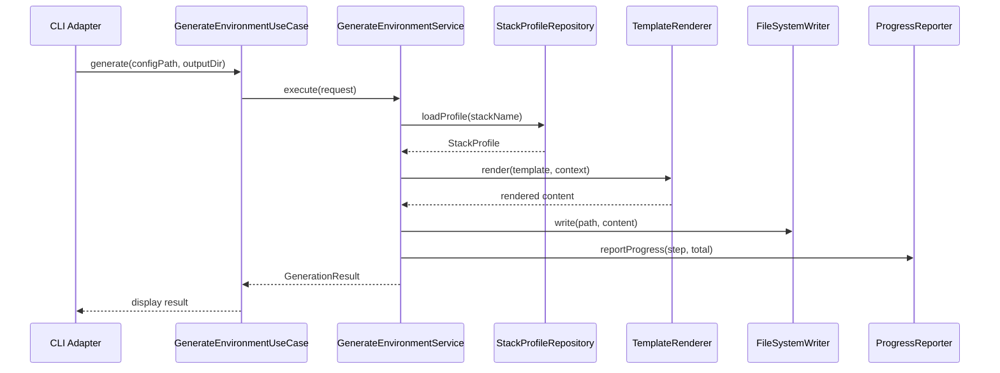
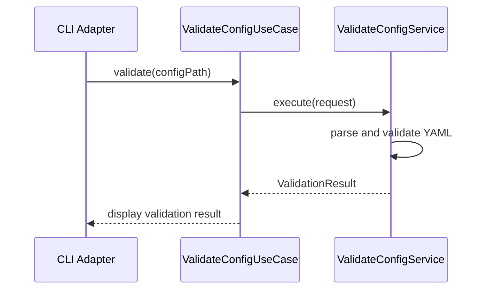

# Service Architecture — my-java-cli

## 1. Overview

**Service:** my-java-cli
**Architecture:** Hexagonal (Ports & Adapters)
**Language:** Java 21
**Framework:** picocli 4.7
**Interfaces:** CLI
**Build Tool:** Maven

> `ia-dev-env` is a CLI tool that generates development environment configurations
> (Claude Code, GitHub Copilot, Codex) from a YAML specification. It reads a
> project setup config, resolves the technology stack, and assembles output files
> using Pebble templates.

## 2. Package Structure (Hexagonal)

```
src/main/java/dev/iadev/
├── domain/                          # Core — zero external dependencies
│   ├── model/                       # Value objects, records, domain exceptions
│   │   ├── ProjectConfig.java       # Root aggregate (YAML -> typed config)
│   │   ├── GenerationContext.java   # Immutable context for template rendering
│   │   ├── ConfigValidationException.java  # Domain validation exception
│   │   └── ... (19 records total)
│   ├── port/
│   │   ├── input/                   # Use case interfaces (3)
│   │   │   ├── GenerateEnvironmentUseCase.java
│   │   │   ├── ValidateConfigUseCase.java
│   │   │   └── ListStackProfilesUseCase.java
│   │   └── output/                  # Driven port interfaces (5)
│   │       ├── StackProfileRepository.java
│   │       ├── TemplateRenderer.java
│   │       ├── FileSystemWriter.java
│   │       ├── CheckpointStore.java
│   │       └── ProgressReporter.java
│   ├── service/                     # Domain services implementing input ports
│   │   ├── GenerateEnvironmentService.java
│   │   ├── ValidateConfigService.java
│   │   └── ListStackProfilesService.java
│   ├── stack/                       # Stack resolution logic
│   └── implementationmap/           # DAG computation for epic execution
├── application/
│   ├── assembler/                   # Template assemblers (87 classes)
│   ├── dag/                         # Assembler dependency graph
│   └── factory/                     # Assembler factory
├── infrastructure/
│   ├── adapter/
│   │   ├── input/
│   │   │   └── cli/                 # CLI commands (picocli)
│   │   │       ├── GenerateCommandAdapter.java
│   │   │       ├── ValidateCommandAdapter.java
│   │   │       └── ListProfilesCommandAdapter.java
│   │   └── output/
│   │       ├── config/              # YAML config adapter (SnakeYAML)
│   │       ├── template/            # Template engine adapter (Pebble)
│   │       ├── filesystem/          # File system adapter (java.nio)
│   │       ├── checkpoint/          # Checkpoint persistence adapter (Jackson)
│   │       └── progress/            # Progress reporting adapter (console)
│   └── config/
│       └── ApplicationFactory.java  # Composition root (wires all)
├── exception/                       # Infrastructure exceptions (legacy bridge)
├── util/                            # Shared utilities
└── smoke/                           # Smoke test artifact generation
```

## 3. Dependency Direction

```
infrastructure/adapter/input/cli → domain/port/input → domain/service → domain/port/output
                                                                              ↑
                                                        infrastructure/adapter/output (implements)

infrastructure/config/ApplicationFactory → wires all layers
```

**Golden Rule:** Dependencies point inward. Domain NEVER imports adapter, infrastructure, or framework code.

## 4. Layer Rules

| Layer | Can Depend On | Cannot Depend On |
| :--- | :--- | :--- |
| `domain.model` | Standard library only | Everything else |
| `domain.port.input` | `domain.model`, standard library | adapter, application, infrastructure |
| `domain.port.output` | `domain.model`, standard library | adapter, application, infrastructure |
| `domain.service` | `domain.model`, `domain.port.*` | adapter, application, infrastructure |
| `application.assembler` | `domain.port.output`, `domain.model` | `domain.service`, adapter, CLI |
| `infrastructure.adapter.input` | `domain.port.input`, `domain.model` | `domain.service`, output adapters |
| `infrastructure.adapter.output` | `domain.port.output`, `domain.model` | input adapters, `domain.service` |
| `infrastructure.config` | All layers (composition root) | — |

## 5. ArchUnit Enforcement

All architecture rules are enforced automatically via ArchUnit (8 rules, zero violations):

| Rule | Description | Status |
| :--- | :--- | :--- |
| RULE-001a | Domain must not depend on infrastructure packages | Active |
| RULE-001b | Domain must not depend on application layer | Active |
| RULE-002 | Output ports must be interfaces | Active |
| RULE-003a | Input ports must be interfaces | Active |
| RULE-003b | Input ports must only depend on domain model | Active |
| RULE-003c | CLI must only access input ports | Active |
| RULE-004 | Domain model must have zero framework dependencies | Active |
| RULE-005 | Domain must not reference config (composition root) | Active |

## 6. Critical Flows

### Flow 1: Generate Environment



### Flow 2: Validate Configuration



## 7. Architectural Decisions

| ADR | Title | Status |
| :--- | :--- | :--- |
| ADR-001 | Hexagonal Architecture Migration | Accepted |

## 8. Legacy Packages (Tech Debt)

The following legacy packages remain as active code that has not yet been
migrated into the hexagonal structure. They are functional and tested but
represent remaining migration work:

| Package | Status | Notes |
| :--- | :--- | :--- |
| `cli/` | Active (legacy) | Contains original CLI commands; new adapters delegate to these |
| `config/` | Active (legacy) | ConfigLoader, ContextBuilder still used by assemblers |
| `checkpoint/` | Active (legacy) | Checkpoint engine and persistence |
| `progress/` | Active (legacy) | Progress reporting and formatting |
| `template/` | Active (legacy) | Pebble template engine wrapper |
| `exception/` | Bridge | Subclasses domain exceptions for backward compatibility |
| `util/` | Active (legacy) | Shared utilities (PathUtils, ResourceDiscovery, etc.) |

## 9. Change History

| Date | Author | Description |
| :--- | :--- | :--- |
| 2026-04-04 | EPIC-0015 | Hexagonal architecture migration (15 stories) |
