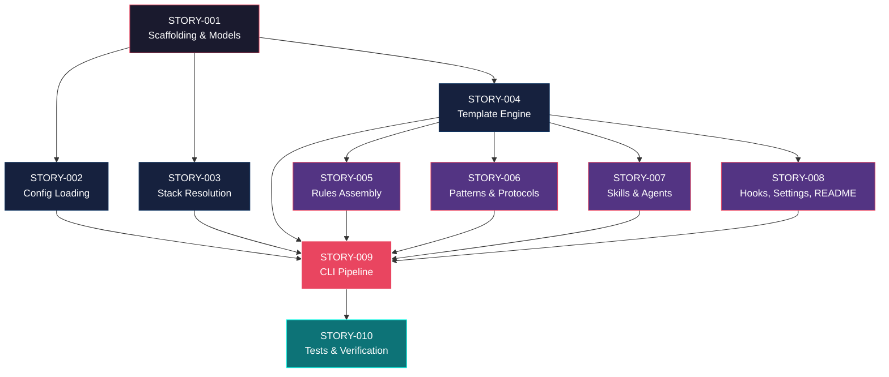

# Mapa de Implementação — Reescrita Cross-Platform do setup.sh em Python

**Gerado a partir das dependências BlockedBy/Blocks de cada história do EPIC_CROSS-PLATFORM-SETUP.**

---

## 1. Matriz de Dependências

| Story     | Título                  | Blocked By                              | Blocks                                  | Status   |
| :-------- | :---------------------- | :-------------------------------------- | :-------------------------------------- | :------- |
| STORY-001 | Scaffolding e Modelos   | —                                       | STORY-002, 003, 004, 005, 006, 007, 008 | Done |
| STORY-002 | Config Loading          | STORY-001                               | STORY-009                               | Done |
| STORY-003 | Stack Resolution        | STORY-001                               | STORY-009                               | Done |
| STORY-004 | Template Engine         | STORY-001                               | STORY-005, 006, 007, 008                | Done |
| STORY-005 | Rules Assembly          | STORY-001, 004                          | STORY-009                               | Done |
| STORY-006 | Patterns & Protocols    | STORY-001, 004                          | STORY-009                               | Done |
| STORY-007 | Skills & Agents         | STORY-001, 004                          | STORY-009                               | Done |
| STORY-008 | Hooks, Settings, README | STORY-001, 004                          | STORY-009                               | Done |
| STORY-009 | CLI Pipeline            | STORY-002, 003, 004, 005, 006, 007, 008 | STORY-010                               | Done |
| STORY-010 | Tests & Verification    | STORY-009                               | —                                       | Pendente |

> **Nota:** STORY-004 (Template Engine) é dependência indireta de STORY-009 tanto diretamente quanto via assemblers (005-008). Isso torna STORY-004 o nó mais crítico da árvore de dependências.

---

## 2. Fases de Implementação

> As histórias são agrupadas em fases. Dentro de cada fase, as histórias podem ser implementadas **em paralelo**. Uma fase só pode iniciar quando todas as dependências das fases anteriores estiverem concluídas.

```
╔════════════════════════════════════════════════════════════════════════╗
║                   FASE 0 — Foundation                                  ║
║                                                                        ║
║   ┌─────────────────────────────────────────────────────────────┐      ║
║   │  STORY-001  Scaffolding do Projeto e Modelos de Domínio     │      ║
║   └──────────────────────────┬──────────────────────────────────┘      ║
╚══════════════════════════════╪═════════════════════════════════════════╝
                               │
                               ▼
╔═══════════════════════════════════════════════════════════════════════╗
║              FASE 1 — Core Modules (paralelo)                         ║
║                                                                       ║
║   ┌─────────────┐  ┌─────────────┐  ┌─────────────┐                   ║
║   │  STORY-002  │  │  STORY-003  │  │  STORY-004  │                   ║
║   │  Config     │  │  Stack Res. │  │  Template   │                   ║
║   └──────┬──────┘  └──────┬──────┘  └──────┬──────┘                   ║
╚══════════╪════════════════╪════════════════╪══════════════════════════╝
           │                │                │
           │                │                ▼
╔══════════╪════════════════╪════════════════════════════════════════════╗
║          │                │   FASE 2 — Assemblers (paralelo)           ║
║          │                │                                            ║
║          │                │   ┌───────────┐  ┌───────────┐             ║
║          │                │   │ STORY-005 │  │ STORY-006 │             ║
║          │                │   │ Rules     │  │ Patterns  │             ║
║          │                │   └─────┬─────┘  └─────┬─────┘             ║
║          │                │   ┌───────────┐  ┌───────────┐             ║
║          │                │   │ STORY-007 │  │ STORY-008 │             ║
║          │                │   │ Skills    │  │ Hooks/Set │             ║
║          │                │   └─────┬─────┘  └─────┬─────┘             ║
╚══════════╪════════════════╪═════════╪══════════════╪═══════════════════╝
           │                │         │              │
           ▼                ▼         ▼              ▼
╔════════════════════════════════════════════════════════════════════════╗
║                   FASE 3 — Integration                                 ║
║                                                                        ║
║   ┌──────────────────────────────────────────────────────────┐         ║
║   │  STORY-009  CLI Pipeline e Orquestração                  │         ║
║   │  (← STORY-002, 003, 004, 005, 006, 007, 008)             │         ║
║   └──────────────────────────┬───────────────────────────────┘         ║
╚══════════════════════════════╪═════════════════════════════════════════╝
                               │
                               ▼
╔══════════════════════════════════════════════════════════════════════════╗
║                   FASE 4 — Verification                                  ║
║                                                                          ║
║   ┌──────────────────────────────────────────────────────────┐           ║
║   │  STORY-010  Testes e Verificação End-to-End              │           ║
║   │  (← STORY-009)                                           │           ║
║   └──────────────────────────────────────────────────────────┘           ║
╚══════════════════════════════════════════════════════════════════════════╝
```

---

## 3. Caminho Crítico

> O caminho crítico (a sequência mais longa de dependências) determina o tempo mínimo de implementação do projeto.

```
STORY-001 → STORY-004 → STORY-005 → STORY-009 → STORY-010
  Fase 0      Fase 1      Fase 2      Fase 3      Fase 4
```

**5 fases no caminho crítico, 5 histórias na cadeia mais longa (001 → 004 → 005 → 009 → 010).**

Qualquer atraso em STORY-001 ou STORY-004 impacta diretamente todas as fases subsequentes. STORY-004 é o nó mais crítico pois bloqueia todos os 4 assemblers da Fase 2. Investir tempo extra na qualidade de STORY-004 compensa ao evitar retrabalho nos assemblers.

---

## 4. Grafo de Dependências (Mermaid)



---

## 5. Resumo por Fase

| Fase | Histórias                                  | Camada       | Paralelismo | Pré-requisito          |
| :--- | :----------------------------------------- | :----------- | :---------- | :--------------------- |
| 0    | STORY-001                                  | Foundation   | 1           | —                      |
| 1    | STORY-002, STORY-003, STORY-004            | Core Modules | 3 paralelas | Fase 0 concluída       |
| 2    | STORY-005, STORY-006, STORY-007, STORY-008 | Assemblers   | 4 paralelas | Fase 0 + STORY-004     |
| 3    | STORY-009                                  | Integration  | 1           | Fases 1 e 2 concluídas |
| 4    | STORY-010                                  | Verification | 1           | Fase 3 concluída       |

**Total: 10 histórias em 5 fases.**

> **Nota:** Fase 2 pode iniciar parcialmente assim que STORY-004 (Fase 1) estiver concluída, mesmo que STORY-002 e STORY-003 ainda estejam em andamento. Os assemblers dependem apenas de STORY-001 e STORY-004.

---

## 6. Detalhamento por Fase

### Fase 0 — Foundation

| Story     | Escopo Principal                                         | Artefatos Chave                                           |
| :-------- | :------------------------------------------------------- | :-------------------------------------------------------- |
| STORY-001 | Estrutura do projeto Python, dataclasses, pyproject.toml | `claude_setup/models.py`, `pyproject.toml`, `__main__.py` |

**Entregas da Fase 0:**

- Pacote Python instalável com `pip install -e .`
- Todos os dataclasses para representação de config
- Entry point CLI básico funcional

### Fase 1 — Core Modules

| Story     | Escopo Principal                                     | Artefatos Chave               |
| :-------- | :--------------------------------------------------- | :---------------------------- |
| STORY-002 | YAML loading, migração v2→v3, modo interativo        | `config.py`                   |
| STORY-003 | Resolução de stack, validação de compatibilidade     | `resolver.py`, `validator.py` |
| STORY-004 | Engine Jinja2, replace placeholders, inject sections | `template_engine.py`          |

**Entregas da Fase 1:**

- Config loading completo com migração automática
- Stack resolver com todos os stacks suportados
- Template engine compatível com templates existentes

### Fase 2 — Assemblers

| Story     | Escopo Principal                                | Artefatos Chave                                                      |
| :-------- | :---------------------------------------------- | :------------------------------------------------------------------- |
| STORY-005 | Rules assembly, project identity, consolidação  | `assembler/rules.py`                                                 |
| STORY-006 | Patterns selection, protocols derivation        | `assembler/patterns.py`, `assembler/protocols.py`                    |
| STORY-007 | Skills copying, agents copying, knowledge packs | `assembler/skills.py`, `assembler/agents.py`                         |
| STORY-008 | Hooks JSON, settings JSON, README generation    | `assembler/hooks.py`, `assembler/settings.py`, `assembler/readme.py` |

**Entregas da Fase 2:**

- Todos os assemblers funcionais e independentes
- Output de cada assembler verificável individualmente

### Fase 3 — Integration

| Story     | Escopo Principal                                    | Artefatos Chave                               |
| :-------- | :-------------------------------------------------- | :-------------------------------------------- |
| STORY-009 | CLI Click, pipeline de orquestração, output atômico | `cli.py`, `assembler/__init__.py`, `utils.py` |

**Entregas da Fase 3:**

- CLI funcional com `generate`, `validate` commands
- Pipeline end-to-end com output atômico
- Modos: config file, interactive, dry-run

### Fase 4 — Verification

| Story     | Escopo Principal                              | Artefatos Chave         |
| :-------- | :-------------------------------------------- | :---------------------- |
| STORY-010 | Verifier byte-a-byte, golden files, suíte e2e | `verifier.py`, `tests/` |

**Entregas da Fase 4:**

- Verificação byte-a-byte para 7 perfis de config
- Golden files gerados e versionados
- Cobertura total ≥ 95% line

---

## 7. Observações Estratégicas

### Gargalo Principal

**STORY-004 (Template Engine)** é o maior gargalo — bloqueia diretamente 4 assemblers (STORY-005 a STORY-008). Investir tempo extra na qualidade e completude do template engine evita retrabalho cascata. Recomendação: alocar o desenvolvedor mais experiente e incluir testes de compatibilidade byte-a-byte desde o início.

### Histórias Folha (sem dependentes)

- **STORY-010** (Tests & Verification) — não bloqueia nenhuma outra história. Pode absorver atrasos sem impacto no caminho crítico, mas é a validação final do projeto.
- **STORY-002** e **STORY-003** na Fase 1 — não bloqueiam os assemblers (que dependem apenas de 001+004). Podem ter execução mais relaxada se necessário.

### Otimização de Tempo

- Paralelismo máximo na **Fase 1** (3 stories) e **Fase 2** (4 stories)
- STORY-001 pode começar imediatamente — é a única sem dependências
- Alocar 3 desenvolvedores: um no caminho crítico (001→004→005→009→010), dois nas stories paralelas (002, 003, 006, 007, 008)

### Dependências Cruzadas

STORY-009 é o ponto de convergência onde todos os ramos se encontram. Garanta que a interface de cada assembler (`assemble(config, output_dir, engine) → list[Path]`) esteja definida em STORY-001 para evitar conflitos na integração.

### Marco de Validação Arquitetural

**STORY-004 + STORY-005** devem servir como checkpoint: se o template engine + rules assembler produzem output idêntico ao bash, a abordagem está validada. Execute verificação byte-a-byte nesse ponto antes de expandir para os demais assemblers.
