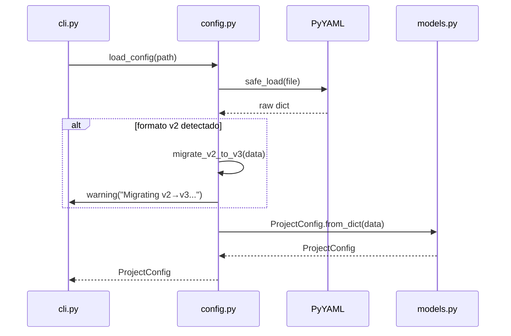

# História: Carregamento e Validação de Configuração

**ID:** STORY-002

## 1. Dependências

| Blocked By | Blocks |
| :--- | :--- |
| STORY-001 | STORY-009 |

## 2. Regras Transversais Aplicáveis

| ID | Título |
| :--- | :--- |
| RULE-002 | Migração v2→v3 |
| RULE-004 | Python 3.9+ |
| RULE-006 | Modo interativo |

## 3. Descrição

Como **usuário da ferramenta**, eu quero carregar configuração a partir de um arquivo YAML ou via modo interativo, garantindo que ambos os modos produzam um `ProjectConfig` válido e equivalente.

Este módulo (`config.py`) é responsável por: ler e parsear YAML, detectar formato v2 (legacy) e auto-migrar para v3, validar campos obrigatórios, e fornecer modo interativo via Click prompts como fallback quando nenhum arquivo é fornecido.

A migração v2→v3 mapeia o campo `type: "java-quarkus"` para seções separadas `language: {name: java, version: "21"}` e `framework: {name: quarkus, version: "3.17"}`. O mapping é derivado das funções `detect_old_config_format()` e `migrate_old_type()` do setup.sh original (linhas 419-465).

### 3.1 Carregamento de YAML

- Ler arquivo com `yaml.safe_load()`
- Validar presença de seções obrigatórias: `project`, `architecture`, `interfaces`, `language`, `framework`
- Retornar `ProjectConfig` via `from_dict()`

### 3.2 Migração v2→v3

- Detectar presença de `type:` no root ou `project.type`
- Mapear stacks conhecidas: `java-quarkus`, `java-spring`, `python-fastapi`, `go-gin`, etc.
- Emitir warning via `click.echo()` informando migração
- Produzir dict v3 equivalente

### 3.3 Modo Interativo

- `prompt_select()` para escolhas (architecture style, language, framework, etc.)
- `prompt_input()` para texto livre (project name, purpose)
- `prompt_yesno()` para booleans (domain_driven, event_driven, native_build)
- Construir `ProjectConfig` a partir das respostas

## 4. Definições de Qualidade Locais

### DoR Local
- [ ] Modelos de dados (STORY-001) implementados e testados
- [ ] Mapeamento de stacks v2→v3 documentado
- [ ] Config YAML v2 e v3 de exemplo disponíveis

### DoD Local
- [ ] `load_config(path)` retorna `ProjectConfig` para qualquer config válida
- [ ] `migrate_v2_to_v3(data)` converte corretamente todos os stacks conhecidos
- [ ] `run_interactive()` coleta inputs e produz `ProjectConfig` equivalente
- [ ] Erros de validação levantam exceções com mensagem descritiva

### Global DoD
- **Cobertura:** ≥ 95% Line, ≥ 90% Branch
- **Testes Automatizados:** Unit (pytest), integration, contract
- **Relatório de Cobertura:** pytest-cov HTML + XML
- **Documentação:** README.md, --help funcional
- **Persistência:** N/A
- **Performance:** Execução completa < 5s

## 5. Contratos de Dados (Data Contract)

**load_config(path: Path) → ProjectConfig:**

| Campo | Formato | Input | Output | Origem / Regra |
| :--- | :--- | :--- | :--- | :--- |
| `path` | `Path` | M | — | Caminho do YAML |
| `return` | `ProjectConfig` | — | M | Modelo populado |

**migrate_v2_to_v3(data: dict) → dict:**

| Campo | Formato | Input | Output | Origem / Regra |
| :--- | :--- | :--- | :--- | :--- |
| `data` | `dict` | M | — | YAML parseado em formato v2 |
| `return` | `dict` | — | M | Dict em formato v3 — RULE-002 |

## 6. Diagramas

### 6.1 Fluxo de Carregamento



## 7. Critérios de Aceite (Gherkin)

```gherkin
Cenario: Carregar config v3 válida
  DADO que tenho um arquivo setup-config.java-quarkus.yaml em formato v3
  QUANDO executo load_config(path)
  ENTÃO recebo um ProjectConfig com language.name == "java"
  E framework.name == "quarkus"

Cenario: Auto-migrar config v2
  DADO que tenho um arquivo com "type: java-quarkus" no root
  QUANDO executo load_config(path)
  ENTÃO recebo um ProjectConfig válido em formato v3
  E um warning de migração é emitido

Cenario: Config com campos obrigatórios ausentes
  DADO que tenho um YAML sem a seção "language"
  QUANDO executo load_config(path)
  ENTÃO uma exceção ConfigValidationError é lançada
  E a mensagem indica o campo ausente

Cenario: Modo interativo produz config equivalente
  DADO que executo run_interactive() com respostas equivalentes ao java-quarkus.yaml
  QUANDO o processo interativo completa
  ENTÃO o ProjectConfig resultante é equivalente ao carregado do arquivo
```

## 8. Sub-tarefas

- [ ] [Dev] Implementar `load_config()` com parsing YAML
- [ ] [Dev] Implementar `detect_v2_format()` e `migrate_v2_to_v3()`
- [ ] [Dev] Implementar validação de campos obrigatórios
- [ ] [Dev] Implementar `run_interactive()` com Click prompts
- [ ] [Test] Unitário: loading de cada perfil de config
- [ ] [Test] Unitário: migração v2→v3 para todos os stacks
- [ ] [Test] Unitário: validação de erros com mensagens descritivas
- [ ] [Test] Contract: config interativo vs config file produzem output idêntico
