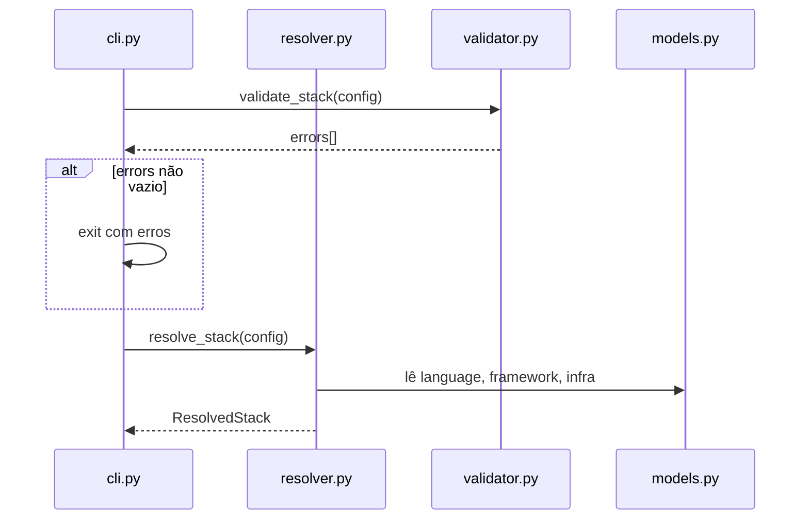

# História: Resolução e Validação de Stack

**ID:** STORY-003

## 1. Dependências

| Blocked By | Blocks |
| :--- | :--- |
| STORY-001 | STORY-009 |

## 2. Regras Transversais Aplicáveis

| ID | Título |
| :--- | :--- |
| RULE-004 | Python 3.9+ |

## 3. Descrição

Como **desenvolvedor da ferramenta**, eu quero que o sistema resolva e valide a combinação de stack (language + framework + infra), garantindo que apenas combinações suportadas sejam processadas e que comandos derivados estejam corretos.

Este módulo implementa a lógica das funções `resolve_stack_commands()` (linha 467, 120 linhas), `validate_stack_compatibility()` (linha 589, 120 linhas), `infer_native_build()` (linha 711), `derive_protocols_from_interfaces()` (linha 746), `derive_project_type()` (linha 763), e `verify_cross_references()` (linha 794) do setup.sh original.

O resolver determina: build commands, test commands, Docker base images, health check paths, e outras derivações baseadas na combinação language+framework. O validator garante que combinações incompatíveis (ex: `native_build: true` com Spring Boot) sejam rejeitadas com erro descritivo.

### 3.1 Resolver (`resolver.py`)

- `resolve_stack(config: ProjectConfig) → ResolvedStack` — calcula todos os valores derivados
- `ResolvedStack` dataclass com: build_cmd, test_cmd, docker_base_image, health_path, package_manager, etc.
- Mapping de stacks suportados: java-quarkus, java-spring, python-fastapi, go-gin, node-express, etc.

### 3.2 Validator (`validator.py`)

- `validate_stack(config: ProjectConfig) → list[str]` — retorna lista de erros (vazia = válido)
- Validações: combinação language+framework suportada, interfaces compatíveis com framework, native_build compatível
- `verify_cross_references(config, src_dir)` — verifica que templates/skills referenciados existem

## 4. Definições de Qualidade Locais

### DoR Local
- [ ] Modelos (STORY-001) implementados
- [ ] Tabela de stacks suportados documentada
- [ ] Regras de compatibilidade extraídas do setup.sh

### DoD Local
- [ ] `resolve_stack()` retorna valores corretos para todos os stacks suportados
- [ ] `validate_stack()` rejeita combinações inválidas com mensagens claras
- [ ] `verify_cross_references()` valida existência de artefatos referenciados
- [ ] Testes parametrizados para cada stack

### Global DoD
- **Cobertura:** ≥ 95% Line, ≥ 90% Branch
- **Testes Automatizados:** Unit (pytest), integration, contract
- **Relatório de Cobertura:** pytest-cov HTML + XML
- **Documentação:** README.md, --help funcional
- **Persistência:** N/A
- **Performance:** Execução completa < 5s

## 5. Contratos de Dados (Data Contract)

**ResolvedStack (dataclass):**

| Campo | Tipo | Origem / Regra |
| :--- | :--- | :--- |
| `build_cmd` | `str` | Derivado de language+framework |
| `test_cmd` | `str` | Derivado de language+framework |
| `docker_base_image` | `str` | Derivado de language+version |
| `health_path` | `str` | `/q/health` (quarkus), `/actuator/health` (spring) |
| `package_manager` | `str` | `maven`/`gradle`/`pip`/`go mod`/`npm` |
| `native_supported` | `bool` | Derivado de framework capabilities |

## 6. Diagramas

### 6.1 Fluxo de Resolução



## 7. Critérios de Aceite (Gherkin)

```gherkin
Cenario: Resolver stack java-quarkus
  DADO que tenho um ProjectConfig com language=java, framework=quarkus
  QUANDO executo resolve_stack(config)
  ENTÃO build_cmd contém "mvn"
  E docker_base_image contém "ubi-minimal"
  E health_path é "/q/health"

Cenario: Validar stack incompatível
  DADO que tenho um ProjectConfig com native_build=true e framework=spring
  QUANDO executo validate_stack(config)
  ENTÃO a lista de erros contém mensagem sobre native_build incompatível

Cenario: Resolver protocolos a partir de interfaces
  DADO que tenho interfaces [rest, grpc, event-consumer]
  QUANDO executo derive_protocols(config)
  ENTÃO os protocolos incluem "openapi", "proto3", "kafka"

Cenario: Validar cross-references com diretório src
  DADO que tenho um config referenciando skills e templates
  QUANDO executo verify_cross_references(config, src_dir)
  ENTÃO todos os artefatos referenciados existem no filesystem
```

## 8. Sub-tarefas

- [ ] [Dev] Implementar `ResolvedStack` dataclass
- [ ] [Dev] Implementar `resolve_stack()` com mappings para todos os stacks
- [ ] [Dev] Implementar `validate_stack()` com regras de compatibilidade
- [ ] [Dev] Implementar `derive_protocols_from_interfaces()`
- [ ] [Dev] Implementar `verify_cross_references()`
- [ ] [Test] Unitário: resolução para cada stack suportado (parametrizado)
- [ ] [Test] Unitário: validação de combinações inválidas
- [ ] [Test] Unitário: derivação de protocolos
- [ ] [Test] Integração: cross-reference com filesystem real
