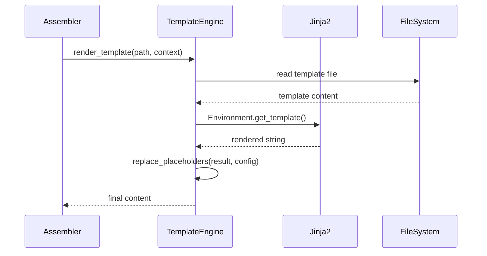

# História: Engine de Templates Jinja2

**ID:** STORY-004

## 1. Dependências

| Blocked By | Blocks |
| :--- | :--- |
| STORY-001 | STORY-005, STORY-006, STORY-007, STORY-008 |

## 2. Regras Transversais Aplicáveis

| ID | Título |
| :--- | :--- |
| RULE-001 | Sintaxe Jinja2 |
| RULE-004 | Python 3.9+ |
| RULE-005 | Compatibilidade byte-a-byte |

## 3. Descrição

Como **desenvolvedor da ferramenta**, eu quero um engine de templates que processe os templates existentes com Jinja2, garantindo que o output seja idêntico ao produzido pelo sed/bash do setup.sh original.

Este módulo (`template_engine.py`) encapsula o Jinja2 Environment com configurações específicas do projeto: loader de filesystem, variáveis de contexto derivadas do `ProjectConfig`, e helpers para operações comuns (replace placeholders, inject sections, concatenate files).

O setup.sh original usa `sed` para substituição de placeholders (`replace_placeholders()`, linha 259) e concatenação de arquivos com injeção de seções (`inject_section()`, linha 2518). O engine Jinja2 deve reproduzir esse comportamento exatamente, incluindo preservação de whitespace e newlines.

### 3.1 Template Engine Core

- `TemplateEngine(src_dir: Path, config: ProjectConfig)` — inicializa Jinja2 Environment
- `render_template(template_path: Path, context: dict) → str` — renderiza um template
- `render_string(template_str: str, context: dict) → str` — renderiza string inline
- Context padrão derivado de `ProjectConfig`: project_name, language_name, framework_name, etc.

### 3.2 Operações de Montagem

- `replace_placeholders(content: str, config: ProjectConfig) → str` — substitui `{placeholder}` por valores do config (compatível com o formato existente, não Jinja2)
- `inject_section(base_content: str, section: str, marker: str) → str` — injeta conteúdo em ponto marcado
- `concat_files(paths: list[Path], separator: str) → str` — concatena múltiplos arquivos com separador

### 3.3 Compatibilidade

- Templates existentes usam `{{ }}` que é nativo Jinja2 — zero adaptação necessária
- Placeholders legados `{project_name}` devem ser tratados com regex fallback
- Whitespace: `keep_trailing_newline=True`, `trim_blocks=False`, `lstrip_blocks=False`

## 4. Definições de Qualidade Locais

### DoR Local
- [ ] Modelos (STORY-001) implementados
- [ ] Templates de referência disponíveis em `src/`
- [ ] Output de referência (bash) disponível para comparação

### DoD Local
- [ ] `render_template()` produz output idêntico ao bash para templates de teste
- [ ] `replace_placeholders()` trata todos os formatos de placeholder
- [ ] `inject_section()` preserva formatação e whitespace
- [ ] `concat_files()` preserva newlines entre arquivos

### Global DoD
- **Cobertura:** ≥ 95% Line, ≥ 90% Branch
- **Testes Automatizados:** Unit (pytest), integration, contract
- **Relatório de Cobertura:** pytest-cov HTML + XML
- **Documentação:** README.md, --help funcional
- **Persistência:** N/A
- **Performance:** Execução completa < 5s

## 5. Contratos de Dados (Data Contract)

**TemplateEngine:**

| Método | Input | Output | Regra |
| :--- | :--- | :--- | :--- |
| `render_template` | `Path, dict` | `str` | RULE-001, RULE-005 |
| `render_string` | `str, dict` | `str` | RULE-001 |
| `replace_placeholders` | `str, ProjectConfig` | `str` | RULE-005 |
| `inject_section` | `str, str, str` | `str` | RULE-005 |
| `concat_files` | `list[Path], str` | `str` | RULE-005 |

## 6. Diagramas

### 6.1 Fluxo de Renderização



## 7. Critérios de Aceite (Gherkin)

```gherkin
Cenario: Renderizar template com variáveis Jinja2
  DADO que tenho um template com "{{ project_name }}"
  QUANDO renderizo com context {"project_name": "my-service"}
  ENTÃO o output contém "my-service"
  E nenhum placeholder residual existe

Cenario: Substituir placeholders legados
  DADO que tenho conteúdo com "{framework_name}" (formato legado)
  QUANDO executo replace_placeholders(content, config)
  ENTÃO "{framework_name}" é substituído por "quarkus"

Cenario: Injetar seção em marcador
  DADO que tenho conteúdo base com marcador "<!-- INSERT:rules -->"
  E tenho uma seção de regras a injetar
  QUANDO executo inject_section(base, section, "<!-- INSERT:rules -->")
  ENTÃO a seção é inserida no ponto do marcador
  E o marcador é removido

Cenario: Compatibilidade byte-a-byte com bash
  DADO que tenho o output de referência do bash para um template
  QUANDO renderizo o mesmo template com o engine Python
  ENTÃO o output é idêntico byte-a-byte ao do bash
```

## 8. Sub-tarefas

- [ ] [Dev] Implementar `TemplateEngine` com Jinja2 Environment
- [ ] [Dev] Implementar `render_template()` e `render_string()`
- [ ] [Dev] Implementar `replace_placeholders()` com regex
- [ ] [Dev] Implementar `inject_section()` preservando whitespace
- [ ] [Dev] Implementar `concat_files()` com separador
- [ ] [Test] Unitário: renderização Jinja2 com variáveis
- [ ] [Test] Unitário: placeholders legados
- [ ] [Test] Contract: comparação byte-a-byte com output bash
