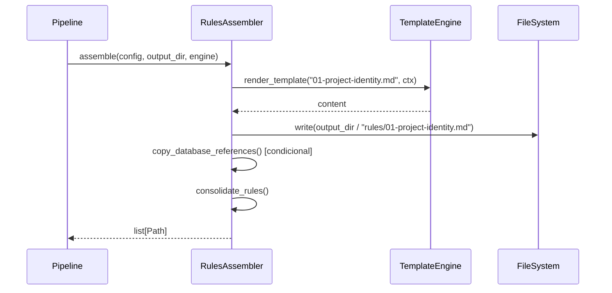

# História: Assembler de Regras (.claude/rules/)

**ID:** STORY-005

## 1. Dependências

| Blocked By | Blocks |
| :--- | :--- |
| STORY-001, STORY-004 | STORY-009 |

## 2. Regras Transversais Aplicáveis

| ID | Título |
| :--- | :--- |
| RULE-001 | Sintaxe Jinja2 |
| RULE-003 | Output atômico |
| RULE-005 | Compatibilidade byte-a-byte |
| RULE-007 | Assemblers independentes |

## 3. Descrição

Como **usuário da ferramenta**, eu quero que o assembler de regras gere os arquivos `.claude/rules/` corretamente, garantindo que as regras de projeto, coding standards, arquitetura, qualidade e domínio sejam montadas a partir dos templates e knowledge packs.

Este assembler porta a função `assemble_rules()` (linha 1244, ~200 linhas) e funções relacionadas: `generate_project_identity()` (linha 1443), `copy_database_references()` (linha 1506), `copy_cache_references()` (linha 1541), `consolidate_rules()` (linha 1588), `consolidate_framework_rules()` (linha 1611), `audit_rules_context()` (linha 1654), `assemble_security_rules()` (linha 1696), `assemble_cloud_knowledge()` (linha 1738), `assemble_infrastructure_knowledge()` (linha 1757).

O assembler recebe `ProjectConfig` + `output_dir` + `TemplateEngine` e gera os arquivos de regras numerados (01-project-identity.md, 02-domain.md, 03-coding-standards.md, 04-architecture-summary.md, 05-quality-gates.md, etc.).

### 3.1 Geração de Regras Core

- `01-project-identity.md` — gerado a partir de `ProjectConfig` com template
- `02-domain.md` — copiado de template com placeholders substituídos
- `03-coding-standards.md` — montado a partir de knowledge packs de linguagem
- `04-architecture-summary.md` — montado a partir do knowledge pack de arquitetura
- `05-quality-gates.md` — montado a partir de config de testes

### 3.2 Regras Condicionais

- Security rules — geradas apenas se `security.frameworks` não vazio
- Database references — copiadas apenas se `data.database` definido
- Cache references — copiadas apenas se `data.cache` definido
- Cloud/infra knowledge — baseado em `infrastructure` config

### 3.3 Consolidação

- Múltiplos knowledge packs são consolidados em um único arquivo
- Framework-specific rules são mescladas com regras gerais
- Audit de referências cruzadas valida que todos os arquivos referenciados existem

## 4. Definições de Qualidade Locais

### DoR Local
- [ ] Modelos (STORY-001) e TemplateEngine (STORY-004) implementados
- [ ] Knowledge packs e templates de regras disponíveis em `src/`
- [ ] Output de referência (bash) para regras disponível

### DoD Local
- [ ] Assembler gera todos os arquivos de regras para config java-quarkus
- [ ] Regras condicionais são incluídas/excluídas corretamente
- [ ] Consolidação produz arquivos sem duplicação
- [ ] Output idêntico ao bash para regras

### Global DoD
- **Cobertura:** ≥ 95% Line, ≥ 90% Branch
- **Testes Automatizados:** Unit (pytest), integration, contract
- **Relatório de Cobertura:** pytest-cov HTML + XML
- **Documentação:** README.md, --help funcional
- **Persistência:** N/A
- **Performance:** Execução completa < 5s

## 5. Contratos de Dados (Data Contract)

**RulesAssembler:**

| Método | Input | Output | Regra |
| :--- | :--- | :--- | :--- |
| `assemble(config, output_dir, engine)` | `ProjectConfig, Path, TemplateEngine` | `list[Path]` (arquivos gerados) | RULE-003, RULE-005, RULE-007 |
| `generate_project_identity(config)` | `ProjectConfig` | `str` | RULE-005 |
| `consolidate_rules(rules_dir)` | `Path` | `None` (modifica in-place) | RULE-005 |

## 6. Diagramas

### 6.1 Fluxo de Assembly de Regras



## 7. Critérios de Aceite (Gherkin)

```gherkin
Cenario: Gerar regras para java-quarkus completo
  DADO que tenho um ProjectConfig para java-quarkus com todas as seções
  QUANDO executo RulesAssembler.assemble(config, output_dir, engine)
  ENTÃO os arquivos 01 a 05 são gerados em output_dir/rules/
  E o conteúdo de 01-project-identity.md contém "my-quarkus-service"

Cenario: Excluir regras de segurança quando não configurado
  DADO que tenho um ProjectConfig sem security.frameworks
  QUANDO executo RulesAssembler.assemble(config, output_dir, engine)
  ENTÃO nenhum arquivo de regras de segurança é gerado

Cenario: Consolidar knowledge packs de linguagem
  DADO que tenho knowledge packs para java 21 em múltiplos arquivos
  QUANDO executo consolidate_rules()
  ENTÃO um único arquivo consolidado é produzido
  E não há conteúdo duplicado

Cenario: Output idêntico ao bash
  DADO que tenho o output de referência do bash para regras
  QUANDO gero regras com o assembler Python
  ENTÃO cada arquivo é idêntico byte-a-byte ao do bash
```

## 8. Sub-tarefas

- [ ] [Dev] Implementar `RulesAssembler` classe principal
- [ ] [Dev] Implementar `generate_project_identity()`
- [ ] [Dev] Implementar `copy_database_references()` e `copy_cache_references()`
- [ ] [Dev] Implementar `consolidate_rules()` e `consolidate_framework_rules()`
- [ ] [Dev] Implementar `assemble_security_rules()` condicional
- [ ] [Dev] Implementar `assemble_cloud_knowledge()` e `assemble_infrastructure_knowledge()`
- [ ] [Test] Unitário: geração de cada arquivo de regra
- [ ] [Test] Unitário: inclusão/exclusão condicional
- [ ] [Test] Contract: comparação byte-a-byte com bash output
