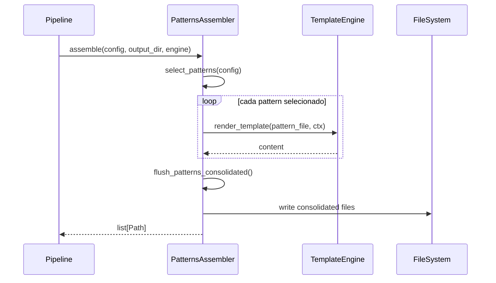

# História: Assemblers de Patterns e Protocols

**ID:** STORY-006

## 1. Dependências

| Blocked By | Blocks |
| :--- | :--- |
| STORY-001, STORY-004 | STORY-009 |

## 2. Regras Transversais Aplicáveis

| ID | Título |
| :--- | :--- |
| RULE-001 | Sintaxe Jinja2 |
| RULE-003 | Output atômico |
| RULE-005 | Compatibilidade byte-a-byte |
| RULE-007 | Assemblers independentes |

## 3. Descrição

Como **usuário da ferramenta**, eu quero que os assemblers de patterns e protocols gerem corretamente os diretórios `.claude/rules/` com knowledge packs de design patterns e protocolos de comunicação, garantindo que apenas os patterns e protocolos relevantes ao stack sejam incluídos.

Este módulo porta as funções: `select_pattern()` (linha 1829), `select_pattern_dir()` (linha 1863), `flush_patterns()` (linha 1877), `flush_patterns_consolidated()` (linha 1923), `assemble_patterns()` (linha 1984), `concat_protocol_dir()` (linha 2061), e `assemble_protocols()` (linha 2103).

### 3.1 Patterns Assembler (`assembler/patterns.py`)

- Seleciona patterns aplicáveis ao stack (microservice, resilience, data, integration)
- `flush_patterns()` — copia arquivos de pattern individuais
- `flush_patterns_consolidated()` — consolida múltiplos patterns em arquivo único
- Pattern selection baseada em: architecture style, event_driven, interfaces

### 3.2 Protocols Assembler (`assembler/protocols.py`)

- Seleciona protocolos baseado em `interfaces` do config
- REST → OpenAPI, gRPC → Proto3, event-* → Kafka/messaging
- `concat_protocol_dir()` — concatena arquivos de um diretório de protocolo
- `assemble_protocols()` — orquestra seleção e concatenação

## 4. Definições de Qualidade Locais

### DoR Local
- [ ] Modelos (STORY-001) e TemplateEngine (STORY-004) implementados
- [ ] Knowledge packs de patterns e protocols disponíveis em `src/`
- [ ] Mapeamento interface→protocolo documentado

### DoD Local
- [ ] Patterns assembler gera arquivos corretos para java-quarkus
- [ ] Protocols assembler inclui apenas protocolos das interfaces configuradas
- [ ] Consolidação preserva ordem e formatação
- [ ] Output idêntico ao bash

### Global DoD
- **Cobertura:** ≥ 95% Line, ≥ 90% Branch
- **Testes Automatizados:** Unit (pytest), integration, contract
- **Relatório de Cobertura:** pytest-cov HTML + XML
- **Documentação:** README.md, --help funcional
- **Persistência:** N/A
- **Performance:** Execução completa < 5s

## 5. Contratos de Dados (Data Contract)

**PatternsAssembler:**

| Método | Input | Output | Regra |
| :--- | :--- | :--- | :--- |
| `assemble(config, output_dir, engine)` | `ProjectConfig, Path, TemplateEngine` | `list[Path]` | RULE-005, RULE-007 |
| `select_patterns(config)` | `ProjectConfig` | `list[str]` (pattern names) | — |

**ProtocolsAssembler:**

| Método | Input | Output | Regra |
| :--- | :--- | :--- | :--- |
| `assemble(config, output_dir, engine)` | `ProjectConfig, Path, TemplateEngine` | `list[Path]` | RULE-005, RULE-007 |
| `derive_protocols(config)` | `ProjectConfig` | `list[str]` (protocol names) | — |

## 6. Diagramas

### 6.1 Fluxo de Assembly de Patterns



## 7. Critérios de Aceite (Gherkin)

```gherkin
Cenario: Selecionar patterns para microservice event-driven
  DADO que tenho um ProjectConfig com style=microservice e event_driven=true
  QUANDO executo select_patterns(config)
  ENTÃO os patterns incluem "saga", "outbox", "circuit-breaker"
  E os patterns NÃO incluem patterns exclusivos de monolith

Cenario: Gerar protocolos para REST + gRPC
  DADO que tenho interfaces [rest, grpc]
  QUANDO executo ProtocolsAssembler.assemble(config, output_dir, engine)
  ENTÃO o output inclui knowledge pack de OpenAPI
  E o output inclui knowledge pack de Proto3
  E NÃO inclui knowledge pack de Kafka

Cenario: Consolidar patterns em arquivo único
  DADO que tenho 5 patterns selecionados
  QUANDO executo flush_patterns_consolidated()
  ENTÃO um único arquivo é gerado com todos os patterns
  E as seções estão separadas por headers

Cenario: Output idêntico ao bash
  DADO que tenho o output de referência do bash para patterns e protocols
  QUANDO gero com os assemblers Python
  ENTÃO cada arquivo é idêntico byte-a-byte ao do bash
```

## 8. Sub-tarefas

- [ ] [Dev] Implementar `PatternsAssembler` com seleção de patterns
- [ ] [Dev] Implementar `flush_patterns()` e `flush_patterns_consolidated()`
- [ ] [Dev] Implementar `ProtocolsAssembler` com derivação de protocolos
- [ ] [Dev] Implementar `concat_protocol_dir()` para concatenação
- [ ] [Test] Unitário: seleção de patterns por tipo de arquitetura
- [ ] [Test] Unitário: derivação de protocolos por interfaces
- [ ] [Test] Contract: comparação byte-a-byte com bash output
