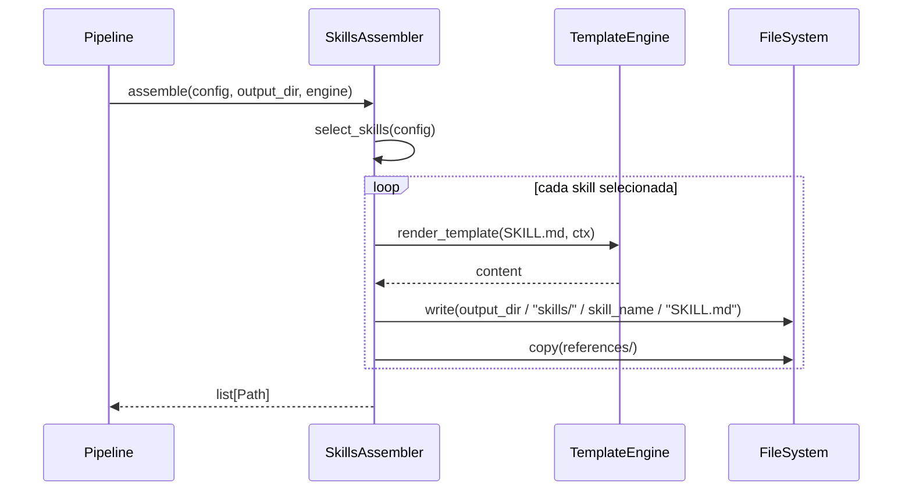

# História: Assemblers de Skills e Agents

**ID:** STORY-007

## 1. Dependências

| Blocked By | Blocks |
| :--- | :--- |
| STORY-001, STORY-004 | STORY-009 |

## 2. Regras Transversais Aplicáveis

| ID | Título |
| :--- | :--- |
| RULE-001 | Sintaxe Jinja2 |
| RULE-003 | Output atômico |
| RULE-005 | Compatibilidade byte-a-byte |
| RULE-007 | Assemblers independentes |

## 3. Descrição

Como **usuário da ferramenta**, eu quero que os assemblers de skills e agents copiem e configurem corretamente os diretórios `.claude/skills/` e `.claude/agents/`, garantindo que apenas skills e agents relevantes ao stack sejam incluídos com placeholders substituídos.

Este módulo porta as funções: `assemble_skills()` (linha 2166, ~225 linhas), `copy_conditional_skill()` (linha 2391), `copy_knowledge_pack()` (linha 2405), `assemble_agents()` (linha 2432, ~70 linhas), e `copy_conditional_agent()` (linha 2504).

### 3.1 Skills Assembler (`assembler/skills.py`)

- Copia skills core (sempre incluídas): coding-standards, architecture, testing, security, etc.
- Copia skills condicionais baseadas em config: database skills (se database configurado), cache skills (se cache configurado), protocol-specific skills (baseado em interfaces)
- `copy_knowledge_pack()` — copia diretório de knowledge pack com substituição de placeholders
- `copy_conditional_skill()` — copia skill apenas se condição satisfeita
- Para cada skill: copia `SKILL.md`, `references/` e substitui placeholders

### 3.2 Agents Assembler (`assembler/agents.py`)

- Copia agents core: review, implement-story, feature-lifecycle, etc.
- Copia agents condicionais baseados em interfaces e features habilitadas
- `copy_conditional_agent()` — copia agent apenas se condição satisfeita
- Para cada agent: copia `AGENT.md` com placeholders substituídos

### 3.3 Regras de Seleção

- Skills de protocolo: REST skill se interface rest, gRPC skill se interface grpc, etc.
- Skills de observability: sempre incluídas se observability configurado
- Skills de compliance: incluídas por framework de segurança (GDPR, HIPAA, etc.)
- Agents de review: específicos por protocolo (review-api, review-grpc, review-events)

## 4. Definições de Qualidade Locais

### DoR Local
- [ ] Modelos (STORY-001) e TemplateEngine (STORY-004) implementados
- [ ] Skills e agents templates disponíveis em `src/skills-templates/` e `src/agents-templates/`
- [ ] Mapeamento skill/agent→condição documentado

### DoD Local
- [ ] Skills assembler copia todas as skills core e condicionais corretas para java-quarkus
- [ ] Agents assembler copia todos os agents core e condicionais corretos
- [ ] Placeholders substituídos em todos os arquivos copiados
- [ ] Skills/agents não aplicáveis ao stack NÃO são incluídos
- [ ] Output idêntico ao bash

### Global DoD
- **Cobertura:** ≥ 95% Line, ≥ 90% Branch
- **Testes Automatizados:** Unit (pytest), integration, contract
- **Relatório de Cobertura:** pytest-cov HTML + XML
- **Documentação:** README.md, --help funcional
- **Persistência:** N/A
- **Performance:** Execução completa < 5s

## 5. Contratos de Dados (Data Contract)

**SkillsAssembler:**

| Método | Input | Output | Regra |
| :--- | :--- | :--- | :--- |
| `assemble(config, output_dir, engine)` | `ProjectConfig, Path, TemplateEngine` | `list[Path]` | RULE-005, RULE-007 |
| `select_skills(config)` | `ProjectConfig` | `list[str]` (skill names) | — |
| `copy_knowledge_pack(skill, src, dst, engine)` | `str, Path, Path, TemplateEngine` | `Path` | RULE-001 |

**AgentsAssembler:**

| Método | Input | Output | Regra |
| :--- | :--- | :--- | :--- |
| `assemble(config, output_dir, engine)` | `ProjectConfig, Path, TemplateEngine` | `list[Path]` | RULE-005, RULE-007 |
| `select_agents(config)` | `ProjectConfig` | `list[str]` (agent names) | — |

## 6. Diagramas

### 6.1 Fluxo de Assembly de Skills



## 7. Critérios de Aceite (Gherkin)

```gherkin
Cenario: Selecionar skills para java-quarkus full-featured
  DADO que tenho um ProjectConfig com java-quarkus, postgresql, redis, kafka
  QUANDO executo select_skills(config)
  ENTÃO as skills incluem coding-standards, architecture, testing, security
  E as skills incluem database-patterns, quarkus-patterns
  E as skills incluem api-design, protocols

Cenario: Excluir skills não aplicáveis
  DADO que tenho um ProjectConfig sem database
  QUANDO executo select_skills(config)
  ENTÃO as skills NÃO incluem database-patterns

Cenario: Copiar knowledge pack com substituição de placeholders
  DADO que tenho um skill com SKILL.md contendo "{language_name}"
  QUANDO executo copy_knowledge_pack(skill, src, dst, engine)
  ENTÃO o arquivo destino contém "java" no lugar de "{language_name}"

Cenario: Selecionar agents baseado em interfaces
  DADO que tenho interfaces [rest, grpc, event-consumer]
  QUANDO executo select_agents(config)
  ENTÃO os agents incluem review-api, review-grpc, review-events

Cenario: Output idêntico ao bash
  DADO que tenho o output de referência do bash para skills e agents
  QUANDO gero com os assemblers Python
  ENTÃO cada arquivo é idêntico byte-a-byte ao do bash
```

## 8. Sub-tarefas

- [ ] [Dev] Implementar `SkillsAssembler` com seleção de skills
- [ ] [Dev] Implementar `copy_knowledge_pack()` com substituição de placeholders
- [ ] [Dev] Implementar `copy_conditional_skill()` com lógica condicional
- [ ] [Dev] Implementar `AgentsAssembler` com seleção de agents
- [ ] [Dev] Implementar `copy_conditional_agent()`
- [ ] [Test] Unitário: seleção de skills por config
- [ ] [Test] Unitário: seleção de agents por interfaces
- [ ] [Test] Unitário: substituição de placeholders em knowledge packs
- [ ] [Test] Contract: comparação byte-a-byte com bash output
