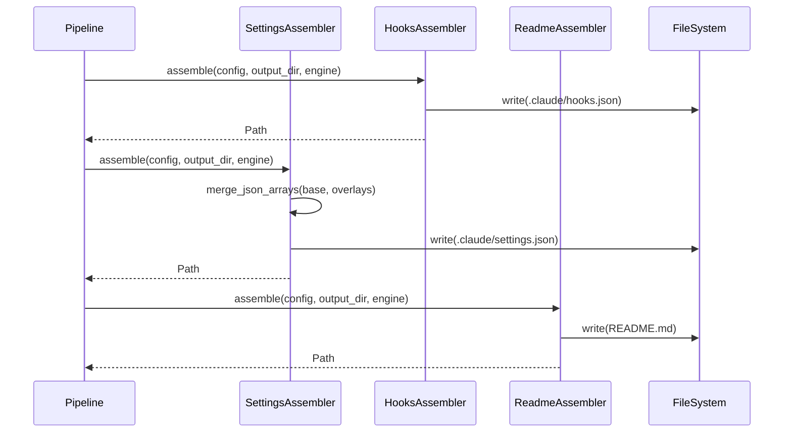

# História: Assemblers de Hooks, Settings e README

**ID:** STORY-008

## 1. Dependências

| Blocked By | Blocks |
| :--- | :--- |
| STORY-001, STORY-004 | STORY-009 |

## 2. Regras Transversais Aplicáveis

| ID | Título |
| :--- | :--- |
| RULE-001 | Sintaxe Jinja2 |
| RULE-003 | Output atômico |
| RULE-005 | Compatibilidade byte-a-byte |
| RULE-007 | Assemblers independentes |

## 3. Descrição

Como **usuário da ferramenta**, eu quero que os assemblers de hooks, settings e README gerem corretamente os arquivos `.claude/hooks.json`, `.claude/settings.json`, e `README.md`, garantindo que a configuração do Claude Code esteja completa e funcional.

Este módulo porta as funções: `assemble_hooks()` (linha 2624), `generate_settings()` (linha 2648, ~150 linhas), `merge_json_arrays()` (linha 2792), `generate_readme()` (linha 2805, ~135 linhas), e `generate_minimal_readme()` (linha 2941).

### 3.1 Hooks Assembler (`assembler/hooks.py`)

- Gera `.claude/hooks.json` com hooks de pre-commit, post-commit, etc.
- Hooks derivados das features habilitadas (linting, formatting, testing)
- Inject conditional checklists baseado em config

### 3.2 Settings Assembler (`assembler/settings.py`)

- Gera `.claude/settings.json` com configuração do Claude Code
- Inclui: model preferences, allowed tools, custom instructions
- `merge_json_arrays()` — merge de arrays JSON de múltiplas fontes
- Settings condicionais: MCP servers (se configurados), custom tools

### 3.3 README Assembler (`assembler/readme.py`)

- Gera `README.md` com seções padrão do projeto
- `generate_readme()` — README completo com todas as seções
- `generate_minimal_readme()` — README mínimo para projetos simples
- Seções: Project description, Tech stack, Setup, Development, Testing, Deployment
- Inject de badges, links, e informações do stack

## 4. Definições de Qualidade Locais

### DoR Local
- [ ] Modelos (STORY-001) e TemplateEngine (STORY-004) implementados
- [ ] Hooks e settings templates disponíveis em `src/`
- [ ] Output de referência (bash) para hooks, settings e README disponível

### DoD Local
- [ ] Hooks assembler gera JSON válido com hooks corretos
- [ ] Settings assembler gera JSON válido com merge de arrays
- [ ] README assembler gera markdown completo e mínimo
- [ ] Output idêntico ao bash

### Global DoD
- **Cobertura:** ≥ 95% Line, ≥ 90% Branch
- **Testes Automatizados:** Unit (pytest), integration, contract
- **Relatório de Cobertura:** pytest-cov HTML + XML
- **Documentação:** README.md, --help funcional
- **Persistência:** N/A
- **Performance:** Execução completa < 5s

## 5. Contratos de Dados (Data Contract)

**HooksAssembler:**

| Método | Input | Output | Regra |
| :--- | :--- | :--- | :--- |
| `assemble(config, output_dir, engine)` | `ProjectConfig, Path, TemplateEngine` | `Path` (hooks.json) | RULE-005, RULE-007 |

**SettingsAssembler:**

| Método | Input | Output | Regra |
| :--- | :--- | :--- | :--- |
| `assemble(config, output_dir, engine)` | `ProjectConfig, Path, TemplateEngine` | `Path` (settings.json) | RULE-005, RULE-007 |
| `merge_json_arrays(base, overlay)` | `dict, dict` | `dict` | — |

**ReadmeAssembler:**

| Método | Input | Output | Regra |
| :--- | :--- | :--- | :--- |
| `assemble(config, output_dir, engine)` | `ProjectConfig, Path, TemplateEngine` | `Path` (README.md) | RULE-005, RULE-007 |
| `generate_readme(config, engine)` | `ProjectConfig, TemplateEngine` | `str` | RULE-001 |
| `generate_minimal_readme(config)` | `ProjectConfig` | `str` | — |

## 6. Diagramas

### 6.1 Fluxo de Assembly de Settings



## 7. Critérios de Aceite (Gherkin)

```gherkin
Cenario: Gerar hooks.json válido
  DADO que tenho um ProjectConfig com linting e testing habilitados
  QUANDO executo HooksAssembler.assemble(config, output_dir, engine)
  ENTÃO hooks.json é um JSON válido
  E contém hooks de pre-commit

Cenario: Gerar settings.json com merge de arrays
  DADO que tenho configurações base e overlays de MCP servers
  QUANDO executo SettingsAssembler.assemble(config, output_dir, engine)
  ENTÃO settings.json contém arrays mesclados sem duplicação
  E o JSON é válido

Cenario: Gerar README completo
  DADO que tenho um ProjectConfig para java-quarkus full-featured
  QUANDO executo ReadmeAssembler.assemble(config, output_dir, engine)
  ENTÃO README.md contém seções: description, tech stack, setup, development
  E contém informações corretas do stack

Cenario: Gerar README mínimo
  DADO que tenho um ProjectConfig com configuração mínima
  QUANDO executo generate_minimal_readme(config)
  ENTÃO o README contém apenas project name e purpose

Cenario: Output idêntico ao bash
  DADO que tenho o output de referência do bash para hooks, settings e README
  QUANDO gero com os assemblers Python
  ENTÃO cada arquivo é idêntico byte-a-byte ao do bash
```

## 8. Sub-tarefas

- [ ] [Dev] Implementar `HooksAssembler` com geração de hooks.json
- [ ] [Dev] Implementar `SettingsAssembler` com merge de arrays JSON
- [ ] [Dev] Implementar `ReadmeAssembler` com README completo e mínimo
- [ ] [Dev] Implementar `inject_conditional_checklists()` para hooks
- [ ] [Test] Unitário: validação de JSON gerado (hooks e settings)
- [ ] [Test] Unitário: merge de arrays JSON
- [ ] [Test] Unitário: geração de README completo vs mínimo
- [ ] [Test] Contract: comparação byte-a-byte com bash output
