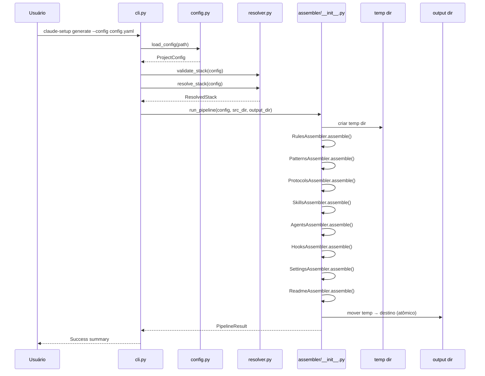

# História: CLI Pipeline e Orquestração

**ID:** STORY-009

## 1. Dependências

| Blocked By | Blocks |
| :--- | :--- |
| STORY-002, STORY-003, STORY-004, STORY-005, STORY-006, STORY-007, STORY-008 | STORY-010 |

## 2. Regras Transversais Aplicáveis

| ID | Título |
| :--- | :--- |
| RULE-003 | Output atômico |
| RULE-004 | Python 3.9+ |
| RULE-005 | Compatibilidade byte-a-byte |
| RULE-006 | Modo interativo |
| RULE-007 | Assemblers independentes |

## 3. Descrição

Como **usuário da ferramenta**, eu quero uma CLI Click que orquestre todo o pipeline de geração, garantindo que posso executar `claude-setup --config config.yaml` ou `claude-setup --interactive` e obter o boilerplate completo do projeto.

Este módulo integra todos os componentes: `cli.py` (entry point Click com comandos e opções), `assembler/__init__.py` (pipeline de orquestração que chama todos os assemblers em sequência), e `utils.py` (funções utilitárias: atomic output, cleanup, logging).

O pipeline implementa RULE-003 (output atômico): gera tudo em temp dir, valida, e move para destino final. A função `main()` do setup.sh (linha 2976) é o modelo para a orquestração.

### 3.1 CLI (`cli.py`)

- `claude-setup generate --config <path>` — modo config file
- `claude-setup generate --interactive` — modo interativo (RULE-006)
- `claude-setup validate --config <path>` — apenas validação sem geração
- `--output-dir` — diretório de saída (default: `.`)
- `--src-dir` — diretório com templates/skills fonte (default: detectado)
- `--verbose` — logging detalhado
- `--dry-run` — mostra o que seria gerado sem executar

### 3.2 Pipeline de Orquestração (`assembler/__init__.py`)

- `run_pipeline(config: ProjectConfig, src_dir: Path, output_dir: Path) → PipelineResult`
- Sequência: criar temp dir → inicializar TemplateEngine → executar cada assembler → validar output → mover para destino
- Cada assembler é chamado independentemente (RULE-007)
- Em caso de falha: cleanup do temp dir, nenhum arquivo parcial no destino

### 3.3 Utilitários (`utils.py`)

- `atomic_output(dest_dir)` — context manager para geração atômica
- `setup_logging(verbose: bool)` — configuração de logging
- `find_src_dir()` — detecta diretório fonte baseado em localização do script

## 4. Definições de Qualidade Locais

### DoR Local
- [ ] Todos os assemblers (STORY-005 a STORY-008) implementados e testados
- [ ] Config loading (STORY-002) e stack resolution (STORY-003) implementados
- [ ] Template engine (STORY-004) implementado

### DoD Local
- [ ] `claude-setup generate --config setup-config.java-quarkus.yaml` executa sem erros
- [ ] `claude-setup generate --interactive` coleta inputs e gera output
- [ ] Output atômico: falha intermediária não deixa arquivos parciais
- [ ] `--dry-run` mostra plano sem modificar filesystem
- [ ] `--validate` verifica config sem gerar

### Global DoD
- **Cobertura:** ≥ 95% Line, ≥ 90% Branch
- **Testes Automatizados:** Unit (pytest), integration, contract
- **Relatório de Cobertura:** pytest-cov HTML + XML
- **Documentação:** README.md, --help funcional
- **Persistência:** N/A
- **Performance:** Execução completa < 5s

## 5. Contratos de Dados (Data Contract)

**PipelineResult (dataclass):**

| Campo | Tipo | Descrição |
| :--- | :--- | :--- |
| `success` | `bool` | Pipeline completou sem erros |
| `output_dir` | `Path` | Diretório de saída final |
| `files_generated` | `list[Path]` | Lista de arquivos gerados |
| `warnings` | `list[str]` | Warnings durante geração |
| `duration_ms` | `int` | Tempo de execução em ms |

**CLI Options:**

| Opção | Tipo | Default | Descrição |
| :--- | :--- | :--- | :--- |
| `--config` | `Path` | — | Caminho do YAML de config |
| `--interactive` | `bool` | `False` | Modo interativo |
| `--output-dir` | `Path` | `.` | Diretório de saída |
| `--src-dir` | `Path` | auto-detect | Diretório fonte |
| `--verbose` | `bool` | `False` | Logging detalhado |
| `--dry-run` | `bool` | `False` | Apenas simular |

## 6. Diagramas

### 6.1 Pipeline de Geração



## 7. Critérios de Aceite (Gherkin)

```gherkin
Cenario: Geração completa com config file
  DADO que tenho setup-config.java-quarkus.yaml
  QUANDO executo "claude-setup generate --config setup-config.java-quarkus.yaml"
  ENTÃO o output contém .claude/rules/, .claude/skills/, .claude/agents/
  E o output contém .claude/settings.json e .claude/hooks.json
  E o output contém README.md
  E o exit code é 0

Cenario: Geração interativa
  DADO que executo "claude-setup generate --interactive"
  QUANDO respondo todas as perguntas equivalentes a java-quarkus
  ENTÃO o output é idêntico ao gerado com config file

Cenario: Output atômico em caso de falha
  DADO que um assembler falha durante a geração
  QUANDO o pipeline detecta o erro
  ENTÃO o temp dir é limpo automaticamente
  E nenhum arquivo parcial existe no destino
  E o exit code é não-zero

Cenario: Dry run
  DADO que tenho um config file válido
  QUANDO executo "claude-setup generate --config config.yaml --dry-run"
  ENTÃO o output mostra os arquivos que seriam gerados
  E nenhum arquivo é criado no filesystem

Cenario: Validate only
  DADO que tenho um config file com erro
  QUANDO executo "claude-setup validate --config config.yaml"
  ENTÃO os erros de validação são exibidos
  E nenhum arquivo é gerado
```

## 8. Sub-tarefas

- [ ] [Dev] Implementar `cli.py` com Click commands (generate, validate)
- [ ] [Dev] Implementar `assembler/__init__.py` com pipeline de orquestração
- [ ] [Dev] Implementar `utils.py` com atomic_output context manager
- [ ] [Dev] Implementar `PipelineResult` dataclass
- [ ] [Dev] Implementar `--dry-run` e `--verbose` modes
- [ ] [Test] Unitário: atomic_output com sucesso e falha
- [ ] [Test] Integração: pipeline completo com config java-quarkus
- [ ] [Test] Integração: modo interativo com inputs simulados
- [ ] [Test] Integração: dry-run não modifica filesystem
