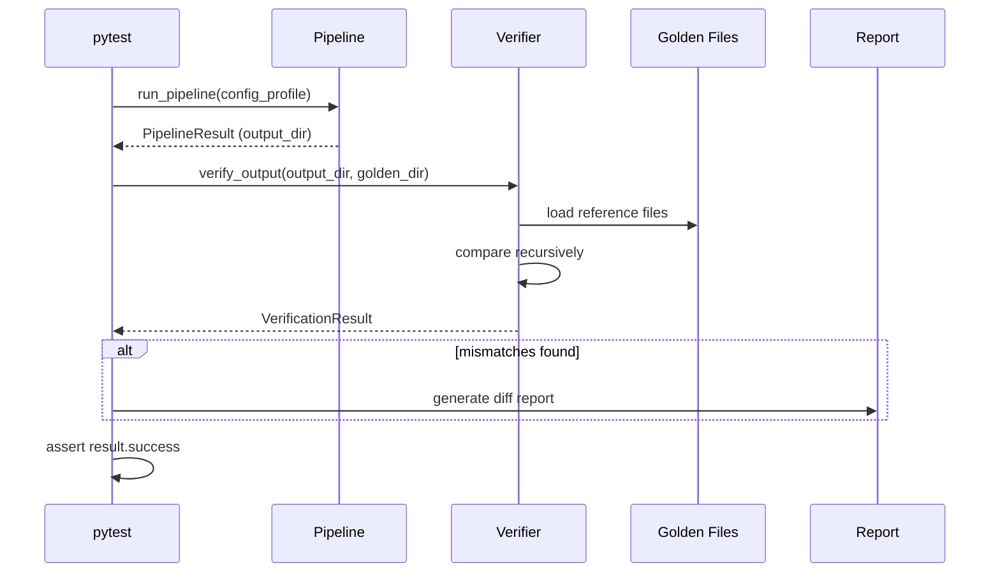

# História: Testes e Verificação End-to-End

**ID:** STORY-010

## 1. Dependências

| Blocked By | Blocks |
| :--- | :--- |
| STORY-009 | — |

## 2. Regras Transversais Aplicáveis

| ID | Título |
| :--- | :--- |
| RULE-004 | Python 3.9+ |
| RULE-005 | Compatibilidade byte-a-byte |

## 3. Descrição

Como **desenvolvedor da ferramenta**, eu quero uma suíte de verificação automatizada que compare o output Python com o output Bash para todos os perfis de configuração, garantindo compatibilidade byte-a-byte e prevenindo regressões.

Este módulo implementa: `verifier.py` (comparador de output byte-a-byte), suíte de testes pytest parametrizados por config profile, e scripts de geração de output de referência (golden files) a partir do setup.sh original.

A verificação é a garantia final de RULE-005. Cada perfil de config em `src/config-templates/setup-config.*.yaml` deve produzir output idêntico entre Bash e Python.

### 3.1 Verifier (`verifier.py`)

- `verify_output(python_dir: Path, reference_dir: Path) → VerificationResult`
- Compara recursivamente todos os arquivos
- Para cada arquivo: comparação byte-a-byte, diff detalhado em caso de diferença
- `VerificationResult`: success, mismatches (com diff), missing files, extra files

### 3.2 Golden Files

- Script para gerar output de referência executando setup.sh com cada config profile
- Golden files armazenados em `tests/golden/` por profile
- Geração automatizável via `make golden` ou `pytest --generate-golden`

### 3.3 Suíte de Testes

- Testes parametrizados por config profile (7 perfis)
- Para cada perfil: executa pipeline Python, compara com golden files
- Testes de regressão: qualquer mudança no output é detectada
- Testes de performance: execução < 5s por perfil
- Testes de edge cases: config mínimo, config com campos opcionais, config v2

## 4. Definições de Qualidade Locais

### DoR Local
- [ ] Pipeline CLI (STORY-009) implementado e funcional
- [ ] setup.sh funcional para gerar golden files de referência
- [ ] Todos os 7 config profiles disponíveis

### DoD Local
- [ ] Verifier compara output corretamente com diff detalhado
- [ ] Golden files gerados para todos os 7 perfis
- [ ] Testes parametrizados passam para todos os perfis
- [ ] Cobertura total do projeto ≥ 95% line, ≥ 90% branch
- [ ] Nenhuma diferença byte-a-byte entre Python e Bash

### Global DoD
- **Cobertura:** ≥ 95% Line, ≥ 90% Branch
- **Testes Automatizados:** Unit (pytest), integration, contract
- **Relatório de Cobertura:** pytest-cov HTML + XML
- **Documentação:** README.md, --help funcional
- **Persistência:** N/A
- **Performance:** Execução completa < 5s

## 5. Contratos de Dados (Data Contract)

**VerificationResult (dataclass):**

| Campo | Tipo | Descrição |
| :--- | :--- | :--- |
| `success` | `bool` | Todos os arquivos idênticos |
| `total_files` | `int` | Total de arquivos comparados |
| `mismatches` | `list[FileDiff]` | Arquivos com diferenças |
| `missing_files` | `list[Path]` | Arquivos no reference mas não no output |
| `extra_files` | `list[Path]` | Arquivos no output mas não no reference |

**FileDiff (dataclass):**

| Campo | Tipo | Descrição |
| :--- | :--- | :--- |
| `path` | `Path` | Caminho relativo do arquivo |
| `diff` | `str` | Unified diff |
| `python_size` | `int` | Tamanho do arquivo Python |
| `reference_size` | `int` | Tamanho do arquivo referência |

## 6. Diagramas

### 6.1 Fluxo de Verificação



## 7. Critérios de Aceite (Gherkin)

```gherkin
Cenario: Verificação bem-sucedida para java-quarkus
  DADO que tenho golden files gerados pelo setup.sh para java-quarkus
  E o pipeline Python gera output para a mesma config
  QUANDO executo verify_output(python_output, golden_dir)
  ENTÃO o resultado é success=True
  E mismatches está vazio

Cenario: Detectar diferença em arquivo
  DADO que o pipeline Python gera um arquivo com whitespace extra
  QUANDO executo verify_output(python_output, golden_dir)
  ENTÃO o resultado é success=False
  E mismatches contém o arquivo com diff detalhado

Cenario: Detectar arquivo faltante
  DADO que o pipeline Python não gera um arquivo esperado
  QUANDO executo verify_output(python_output, golden_dir)
  ENTÃO missing_files contém o caminho do arquivo

Cenario: Testes parametrizados para todos os perfis
  DADO que tenho 7 config profiles com golden files
  QUANDO executo "pytest tests/ -k test_byte_for_byte"
  ENTÃO todos os 7 perfis passam
  E o tempo total é < 35s (5s por perfil)

Cenario: Performance de execução
  DADO que tenho a config java-quarkus
  QUANDO executo o pipeline Python com timing
  ENTÃO a execução completa em menos de 5 segundos
```

## 8. Sub-tarefas

- [ ] [Dev] Implementar `VerificationResult` e `FileDiff` dataclasses
- [ ] [Dev] Implementar `verify_output()` com comparação recursiva
- [ ] [Dev] Criar script de geração de golden files
- [ ] [Test] Parametrizado: verificação byte-a-byte para 7 perfis
- [ ] [Test] Unitário: detecção de mismatches, missing, e extra files
- [ ] [Test] Performance: timing de execução por perfil
- [ ] [Test] Edge case: config mínimo, config v2
- [ ] [Doc] Documentar processo de regeneração de golden files
