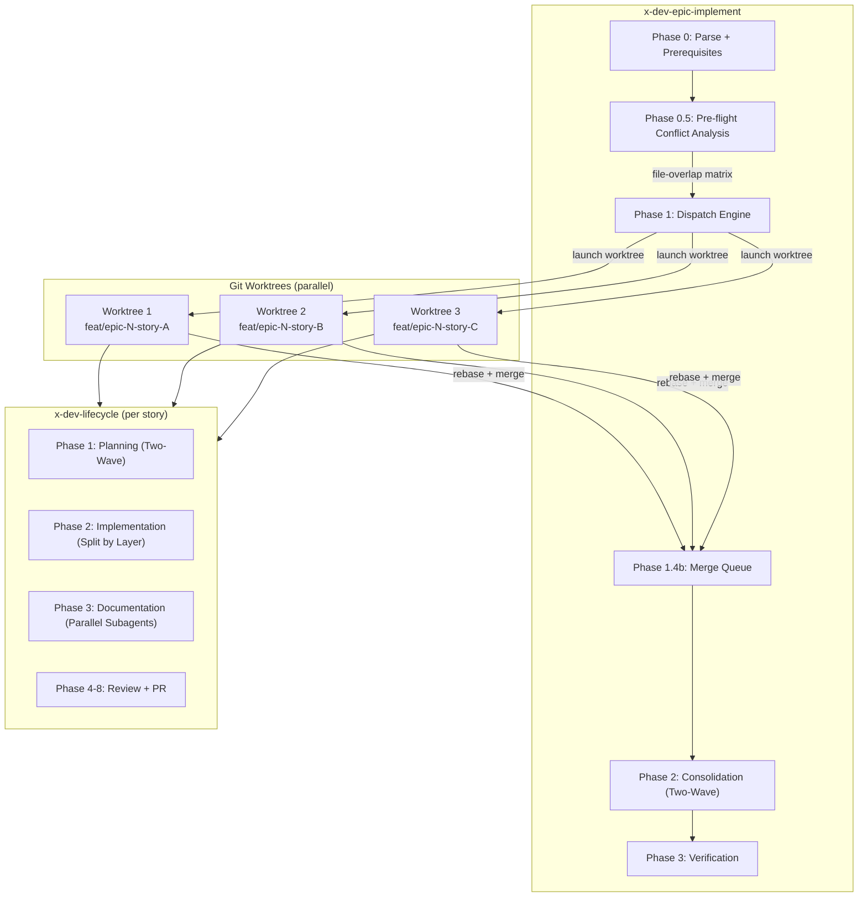
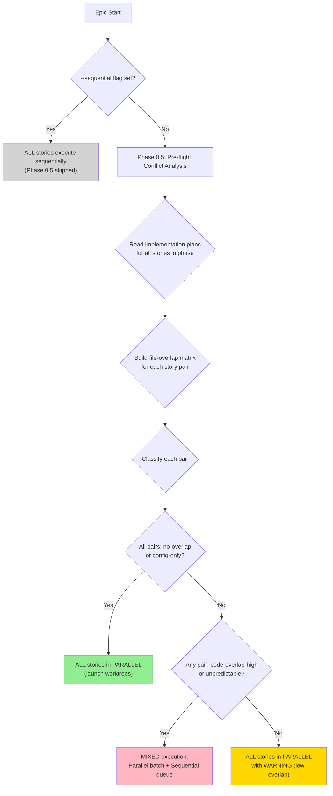
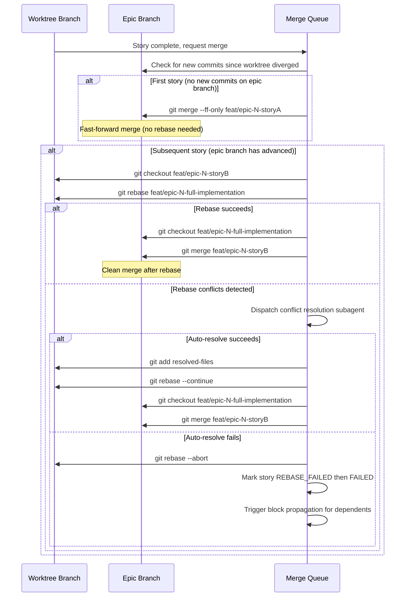

# Worktree Parallelism Strategy

This guide documents the parallelism model implemented across the `x-dev-epic-implement`, `x-dev-lifecycle`, and `x-dev-implement` orchestration skills. It covers worktree-based parallel story execution, pre-flight conflict analysis, rebase-before-merge strategy, and layer-level parallelism within stories.

---

## 1. Architecture Overview

The parallelism model operates at two levels: **epic-level** (parallel stories via worktrees) and **story-level** (parallel layers within a single story). The `x-dev-epic-implement` orchestrator drives epic-level parallelism, while `x-dev-lifecycle` drives story-level parallelism through its Phase 2 split mode.

### Execution Model



### Component Roles

| Component | Role |
|-----------|------|
| **x-dev-epic-implement** | Top-level orchestrator. Dispatches stories, manages worktrees, runs pre-flight analysis, handles merge queue, consolidation, and verification. |
| **x-dev-lifecycle** | Per-story orchestrator. Runs inside each worktree. Manages planning (Two-Wave), implementation (split by layer or monolithic), documentation (parallel subagents), review, fixes, and PR. |
| **x-dev-implement** | Implementation engine. Executes TDD Red-Green-Refactor cycles. Supports `--layer` parameter for layer-scoped execution within split mode. |
| **Git Worktrees** | Isolation mechanism. Each story executes on an independent copy of the repository with its own branch (`feat/epic-{epicId}-{storyId}`). |
| **Merge Queue** | Sequential merge of completed worktree branches into the epic branch, using rebase-before-merge to prevent spurious conflicts. |

### Relationship Between Skills

```
x-dev-epic-implement (epic level)
  |
  |-- dispatches N worktrees (one per story in parallel batch)
  |     |
  |     +-- each worktree runs x-dev-lifecycle (story level)
  |           |
  |           +-- Phase 2 may invoke x-dev-implement --layer domain
  |           +-- Phase 2 may invoke x-dev-implement --layer outbound
  |           +-- Phase 2 may invoke x-dev-implement --layer application
  |           +-- Phase 2 may invoke x-dev-implement --layer inbound
  |
  |-- merge queue (rebase-before-merge, critical path order)
  |-- consolidation (Two-Wave: review + report in parallel, then PR)
  +-- verification (full test suite + DoD checklist)
```

---

## 2. Decision Tree: Parallel vs Sequential

The orchestrator determines the execution mode for each phase through pre-flight conflict analysis (Phase 0.5). The decision applies per-phase, not globally -- stories in one phase may run in parallel while stories in another phase run sequentially.

### Decision Flowchart



### When Each Mode Applies

| Scenario | Execution Mode | Reason |
|----------|---------------|--------|
| All story pairs have zero file overlap | Fully parallel | No conflict risk |
| Story pairs share only config files (`.yaml`, `.json`, `pom.xml`, etc.) | Fully parallel | Config files are merge-friendly |
| Story pairs share 1-2 code files | Parallel with WARNING | Low conflict risk, monitored |
| Story pairs share 3+ code files | Demote to sequential queue | High conflict risk |
| A story has no implementation plan | Demote to sequential queue | Unpredictable file changes |
| `--sequential` flag is set | Fully sequential | User opted out of parallelism |
| Single story in phase | No parallelism needed | Only one story to execute |

### When to Use `--sequential`

Use `--sequential` when:
- Stories in the same phase modify the same core domain entities extensively
- The epic modifies a shared framework or infrastructure layer across all stories
- Previous parallel runs produced merge conflicts that required manual resolution
- Debugging a specific story and you want deterministic execution order

Do NOT use `--sequential` when:
- Stories are in different bounded contexts with independent code paths
- Stories only share configuration files (these merge cleanly)
- The pre-flight analysis shows LOW or NO overlap (trust the analysis)

---

## 3. Pre-flight Conflict Analysis

Pre-flight conflict analysis (Phase 0.5) runs before the execution loop begins. It reads implementation plans to predict which files each story will modify, then builds a file-overlap matrix to identify potential merge conflicts before they occur.

### How the File-Overlap Matrix Works

1. **Read implementation plans:** For each story in the current phase, read `docs/stories/epic-XXXX/plans/plan-story-XXXX-YYYY.md` and extract the list of affected files from sections titled "Affected files", "Existing classes to modify", or "New classes/interfaces to create".

2. **Build pairwise matrix:** For each pair of stories (A, B), compute the intersection of their affected file sets. The matrix is symmetric -- `overlap(A, B) == overlap(B, A)`.

3. **Classify each pair:** Apply classification rules based on overlap count and file types.

### Classification Rules

| Classification | Criteria | Action |
|----------------|----------|--------|
| `no-overlap` | Zero overlapping files, both stories have plans | Parallel dispatch (no action needed) |
| `config-only` | ALL overlapping files are config files (`*.yaml`, `*.json`, `*.properties`, `*.toml`, `*.env`, `pom.xml`, `build.gradle`, `package.json`) | Parallel dispatch + smart merge |
| `code-overlap-low` | 1-2 overlapping files are code files (`.ts`, `.java`, `.py`, `.go`, `.rs`, `.kt`) | Parallel dispatch with WARNING |
| `code-overlap-high` | 3+ overlapping code files | Demote to sequential queue |
| `unpredictable` | One or both stories have no implementation plan | Demote to sequential queue (conservative) |

### Warning Levels

- **No warning:** `no-overlap` and `config-only` pairs produce no warnings. Safe for parallel execution.
- **LOW (informational):** `code-overlap-low` pairs log `"WARNING: Low code overlap (N file(s)) between storyA and storyB"`. Parallel execution proceeds but the overlap is tracked.
- **HIGH (action required):** `code-overlap-high` and `unpredictable` pairs cause automatic demotion to the sequential queue. No manual action needed -- the orchestrator handles it.

### How Demotion to Sequential Works

After classification, stories are partitioned into two groups:

- **Parallel Batch:** Stories with `no-overlap`, `config-only`, or `code-overlap-low` overlaps. Dispatched concurrently via worktrees.
- **Sequential Queue:** Stories involved in `code-overlap-high` or `unpredictable` pairs. Dispatched one at a time AFTER the parallel batch completes. Ordered by critical path priority.

### Output Artifact

The analysis is saved to `docs/stories/epic-XXXX/plans/preflight-analysis-phase-N.md` for audit purposes. Example:

```markdown
# Pre-flight Conflict Analysis -- Phase 1

## File Overlap Matrix

| Story A | Story B | Overlapping Files | Classification |
|---------|---------|-------------------|----------------|
| story-0042-0001 | story-0042-0002 | pom.xml | config-only |
| story-0042-0001 | story-0042-0003 | UserService.java, UserRepository.java, UserController.java | code-overlap-high |
| story-0042-0002 | story-0042-0003 | -- | no-overlap |

## Adjusted Execution Plan

### Parallel Batch
- story-0042-0002 (no overlaps)

### Sequential Queue (after parallel batch)
1. story-0042-0001 (code-overlap-high with story-0042-0003)
2. story-0042-0003 (code-overlap-high with story-0042-0001)
```

---

## 4. Merge Strategy: Rebase-Before-Merge

After all parallel worktree subagents complete their story implementations, the orchestrator merges their branches into the epic branch sequentially using a rebase-before-merge strategy (Section 1.4b of `x-dev-epic-implement`).

### Why Rebase-Before-Merge

All worktree branches originate from the same base commit on the epic branch. After merging story A, the epic branch advances, but story B's branch still points to the old base. A direct `git merge` of story B may produce spurious conflicts on shared files (e.g., `pom.xml`, `build.gradle`, `CHANGELOG.md`). Rebasing story B onto the updated epic branch gives git the full context of what was already merged, drastically reducing conflict rates.

### Step-by-Step Flow



### Merge Algorithm Detail

1. Collect all stories with `status: SUCCESS` from the parallel dispatch results.
2. Sort by critical path priority (stories on the critical path merge first).
3. For each story in order:

**First story (Case A):**
```bash
git merge --ff-only feat/epic-{epicId}-{storyId}
# If fast-forward fails, fall back to:
git merge feat/epic-{epicId}-{storyId}
```

**Subsequent stories (Case B):**
```bash
# Step 1: Update checkpoint status to REBASING
# Step 2: Checkout story branch
git checkout feat/epic-{epicId}-{storyId}

# Step 3: Rebase onto updated epic branch
git rebase feat/epic-{epicId}-full-implementation

# Step 4 (if rebase succeeds): Merge
git checkout feat/epic-{epicId}-full-implementation
git merge feat/epic-{epicId}-{storyId}

# Step 4 (if rebase fails): Abort and mark FAILED
git rebase --abort
# Story marked REBASE_FAILED -> FAILED
# Block propagation triggered for dependent stories
```

### Checkpoint States During Merge

| State | Description |
|-------|-------------|
| `REBASING` | Rebase in progress onto the updated epic branch |
| `REBASE_SUCCESS` | Rebase completed, merge pending |
| `REBASE_FAILED` | Rebase failed, conflict resolution attempted |

These intermediate states enable precise resume behavior: if the orchestrator crashes during a rebase, the checkpoint indicates exactly where the process was interrupted.

### When Rebase Is Automatic vs Manual

- **Automatic:** The orchestrator always attempts rebase automatically for every story after the first. If rebase succeeds, the merge is automatic.
- **Conflict resolution subagent:** When rebase produces conflicts, a subagent is dispatched to attempt automatic resolution. The subagent receives the list of conflicting files and already-merged story context.
- **Manual intervention:** If the conflict resolution subagent fails (returns `status: FAILED`), the story is marked FAILED and the worktree is preserved for manual diagnosis. The developer can inspect the branch and resolve conflicts manually.

---

## 5. Common Conflict Scenarios

### 5.1 Shared Configuration File

**Problem:** Multiple stories modify `pom.xml`, `build.gradle`, `package.json`, or similar build configuration files to add different dependencies.

**Cause:** Each worktree branch adds its own dependency entry to the same file. When the second branch rebases, git sees overlapping changes in the dependency section.

**Resolution:**
1. The pre-flight analysis classifies this as `config-only` and allows parallel dispatch (config files are merge-friendly).
2. If a conflict does occur during rebase, the conflict resolution subagent handles it by combining both dependency additions.
3. Manual resolution (if auto-resolve fails):
```bash
# Open the conflicting file
# Accept both dependency additions (both sides are valid)
# Ensure no duplicate entries
git add pom.xml
git rebase --continue
```

### 5.2 Same Domain Entity Modified

**Problem:** Two stories modify the same domain entity class -- one adds a new field, the other adds a new method.

**Cause:** Both worktrees modify overlapping regions of the same source file. Git cannot determine how to combine the changes automatically.

**Resolution:**
1. The pre-flight analysis detects this as `code-overlap-low` (1-2 files) or `code-overlap-high` (3+ files) and either warns or demotes to sequential.
2. If running in parallel despite overlap (low classification), the rebase conflict resolution subagent analyzes both diffs and merges them structurally.
3. Manual resolution:
```bash
# Review the conflicting entity class
# Both changes are typically additive (new field + new method)
# Accept both additions, ensuring constructor/builder is updated
git add src/main/java/.../UserEntity.java
git rebase --continue
```

### 5.3 Port Interface Change

**Problem:** Story A adds a new method to a port interface. Story B adds a different method to the same port interface. Both also add corresponding adapter implementations.

**Cause:** The port interface file and potentially the adapter classes have overlapping modifications from both branches.

**Resolution:**
1. Pre-flight detects overlap on the port interface and adapter files. If 3+ files are affected, the pair is demoted to sequential execution.
2. If resolved manually:
```bash
# Resolve the port interface: accept both new method signatures
# Resolve each adapter: accept both new method implementations
# Ensure all implementations satisfy the updated interface contract
git add src/main/java/.../UserPort.java
git add src/main/java/.../UserRepositoryAdapter.java
git rebase --continue
# Run compile check to verify interface compliance:
mvn compile  # or: npx tsc --noEmit
```

### 5.4 Test Fixture Collision

**Problem:** Two stories create test fixtures or test data builders that conflict -- same class name in the same package, or overlapping test utility methods.

**Cause:** Test infrastructure is often shared across stories. When both branches create helpers in the same test utility package, name collisions occur.

**Resolution:**
1. Pre-flight may not catch this if implementation plans do not list test fixture files. The pair would be classified as `unpredictable` if plans are missing.
2. Manual resolution:
```bash
# Rename one fixture to be more specific
# e.g., UserTestFixture -> UserRegistrationTestFixture
# Update all references in the affected test files
git add src/test/java/.../UserRegistrationTestFixture.java
git add src/test/java/.../UserQueryTestFixture.java
git rebase --continue
```

### 5.5 Migration File Ordering

**Problem:** Two stories create database migration files. Both branches assign the same sequence number (e.g., `V005__add_user_email.sql` and `V005__add_order_status.sql`).

**Cause:** Each worktree branch independently determines the next migration number from the same starting state. Both assign the same number.

**Resolution:**
1. Pre-flight detects this as a config/migration file overlap if the plans list migration files.
2. During rebase, the second story's migration file must be renumbered:
```bash
# Rename the conflicting migration to the next available number
mv V005__add_order_status.sql V006__add_order_status.sql
# Update any references in the migration changelog or flyway history
git add db/migration/V006__add_order_status.sql
git rebase --continue
```

---

## 6. Configuration Reference

### Flags

| Flag | Default | Description | Origin |
|------|---------|-------------|--------|
| (no flag) | Parallel execution via worktrees | Parallel execution is the default behavior. Stories in the same phase with acceptable overlap are dispatched concurrently via git worktrees. | story-0010-0002 |
| `--sequential` | `false` | Disables parallel worktree dispatch. All stories execute one at a time in dependency order. Pre-flight analysis (Phase 0.5) is skipped. | story-0010-0002 |
| `--layer domain\|outbound\|application\|inbound` | (all layers) | Restricts `x-dev-implement` to a single architecture layer. Used by `x-dev-lifecycle` Phase 2 split mode to dispatch independent layer implementations as parallel subagents. Without `--layer`, full story implementation across all layers is preserved (backward compatible). | story-0010-0008 |

### Legacy Flags

| Flag | Behavior | Notes |
|------|----------|-------|
| `--parallel` | Silently ignored (no error) | Parallel is already the default. This flag is accepted as a legacy alias for backward compatibility but has no effect. It will be removed in a future version. |

### Thresholds and Classification Criteria

| Parameter | Value | Description |
|-----------|-------|-------------|
| Code overlap threshold (high) | 3+ code files | Story pairs sharing 3 or more code files are demoted to sequential |
| Code overlap threshold (low) | 1-2 code files | Parallel dispatch proceeds with WARNING logged |
| Config file extensions | `.yaml`, `.json`, `.properties`, `.toml`, `.env`, `pom.xml`, `build.gradle`, `package.json` | Files matching these patterns are classified as `config-only` (merge-friendly) |
| Code file extensions | `.ts`, `.java`, `.py`, `.go`, `.rs`, `.kt` | Files matching these patterns count toward code overlap |
| Max retries (resume) | 2 | FAILED stories are retried up to 2 times on `--resume` |

### Phase 2 Split Mode Criteria

| Condition | Mode |
|-----------|------|
| `domain_tasks >= 1 AND outbound_tasks >= 1 AND (application_tasks >= 1 OR inbound_tasks >= 1)` | SPLIT MODE (parallel inner layers) |
| All other cases (1-2 layers) | MONOLITHIC MODE (single subagent) |
| No task breakdown file exists | MONOLITHIC MODE (fallback) |
| No test plan available (G1-G7 fallback) | MONOLITHIC MODE (always) |

---

## 7. Troubleshooting

### Q: Stories keep getting demoted to sequential

**Symptom:** Pre-flight analysis classifies most story pairs as `code-overlap-high` or `unpredictable`, resulting in a large sequential queue and minimal parallelism benefit.

**Diagnosis:**
1. Check the pre-flight analysis output at `docs/stories/epic-XXXX/plans/preflight-analysis-phase-N.md`.
2. Look at the "File Overlap Matrix" section to identify which files cause the overlap.
3. If stories are `unpredictable`, verify implementation plans exist at `docs/stories/epic-XXXX/plans/plan-story-XXXX-YYYY.md`.

**Resolution:**
- If plans are missing: run the planning phase first (`--phase 0` or ensure Phase 1 of `x-dev-lifecycle` completed for each story). Stories without plans are conservatively classified as `unpredictable`.
- If overlap is genuine: consider restructuring stories to reduce cross-cutting file modifications. Move shared infrastructure changes to a dedicated story that executes first (Phase 0), then parallelize the feature stories (Phase 1+).
- If overlap is only on config files but classification is wrong: verify that the file extensions match the config-only patterns (`.yaml`, `.json`, `.properties`, `.toml`, `.env`, `pom.xml`, `build.gradle`, `package.json`).

### Q: Rebase fails with "cannot apply" error

**Symptom:** During the merge phase (Section 1.4b), a story's rebase onto the updated epic branch fails. The checkpoint shows `REBASING` or `REBASE_FAILED` status.

**Diagnosis:**
1. Check the execution state at `docs/stories/epic-XXXX/execution-state.json`. Look for stories with `REBASE_FAILED` status.
2. The worktree is preserved for stories that fail rebase. Check the branch `feat/epic-{epicId}-{storyId}`.
3. Review the conflict resolution subagent's summary in the execution state for the list of conflicting files.

**Resolution:**
```bash
# Checkout the failed story branch
git checkout feat/epic-{epicId}-{storyId}

# Attempt rebase manually
git rebase feat/epic-{epicId}-full-implementation

# Resolve conflicts file by file
# For each conflicting file:
#   1. Open the file and review conflict markers
#   2. Accept both sides where changes are additive
#   3. For incompatible changes, preserve the epic branch version
#      and re-apply the story's change on top
git add <resolved-file>
git rebase --continue

# After successful rebase, merge into epic branch
git checkout feat/epic-{epicId}-full-implementation
git merge feat/epic-{epicId}-{storyId}
```

If the conflict is irresolvable, abort and use sequential execution for the affected story:
```bash
git rebase --abort
# Re-run the story with: --story story-XXXX-YYYY (single story mode)
```

### Q: Coverage drops after parallel merge

**Symptom:** Individual story branches pass coverage thresholds (line >= 95%, branch >= 90%), but after merging all branches into the epic branch, the combined coverage drops below thresholds.

**Diagnosis:**
1. Run coverage on the epic branch: `{{COVERAGE_COMMAND}}`
2. Compare with individual story coverage reports.
3. Look for test files that were overwritten during merge (one story's test file replacing another's).

**Resolution:**
- Check for test files with the same name in different stories. If a merge silently chose one version over another, the "losing" story's tests are missing.
- Re-run the integrity gate (Phase 3 of `x-dev-epic-implement`) to identify which tests are failing or missing.
- If coverage drop is due to new code paths without tests (introduced by merge resolution), add targeted tests for the merged code.

### Q: Pre-flight shows HIGH overlap but stories are independent

**Symptom:** Pre-flight analysis reports `code-overlap-high` for two stories, but you know they modify different parts of the same files (e.g., one adds a method at the top, the other at the bottom).

**Diagnosis:**
- Pre-flight analysis operates at the FILE level, not the line level. If two stories list the same file in their implementation plans, it counts as overlap regardless of which lines are modified.
- This is a conservative approach that prevents most merge conflicts at the cost of some false positives.

**Resolution:**
- Accept the demotion to sequential for these stories. The performance impact is usually small (sequential stories still run faster than manual execution).
- If parallelism is critical: refactor the shared file to split it into multiple files (e.g., separate a large service class into focused classes), then update implementation plans. Each story would then modify different files.
- For one-off situations: manually move the demoted stories back to parallel by editing the pre-flight analysis output before re-running the execution loop (advanced, not recommended for normal use).

### Q: Phase 2 always uses monolithic mode, never splits

**Symptom:** Even for stories touching 4+ layers, the complexity detection in `x-dev-lifecycle` Phase 2 selects MONOLITHIC MODE instead of SPLIT MODE.

**Diagnosis:**
1. Check if the task breakdown file exists at `docs/stories/epic-XXXX/plans/tasks-story-XXXX-YYYY.md`. If missing, monolithic mode is the default.
2. Check the task descriptions for layer-specific package paths (`domain/model`, `adapter/outbound`, `application`, `adapter/inbound`). The detection scans for these paths.
3. Verify the split criteria: `domain_tasks >= 1 AND outbound_tasks >= 1 AND (application_tasks >= 1 OR inbound_tasks >= 1)`. All three conditions must be true.

**Resolution:**
- Ensure Phase 1 (Planning) completes successfully, including the task decomposition (Phase 1C). The task breakdown file is required for split detection.
- If task descriptions do not mention layer-specific paths, the detector cannot classify them. Ensure the task decomposer includes package path information.
- If using G1-G7 fallback (no test plan), split mode is never used. Ensure `x-test-plan` runs successfully in Phase 1B-test to produce a test plan with TPP markers.
