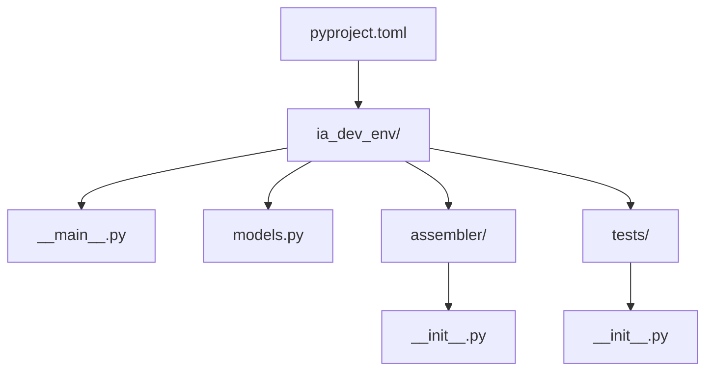

# História: Scaffolding do Projeto e Modelos de Domínio

**ID:** STORY-001

## 1. Dependências

| Blocked By | Blocks |
| :--- | :--- |
| — | STORY-002, STORY-003, STORY-004, STORY-005, STORY-006, STORY-007, STORY-008 |

## 2. Regras Transversais Aplicáveis

| ID | Título |
| :--- | :--- |
| RULE-004 | Python 3.9+ |
| RULE-007 | Assemblers independentes |

## 3. Descrição

Como **desenvolvedor da ferramenta**, eu quero ter a estrutura base do projeto Python e os modelos de dados definidos, garantindo que todas as histórias subsequentes possam ser implementadas sobre uma fundação sólida.

Esta história é o alicerce do projeto. Define a estrutura de diretórios, o `pyproject.toml` com dependências, o entry point `__main__.py`, e os dataclasses que representam a configuração do projeto (`ProjectConfig`, `LanguageConfig`, `FrameworkConfig`, `InfraConfig`, `SecurityConfig`, etc.).

Os modelos devem cobrir todas as seções do YAML de configuração (project, architecture, interfaces, language, framework, data, infrastructure, security, observability, resilience, testing, ci_cd, deployment). Usar `@dataclass` com `from __future__ import annotations` para compatibilidade 3.9+.

### 3.1 Estrutura de Diretórios

- `ia_dev_env/` — pacote principal
- `ia_dev_env/__main__.py` — entry point (`python -m ia_dev_env`)
- `ia_dev_env/models.py` — todos os dataclasses
- `ia_dev_env/assembler/` — subpacote para assemblers (vazio nesta story, com `__init__.py`)
- `ia_dev_env/tests/` — diretório de testes
- `pyproject.toml` — metadata, dependências (`pyyaml`, `jinja2`, `click`), scripts entry point

### 3.2 Modelos de Dados

- `ProjectConfig` — aggregate root com todas as seções
- `ProjectIdentity` — name, purpose
- `ArchitectureConfig` — style, domain_driven, event_driven
- `InterfaceConfig` — type, spec/broker
- `LanguageConfig` — name, version
- `FrameworkConfig` — name, version, build_tool, native_build
- `DataConfig` — database, migration, cache (cada um com name/version)
- `InfraConfig` — container, orchestrator, observability
- `SecurityConfig` — frameworks list
- Todos com `from_dict(cls, data: dict)` factory method

## 4. Definições de Qualidade Locais

### DoR Local
- [ ] Decisão sobre estrutura de pacote confirmada
- [ ] Python 3.9+ disponível no ambiente de desenvolvimento
- [ ] Config YAML de referência disponível para derivar modelos

### DoD Local
- [ ] `pyproject.toml` válido com `pip install -e .` funcional
- [ ] `python -m ia_dev_env --help` retorna sem erro
- [ ] Todos os dataclasses instanciáveis a partir de dicts do YAML
- [ ] 100% de cobertura nos modelos

### Global DoD
- **Cobertura:** ≥ 95% Line, ≥ 90% Branch
- **Testes Automatizados:** Unit (pytest), integration, contract
- **Relatório de Cobertura:** pytest-cov HTML + XML
- **Documentação:** README.md, --help funcional
- **Persistência:** N/A
- **Performance:** Execução completa < 5s

## 5. Contratos de Dados (Data Contract)

**ProjectConfig (dataclass):**

| Campo | Tipo | Obrigatório | Default | Origem |
| :--- | :--- | :--- | :--- | :--- |
| `project` | `ProjectIdentity` | Sim | — | YAML `project:` |
| `architecture` | `ArchitectureConfig` | Sim | — | YAML `architecture:` |
| `interfaces` | `list[InterfaceConfig]` | Sim | — | YAML `interfaces:` |
| `language` | `LanguageConfig` | Sim | — | YAML `language:` |
| `framework` | `FrameworkConfig` | Sim | — | YAML `framework:` |
| `data` | `DataConfig` | Não | `DataConfig()` | YAML `data:` |
| `infrastructure` | `InfraConfig` | Não | `InfraConfig()` | YAML `infrastructure:` |
| `security` | `SecurityConfig` | Não | `SecurityConfig()` | YAML `security:` |

## 6. Diagramas

### 6.1 Estrutura de Pacotes



## 7. Critérios de Aceite (Gherkin)

```gherkin
Cenario: Instalação do pacote
  DADO que o pyproject.toml está configurado
  QUANDO executo "pip install -e ."
  ENTÃO a instalação completa sem erros
  E o comando "ia-dev-env --help" está disponível

Cenario: Criação de ProjectConfig a partir de YAML completo
  DADO que tenho um dict representando setup-config.java-quarkus.yaml
  QUANDO crio ProjectConfig.from_dict(data)
  ENTÃO todos os campos são populados corretamente
  E interfaces contém 4 itens (rest, grpc, event-consumer, event-producer)

Cenario: Criação de ProjectConfig com campos opcionais ausentes
  DADO que tenho um dict mínimo (project, architecture, interfaces, language, framework)
  QUANDO crio ProjectConfig.from_dict(data)
  ENTÃO campos opcionais usam defaults
  E nenhuma exceção é lançada

Cenario: Entry point funcional
  DADO que o pacote está instalado
  QUANDO executo "python -m ia_dev_env --help"
  ENTÃO o output contém informações de uso
  E o exit code é 0
```

## 8. Sub-tarefas

- [ ] [Dev] Criar `pyproject.toml` com metadata e dependências
- [ ] [Dev] Implementar `__main__.py` com entry point Click básico
- [ ] [Dev] Implementar todos os dataclasses em `models.py`
- [ ] [Dev] Implementar `from_dict()` factory methods
- [ ] [Dev] Criar estrutura `assembler/` e `tests/` com `__init__.py`
- [ ] [Test] Unitário: instanciação de todos os modelos
- [ ] [Test] Unitário: `from_dict()` com YAML completo e parcial
- [ ] [Test] Integração: `pip install -e .` e entry point
