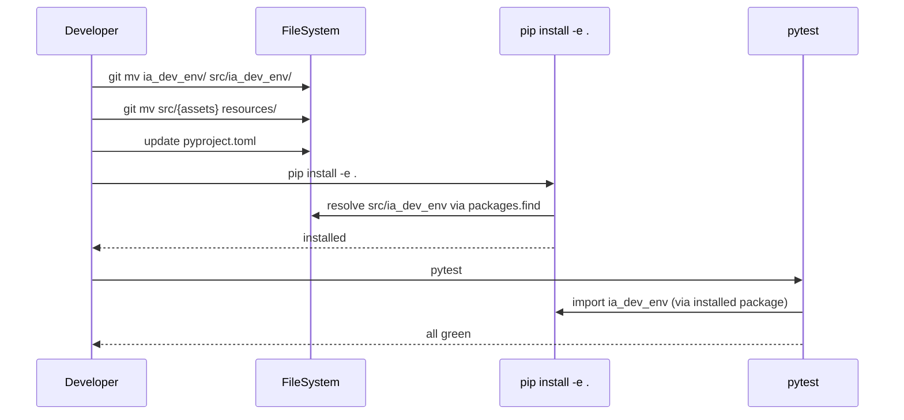

# História: Migração para src Layout (PyPA)

**ID:** STORY-011

## 1. Dependências

| Blocked By | Blocks |
| :--- | :--- |
| STORY-010 | — |

## 2. Regras Transversais Aplicáveis

| ID | Título |
| :--- | :--- |
| RULE-004 | Python 3.9+ |
| RULE-005 | Compatibilidade byte-a-byte |

## 3. Descrição

Como **desenvolvedor**, eu quero que o pacote Python siga o src layout recomendado pela PyPA, garantindo que erros de empacotamento sejam detectados durante o desenvolvimento e não em produção.

O projeto atualmente usa flat layout com `ia_dev_env/` na raiz do repositório. O diretório `src/` existe mas contém assets não-Python (templates, configs, setup.sh). Esta história reorganiza a estrutura: move o pacote Python para `src/ia_dev_env/`, move os assets não-Python para `resources/`, e atualiza toda a configuração de build/test.

O src layout impede que `import ia_dev_env` funcione sem instalação (`pip install -e .`), eliminando uma classe inteira de bugs de empacotamento onde código funciona localmente mas falha ao ser instalado via pip.

### 3.1 Mover pacote Python para src/

- Mover `ia_dev_env/` → `src/ia_dev_env/` (31 arquivos Python)
- Manter toda a estrutura interna inalterada (assembler/, domain/)
- Remover `ia_dev_env.egg-info/` se existir em `src/`

### 3.2 Mover assets não-Python para resources/

- Mover conteúdo atual de `src/` para `resources/` na raiz
  - agents-templates/, cloud-providers/, config-templates/, core/, core-rules/
  - databases/, docs/, frameworks/, hooks-templates/, infrastructure/
  - languages/, patterns/, protocols/, readme-template.md, security/
  - settings-templates/, setup.sh, skills-templates/, templates/, tests/
- Atualizar referências a `src/` no código-fonte (config.py, assemblers)

### 3.3 Atualizar pyproject.toml

- Adicionar `[tool.setuptools.packages.find]` com `where = ["src"]`
- Atualizar `[tool.coverage.run]` source de `["ia_dev_env"]` para `["src/ia_dev_env"]`
- Entry point `ia-dev-env = "ia_dev_env.__main__:main"` permanece igual (setuptools resolve via src)

### 3.4 Atualizar referências internas

- Atualizar paths em código que referenciam `src/` para `resources/`
- Verificar que todos os 72 imports nos testes continuam funcionando
- Verificar que `pip install -e .` instala corretamente

## 4. Definições de Qualidade Locais

### DoR Local
- [ ] STORY-010 (E2E tests) completa e passando
- [ ] Todos os testes existentes green antes da migração
- [ ] Backup/branch criado antes de iniciar

### DoD Local
- [ ] Pacote Python em `src/ia_dev_env/`
- [ ] Assets não-Python em `resources/`
- [ ] `pip install -e .` funciona corretamente
- [ ] `ia-dev-env --help` funciona após instalação
- [ ] Todos os 72+ imports nos testes resolvem corretamente
- [ ] Output byte-a-byte idêntico ao pré-migração

### Global DoD
- **Cobertura:** ≥ 95% Line, ≥ 90% Branch
- **Testes Automatizados:** Unit (pytest), integration, contract
- **Relatório de Cobertura:** pytest-cov HTML + XML
- **Documentação:** README.md, --help funcional
- **Persistência:** N/A
- **Performance:** Execução completa < 5s

## 5. Contratos de Dados (Data Contract)

**pyproject.toml changes:**

| Seção | Antes | Depois | Motivo |
| :--- | :--- | :--- | :--- |
| `[tool.setuptools.packages.find]` | (ausente) | `where = ["src"]` | Indicar src layout ao setuptools |
| `[tool.coverage.run] source` | `["ia_dev_env"]` | `["src/ia_dev_env"]` | Novo path do pacote |
| `[project.scripts]` | `ia_dev_env.__main__:main` | (sem alteração) | setuptools resolve via packages.find |

**Referências internas a atualizar:**

| Arquivo | Referência atual | Nova referência |
| :--- | :--- | :--- |
| `ia_dev_env/config.py` | `src/` paths | `resources/` paths |
| `ia_dev_env/assembler/*.py` | `src/` paths | `resources/` paths |
| `.claude/rules/*.md` | referências a `src/` | referências a `resources/` |

## 6. Diagramas

### 6.1 Estrutura Antes vs Depois



## 7. Critérios de Aceite (Gherkin)

```gherkin
Cenário: Pacote Python instalável via src layout
  DADO que o pacote está em src/ia_dev_env/
  QUANDO executo pip install -e .
  ENTÃO a instalação completa sem erros
  E ia-dev-env --help retorna uso válido

Cenário: Import protegido contra execução sem instalação
  DADO que NÃO executei pip install
  QUANDO executo python -c "import ia_dev_env" da raiz do projeto
  ENTÃO recebo ModuleNotFoundError

Cenário: Todos os testes passam após migração
  DADO que executei pip install -e .
  QUANDO executo pytest com coverage
  ENTÃO todos os testes passam
  E cobertura ≥ 95% line e ≥ 90% branch

Cenário: Assets não-Python acessíveis em resources/
  DADO que os assets foram movidos para resources/
  QUANDO a ferramenta busca templates, configs ou scripts
  ENTÃO encontra todos os arquivos em resources/
  E o output é idêntico ao pré-migração

Cenário: Nenhum arquivo órfão na raiz
  DADO que a migração foi concluída
  QUANDO listo a raiz do projeto
  ENTÃO não existe diretório ia_dev_env/ na raiz
  E não existem assets não-Python em src/
```

## 8. Sub-tarefas

- [ ] [Dev] Mover `ia_dev_env/` para `src/ia_dev_env/`
- [ ] [Dev] Mover assets de `src/` para `resources/`
- [ ] [Dev] Atualizar `pyproject.toml` com src layout config
- [ ] [Dev] Atualizar referências de path `src/` → `resources/` no código
- [ ] [Dev] Atualizar referências em `.claude/rules/` e docs
- [ ] [Dev] Limpar `ia_dev_env.egg-info/` e reinstalar
- [ ] [Test] Verificar `pip install -e .` funciona
- [ ] [Test] Rodar suite completa com coverage
- [ ] [Test] Verificar output byte-a-byte com referência
- [ ] [Doc] Atualizar README com nova estrutura de diretórios
