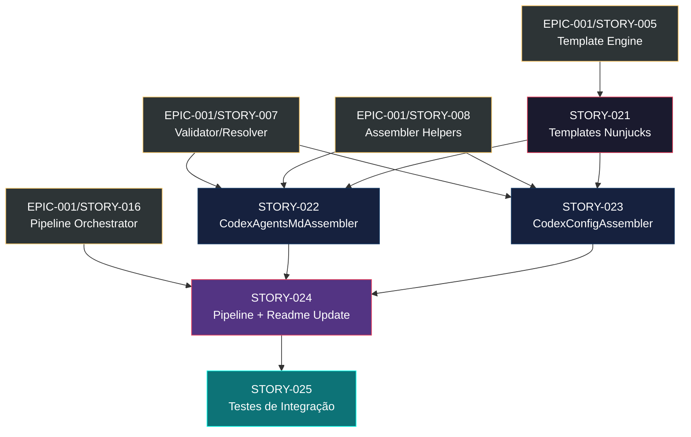

# Mapa de Implementação — EPIC-002: Suporte ao OpenAI Codex

**Gerado a partir das dependências BlockedBy/Blocks de cada história do EPIC-002.**

---

## 1. Matriz de Dependências

| Story | Título | Blocked By | Blocks | Status |
| :--- | :--- | :--- | :--- | :--- |
| STORY-021 | Templates Nunjucks para Codex | EPIC-001/STORY-005 | STORY-022, STORY-023 | Pendente |
| STORY-022 | CodexAgentsMdAssembler | STORY-021, EPIC-001/STORY-007, EPIC-001/STORY-008 | STORY-024 | Pendente |
| STORY-023 | CodexConfigAssembler | STORY-021, EPIC-001/STORY-007, EPIC-001/STORY-008 | STORY-024 | Pendente |
| STORY-024 | Pipeline + ReadmeAssembler Update | STORY-022, STORY-023, EPIC-001/STORY-016 | STORY-025 | Pendente |
| STORY-025 | Testes de Integração Codex | STORY-024 | — | Pendente |

> **Nota:** As dependências com EPIC-001 são externas a este épico. A Phase 0 deste épico só pode iniciar após EPIC-001/STORY-005 (Template Engine) estar concluída. A Phase 1 requer adicionalmente EPIC-001/STORY-007 (Validator/Resolver) e STORY-008 (Assembler Helpers). A Phase 2 requer EPIC-001/STORY-016 (Pipeline Orchestrator).

---

## 2. Fases de Implementação

> As histórias são agrupadas em fases. Dentro de cada fase, as histórias podem ser implementadas **em paralelo**. Uma fase só pode iniciar quando todas as dependências das fases anteriores estiverem concluídas.

```
╔══════════════════════════════════════════════════════════════════════════╗
║              FASE 0 — Foundation (Templates)                           ║
║                                                                        ║
║   ┌──────────────────────────────────────────────────────────┐         ║
║   │  STORY-021  Templates Nunjucks para Codex                │         ║
║   │  (← EPIC-001/STORY-005)                                 │         ║
║   └──────────────────────────┬───────────────────────────────┘         ║
╚══════════════════════════════╪═════════════════════════════════════════╝
                               │
                               ▼
╔══════════════════════════════════════════════════════════════════════════╗
║              FASE 1 — Core Assemblers (paralelo: 2)                    ║
║                                                                        ║
║   ┌─────────────────────────┐   ┌──────────────────────────┐          ║
║   │  STORY-022              │   │  STORY-023               │          ║
║   │  CodexAgentsMdAssembler │   │  CodexConfigAssembler    │          ║
║   │  (← 021, E1/007, 008)  │   │  (← 021, E1/007, 008)   │          ║
║   └────────────┬────────────┘   └────────────┬─────────────┘          ║
╚════════════════╪═════════════════════════════╪═════════════════════════╝
                 │                             │
                 └──────────────┬──────────────┘
                                ▼
╔══════════════════════════════════════════════════════════════════════════╗
║              FASE 2 — Integration                                      ║
║                                                                        ║
║   ┌──────────────────────────────────────────────────────────┐         ║
║   │  STORY-024  Pipeline + ReadmeAssembler Update            │         ║
║   │  (← 022, 023, EPIC-001/STORY-016)                       │         ║
║   └──────────────────────────┬───────────────────────────────┘         ║
╚══════════════════════════════╪═════════════════════════════════════════╝
                               │
                               ▼
╔══════════════════════════════════════════════════════════════════════════╗
║              FASE 3 — Validation                                       ║
║                                                                        ║
║   ┌──────────────────────────────────────────────────────────┐         ║
║   │  STORY-025  Testes de Integração Codex                   │         ║
║   │  (← 024)                                                 │         ║
║   └──────────────────────────────────────────────────────────┘         ║
╚══════════════════════════════════════════════════════════════════════════╝
```

---

## 3. Caminho Crítico

> O caminho crítico (a sequência mais longa de dependências) determina o tempo mínimo de implementação do projeto.

```
STORY-021 → STORY-022 → STORY-024 → STORY-025
   Fase 0      Fase 1      Fase 2      Fase 3
```

**4 fases no caminho crítico, 4 histórias na cadeia mais longa (STORY-021 → STORY-022 → STORY-024 → STORY-025).**

STORY-023 (CodexConfigAssembler) executa em paralelo com STORY-022 na Fase 1, portanto não está no caminho crítico. Atrasos em STORY-023 não impactam o prazo final desde que sejam absorvidos dentro da Fase 1.

O caminho crítico passa pelo `CodexAgentsMdAssembler` (STORY-022), que é o assembler mais complexo — justificando priorização e alocação de mais esforço.

---

## 4. Grafo de Dependências (Mermaid)



---

## 5. Resumo por Fase

| Fase | Histórias | Camada | Paralelismo | Pré-requisito |
| :--- | :--- | :--- | :--- | :--- |
| 0 | STORY-021 | Resources (Templates) | 1 | EPIC-001/STORY-005 concluída |
| 1 | STORY-022, STORY-023 | Assemblers | 2 paralelas | Fase 0 + EPIC-001/STORY-007, 008 concluídas |
| 2 | STORY-024 | Integration (Pipeline) | 1 | Fase 1 + EPIC-001/STORY-016 concluída |
| 3 | STORY-025 | Validation (Tests) | 1 | Fase 2 concluída |

**Total: 5 histórias em 4 fases.**

> **Nota:** A Fase 0 pode iniciar assim que EPIC-001 Phase 1 estiver concluída (STORY-005). A Fase 1 requer EPIC-001 Phase 3 (STORY-007, 008). A Fase 2 requer EPIC-001 Phase 5 (STORY-016). Isso permite desenvolvimento intercalado entre os dois épicos.

---

## 6. Detalhamento por Fase

### Fase 0 — Foundation (Templates)

| Story | Escopo Principal | Artefatos Chave |
| :--- | :--- | :--- |
| STORY-021 | Templates Nunjucks para AGENTS.md e config.toml | 13 templates em `resources/codex-templates/` (1 principal + 10 seções + 1 config TOML) |

**Entregas da Fase 0:**

- Diretório `resources/codex-templates/` com todos os templates
- Seções condicionais testáveis independentemente
- Testes de renderização individual por seção

### Fase 1 — Core Assemblers

| Story | Escopo Principal | Artefatos Chave |
| :--- | :--- | :--- |
| STORY-022 | CodexAgentsMdAssembler — gera `.codex/AGENTS.md` | `src/assembler/codex-agents-md-assembler.ts` + scan de agents/skills |
| STORY-023 | CodexConfigAssembler — gera `.codex/config.toml` | `src/assembler/codex-config-assembler.ts` + derivação de approval policy |

**Entregas da Fase 1:**

- 2 assemblers implementados e testados unitariamente
- `.codex/AGENTS.md` gerado com consolidação de rules, agents, skills
- `.codex/config.toml` gerado com valores derivados deterministicamente
- Seções condicionais funcionais (domain, security, MCP)

### Fase 2 — Integration

| Story | Escopo Principal | Artefatos Chave |
| :--- | :--- | :--- |
| STORY-024 | Pipeline expandido (14 → 16 assemblers) + ReadmeAssembler atualizado | Modificações em `src/assembler/index.ts`, `src/assembler/readme-assembler.ts`, `resources/readme-template.md` |

**Entregas da Fase 2:**

- Pipeline executa 16 assemblers na ordem correta
- ReadmeAssembler conta e documenta artefatos Codex
- Output `.claude/` e `.github/` confirmado como inalterado
- Tabela de mapping e Generation Summary atualizados

### Fase 3 — Validation

| Story | Escopo Principal | Artefatos Chave |
| :--- | :--- | :--- |
| STORY-025 | Testes de integração end-to-end com 5+ fixtures | 5 fixtures YAML, testes de regressão, testes de determinismo |

**Entregas da Fase 3:**

- 5 fixtures de configuração cobrindo cenários diversos
- Testes de integração por fixture validando conteúdo
- Testes de regressão confirmando zero impacto
- Cobertura combinada ≥ 95% line, ≥ 90% branch
- Validação final de entrega do EPIC-002

---

## 7. Observações Estratégicas

### Gargalo Principal

**STORY-021 (Templates Nunjucks)** é o gargalo — bloqueia STORY-022 e STORY-023. Todo o épico depende da criação correta dos templates. Investir tempo na Fase 0 para garantir que os templates estejam corretos e completos compensa pois reduz retrabalho nos assemblers.

Secundariamente, as **dependências externas com EPIC-001** são o gargalo real. O EPIC-002 não pode iniciar sem EPIC-001/STORY-005, e a Fase 1 depende de EPIC-001/STORY-007 e STORY-008 (Phase 3 do EPIC-001). Planejamento de intercalação entre os dois épicos é essencial.

### Histórias Folha (sem dependentes)

**STORY-025** (Testes de Integração) é a única história folha. Pode absorver atrasos das fases anteriores sem impacto em outros trabalhos. É também o checkpoint final de validação antes de considerar o épico concluído.

### Otimização de Tempo

- **Fase 1 é o ponto de máximo paralelismo** (2 assemblers independentes). Alocar 2 desenvolvedores simultâneos nesta fase maximiza throughput.
- **Fase 0 pode iniciar cedo** — só depende do Template Engine (EPIC-001/STORY-005, Phase 1). Templates são resources puros, sem dependência de lógica TypeScript complexa.
- **Fase 2 e 3 são sequenciais** por natureza (integração → validação), sem oportunidade de paralelismo.

### Dependências Cruzadas

As dependências com EPIC-001 convergem em 2 pontos:
1. **EPIC-001 Phase 3** (STORY-007, 008) → desbloqueia EPIC-002 Phase 1
2. **EPIC-001 Phase 5** (STORY-016) → desbloqueia EPIC-002 Phase 2

Isso permite uma estratégia de **intercalação**: iniciar EPIC-002 Phase 0 durante EPIC-001 Phase 2-3, e EPIC-002 Phase 1 durante EPIC-001 Phase 4.

```
EPIC-001:  Phase 0 │ Phase 1 │ Phase 2 │ Phase 3 │ Phase 4 │ Phase 5 │ ...
EPIC-002:                               │ Phase 0 │ Phase 1 │         │ Phase 2 │ Phase 3
```

### Marco de Validação Arquitetural

**STORY-022 (CodexAgentsMdAssembler)** deve servir como checkpoint de validação. Ele é o assembler mais complexo e exercita:
- Scan de agents e skills (leitura de output de assemblers anteriores)
- Construção de context estendido (merge de dados de múltiplas fontes)
- Renderização de template com seções condicionais
- Criação de diretório `.codex/`

Se STORY-022 funciona corretamente, STORY-023 (mais simples) terá poucos riscos, e a integração no pipeline (STORY-024) será straightforward.
