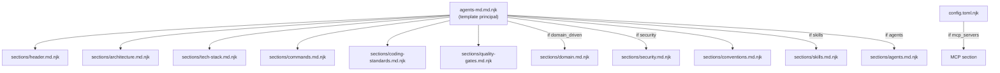

# História: Templates Nunjucks para Codex

**ID:** STORY-021

## 1. Dependências

| Blocked By | Blocks |
| :--- | :--- |
| EPIC-001/STORY-005 (Template Engine) | STORY-022, STORY-023 |

## 2. Regras Transversais Aplicáveis

| ID | Título |
| :--- | :--- |
| RULE-101 | Consolidação AGENTS.md |
| RULE-102 | Seções condicionais |
| RULE-104 | Modularidade de templates |
| RULE-107 | Paridade de placeholders |
| RULE-109 | Feature gating Codex |
| RULE-110 | TOML via template |

## 3. Descrição

Como **desenvolvedor do ia-dev-environment**, eu quero ter todos os templates Nunjucks para geração de artefatos Codex criados em `resources/codex-templates/`, garantindo que possam ser renderizados pelo template engine existente e produzam output Markdown e TOML válidos.

Esta história é a fundação do suporte Codex. Ela cria 13 templates Nunjucks: 1 template principal para AGENTS.md (que inclui 10 seções modulares via ``), 1 template para config.toml, e 1 template master que orquestra as inclusões. Os templates consomem exatamente os mesmos 25 campos de placeholder context já definidos no template engine, mais dados adicionais passados pelos assemblers (ResolvedStack, listas de agents/skills).

### 3.1 Diretório de Destino

- `resources/codex-templates/` — novo diretório
- `resources/codex-templates/sections/` — subdiretório para seções modulares

### 3.2 Templates a Criar

**Template principal:**
- `agents-md.md.njk` — Orquestra inclusões condicionais de seções. Gera `.codex/AGENTS.md`.

**Seções modulares (incluídas via ``):**
- `sections/header.md.njk` — Título do projeto + purpose + versão
- `sections/architecture.md.njk` — Architecture style, package structure, dependency rules
- `sections/tech-stack.md.njk` — Tabela de tecnologias (condicional: omite linhas com "none")
- `sections/commands.md.njk` — Build, test, compile, coverage commands (do ResolvedStack)
- `sections/coding-standards.md.njk` — Hard limits, SOLID, error handling, forbidden patterns
- `sections/quality-gates.md.njk` — Coverage thresholds, test categories, test naming
- `sections/domain.md.njk` — Domain model (condicional: `domain_driven == "True"`)
- `sections/security.md.njk` — Security guidelines (condicional: security frameworks presentes)
- `sections/conventions.md.njk` — Commits, branches, code language, documentation
- `sections/skills.md.njk` — Lista de skills disponíveis com nome e descrição
- `sections/agents.md.njk` — Agent personas com nome e role

**Config TOML:**
- `config.toml.njk` — Template do `config.toml` com model, approval_policy, sandbox_mode, MCP servers

### 3.3 Variáveis de Contexto Consumidas

**Do context flat (25 campos — RULE-107):**
- `project_name`, `project_purpose`
- `language_name`, `language_version`, `framework_name`, `framework_version`, `build_tool`
- `architecture_style`, `domain_driven`, `event_driven`
- `database_name`, `cache_name`
- `container`, `orchestrator`, `observability`
- `coverage_line`, `coverage_branch`
- `smoke_tests`, `contract_tests`, `performance_tests`

**Do contexto estendido (RULE-108):**
- `resolved_stack` — objeto com `build_cmd`, `test_cmd`, `compile_cmd`, `coverage_cmd`
- `agents_list` — array de `{ name: string, description: string }`
- `skills_list` — array de `{ name: string, description: string, user_invocable: boolean }`
- `has_hooks` — boolean indicando se hooks foram gerados
- `mcp_servers` — array de `{ name: string, command: string[], env: Record<string, string> }`
- `security_frameworks` — array de strings (pode ser vazio)

### 3.4 Lógica Condicional nos Templates (RULE-102)

| Seção | Condição de Inclusão |
| :--- | :--- |
| `domain.md.njk` | `domain_driven == "True"` |
| `security.md.njk` | `security_frameworks` não vazio |
| Database row em tech-stack | `database_name != "none"` |
| Cache row em tech-stack | `cache_name != "none"` |
| Orchestrator row em tech-stack | `orchestrator != "none"` |
| Observability row em tech-stack | `observability != "none"` |
| MCP section em config.toml | `mcp_servers` não vazio |
| Skills section | `skills_list` não vazio |
| Agents section | `agents_list` não vazio |

## 4. Definições de Qualidade Locais

### DoR Local (Definition of Ready)

- [ ] Template engine (EPIC-001/STORY-005) funcional e compilável
- [ ] Documentação oficial do Codex CLI consultada para formato AGENTS.md e config.toml
- [ ] Variáveis de contexto documentadas (25 flat + estendidas)
- [ ] Exemplos de output esperado rascunhados para configs minimal e full

### DoD Local (Definition of Done)

- [ ] 13 templates criados no diretório `resources/codex-templates/`
- [ ] Cada template renderiza sem erros com context de teste
- [ ] Seções condicionais são omitidas quando condição é falsa
- [ ] Output AGENTS.md é Markdown válido (sem artefatos de template)
- [ ] Output config.toml é TOML válido (sem artefatos de template)
- [ ] Templates usam apenas variáveis documentadas (nenhuma variável nova)

### Global Definition of Done (DoD)

- **Cobertura:** ≥ 95% Line Coverage, ≥ 90% Branch Coverage
- **Testes Automatizados:** Unitários de renderização de cada template + snapshot tests
- **Relatório de Cobertura:** vitest coverage lcov + text
- **Documentação:** Comentários em templates explicando seções condicionais
- **Persistência:** N/A
- **Performance:** N/A

## 5. Contratos de Dados (Data Contract)

**Contexto de renderização do agents-md.md.njk:**

| Campo | Tipo | Obrigatório | Origem / Regra |
| :--- | :--- | :--- | :--- |
| `project_name` | string | M | ProjectConfig.project.name |
| `project_purpose` | string | M | ProjectConfig.project.purpose |
| `language_name` | string | M | ProjectConfig.language.name |
| `language_version` | string | M | ProjectConfig.language.version |
| `framework_name` | string | M | ProjectConfig.framework.name |
| `framework_version` | string | O | ProjectConfig.framework.version |
| `build_tool` | string | M | ProjectConfig.language.build_tool |
| `architecture_style` | string | M | ProjectConfig.architecture.style |
| `domain_driven` | string ("True"/"False") | M | ProjectConfig.architecture.domain_driven |
| `event_driven` | string ("True"/"False") | M | ProjectConfig.architecture.event_driven |
| `database_name` | string | M | ProjectConfig.data.database.name |
| `cache_name` | string | M | ProjectConfig.data.cache.name |
| `container` | string | M | ProjectConfig.infra.container |
| `orchestrator` | string | M | ProjectConfig.infra.orchestrator |
| `observability` | string | M | ProjectConfig.observability.stack |
| `coverage_line` | number | M | ProjectConfig.testing.coverage_line |
| `coverage_branch` | number | M | ProjectConfig.testing.coverage_branch |
| `resolved_stack` | ResolvedStack | M | Computed by resolver |
| `agents_list` | Array<{name, description}> | M | Scanned from output dir |
| `skills_list` | Array<{name, description, user_invocable}> | M | Scanned from output dir |
| `has_hooks` | boolean | M | Derived from hooks output |
| `mcp_servers` | Array<McpServerConfig> | O | ProjectConfig.mcp.servers |
| `security_frameworks` | string[] | O | ProjectConfig.security.frameworks |

**Contexto de renderização do config.toml.njk:**

| Campo | Tipo | Obrigatório | Origem / Regra |
| :--- | :--- | :--- | :--- |
| `model` | string | M | Hardcoded "o4-mini" (RULE-103) |
| `approval_policy` | string | M | Derived: "on-request" se has_hooks, "untrusted" senão |
| `sandbox_mode` | string | M | Hardcoded "workspace-write" (RULE-103) |
| `mcp_servers` | Array<McpServerConfig> | O | ProjectConfig.mcp.servers |
| `project_name` | string | M | ProjectConfig.project.name |

## 6. Diagramas

### 6.1 Estrutura de Templates e Inclusões



## 7. Critérios de Aceite (Gherkin)

```gherkin
Cenario: Renderização do AGENTS.md com config completo
  DADO que tenho um context com todos os 25 campos flat preenchidos
  E resolved_stack com build_cmd, test_cmd, compile_cmd, coverage_cmd
  E agents_list com 3 agents e skills_list com 5 skills
  QUANDO renderizo o template agents-md.md.njk
  ENTÃO o output contém seções Header, Architecture, Tech Stack, Commands, Coding Standards, Quality Gates, Conventions, Skills, Agents
  E o output é Markdown válido sem artefatos de template ({{ ou {%)

Cenario: Seção Domain omitida quando domain_driven é False
  DADO que tenho um context com domain_driven = "False"
  QUANDO renderizo o template agents-md.md.njk
  ENTÃO o output NÃO contém a seção "## Domain"

Cenario: Seção Security omitida quando não há frameworks
  DADO que tenho um context com security_frameworks = []
  QUANDO renderizo o template agents-md.md.njk
  ENTÃO o output NÃO contém a seção "## Security"

Cenario: Tech Stack omite linhas com "none"
  DADO que tenho um context com database_name = "none" e cache_name = "redis"
  QUANDO renderizo o template agents-md.md.njk
  ENTÃO a tabela Tech Stack NÃO contém linha "Database"
  E a tabela Tech Stack contém linha "Cache" com valor "redis"

Cenario: config.toml válido com MCP servers
  DADO que tenho mcp_servers com 2 servers configurados
  QUANDO renderizo o template config.toml.njk
  ENTÃO o output contém seções [mcp_servers.server1] e [mcp_servers.server2]
  E o output é TOML válido

Cenario: config.toml sem MCP quando lista vazia
  DADO que tenho mcp_servers = []
  QUANDO renderizo o template config.toml.njk
  ENTÃO o output NÃO contém seção [mcp_servers]

Cenario: Approval policy derivada de hooks
  DADO que tenho has_hooks = true
  QUANDO renderizo o template config.toml.njk
  ENTÃO approval_policy = "on-request"

Cenario: Approval policy padrão sem hooks
  DADO que tenho has_hooks = false
  QUANDO renderizo o template config.toml.njk
  ENTÃO approval_policy = "untrusted"
```

## 8. Sub-tarefas

- [ ] [Dev] Criar diretório `resources/codex-templates/sections/`
- [ ] [Dev] Implementar `sections/header.md.njk`
- [ ] [Dev] Implementar `sections/architecture.md.njk`
- [ ] [Dev] Implementar `sections/tech-stack.md.njk` com condicionais para "none"
- [ ] [Dev] Implementar `sections/commands.md.njk` com dados do ResolvedStack
- [ ] [Dev] Implementar `sections/coding-standards.md.njk`
- [ ] [Dev] Implementar `sections/quality-gates.md.njk`
- [ ] [Dev] Implementar `sections/domain.md.njk` (condicional)
- [ ] [Dev] Implementar `sections/security.md.njk` (condicional)
- [ ] [Dev] Implementar `sections/conventions.md.njk`
- [ ] [Dev] Implementar `sections/skills.md.njk` com iteração sobre skills_list
- [ ] [Dev] Implementar `sections/agents.md.njk` com iteração sobre agents_list
- [ ] [Dev] Implementar `agents-md.md.njk` com inclusões condicionais
- [ ] [Dev] Implementar `config.toml.njk` com MCP condicional
- [ ] [Test] Unitário: renderização de cada seção individual com context válido
- [ ] [Test] Unitário: omissão de seções condicionais quando condição é falsa
- [ ] [Test] Unitário: TOML válido gerado pelo config.toml.njk
- [ ] [Test] Snapshot: output completo AGENTS.md para config full
- [ ] [Test] Snapshot: output completo AGENTS.md para config minimal (sem domain, sem security)
