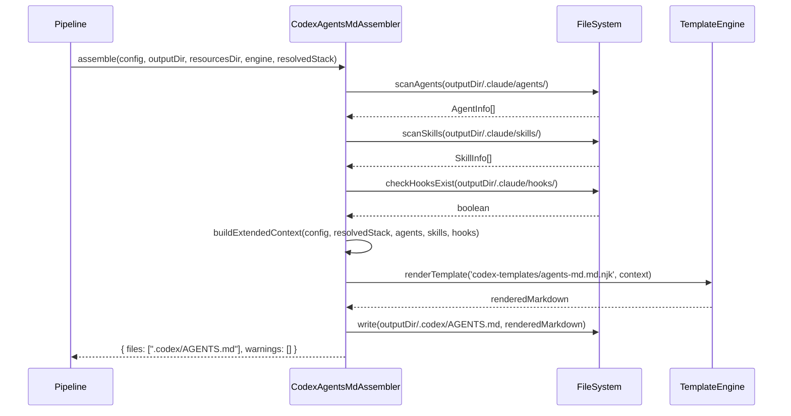

# História: CodexAgentsMdAssembler

**ID:** STORY-022

## 1. Dependências

| Blocked By | Blocks |
| :--- | :--- |
| STORY-021, EPIC-001/STORY-007, EPIC-001/STORY-008 | STORY-024 |

## 2. Regras Transversais Aplicáveis

| ID | Título |
| :--- | :--- |
| RULE-101 | Consolidação AGENTS.md |
| RULE-102 | Seções condicionais |
| RULE-105 | Impacto zero no output existente |
| RULE-106 | Padrão de extensão do pipeline |
| RULE-107 | Paridade de placeholders |
| RULE-108 | Contexto estendido para AGENTS.md |
| RULE-109 | Feature gating Codex |

## 3. Descrição

Como **desenvolvedor do ia-dev-environment**, eu quero ter o `CodexAgentsMdAssembler` implementado em TypeScript, garantindo que a geração do `.codex/AGENTS.md` consolide informações de rules, architecture, coding standards, quality gates, domain, security, agents e skills em um único Markdown estruturado.

O `CodexAgentsMdAssembler` é o assembler mais complexo deste épico. Ele opera em 3 fases:
1. **Coleta de contexto estendido** — Lê agents e skills já gerados pelo pipeline para montar listas
2. **Construção do context de renderização** — Combina o context flat de 25 campos com ResolvedStack e listas coletadas
3. **Renderização** — Passa o context completo ao template `agents-md.md.njk` e escreve o resultado em `.codex/AGENTS.md`

### 3.1 Módulo TypeScript de Destino

- `src/assembler/codex-agents-md-assembler.ts`

### 3.2 Interface e Assinatura

```typescript
export class CodexAgentsMdAssembler implements Assembler {
  assemble(
    config: ProjectConfig,
    outputDir: string,
    resourcesDir: string,
    engine: TemplateEngine,
    resolvedStack: ResolvedStack
  ): Promise<{ files: string[]; warnings: string[] }>;
}
```

### 3.3 Fases de Execução

**Fase 1 — Coleta de contexto estendido:**
- Escanear `{outputDir}/.claude/agents/` para coletar nomes e descrições de agents
- Escanear `{outputDir}/.claude/skills/` para coletar nomes e descrições de skills (ler SKILL.md frontmatter)
- Verificar existência de `{outputDir}/.claude/hooks/` para determinar `has_hooks`
- Ler `config.mcp.servers` para MCP servers
- Ler `config.security.frameworks` para security frameworks

**Fase 2 — Construção do context:**
- Usar `engine.buildContext(config)` para obter os 25 campos flat
- Adicionar campos estendidos: `resolved_stack`, `agents_list`, `skills_list`, `has_hooks`, `mcp_servers`, `security_frameworks`

**Fase 3 — Renderização:**
- `engine.renderTemplate('codex-templates/agents-md.md.njk', context)`
- Criar diretório `.codex/` no outputDir
- Escrever resultado em `{outputDir}/.codex/AGENTS.md`

### 3.4 Scan de Agents

Para cada arquivo `*.md` em `{outputDir}/.claude/agents/`:
- Extrair nome do arquivo (sem extensão): `architect.md` → `architect`
- Extrair primeira linha como descrição (ou título `# ...`)
- Retornar array `[{ name, description }]`

### 3.5 Scan de Skills

Para cada diretório em `{outputDir}/.claude/skills/` que contenha `SKILL.md`:
- Ler frontmatter YAML do `SKILL.md`
- Extrair `name`, `description`, `user-invocable`
- Retornar array `[{ name, description, user_invocable }]`

## 4. Definições de Qualidade Locais

### DoR Local (Definition of Ready)

- [ ] Templates Nunjucks (STORY-021) criados e testados
- [ ] Validator/Resolver (EPIC-001/STORY-007) disponíveis
- [ ] Assembler helpers (EPIC-001/STORY-008) disponíveis
- [ ] Template engine com `renderTemplate` funcional
- [ ] Output de AgentsAssembler e SkillsAssembler disponível em fixtures

### DoD Local (Definition of Done)

- [ ] `CodexAgentsMdAssembler` implementado com 3 fases
- [ ] Scan de agents funcional (extrai nome e descrição)
- [ ] Scan de skills funcional (extrai frontmatter YAML)
- [ ] Context estendido montado corretamente
- [ ] `.codex/AGENTS.md` gerado com todas as seções aplicáveis
- [ ] Seções condicionais omitidas quando condição é falsa
- [ ] Output `.claude/` e `.github/` inalterados (RULE-105)

### Global Definition of Done (DoD)

- **Cobertura:** ≥ 95% Line Coverage, ≥ 90% Branch Coverage
- **Testes Automatizados:** Unitários + testes de output com configs diversas
- **Relatório de Cobertura:** vitest coverage lcov + text
- **Documentação:** JSDoc em métodos públicos
- **Persistência:** N/A
- **Performance:** N/A

## 5. Contratos de Dados (Data Contract)

**CodexAgentsMdAssembler.assemble — Input:**

| Parâmetro | Tipo | Obrigatório | Descrição |
| :--- | :--- | :--- | :--- |
| `config` | `ProjectConfig` | M | Configuração do projeto |
| `outputDir` | `string` | M | Diretório onde outros assemblers já geraram |
| `resourcesDir` | `string` | M | Diretório de resources (contém codex-templates/) |
| `engine` | `TemplateEngine` | M | Template engine Nunjucks |
| `resolvedStack` | `ResolvedStack` | M | Stack resolvido com commands |

**CodexAgentsMdAssembler.assemble — Output:**

| Campo | Tipo | Descrição |
| :--- | :--- | :--- |
| `files` | `string[]` | `[".codex/AGENTS.md"]` |
| `warnings` | `string[]` | Avisos (ex: "No agents found", "No skills found") |

**AgentInfo (interno):**

| Campo | Tipo | Descrição |
| :--- | :--- | :--- |
| `name` | `string` | Nome do agent (ex: "architect") |
| `description` | `string` | Descrição extraída do arquivo |

**SkillInfo (interno):**

| Campo | Tipo | Descrição |
| :--- | :--- | :--- |
| `name` | `string` | Nome do skill (ex: "x-dev-implement") |
| `description` | `string` | Descrição do frontmatter |
| `user_invocable` | `boolean` | Se o skill é invocável pelo usuário |

## 6. Diagramas

### 6.1 Fluxo de Geração do AGENTS.md



## 7. Critérios de Aceite (Gherkin)

```gherkin
Cenario: Geração do AGENTS.md com config completo
  DADO que tenho um ProjectConfig completo com domain_driven=true
  E o pipeline já gerou 6 agents e 12 skills
  E resolvedStack contém build_cmd="npm run build"
  QUANDO executo CodexAgentsMdAssembler.assemble
  ENTÃO .codex/AGENTS.md é gerado
  E contém seções: Header, Architecture, Tech Stack, Commands, Coding Standards, Quality Gates, Domain, Conventions, Skills, Agents
  E a seção Skills lista 12 skills
  E a seção Agents lista 6 agents

Cenario: AGENTS.md sem seção Domain para projeto não-DDD
  DADO que tenho um ProjectConfig com domain_driven=false
  QUANDO executo CodexAgentsMdAssembler.assemble
  ENTÃO .codex/AGENTS.md NÃO contém seção "## Domain"

Cenario: AGENTS.md sem seção Security quando não há frameworks
  DADO que tenho um ProjectConfig sem security.frameworks
  QUANDO executo CodexAgentsMdAssembler.assemble
  ENTÃO .codex/AGENTS.md NÃO contém seção "## Security"

Cenario: Scan de agents extrai nomes e descrições
  DADO que existem 3 arquivos .md em .claude/agents/
  QUANDO scanAgents é executado
  ENTÃO retorna array com 3 AgentInfo
  E cada AgentInfo tem name e description preenchidos

Cenario: Scan de skills extrai frontmatter YAML
  DADO que existem 5 skills com SKILL.md em .claude/skills/
  QUANDO scanSkills é executado
  ENTÃO retorna array com 5 SkillInfo
  E skills com user-invocable=false são marcadas como knowledge packs

Cenario: Warning quando nenhum agent encontrado
  DADO que o diretório .claude/agents/ está vazio
  QUANDO executo CodexAgentsMdAssembler.assemble
  ENTÃO warnings contém "No agents found in output directory"
  E a seção Agents é omitida do AGENTS.md
```

## 8. Sub-tarefas

- [ ] [Dev] Criar `src/assembler/codex-agents-md-assembler.ts`
- [ ] [Dev] Implementar `scanAgents()` — leitura e extração de agents
- [ ] [Dev] Implementar `scanSkills()` — leitura de SKILL.md frontmatter
- [ ] [Dev] Implementar `buildExtendedContext()` — merge de context flat + estendido
- [ ] [Dev] Implementar `assemble()` — orquestração das 3 fases
- [ ] [Dev] Criar diretório `.codex/` no outputDir
- [ ] [Test] Unitário: scanAgents com 0, 1, N agents
- [ ] [Test] Unitário: scanSkills com skills invocáveis e knowledge packs
- [ ] [Test] Unitário: buildExtendedContext com todos os campos
- [ ] [Test] Unitário: assemble completo com config full
- [ ] [Test] Unitário: assemble com config minimal (sem domain, sem security)
- [ ] [Test] Unitário: warnings para agents/skills vazios
