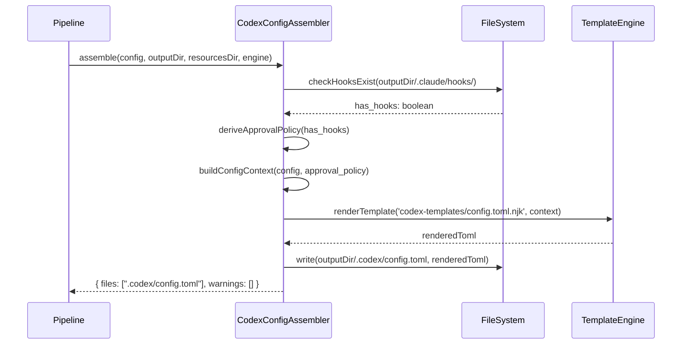
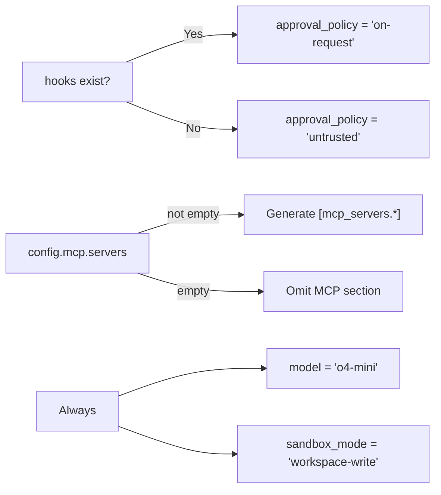

# História: CodexConfigAssembler

**ID:** STORY-023

## 1. Dependências

| Blocked By | Blocks |
| :--- | :--- |
| STORY-021, EPIC-001/STORY-007, EPIC-001/STORY-008 | STORY-024 |

## 2. Regras Transversais Aplicáveis

| ID | Título |
| :--- | :--- |
| RULE-103 | Derivação determinística do config.toml |
| RULE-105 | Impacto zero no output existente |
| RULE-106 | Padrão de extensão do pipeline |
| RULE-107 | Paridade de placeholders |
| RULE-109 | Feature gating Codex |
| RULE-110 | TOML via template |

## 3. Descrição

Como **desenvolvedor do ia-dev-environment**, eu quero ter o `CodexConfigAssembler` implementado em TypeScript, garantindo que a geração do `.codex/config.toml` derive deterministicamente todas as configurações a partir do YAML do projeto, sem inputs adicionais do usuário.

O `CodexConfigAssembler` é o assembler mais simples deste épico. Ele opera em 2 fases:
1. **Derivação de valores** — Computa `model`, `approval_policy`, `sandbox_mode` e mapeia MCP servers
2. **Renderização** — Passa os valores derivados ao template `config.toml.njk` e escreve em `.codex/config.toml`

### 3.1 Módulo TypeScript de Destino

- `src/assembler/codex-config-assembler.ts`

### 3.2 Interface e Assinatura

```typescript
export class CodexConfigAssembler implements Assembler {
  assemble(
    config: ProjectConfig,
    outputDir: string,
    resourcesDir: string,
    engine: TemplateEngine
  ): Promise<{ files: string[]; warnings: string[] }>;
}
```

### 3.3 Regras de Derivação (RULE-103)

| Campo config.toml | Valor | Regra |
| :--- | :--- | :--- |
| `model` | `"o4-mini"` | Hardcoded — default recomendado para custo/performance |
| `approval_policy` | `"on-request"` ou `"untrusted"` | `"on-request"` se projeto tem hooks (post-compile, etc.); `"untrusted"` caso contrário |
| `sandbox_mode` | `"workspace-write"` | Default seguro — permite edição de arquivos do projeto |
| `[mcp_servers.<name>]` | Mapeamento 1:1 | Cada entry de `config.mcp.servers` gera uma seção TOML com `command`, `args`, `env` |

### 3.4 Detecção de Hooks

Para determinar `has_hooks`:
- Verificar se `{outputDir}/.claude/hooks/` existe e contém pelo menos 1 arquivo
- OU verificar se `config` declara hooks na configuração

### 3.5 Mapeamento de MCP Servers

Cada `McpServerConfig` do YAML:
```yaml
mcp:
  servers:
    - name: "firecrawl"
      command: ["npx", "-y", "@anthropic-ai/firecrawl-mcp"]
      env:
        API_KEY: "..."
```

Gera no config.toml:
```toml
[mcp_servers.firecrawl]
command = "npx"
args = ["-y", "@anthropic-ai/firecrawl-mcp"]
env = { "API_KEY" = "..." }
```

## 4. Definições de Qualidade Locais

### DoR Local (Definition of Ready)

- [ ] Templates Nunjucks (STORY-021) criados e testados
- [ ] Validator/Resolver (EPIC-001/STORY-007) disponíveis
- [ ] Assembler helpers (EPIC-001/STORY-008) disponíveis
- [ ] Template engine com `renderTemplate` funcional
- [ ] McpServerConfig interface disponível em models.ts

### DoD Local (Definition of Done)

- [ ] `CodexConfigAssembler` implementado com derivação determinística
- [ ] `model` hardcoded como "o4-mini"
- [ ] `approval_policy` derivada corretamente de hooks
- [ ] `sandbox_mode` hardcoded como "workspace-write"
- [ ] MCP servers mapeados 1:1 quando presentes
- [ ] MCP section omitida quando não há servers
- [ ] Output `.claude/` e `.github/` inalterados (RULE-105)
- [ ] config.toml gerado é TOML válido

### Global Definition of Done (DoD)

- **Cobertura:** ≥ 95% Line Coverage, ≥ 90% Branch Coverage
- **Testes Automatizados:** Unitários + testes de output TOML válido
- **Relatório de Cobertura:** vitest coverage lcov + text
- **Documentação:** JSDoc em métodos públicos
- **Persistência:** N/A
- **Performance:** N/A

## 5. Contratos de Dados (Data Contract)

**CodexConfigAssembler.assemble — Input:**

| Parâmetro | Tipo | Obrigatório | Descrição |
| :--- | :--- | :--- | :--- |
| `config` | `ProjectConfig` | M | Configuração do projeto |
| `outputDir` | `string` | M | Diretório onde outros assemblers já geraram |
| `resourcesDir` | `string` | M | Diretório de resources |
| `engine` | `TemplateEngine` | M | Template engine Nunjucks |

**CodexConfigAssembler.assemble — Output:**

| Campo | Tipo | Descrição |
| :--- | :--- | :--- |
| `files` | `string[]` | `[".codex/config.toml"]` |
| `warnings` | `string[]` | Avisos (vazio na maioria dos casos) |

**Config TOML context:**

| Campo | Tipo | Obrigatório | Origem / Regra |
| :--- | :--- | :--- | :--- |
| `model` | string | M | Hardcoded "o4-mini" |
| `approval_policy` | string | M | Derived: "on-request" ou "untrusted" |
| `sandbox_mode` | string | M | Hardcoded "workspace-write" |
| `project_name` | string | M | ProjectConfig.project.name |
| `mcp_servers` | Array<McpServerConfig> | O | ProjectConfig.mcp.servers |
| `has_mcp` | boolean | M | mcp_servers.length > 0 |

## 6. Diagramas

### 6.1 Fluxo de Geração do config.toml



### 6.2 Regras de Derivação



## 7. Critérios de Aceite (Gherkin)

```gherkin
Cenario: config.toml com valores default para projeto simples
  DADO que tenho um ProjectConfig sem hooks e sem MCP servers
  QUANDO executo CodexConfigAssembler.assemble
  ENTÃO .codex/config.toml é gerado
  E model = "o4-mini"
  E approval_policy = "untrusted"
  E sandbox_mode = "workspace-write"
  E NÃO contém seção [mcp_servers]

Cenario: config.toml com approval on-request quando hooks presentes
  DADO que tenho um ProjectConfig e o pipeline gerou hooks em .claude/hooks/
  QUANDO executo CodexConfigAssembler.assemble
  ENTÃO approval_policy = "on-request"

Cenario: config.toml com MCP servers mapeados
  DADO que tenho um ProjectConfig com 2 MCP servers configurados
  E server1 name="firecrawl" command=["npx", "-y", "@anthropic-ai/firecrawl-mcp"]
  E server2 name="docs" command=["docs-server"] env={"API_KEY": "value"}
  QUANDO executo CodexConfigAssembler.assemble
  ENTÃO .codex/config.toml contém [mcp_servers.firecrawl]
  E contém [mcp_servers.docs]
  E contém env = { "API_KEY" = "value" }

Cenario: config.toml é TOML válido
  DADO que tenho qualquer ProjectConfig válido
  QUANDO executo CodexConfigAssembler.assemble
  ENTÃO o conteúdo de .codex/config.toml pode ser parseado como TOML válido

Cenario: Diretório .codex/ criado automaticamente
  DADO que outputDir não contém .codex/
  QUANDO executo CodexConfigAssembler.assemble
  ENTÃO o diretório .codex/ é criado
  E .codex/config.toml é escrito dentro dele

Cenario: Output existente não é alterado
  DADO que o pipeline já gerou .claude/ e .github/
  QUANDO executo CodexConfigAssembler.assemble
  ENTÃO nenhum arquivo em .claude/ ou .github/ é modificado
```

## 8. Sub-tarefas

- [ ] [Dev] Criar `src/assembler/codex-config-assembler.ts`
- [ ] [Dev] Implementar `deriveApprovalPolicy()` — lógica de hooks → policy
- [ ] [Dev] Implementar `buildConfigContext()` — montagem do context TOML
- [ ] [Dev] Implementar `mapMcpServers()` — conversão McpServerConfig → TOML context
- [ ] [Dev] Implementar `assemble()` — orquestração de derivação + renderização
- [ ] [Test] Unitário: deriveApprovalPolicy com/sem hooks
- [ ] [Test] Unitário: buildConfigContext com/sem MCP
- [ ] [Test] Unitário: mapMcpServers com 0, 1, N servers
- [ ] [Test] Unitário: assemble completo com config simples
- [ ] [Test] Unitário: assemble com MCP servers
- [ ] [Test] Validação: output TOML parseável
