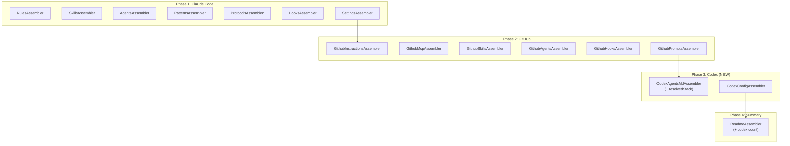

# História: Pipeline + ReadmeAssembler Update

**ID:** STORY-024

## 1. Dependências

| Blocked By | Blocks |
| :--- | :--- |
| STORY-022, STORY-023, EPIC-001/STORY-016 | STORY-025 |

## 2. Regras Transversais Aplicáveis

| ID | Título |
| :--- | :--- |
| RULE-105 | Impacto zero no output existente |
| RULE-106 | Padrão de extensão do pipeline |
| RULE-108 | Contexto estendido para AGENTS.md |
| RULE-111 | Atualização do ReadmeAssembler |

## 3. Descrição

Como **desenvolvedor do ia-dev-environment**, eu quero que os novos assemblers Codex estejam integrados no pipeline de geração e que o ReadmeAssembler reflita os artefatos Codex no resumo, garantindo que a geração completa inclua `.codex/` sem alterar `.claude/` ou `.github/`.

Esta história faz 2 modificações cirúrgicas em módulos existentes:

1. **Pipeline Orchestrator** (`src/assembler/index.ts` ou módulo equivalente) — Adiciona `CodexAgentsMdAssembler` (posição 14) e `CodexConfigAssembler` (posição 15) na lista ordenada de assemblers, antes do ReadmeAssembler. Passa `resolvedStack` ao CodexAgentsMdAssembler.

2. **ReadmeAssembler** (`src/assembler/readme-assembler.ts`) — Atualiza contagem e tabelas para incluir artefatos Codex:
   - Conta arquivos em `.codex/` (AGENTS.md + config.toml = 2)
   - Adiciona seção Codex na tabela de mapping (.claude ↔ .github ↔ .codex)
   - Inclui linha Codex na tabela de Generation Summary

### 3.1 Módulos Modificados

- `src/assembler/index.ts` (ou pipeline orchestrator equivalente)
- `src/assembler/readme-assembler.ts`
- `resources/readme-template.md` (adicionar placeholder `{{CODEX_COUNT}}` e seção Codex)

### 3.2 Pipeline — Nova Ordem (16 Assemblers)

```
 1. RulesAssembler
 2. SkillsAssembler
 3. AgentsAssembler
 4. PatternsAssembler
 5. ProtocolsAssembler
 6. HooksAssembler
 7. SettingsAssembler
 8. GithubInstructionsAssembler
 9. GithubMcpAssembler
10. GithubSkillsAssembler
11. GithubAgentsAssembler
12. GithubHooksAssembler
13. GithubPromptsAssembler
14. CodexAgentsMdAssembler      ← NOVO
15. CodexConfigAssembler         ← NOVO
16. ReadmeAssembler              ← ATUALIZADO
```

### 3.3 Passagem de ResolvedStack

O `CodexAgentsMdAssembler` precisa do `ResolvedStack` (RULE-108). O pipeline deve:
- Resolver o stack antes de iniciar os assemblers (já faz isso)
- Passar `resolvedStack` como parâmetro adicional ao `CodexAgentsMdAssembler`
- Outros assemblers não recebem este parâmetro (compatibilidade)

### 3.4 ReadmeAssembler — Alterações

**Contagem de artefatos Codex:**
- Escanear `{outputDir}/.codex/` e contar arquivos
- Adicionar `codex_count` ao context de renderização

**Tabela de mapping atualizada:**

| .claude/ | .github/ | .codex/ | Notes |
|----------|----------|---------|-------|
| Rules | Instructions | Seções AGENTS.md | Rules → seções consolidadas |
| Skills | Skills | Referência AGENTS.md | Skills listadas no AGENTS.md |
| Agents | Agents | Agent Personas AGENTS.md | Agents como seção |
| Settings | N/A | config.toml | Permissions → approval policy |
| Hooks | Hooks | Referência AGENTS.md | Hooks influenciam approval_policy |

**Generation Summary atualizada:**
- Adicionar linhas: `AGENTS.md (.codex)`, `config.toml (.codex)`

### 3.5 Template readme-template.md — Alterações

Adicionar novos placeholders ao template:
- `{{CODEX_MAPPING_TABLE}}` — Tabela de mapping .codex
- `{{CODEX_SUMMARY}}` — Contagem na seção de Generation Summary

## 4. Definições de Qualidade Locais

### DoR Local (Definition of Ready)

- [ ] CodexAgentsMdAssembler (STORY-022) implementado e testado
- [ ] CodexConfigAssembler (STORY-023) implementado e testado
- [ ] Pipeline Orchestrator (EPIC-001/STORY-016) funcional
- [ ] ReadmeAssembler (EPIC-001/STORY-015) funcional
- [ ] Output completo de pipeline existente disponível para testes de regressão

### DoD Local (Definition of Done)

- [ ] Pipeline executa 16 assemblers na ordem correta
- [ ] CodexAgentsMdAssembler recebe resolvedStack
- [ ] CodexConfigAssembler integrado sem parâmetros adicionais
- [ ] ReadmeAssembler conta artefatos Codex
- [ ] Tabela de mapping inclui coluna .codex/
- [ ] Generation Summary inclui contagem Codex
- [ ] Output `.claude/` e `.github/` byte-for-byte idêntico ao anterior (RULE-105)
- [ ] readme-template.md atualizado com novos placeholders

### Global Definition of Done (DoD)

- **Cobertura:** ≥ 95% Line Coverage, ≥ 90% Branch Coverage
- **Testes Automatizados:** Unitários + testes de regressão do pipeline completo
- **Relatório de Cobertura:** vitest coverage lcov + text
- **Documentação:** JSDoc atualizado nos módulos modificados
- **Persistência:** N/A
- **Performance:** ≤ 2× tempo do pipeline anterior

## 5. Contratos de Dados (Data Contract)

**Pipeline — Assembler list atualizada:**

| Posição | Assembler | Parâmetros Especiais |
| :--- | :--- | :--- |
| 1-13 | (inalterados) | — |
| 14 | CodexAgentsMdAssembler | `resolvedStack: ResolvedStack` |
| 15 | CodexConfigAssembler | — |
| 16 | ReadmeAssembler | — |

**ReadmeAssembler — Novos campos de context:**

| Campo | Tipo | Obrigatório | Descrição |
| :--- | :--- | :--- | :--- |
| `codex_count` | number | M | Número de artefatos em .codex/ |
| `codex_mapping_table` | string | M | Tabela Markdown de mapping .codex |
| `codex_summary` | string | M | Linhas de sumário para .codex |

## 6. Diagramas

### 6.1 Pipeline Expandido



## 7. Critérios de Aceite (Gherkin)

```gherkin
Cenario: Pipeline executa 16 assemblers na ordem correta
  DADO que tenho um config válido e resourcesDir
  QUANDO executo runPipeline
  ENTÃO os 16 assemblers são executados na ordem: Rules, Skills, Agents, Patterns, Protocols, Hooks, Settings, GithubInstructions, GithubMcp, GithubSkills, GithubAgents, GithubHooks, GithubPrompts, CodexAgentsMd, CodexConfig, Readme
  E PipelineResult.success é true

Cenario: CodexAgentsMdAssembler recebe resolvedStack
  DADO que o pipeline resolve o stack antes da execução
  QUANDO CodexAgentsMdAssembler é invocado
  ENTÃO o parâmetro resolvedStack contém build_cmd, test_cmd, compile_cmd, coverage_cmd

Cenario: ReadmeAssembler inclui contagem Codex
  DADO que o pipeline gerou .codex/AGENTS.md e .codex/config.toml
  QUANDO ReadmeAssembler é executado
  ENTÃO o README.md contém "AGENTS.md (.codex)" e "config.toml (.codex)" na seção Generation Summary

Cenario: Tabela de mapping inclui .codex
  DADO que o pipeline gerou artefatos .claude/, .github/ e .codex/
  QUANDO ReadmeAssembler gera a tabela de mapping
  ENTÃO a tabela inclui coluna .codex/ com equivalências

Cenario: Output .claude/ e .github/ inalterado
  DADO que tenho um snapshot do output anterior (sem Codex)
  QUANDO executo o pipeline com os 16 assemblers
  ENTÃO os arquivos em .claude/ e .github/ são byte-for-byte idênticos ao snapshot
  E novos arquivos existem apenas em .codex/

Cenario: PipelineResult inclui arquivos Codex
  DADO que executo o pipeline completo
  QUANDO verifico PipelineResult.filesGenerated
  ENTÃO a lista contém ".codex/AGENTS.md" e ".codex/config.toml"
```

## 8. Sub-tarefas

- [ ] [Dev] Adicionar CodexAgentsMdAssembler na posição 14 do pipeline
- [ ] [Dev] Adicionar CodexConfigAssembler na posição 15 do pipeline
- [ ] [Dev] Passar resolvedStack ao CodexAgentsMdAssembler
- [ ] [Dev] Atualizar ReadmeAssembler — contagem de artefatos .codex/
- [ ] [Dev] Atualizar ReadmeAssembler — tabela de mapping com .codex/
- [ ] [Dev] Atualizar ReadmeAssembler — Generation Summary com Codex
- [ ] [Dev] Atualizar `resources/readme-template.md` com novos placeholders
- [ ] [Test] Unitário: pipeline executa 16 assemblers na ordem correta
- [ ] [Test] Unitário: ReadmeAssembler conta artefatos Codex
- [ ] [Test] Regressão: output .claude/ e .github/ inalterado
- [ ] [Test] Integração: pipeline completo gera .codex/ corretamente
