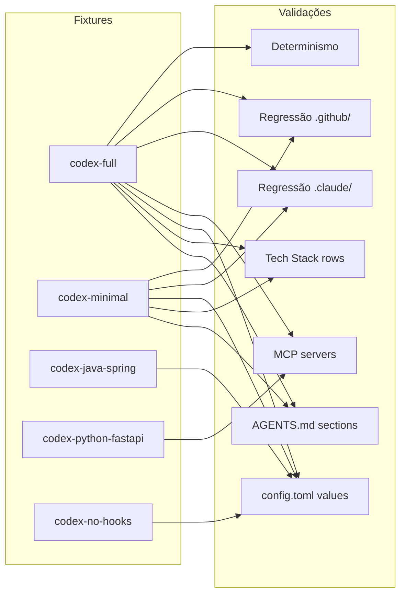

# História: Testes de Integração Codex

**ID:** STORY-025

## 1. Dependências

| Blocked By | Blocks |
| :--- | :--- |
| STORY-024 | — |

## 2. Regras Transversais Aplicáveis

| ID | Título |
| :--- | :--- |
| RULE-101 | Consolidação AGENTS.md |
| RULE-102 | Seções condicionais |
| RULE-103 | Derivação determinística do config.toml |
| RULE-105 | Impacto zero no output existente |
| RULE-109 | Feature gating Codex |

## 3. Descrição

Como **desenvolvedor do ia-dev-environment**, eu quero ter um conjunto abrangente de testes de integração que validem a geração end-to-end de artefatos Codex com múltiplas configurações, garantindo que o output é correto, determinístico e não impacta artefatos existentes.

Esta história é o checkpoint de validação final do EPIC-002. Ela executa o pipeline completo com configs diversificadas e valida:
1. **Conteúdo do AGENTS.md** — Seções presentes/ausentes conforme config
2. **Conteúdo do config.toml** — Valores derivados corretamente
3. **Regressão** — Output `.claude/` e `.github/` inalterado
4. **Determinismo** — Mesma config produz mesmo output em execuções repetidas
5. **Edge cases** — Configs mínimos, sem MCP, sem hooks, sem domain, etc.

### 3.1 Módulos de Teste

- `tests/assembler/codex-agents-md-assembler.test.ts` — Testes unitários do assembler
- `tests/assembler/codex-config-assembler.test.ts` — Testes unitários do assembler
- `tests/integration/codex-generation.test.ts` — Testes de integração end-to-end
- `tests/integration/codex-regression.test.ts` — Testes de regressão (output existente inalterado)

### 3.2 Fixtures de Configuração

| Fixture | Características |
| :--- | :--- |
| `codex-full.yaml` | Config completo: TypeScript + NestJS, DDD=true, PostgreSQL, Redis, security frameworks, MCP servers, todos os hooks |
| `codex-minimal.yaml` | Config mínimo: TypeScript + Commander (CLI), DDD=false, sem DB, sem cache, sem security, sem MCP |
| `codex-java-spring.yaml` | Java + Spring Boot, microservice, PostgreSQL, sem MCP, com hooks |
| `codex-python-fastapi.yaml` | Python + FastAPI, REST API, MongoDB, com MCP, sem hooks |
| `codex-no-hooks.yaml` | Config sem hooks — valida approval_policy = "untrusted" |

### 3.3 Validações por Fixture

**Para `codex-full.yaml`:**
- AGENTS.md contém TODAS as seções (incluindo Domain e Security)
- Tech Stack contém Database, Cache, Orchestrator
- Skills e Agents listados corretamente
- config.toml: approval_policy = "on-request", MCP servers presentes

**Para `codex-minimal.yaml`:**
- AGENTS.md NÃO contém seções Domain e Security
- Tech Stack omite Database, Cache (são "none")
- config.toml: approval_policy = "untrusted", sem MCP

**Para todas as fixtures:**
- Output `.claude/` e `.github/` idêntico ao gerado sem Codex assemblers
- AGENTS.md é Markdown válido
- config.toml é TOML válido (parseável)
- Execução repetida produz output idêntico (determinismo)

### 3.4 Estratégia de Regressão

1. Executar pipeline SEM Codex assemblers → salvar snapshot de `.claude/` e `.github/`
2. Executar pipeline COM Codex assemblers → comparar `.claude/` e `.github/` com snapshot
3. Diferença deve ser ZERO bytes

## 4. Definições de Qualidade Locais

### DoR Local (Definition of Ready)

- [ ] Pipeline com 16 assemblers (STORY-024) funcional
- [ ] Todos os assemblers Codex passando testes unitários
- [ ] Fixtures YAML preparadas com configs diversas
- [ ] Snapshot de referência gerado para testes de regressão

### DoD Local (Definition of Done)

- [ ] 5+ fixtures de configuração cobrindo cenários diversos
- [ ] Testes de integração validando conteúdo de AGENTS.md por fixture
- [ ] Testes de integração validando conteúdo de config.toml por fixture
- [ ] Testes de regressão confirmando zero impacto em .claude/ e .github/
- [ ] Testes de determinismo (2 execuções → mesmo output)
- [ ] Cobertura combinada de todos os módulos Codex ≥ 95% line, ≥ 90% branch

### Global Definition of Done (DoD)

- **Cobertura:** ≥ 95% Line Coverage, ≥ 90% Branch Coverage
- **Testes Automatizados:** Integração end-to-end + regressão + determinismo
- **Relatório de Cobertura:** vitest coverage lcov + text, granularidade por arquivo
- **Documentação:** JSDoc em helpers de teste
- **Persistência:** N/A
- **Performance:** Pipeline completo ≤ 2× tempo anterior

## 5. Contratos de Dados (Data Contract)

**Fixture YAML — Estrutura mínima para testes Codex:**

| Campo | Tipo | Obrigatório | Descrição |
| :--- | :--- | :--- | :--- |
| `project.name` | string | M | Nome do projeto |
| `project.purpose` | string | M | Propósito |
| `language.name` | string | M | Linguagem |
| `language.version` | string | M | Versão |
| `framework.name` | string | M | Framework |
| `architecture.style` | string | M | Estilo arquitetural |
| `architecture.domain_driven` | boolean | M | DDD habilitado |
| `data.database.name` | string | M | Database (ou "none") |
| `data.cache.name` | string | M | Cache (ou "none") |
| `security.frameworks` | string[] | O | Frameworks de segurança |
| `mcp.servers` | McpServerConfig[] | O | MCP servers |

**Assertion helpers:**

| Helper | Assinatura | Descrição |
| :--- | :--- | :--- |
| `assertAgentsMdContains` | `(content: string, section: string) → void` | Verifica presença de seção |
| `assertAgentsMdNotContains` | `(content: string, section: string) → void` | Verifica ausência de seção |
| `assertValidToml` | `(content: string) → Record<string, unknown>` | Parseia e retorna TOML |
| `assertDirsIdentical` | `(dir1: string, dir2: string) → void` | Compara diretórios recursivamente |

## 6. Diagramas

### 6.1 Matriz de Cobertura por Fixture



## 7. Critérios de Aceite (Gherkin)

```gherkin
Cenario: Pipeline completo com config full gera todos os artefatos Codex
  DADO que tenho a fixture codex-full.yaml com DDD=true e MCP servers
  QUANDO executo o pipeline completo com 16 assemblers
  ENTÃO .codex/AGENTS.md é gerado com seções Domain e Security
  E .codex/config.toml contém [mcp_servers] com servers configurados
  E PipelineResult.filesGenerated inclui ".codex/AGENTS.md" e ".codex/config.toml"

Cenario: Pipeline com config minimal omite seções condicionais
  DADO que tenho a fixture codex-minimal.yaml sem DDD e sem security
  QUANDO executo o pipeline completo
  ENTÃO .codex/AGENTS.md NÃO contém seção "## Domain"
  E .codex/AGENTS.md NÃO contém seção "## Security"
  E .codex/config.toml NÃO contém [mcp_servers]

Cenario: Regressão — output .claude/ e .github/ inalterado
  DADO que tenho um snapshot do output gerado SEM assemblers Codex
  QUANDO executo o pipeline COM assemblers Codex usando a mesma config
  ENTÃO todos os arquivos em .claude/ são byte-for-byte idênticos ao snapshot
  E todos os arquivos em .github/ são byte-for-byte idênticos ao snapshot

Cenario: Determinismo — execuções repetidas produzem mesmo output
  DADO que tenho a fixture codex-full.yaml
  QUANDO executo o pipeline 2 vezes consecutivas
  ENTÃO o output de .codex/ é idêntico em ambas execuções

Cenario: config.toml respeita feature gating de hooks
  DADO que tenho a fixture codex-no-hooks.yaml sem hooks
  QUANDO executo o pipeline completo
  ENTÃO .codex/config.toml contém approval_policy = "untrusted"

Cenario: AGENTS.md inclui commands do ResolvedStack
  DADO que tenho a fixture codex-java-spring.yaml com Java + Spring
  QUANDO executo o pipeline completo
  ENTÃO .codex/AGENTS.md contém tabela de Build & Test Commands
  E a tabela contém "mvn compile" ou comando equivalente do stack Java/Spring

Cenario: Cobertura combinada dos módulos Codex atinge thresholds
  DADO que executo todos os testes unitários e de integração Codex
  QUANDO o relatório de cobertura é gerado
  ENTÃO line coverage ≥ 95%
  E branch coverage ≥ 90%
```

## 8. Sub-tarefas

- [ ] [Dev] Criar fixture `codex-full.yaml` com config completo
- [ ] [Dev] Criar fixture `codex-minimal.yaml` com config mínimo
- [ ] [Dev] Criar fixture `codex-java-spring.yaml`
- [ ] [Dev] Criar fixture `codex-python-fastapi.yaml`
- [ ] [Dev] Criar fixture `codex-no-hooks.yaml`
- [ ] [Dev] Implementar assertion helpers (assertAgentsMdContains, assertValidToml, assertDirsIdentical)
- [ ] [Test] Integração: pipeline completo com codex-full.yaml
- [ ] [Test] Integração: pipeline completo com codex-minimal.yaml
- [ ] [Test] Integração: pipeline com cada fixture restante
- [ ] [Test] Regressão: snapshot comparison para .claude/ e .github/
- [ ] [Test] Determinismo: 2 execuções → output idêntico
- [ ] [Test] Validação: AGENTS.md é Markdown válido para todas as fixtures
- [ ] [Test] Validação: config.toml é TOML parseável para todas as fixtures
- [ ] [Doc] Documentar fixtures e estratégia de testes no README de testes
