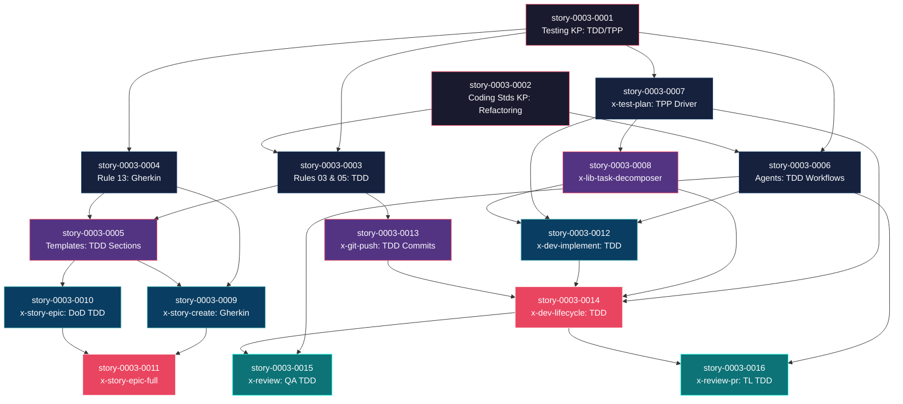

# Mapa de Implementação — Migração do Ciclo de Desenvolvimento para TDD

**Gerado a partir das dependências BlockedBy/Blocks de cada história do epic-0003.**

---

## 1. Matriz de Dependências

| Story | Título | Blocked By | Blocks | Status |
| :--- | :--- | :--- | :--- | :--- |
| story-0003-0001 | Testing KP — TDD Workflow & TPP | — | 0003, 0004, 0006, 0007 | Pendente |
| story-0003-0002 | Coding Standards KP — Refactoring Guidelines | — | 0003, 0006 | Pendente |
| story-0003-0003 | Rules 03 & 05 — TDD Practices & Compliance | 0001, 0002 | 0005, 0013 | Pendente |
| story-0003-0004 | Rule 13 — Gherkin Enriquecido | 0001 | 0005, 0009 | Pendente |
| story-0003-0005 | Templates — Seções TDD | 0003, 0004 | 0009, 0010 | Pendente |
| story-0003-0006 | Agents — TDD Workflows (Dev, QA, TL) | 0001, 0002 | 0012, 0015, 0016 | Pendente |
| story-0003-0007 | x-test-plan — Driver com TPP | 0001 | 0008, 0012, 0014 | Pendente |
| story-0003-0008 | x-lib-task-decomposer — Tasks de Cenários | 0007 | 0012, 0014 | Pendente |
| story-0003-0009 | x-story-create — Gherkin Enriquecido | 0004, 0005 | 0011 | Pendente |
| story-0003-0010 | x-story-epic — DoD com TDD | 0005 | 0011 | Pendente |
| story-0003-0011 | x-story-epic-full — Propagação TDD | 0009, 0010 | — | Pendente |
| story-0003-0012 | x-dev-implement — Red-Green-Refactor | 0006, 0007, 0008 | 0014 | Pendente |
| story-0003-0013 | x-git-push — Commits Atômicos TDD | 0003 | 0014 | Pendente |
| story-0003-0014 | x-dev-lifecycle — Fases TDD | 0007, 0008, 0012, 0013 | 0015, 0016 | Pendente |
| story-0003-0015 | x-review — Checklist TDD QA | 0006, 0014 | — | Pendente |
| story-0003-0016 | x-review-pr — Rubric TDD Tech Lead | 0006, 0014 | — | Pendente |

> **Nota:** As dependências são estritamente entre recursos de template/skill. Não há dependências de banco de dados, APIs ou infraestrutura. Todas as mudanças são em arquivos Markdown dentro de `resources/`.

---

## 2. Fases de Implementação

> As histórias são agrupadas em fases. Dentro de cada fase, as histórias podem ser implementadas **em paralelo**. Uma fase só pode iniciar quando todas as dependências das fases anteriores estiverem concluídas.

```
╔══════════════════════════════════════════════════════════════════════════╗
║                FASE 0 — Foundation: Knowledge Packs (paralelo)         ║
║                                                                        ║
║   ┌───────────────────────────┐   ┌───────────────────────────┐        ║
║   │  story-0003-0001          │   │  story-0003-0002          │        ║
║   │  Testing KP: TDD/TPP     │   │  Coding Stds KP: Refactor │        ║
║   └─────────┬─────────────────┘   └─────────┬─────────────────┘        ║
╚═════════════╪═══════════════════════════════╪══════════════════════════╝
              │                               │
              ▼                               ▼
╔══════════════════════════════════════════════════════════════════════════╗
║           FASE 1 — Rules, Agents & Core Skill (paralelo: 4)           ║
║                                                                        ║
║  ┌────────────────┐ ┌────────────────┐ ┌────────────────┐ ┌──────────┐║
║  │ story-0003-0003│ │ story-0003-0004│ │ story-0003-0006│ │story-0007│║
║  │ Rules 03 & 05  │ │ Rule 13        │ │ Agents (3)     │ │x-test-   │║
║  │ (← 0001, 0002) │ │ (← 0001)      │ │ (← 0001, 0002) │ │plan TPP  │║
║  └───────┬────────┘ └───────┬────────┘ └───────┬────────┘ │(← 0001)  │║
║          │                  │                  │          └────┬─────┘║
╚══════════╪══════════════════╪══════════════════╪══════════════╪═══════╝
           │                  │                  │              │
           ▼                  ▼                  │              ▼
╔══════════════════════════════════════════════════════════════════════════╗
║              FASE 2 — Templates, Decomposer & Git (paralelo: 3)       ║
║                                                                        ║
║  ┌────────────────────┐  ┌────────────────────┐  ┌──────────────────┐  ║
║  │  story-0003-0005   │  │  story-0003-0008   │  │  story-0003-0013 │  ║
║  │  Templates TDD     │  │  Task Decomposer   │  │  x-git-push TDD  │  ║
║  │  (← 0003, 0004)    │  │  (← 0007)          │  │  (← 0003)        │  ║
║  └────────┬───────────┘  └────────┬───────────┘  └────────┬─────────┘  ║
╚═══════════╪═══════════════════════╪═══════════════════════╪════════════╝
            │                       │                       │
            ▼                       ▼                       │
╔══════════════════════════════════════════════════════════════════════════╗
║             FASE 3 — Story Skills & Dev Implement (paralelo: 3)       ║
║                                                                        ║
║  ┌────────────────────┐  ┌────────────────────┐  ┌──────────────────┐  ║
║  │  story-0003-0009   │  │  story-0003-0010   │  │  story-0003-0012 │  ║
║  │  x-story-create    │  │  x-story-epic      │  │  x-dev-implement │  ║
║  │  (← 0004, 0005)    │  │  (← 0005)          │  │  (← 0006, 0007, │  ║
║  │                    │  │                    │  │     0008)         │  ║
║  └────────┬───────────┘  └────────┬───────────┘  └────────┬─────────┘  ║
╚═══════════╪═══════════════════════╪═══════════════════════╪════════════╝
            │                       │                       │
            ▼                       ▼                       ▼
╔══════════════════════════════════════════════════════════════════════════╗
║              FASE 4 — Orchestrators & Lifecycle (paralelo: 2)         ║
║                                                                        ║
║  ┌────────────────────────────┐  ┌───────────────────────────────────┐  ║
║  │  story-0003-0011           │  │  story-0003-0014                  │  ║
║  │  x-story-epic-full         │  │  x-dev-lifecycle                  │  ║
║  │  (← 0009, 0010)            │  │  (← 0007, 0008, 0012, 0013)      │  ║
║  └────────────────────────────┘  └───────────────┬───────────────────┘  ║
╚══════════════════════════════════════════════════╪══════════════════════╝
                                                   │
                                                   ▼
╔══════════════════════════════════════════════════════════════════════════╗
║                    FASE 5 — Reviews (paralelo: 2)                     ║
║                                                                        ║
║  ┌────────────────────────────┐  ┌───────────────────────────────────┐  ║
║  │  story-0003-0015           │  │  story-0003-0016                  │  ║
║  │  x-review — QA TDD         │  │  x-review-pr — Tech Lead TDD     │  ║
║  │  (← 0006, 0014)            │  │  (← 0006, 0014)                  │  ║
║  └────────────────────────────┘  └───────────────────────────────────┘  ║
╚══════════════════════════════════════════════════════════════════════════╝
```

---

## 3. Caminho Crítico

> O caminho crítico (a sequência mais longa de dependências) determina o tempo mínimo de implementação do projeto.

```
story-0003-0001 ──→ story-0003-0007 ──→ story-0003-0008 ──→ story-0003-0012 ──→ story-0003-0014 ──→ story-0003-0015
  (Testing KP)       (x-test-plan)       (Task Decomp.)      (x-dev-impl)        (x-dev-lifecycle)    (x-review)
    Fase 0              Fase 1              Fase 2              Fase 3              Fase 4              Fase 5
```

**6 fases no caminho crítico, 6 histórias na cadeia mais longa (0001 → 0007 → 0008 → 0012 → 0014 → 0015).**

Qualquer atraso em uma história do caminho crítico impacta diretamente o prazo final do
projeto. As histórias fora do caminho crítico (stories 0002, 0003, 0004, 0005, 0006,
0009, 0010, 0011, 0013, 0016) possuem folga e podem absorver atrasos moderados sem
impacto no prazo.

---

## 4. Grafo de Dependências (Mermaid)



---

## 5. Resumo por Fase

| Fase | Histórias | Camada | Paralelismo | Pré-requisito |
| :--- | :--- | :--- | :--- | :--- |
| 0 | story-0003-0001, story-0003-0002 | Foundation (KPs) | 2 paralelas | — |
| 1 | story-0003-0003, story-0003-0004, story-0003-0006, story-0003-0007 | Rules, Agents, Core Skill | 4 paralelas | Fase 0 concluída |
| 2 | story-0003-0005, story-0003-0008, story-0003-0013 | Templates, Decomposer, Git | 3 paralelas | Fase 1 concluída |
| 3 | story-0003-0009, story-0003-0010, story-0003-0012 | Story Skills, Dev Implement | 3 paralelas | Fase 2 concluída |
| 4 | story-0003-0011, story-0003-0014 | Orchestrators, Lifecycle | 2 paralelas | Fase 3 concluída |
| 5 | story-0003-0015, story-0003-0016 | Reviews | 2 paralelas | Fase 4 concluída |

**Total: 16 histórias em 6 fases.**

> **Nota:** Todas as fases oferecem oportunidade de paralelismo (2-4 stories simultâneas). A fase de maior paralelismo é a Fase 1 com 4 stories independentes.

---

## 6. Detalhamento por Fase

### Fase 0 — Foundation: Knowledge Packs

| Story | Escopo Principal | Artefatos Chave |
| :--- | :--- | :--- |
| story-0003-0001 | Adicionar TDD Workflow, Double-Loop TDD, TPP ao Testing KP | `resources/skills-templates/core/testing/references/testing-philosophy.md`, `resources/github-skills-templates/testing/references/` |
| story-0003-0002 | Adicionar Refactoring Guidelines ao Coding Standards KP | `resources/skills-templates/core/coding-standards/references/clean-code.md`, `resources/github-skills-templates/coding-standards/references/` |

**Entregas da Fase 0:**

- Testing KP com seções TDD Workflow, Double-Loop, TPP, Scenario Ordering
- Coding Standards KP com seção Refactoring Guidelines (triggers, técnicas, safety rules)
- Base conceitual para todas as stories subsequentes

### Fase 1 — Rules, Agents & Core Skill

| Story | Escopo Principal | Artefatos Chave |
| :--- | :--- | :--- |
| story-0003-0003 | TDD Practices em Rule 03 + TDD Compliance em Rule 05 | `resources/core/01-clean-code.md`, `resources/rules-templates/03-*`, `resources/rules-templates/05-*` |
| story-0003-0004 | Gherkin Enriquecido na Rule 13 (SD-02, SD-05) | `resources/core/13-story-decomposition.md` |
| story-0003-0006 | TDD Workflows para typescript-developer, qa-engineer, tech-lead | `resources/github-agents-templates/{developers,core}/` |
| story-0003-0007 | x-test-plan promovido a driver com TPP ordering e Double-Loop | `resources/skills-templates/core/x-test-plan/SKILL.md`, `resources/github-skills-templates/testing/x-test-plan/SKILL.md` |

**Entregas da Fase 1:**

- Rules 03 e 05 com seções TDD mandatórias (carregadas em toda conversa)
- Rule 13 com requisitos de Gherkin completeness (degenerate, boundary, error)
- 3 agents atualizados com TDD workflows e checklists
- x-test-plan como driver de implementação com TPP ordering

### Fase 2 — Templates, Decomposer & Git

| Story | Escopo Principal | Artefatos Chave |
| :--- | :--- | :--- |
| story-0003-0005 | Seções TDD em _TEMPLATE-STORY.md e _TEMPLATE-EPIC.md | `resources/templates/_TEMPLATE-STORY.md`, `resources/templates/_TEMPLATE-EPIC.md` |
| story-0003-0008 | Task decomposer derivando tasks de cenários de teste (não layers) | `resources/skills-templates/core/lib/x-lib-task-decomposer/SKILL.md` |
| story-0003-0013 | Commits atômicos por ciclo TDD no x-git-push | `resources/skills-templates/core/x-git-push/SKILL.md` |

**Entregas da Fase 2:**

- Templates de story e epic com seções TDD embutidas
- Task decomposer operando em modo test-driven (scenario → task)
- Git operations com suporte a atomic TDD commits

### Fase 3 — Story Skills & Dev Implement

| Story | Escopo Principal | Artefatos Chave |
| :--- | :--- | :--- |
| story-0003-0009 | x-story-create gerando Gherkin com categorias obrigatórias | `resources/skills-templates/core/x-story-create/SKILL.md` |
| story-0003-0010 | x-story-epic gerando DoD com TDD Compliance | `resources/skills-templates/core/x-story-epic/SKILL.md` |
| story-0003-0012 | x-dev-implement com Red-Green-Refactor loop | `resources/skills-templates/core/x-dev-implement/SKILL.md` |

**Entregas da Fase 3:**

- Story creation com Gherkin enriquecido (degenerate, boundary, error)
- Epic creation com DoD TDD automático
- Implementation skill com TDD loop nativo

### Fase 4 — Orchestrators & Lifecycle

| Story | Escopo Principal | Artefatos Chave |
| :--- | :--- | :--- |
| story-0003-0011 | x-story-epic-full propagando mudanças TDD | `resources/skills-templates/core/x-story-epic-full/SKILL.md` |
| story-0003-0014 | x-dev-lifecycle com 8 fases reestruturadas para TDD | `resources/skills-templates/core/x-dev-lifecycle/SKILL.md` |

**Entregas da Fase 4:**

- Decomposição completa (epic + stories + map) com DNA TDD
- Lifecycle completo operando em modo TDD (Phase 2 = Red-Green-Refactor)

### Fase 5 — Reviews

| Story | Escopo Principal | Artefatos Chave |
| :--- | :--- | :--- |
| story-0003-0015 | x-review com checklist TDD para QA Engineer (6 items) | `resources/skills-templates/core/x-review/SKILL.md` |
| story-0003-0016 | x-review-pr com critérios TDD no rubric (5-6 items) | `resources/skills-templates/core/x-review-pr/SKILL.md` |

**Entregas da Fase 5:**

- QA review validando TDD compliance (30 pontos: 24 originais + 6 TDD)
- Tech Lead review validando TDD process (46 pontos: 40 originais + 6 TDD)

---

## 7. Observações Estratégicas

### Gargalo Principal

**story-0003-0001 (Testing KP)** é o gargalo raiz — bloqueia diretamente 4 stories
(0003, 0004, 0006, 0007) e indiretamente TODAS as demais. Deve ser a primeira story
implementada e receber prioridade máxima. Investir tempo extra na qualidade desta story
compensa porque define a base conceitual de todo o épico.

**story-0003-0014 (x-dev-lifecycle)** é o gargalo do caminho crítico na Fase 4 —
bloqueia as duas stories de review (0015 e 0016). Tem 4 dependências diretas, o que
limita quando pode começar. Alocar o desenvolvedor mais experiente para esta story.

### Histórias Folha (sem dependentes)

- **story-0003-0011** (x-story-epic-full) — sem dependentes, pode absorver atrasos
- **story-0003-0015** (x-review QA) — folha, não bloqueia nada
- **story-0003-0016** (x-review-pr TL) — folha, não bloqueia nada

Estas 3 stories são candidatas a receber menor prioridade em caso de restrição de
recursos. story-0003-0011 em particular é a menos crítica (orquestrador que apenas
propaga mudanças dos sub-skills).

### Otimização de Tempo

- **Máximo paralelismo na Fase 1**: 4 stories podem rodar simultaneamente (0003, 0004, 0006, 0007). Alocar 4 desenvolvedores nesta fase maximiza throughput.
- **Início imediato**: stories 0001 e 0002 podem começar imediatamente sem nenhum pré-requisito.
- **Alocação ideal**: 2 desenvolvedores para Fase 0 (cada um com um KP), 4 para Fase 1, 3 para Fases 2 e 3, 2 para Fases 4 e 5.
- **Fase 4 é o funil**: apenas 2 stories, uma das quais (0014) é a mais complexa do épico. Considerar pair programming para 0014.

### Dependências Cruzadas

- **story-0003-0006 (Agents)** é a ponte entre dois ramos do DAG: depende de 0001 e 0002 (Fase 0), e bloqueia 0012, 0015, 0016 em fases diferentes (3, 5, 5). É o ponto de convergência que conecta o ramo "conceitual" (KPs → Rules → Templates) com o ramo "operacional" (Agents → Implement → Lifecycle → Reviews).

- **story-0003-0014 (x-dev-lifecycle)** converge 4 ramos: test plan (0007), task decomposer (0008), dev implement (0012), git push (0013). É o ponto de integração mais complexo do projeto.

### Marco de Validação Arquitetural

**story-0003-0007 (x-test-plan — Promoção a Driver com TPP)** serve como o checkpoint
de validação arquitetural. Quando esta story está concluída, valida que:

1. O conceito de TPP ordering funciona na prática (produz output útil)
2. O formato Double-Loop (AT + UT) é consumível pelo task decomposer
3. A promoção de "documentação" para "driver" é viável
4. O test plan serve como roadmap real de implementação

Se esta story apresentar problemas, o impacto cascateia para 0008, 0012, 0014, 0015, 0016 — reconsiderar a abordagem antes de prosseguir.
