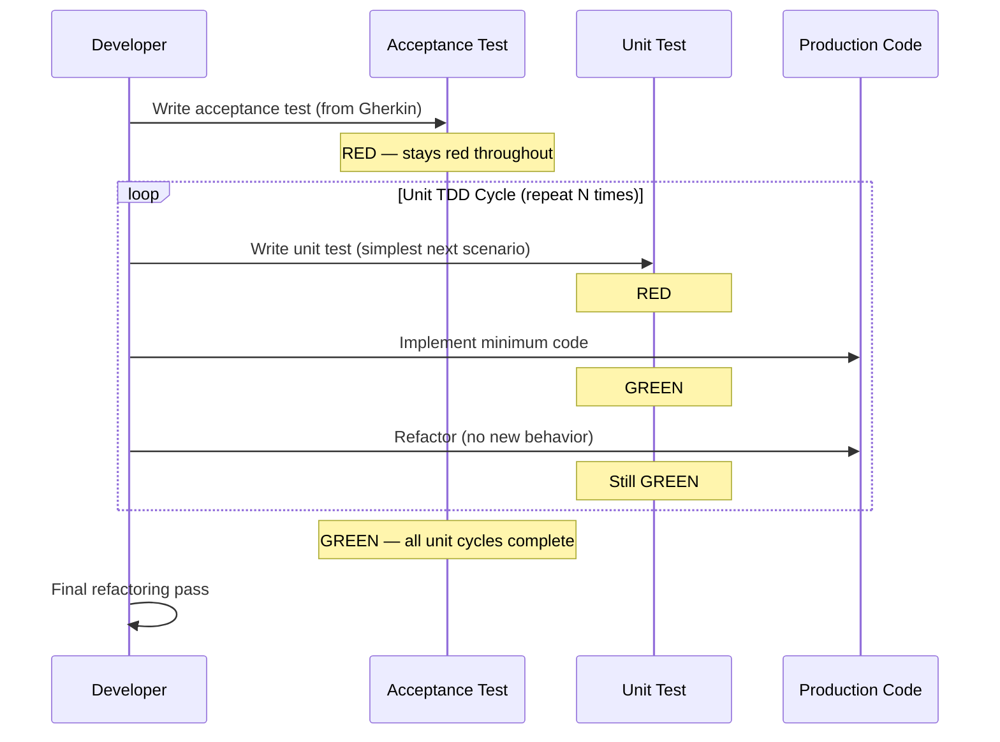

# História: Testing KP — TDD Workflow & Transformation Priority Premise

**ID:** story-0003-0001

## 1. Dependências

| Blocked By | Blocks |
| :--- | :--- |
| — | story-0003-0003, story-0003-0004, story-0003-0006, story-0003-0007 |

## 2. Regras Transversais Aplicáveis

| ID | Título |
| :--- | :--- |
| RULE-001 | Dual Copy Consistency |
| RULE-002 | Source of Truth é resources/ |
| RULE-003 | Backward Compatibility |
| RULE-005 | Red-Green-Refactor Cycle |
| RULE-006 | Transformation Priority Premise (TPP) |
| RULE-007 | Double-Loop TDD |
| RULE-012 | Generated Content Language |

## 3. Descrição

Como **Architect**, eu quero que o Testing Knowledge Pack contenha a metodologia TDD
completa (Red-Green-Refactor, Double-Loop TDD e Transformation Priority Premise),
garantindo que todos os agents e skills que referenciam este KP tenham acesso a
definições autoritativas de TDD.

Este é o story mais fundamental do épico: define os conceitos que todas as outras
mudanças referenciam. O Testing KP é referenciado por x-test-plan, x-dev-implement,
x-dev-lifecycle, qa-engineer agent e todos os skills de review. Sem esta base
conceitual, as outras stories não têm vocabulário nem critérios para implementar TDD.

A mudança é aditiva — as seções existentes do Testing KP (8 categorias de teste,
fixture patterns, async handling, DB strategy) permanecem intactas. Novas seções
são adicionadas ao final do reference file `testing-philosophy.md`.

### 3.1 TDD Workflow (Red-Green-Refactor)

- Definir o ciclo Red-Green-Refactor com 3 fases explícitas:
  - **RED**: Escrever UM teste que falha. O teste deve ser o mais simples possível.
  - **GREEN**: Implementar o código MÍNIMO para o teste passar. Sem otimizações, sem generalização.
  - **REFACTOR**: Melhorar o design (eliminar duplicação, melhorar naming, extrair métodos). Todos os testes DEVEM continuar verdes.
- Regra: NUNCA escrever código de produção sem um teste falhando primeiro
- Regra: NUNCA adicionar comportamento durante o refactoring

### 3.2 Double-Loop TDD

- **Loop Externo (Acceptance Test)**: Derivado do Gherkin da story. Escrito PRIMEIRO. Fica vermelho durante todo o desenvolvimento. Só fica verde quando TODA a funcionalidade está implementada.
- **Loop Interno (Unit Test)**: Ciclos Red-Green-Refactor rápidos dentro do loop externo. Cada ciclo interno implementa um pedaço da funcionalidade e aproxima o acceptance test de ficar verde.
- Diagrama de interação entre os dois loops
- Regra: O acceptance test é o critério de DONE da story

### 3.3 Transformation Priority Premise (TPP)

- Lista ordenada de transformações (do mais simples ao mais complexo):
  1. `{}→nil` (nenhum código → retornar constante nil/null/undefined)
  2. `nil→constant` (retornar um valor fixo)
  3. `constant→variable` (substituir constante por variável)
  4. `unconditional→conditional` (adicionar if/else)
  5. `scalar→collection` (trabalhar com listas/arrays)
  6. `statement→recursion/iteration` (loops)
  7. `value→mutated value` (transformar valores)
- Regra: Sempre escolher a transformação de MENOR prioridade que faz o teste passar
- Regra: Cenários de teste devem ser ordenados para guiar as transformações nesta ordem

### 3.4 Ordenação de Cenários de Teste por TPP

- **Nível 1 — Degenerate cases**: null, empty, zero, constant returns
- **Nível 2 — Unconditional paths**: single path sem branching
- **Nível 3 — Simple conditions**: if/else simples
- **Nível 4 — Complex conditions**: múltiplos branches, switch/match
- **Nível 5 — Iterations**: loops, map/filter/reduce
- **Nível 6 — Edge cases**: boundary values (at-min, at-max, past-max), overflow, concurrent access

## 4. Definições de Qualidade Locais

### DoR Local (Definition of Ready)

- [ ] Arquivo `testing-philosophy.md` existente lido e compreendido
- [ ] Seções existentes do KP identificadas (para não duplicar)
- [ ] Dual copy locations identificadas (resources/skills-templates/core/testing/ + resources/github-skills-templates/testing/)

### DoD Local (Definition of Done)

- [ ] Seção "TDD Workflow" adicionada a `testing-philosophy.md`
- [ ] Seção "Double-Loop TDD" adicionada com diagrama
- [ ] Seção "Transformation Priority Premise" adicionada com lista ordenada
- [ ] Seção "Ordenação de Cenários" adicionada com 6 níveis
- [ ] Ambas as cópias atualizadas (RULE-001)
- [ ] Conteúdo existente do KP preservado intacto (RULE-003)
- [ ] Testes de golden file atualizados para refletir novo conteúdo

### Global Definition of Done (DoD)

- **Cobertura:** ≥ 95% Line, ≥ 90% Branch
- **Testes Automatizados:** Golden file tests validando output gerado contém novas seções TDD
- **TDD Compliance:** Commits test-first, refactoring explícito
- **Documentação:** KP atualizado em ambas as cópias
- **Backward Compatibility:** Seções existentes preservadas
- **Paralelismo:** N/A (story de conteúdo, não de orquestração)

## 5. Contratos de Dados (Data Contract)

**testing-philosophy.md (seções adicionadas):**

| Campo | Formato | Request | Response | Origem / Regra |
| :--- | :--- | :--- | :--- | :--- |
| `## TDD Workflow` | Markdown H2 section | — | M | Nova seção com 3 sub-seções (RED, GREEN, REFACTOR) |
| `## Double-Loop TDD` | Markdown H2 section | — | M | Nova seção com diagrama e regras |
| `## Transformation Priority Premise` | Markdown H2 section | — | M | Lista ordenada de 7 transformações |
| `## Test Scenario Ordering` | Markdown H2 section | — | M | 6 níveis de complexidade |

## 6. Diagramas

### 6.1 Double-Loop TDD Flow



## 7. Critérios de Aceite (Gherkin)

```gherkin
Cenario: KP contém seção TDD Workflow com Red-Green-Refactor
  DADO que o arquivo testing-philosophy.md foi gerado pelo ia-dev-env
  QUANDO o conteúdo é inspecionado
  ENTÃO deve conter uma seção "## TDD Workflow"
  E a seção deve descrever as 3 fases: RED, GREEN, REFACTOR
  E deve conter a regra "never write production code without a failing test"

Cenario: KP contém seção Double-Loop TDD
  DADO que o arquivo testing-philosophy.md foi gerado pelo ia-dev-env
  QUANDO o conteúdo é inspecionado
  ENTÃO deve conter uma seção "## Double-Loop TDD"
  E a seção deve descrever o loop externo (Acceptance) e interno (Unit)
  E deve conter um diagrama de interação entre os loops

Cenario: KP contém Transformation Priority Premise completa
  DADO que o arquivo testing-philosophy.md foi gerado pelo ia-dev-env
  QUANDO o conteúdo é inspecionado
  ENTÃO deve conter uma seção "## Transformation Priority Premise"
  E a seção deve listar pelo menos 7 transformações ordenadas
  E a primeira transformação deve ser "{}→nil"
  E a última transformação deve envolver mutação de valores

Cenario: KP contém ordenação de cenários por TPP
  DADO que o arquivo testing-philosophy.md foi gerado pelo ia-dev-env
  QUANDO o conteúdo é inspecionado
  ENTÃO deve conter uma seção "## Test Scenario Ordering"
  E a seção deve listar 6 níveis de complexidade
  E o nível 1 deve ser "Degenerate cases"
  E o nível 6 deve ser "Edge cases"

Cenario: Conteúdo existente do KP preservado
  DADO que o arquivo testing-philosophy.md original contém seções sobre 8 categorias de teste
  QUANDO as novas seções TDD são adicionadas
  ENTÃO todas as seções originais devem permanecer intactas
  E nenhum conteúdo existente deve ser removido ou modificado

Cenario: Dual copy consistency
  DADO que a versão em resources/skills-templates/core/testing/ foi atualizada
  QUANDO a versão em resources/github-skills-templates/testing/ é comparada
  ENTÃO ambas devem conter exatamente as mesmas seções TDD
  E o conteúdo deve ser semanticamente equivalente (pode diferir em formatação de frontmatter)

Cenario: Seção TDD vazia quando conceito não aplicável
  DADO que um projeto não usa TDD (configuração futura)
  QUANDO o KP é gerado
  ENTÃO as seções TDD existem mas são informativas (não prescritivas)
  E não há impacto em projetos que não adotam TDD (backward compatibility)
```

## 8. Sub-tarefas

- [ ] [Dev] Ler e compreender conteúdo atual de `resources/skills-templates/core/testing/references/testing-philosophy.md`
- [ ] [Dev] Adicionar seção "## TDD Workflow" com 3 sub-seções (RED, GREEN, REFACTOR)
- [ ] [Dev] Adicionar seção "## Double-Loop TDD" com diagrama e regras
- [ ] [Dev] Adicionar seção "## Transformation Priority Premise" com lista ordenada de 7+ transformações
- [ ] [Dev] Adicionar seção "## Test Scenario Ordering" com 6 níveis de complexidade
- [ ] [Dev] Replicar mudanças em `resources/github-skills-templates/testing/references/` (RULE-001)
- [ ] [Test] Golden file: atualizar golden file para refletir novas seções
- [ ] [Test] Integração: validar que ia-dev-env gera output com seções TDD
- [ ] [Doc] Atualizar CHANGELOG se aplicável
