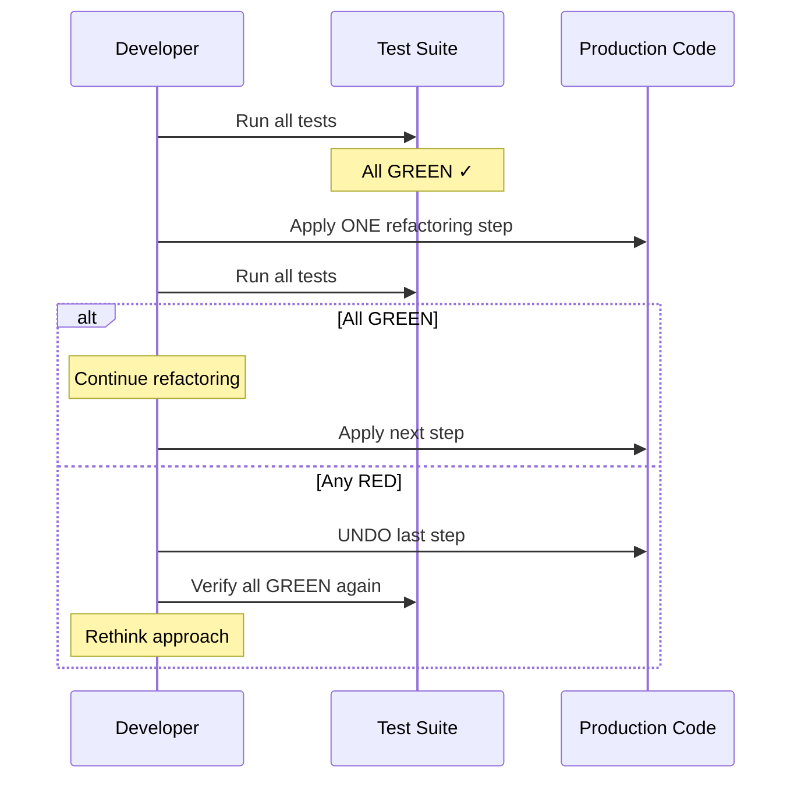

# História: Coding Standards KP — Refactoring Guidelines

**ID:** story-0003-0002

## 1. Dependências

| Blocked By | Blocks |
| :--- | :--- |
| — | story-0003-0003, story-0003-0006 |

## 2. Regras Transversais Aplicáveis

| ID | Título |
| :--- | :--- |
| RULE-001 | Dual Copy Consistency |
| RULE-002 | Source of Truth é resources/ |
| RULE-003 | Backward Compatibility |
| RULE-005 | Red-Green-Refactor Cycle |
| RULE-012 | Generated Content Language |

## 3. Descrição

Como **Architect**, eu quero que o Coding Standards Knowledge Pack contenha guidelines
explícitas de refactoring, garantindo que o developer agent e os skills de implementação
tenham critérios claros para a fase REFACTOR do ciclo TDD.

Atualmente o Coding Standards KP cobre Clean Code (CC-01 a CC-10), SOLID, naming,
injection patterns e convenções de linguagem. Falta uma seção dedicada a refactoring —
quando extrair método, quando aplicar DRY, como reconhecer design patterns emergentes,
e a regra fundamental de que refactoring NUNCA adiciona comportamento.

A mudança é aditiva ao reference file `clean-code.md` (ou novo reference file
`refactoring.md` se o clean-code.md já for muito longo).

### 3.1 Critérios de Refactoring

- Quando extrair método: função > 25 lines (Hard Limit existente)
- Quando extrair classe: classe > 250 lines (Hard Limit existente)
- Quando inline: método usado uma única vez e não melhora legibilidade
- Quando renomear: nome não revela intenção (CC-01)

### 3.2 Técnicas de Refactoring Priorizadas

- Extract Method (mais comum no TDD)
- Rename Variable/Method/Class
- Replace Magic Number with Named Constant
- Extract Interface (para DIP)
- Move Method (para SRP)
- Replace Conditional with Polymorphism (quando pattern emerge)

### 3.3 Regras de Segurança no Refactoring

- TODOS os testes devem estar verdes ANTES de iniciar refactoring
- TODOS os testes devem permanecer verdes APÓS cada passo de refactoring
- NUNCA adicionar comportamento durante refactoring
- Refactoring é uma sequência de small, safe steps — cada um independente
- Se um teste quebra durante refactoring, DESFAZER o último passo

## 4. Definições de Qualidade Locais

### DoR Local (Definition of Ready)

- [ ] Arquivo `clean-code.md` (ou equivalente) existente lido e compreendido
- [ ] Regras CC-01 a CC-10 identificadas para não duplicar
- [ ] Dual copy locations identificadas

### DoD Local (Definition of Done)

- [ ] Seção "Refactoring Guidelines" adicionada ao KP
- [ ] Critérios de refactoring documentados (quando extrair, inline, renomear)
- [ ] Técnicas priorizadas listadas com contexto de uso
- [ ] Regras de segurança no refactoring documentadas
- [ ] Ambas as cópias atualizadas (RULE-001)
- [ ] Conteúdo existente preservado (RULE-003)
- [ ] Testes de golden file atualizados

### Global Definition of Done (DoD)

- **Cobertura:** ≥ 95% Line, ≥ 90% Branch
- **Testes Automatizados:** Golden file tests validando output gerado contém seção refactoring
- **TDD Compliance:** Commits test-first, refactoring explícito
- **Documentação:** KP atualizado em ambas as cópias
- **Backward Compatibility:** Seções existentes preservadas
- **Paralelismo:** N/A

## 5. Contratos de Dados (Data Contract)

**clean-code.md ou refactoring.md (seções adicionadas):**

| Campo | Formato | Request | Response | Origem / Regra |
| :--- | :--- | :--- | :--- | :--- |
| `## Refactoring Guidelines` | Markdown H2 section | — | M | Nova seção principal |
| `### Refactoring Triggers` | Markdown H3 subsection | — | M | Critérios: > 25 lines, > 250 lines, naming ruim |
| `### Prioritized Techniques` | Markdown H3 subsection | — | M | Lista ordenada de técnicas |
| `### Safety Rules` | Markdown H3 subsection | — | M | 5 regras de segurança |

## 6. Diagramas

### 6.1 Refactoring Decision Flow



## 7. Critérios de Aceite (Gherkin)

```gherkin
Cenario: KP contém seção Refactoring Guidelines
  DADO que o arquivo de coding standards foi gerado pelo ia-dev-env
  QUANDO o conteúdo é inspecionado
  ENTÃO deve conter uma seção "## Refactoring Guidelines"
  E a seção deve conter sub-seções de triggers, técnicas e safety rules

Cenario: Refactoring triggers incluem Hard Limits existentes
  DADO que o KP contém a seção Refactoring Guidelines
  QUANDO os triggers são inspecionados
  ENTÃO deve referenciar o limite de 25 lines para funções
  E deve referenciar o limite de 250 lines para classes
  E deve incluir critérios de naming (CC-01)

Cenario: Técnicas priorizadas em ordem de frequência TDD
  DADO que o KP contém a seção Refactoring Guidelines
  QUANDO as técnicas são inspecionadas
  ENTÃO "Extract Method" deve ser a primeira técnica listada
  E cada técnica deve ter contexto de quando aplicar

Cenario: Safety rules impedem adição de comportamento
  DADO que o KP contém a seção Refactoring Guidelines
  QUANDO as safety rules são inspecionadas
  ENTÃO deve conter a regra "never add behavior during refactoring"
  E deve conter a regra "all tests must stay green"
  E deve conter a regra "undo if any test breaks"

Cenario: Conteúdo existente do KP preservado
  DADO que o KP original contém regras CC-01 a CC-10 e SOLID
  QUANDO a seção de refactoring é adicionada
  ENTÃO todas as regras existentes devem permanecer intactas

Cenario: Dual copy consistency
  DADO que a versão em resources/skills-templates/core/coding-standards/ foi atualizada
  QUANDO a versão em resources/github-skills-templates/coding-standards/ é comparada
  ENTÃO ambas devem conter a seção Refactoring Guidelines
```

## 8. Sub-tarefas

- [ ] [Dev] Ler conteúdo atual de `resources/skills-templates/core/coding-standards/references/clean-code.md`
- [ ] [Dev] Avaliar se adicionar a clean-code.md ou criar novo reference `refactoring.md`
- [ ] [Dev] Adicionar seção "## Refactoring Guidelines" com 3 sub-seções
- [ ] [Dev] Documentar critérios de refactoring (triggers)
- [ ] [Dev] Documentar técnicas priorizadas com contexto
- [ ] [Dev] Documentar safety rules (5 regras)
- [ ] [Dev] Replicar mudanças em resources/github-skills-templates/ (RULE-001)
- [ ] [Test] Golden file: atualizar para refletir nova seção
- [ ] [Test] Integração: validar que ia-dev-env gera output com seção refactoring
