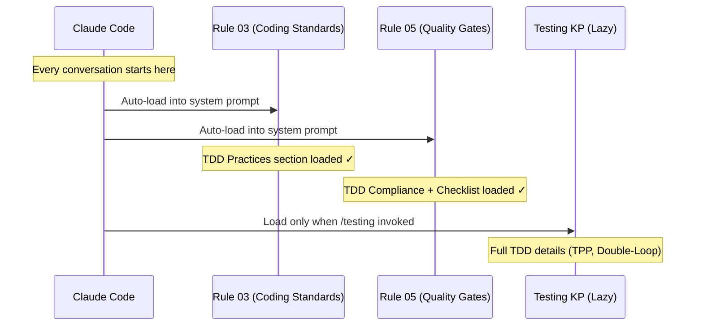

# História: Rules 03 & 05 — TDD Practices e TDD Compliance

**ID:** story-0003-0003

## 1. Dependências

| Blocked By | Blocks |
| :--- | :--- |
| story-0003-0001, story-0003-0002 | story-0003-0005, story-0003-0013 |

## 2. Regras Transversais Aplicáveis

| ID | Título |
| :--- | :--- |
| RULE-001 | Dual Copy Consistency |
| RULE-002 | Source of Truth é resources/ |
| RULE-003 | Backward Compatibility |
| RULE-004 | Coverage Thresholds Mantidos |
| RULE-005 | Red-Green-Refactor Cycle |
| RULE-008 | Atomic TDD Commits |

## 3. Descrição

Como **Tech Lead**, eu quero que as regras de Coding Standards (Rule 03) e Quality Gates
(Rule 05) incluam seções explícitas de TDD, garantindo que todo código gerado pelo
ia-dev-env carregue os requisitos TDD como regras mandatórias carregadas no system prompt.

As regras 03 e 05 são carregadas automaticamente em TODA conversa do Claude Code (são
rules, não skills). Isso significa que qualquer menção a TDD nelas se torna uma instrução
mandatória que o agent segue em toda interação. Isso é diferente dos KPs (lazy-loaded).

### 3.1 Rule 03 — TDD Practices Section

Adicionar seção "## TDD Practices" ao quick reference de coding standards:
- Red-Green-Refactor como prática obrigatória
- Referência ao KP testing para detalhes (link para skills/testing/SKILL.md)
- Refactoring criteria: extract method > 25 lines, eliminate duplication, improve naming
- Regra: "Refactoring NEVER adds behavior"

### 3.2 Rule 05 — TDD Compliance in Merge Checklist

Adicionar itens ao merge checklist de quality gates:
- `[ ] Commits show test-first pattern (test precedes implementation in git log)`
- `[ ] Explicit refactoring after green`
- `[ ] Tests are incremental (simple to complex via TPP)`
- `[ ] No test written AFTER implementation`
- `[ ] Acceptance tests exist and validate end-to-end behavior`

### 3.3 Rule 05 — TDD Section

Adicionar seção "## TDD Compliance" com:
- Double-Loop TDD como prática recomendada
- TPP ordering como guideline
- Atomic TDD commits como requisito

## 4. Definições de Qualidade Locais

### DoR Local (Definition of Ready)

- [ ] KP Testing com seção TDD já implementado (story-0003-0001)
- [ ] KP Coding Standards com refactoring guidelines já implementado (story-0003-0002)
- [ ] Arquivos de rules em resources/core/ e resources/rules-templates/ identificados

### DoD Local (Definition of Done)

- [ ] Rule 03 contém seção "## TDD Practices" com referência ao KP
- [ ] Rule 05 contém 5+ items TDD no merge checklist
- [ ] Rule 05 contém seção "## TDD Compliance"
- [ ] Ambas as cópias (rules-templates + core) atualizadas
- [ ] Testes de golden file atualizados

### Global Definition of Done (DoD)

- **Cobertura:** ≥ 95% Line, ≥ 90% Branch
- **Testes Automatizados:** Golden file tests validando rules geradas contêm seções TDD
- **TDD Compliance:** Commits test-first
- **Documentação:** Rules atualizadas
- **Backward Compatibility:** Seções existentes preservadas
- **Paralelismo:** N/A

## 5. Contratos de Dados (Data Contract)

**03-coding-standards (seções adicionadas):**

| Campo | Formato | Request | Response | Origem / Regra |
| :--- | :--- | :--- | :--- | :--- |
| `## TDD Practices` | Markdown H2 section | — | M | Seção com 4 bullets + referência ao KP |

**05-quality-gates (seções adicionadas):**

| Campo | Formato | Request | Response | Origem / Regra |
| :--- | :--- | :--- | :--- | :--- |
| `## TDD Compliance` | Markdown H2 section | — | M | Seção com Double-Loop, TPP, atomic commits |
| `- [ ] Commits show test-first pattern` | Checklist item | — | M | Adicionado ao Merge Checklist |
| `- [ ] Explicit refactoring after green` | Checklist item | — | M | Adicionado ao Merge Checklist |
| `- [ ] Tests incremental via TPP` | Checklist item | — | M | Adicionado ao Merge Checklist |
| `- [ ] No test written AFTER implementation` | Checklist item | — | M | Adicionado ao Merge Checklist |
| `- [ ] Acceptance tests validate e2e behavior` | Checklist item | — | M | Adicionado ao Merge Checklist |

## 6. Diagramas

### 6.1 Rules Loading in Claude Code



## 7. Critérios de Aceite (Gherkin)

```gherkin
Cenario: Rule 03 contém seção TDD Practices
  DADO que a regra 03-coding-standards foi gerada pelo ia-dev-env
  QUANDO o conteúdo é inspecionado
  ENTÃO deve conter uma seção "## TDD Practices"
  E deve referenciar o KP testing para detalhes completos
  E deve conter "Red-Green-Refactor" como prática obrigatória

Cenario: Rule 05 merge checklist inclui items TDD
  DADO que a regra 05-quality-gates foi gerada pelo ia-dev-env
  QUANDO o merge checklist é inspecionado
  ENTÃO deve conter "Commits show test-first pattern"
  E deve conter "Explicit refactoring after green"
  E deve conter "Tests are incremental"
  E deve conter "No test written AFTER implementation"
  E deve conter "Acceptance tests exist"

Cenario: Rule 05 contém seção TDD Compliance
  DADO que a regra 05-quality-gates foi gerada pelo ia-dev-env
  QUANDO o conteúdo é inspecionado
  ENTÃO deve conter uma seção "## TDD Compliance"
  E deve mencionar Double-Loop TDD
  E deve mencionar Transformation Priority Premise
  E deve mencionar atomic TDD commits

Cenario: Seções existentes das rules preservadas
  DADO que a Rule 03 original contém Hard Limits, Naming, SOLID, Error Handling, Forbidden
  E a Rule 05 original contém Coverage Thresholds, Test Categories, Test Naming, Merge Checklist
  QUANDO as seções TDD são adicionadas
  ENTÃO todas as seções originais devem permanecer intactas
  E os coverage thresholds (95%/90%) devem permanecer inalterados

Cenario: Coverage thresholds não modificados
  DADO que a Rule 05 define ≥ 95% Line e ≥ 90% Branch
  QUANDO a seção TDD Compliance é adicionada
  ENTÃO os thresholds originais devem permanecer exatamente como estão
  E não devem ser duplicados na seção TDD
```

## 8. Sub-tarefas

- [ ] [Dev] Ler conteúdo atual de resources/core/ e resources/rules-templates/ para Rule 03
- [ ] [Dev] Adicionar seção "## TDD Practices" à Rule 03 com referência ao KP
- [ ] [Dev] Ler conteúdo atual de Rule 05
- [ ] [Dev] Adicionar 5 items TDD ao merge checklist da Rule 05
- [ ] [Dev] Adicionar seção "## TDD Compliance" à Rule 05
- [ ] [Dev] Garantir que ambas as cópias estão atualizadas (RULE-001)
- [ ] [Test] Golden file: atualizar para refletir novas seções em ambas as rules
- [ ] [Test] Integração: validar que ia-dev-env gera rules com seções TDD
