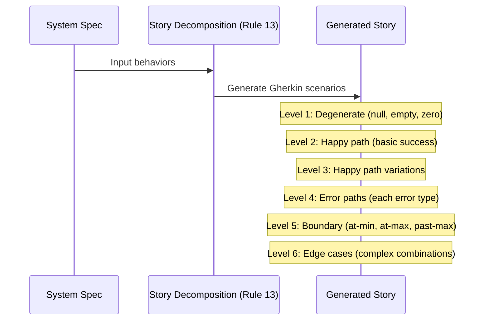

# História: Rule 13 — Gherkin Enriquecido na Decomposição de Stories

**ID:** story-0003-0004

## 1. Dependências

| Blocked By | Blocks |
| :--- | :--- |
| story-0003-0001 | story-0003-0005, story-0003-0009 |

## 2. Regras Transversais Aplicáveis

| ID | Título |
| :--- | :--- |
| RULE-001 | Dual Copy Consistency |
| RULE-002 | Source of Truth é resources/ |
| RULE-003 | Backward Compatibility |
| RULE-006 | Transformation Priority Premise (TPP) |
| RULE-010 | Gherkin Completeness |
| RULE-012 | Generated Content Language |

## 3. Descrição

Como **Product Owner**, eu quero que a Rule 13 (Story Decomposition) exija Gherkin
enriquecido em todas as stories geradas, garantindo que cenários de degenerate cases,
boundary values e error paths sejam obrigatórios, não opcionais.

A Rule 13 define os princípios SD-01 a SD-09 que guiam toda a decomposição de specs
em stories. Atualmente, SD-02 (Story Self-Containment) exige Gherkin com "happy path
+ errors + edge cases", mas sem critérios específicos de cobertura de cenários. Esta
story adiciona requisitos explícitos baseados no TPP.

### 3.1 SD-02 Enhancement — Gherkin Completeness

Adicionar ao princípio SD-02 (Story Self-Containment) os seguintes requisitos:
- **Cenários de degenerate cases obrigatórios**: null input, empty collection, zero value, missing field
- **Cenários de boundary values obrigatórios**: triplet pattern (at-min, at-max, past-max)
- **Cenários de error paths completos**: cada tipo de erro documentado no spec deve ter um cenário
- **Mínimo de 4 cenários por story** (happy + 2 errors + 1 edge case é o piso, não o teto)

### 3.2 SD-05 Enhancement — Sizing com Gherkin Counts

Ajustar o princípio SD-05 (Story Sizing) para refletir:
- Mínimo de 4 cenários Gherkin por story (atualmente sem mínimo explícito)
- Máximo de 8 cenários por story (já existente, mantido)
- Se a story precisa de mais de 8 cenários, considerar split

### 3.3 Ordenação de Cenários (novo princípio ou sub-princípio)

Adicionar guideline de ordenação de cenários Gherkin seguindo TPP:
1. Degenerate cases primeiro
2. Happy path básico
3. Variações do happy path
4. Error paths
5. Boundary values
6. Edge cases complexos

## 4. Definições de Qualidade Locais

### DoR Local (Definition of Ready)

- [ ] KP Testing com TPP já implementado (story-0003-0001)
- [ ] Arquivo `resources/core/13-story-decomposition.md` lido e compreendido
- [ ] Princípios SD-01 a SD-09 identificados

### DoD Local (Definition of Done)

- [ ] SD-02 atualizado com requisitos de Gherkin completeness
- [ ] SD-05 atualizado com mínimo de 4 cenários
- [ ] Guideline de ordenação de cenários adicionada
- [ ] Ambas as cópias atualizadas
- [ ] Testes de golden file atualizados

### Global Definition of Done (DoD)

- **Cobertura:** ≥ 95% Line, ≥ 90% Branch
- **Testes Automatizados:** Golden file tests validando Rule 13 com novos requisitos
- **TDD Compliance:** Commits test-first
- **Documentação:** Rule 13 atualizada
- **Backward Compatibility:** Princípios SD existentes preservados (aditivo)
- **Paralelismo:** N/A

## 5. Contratos de Dados (Data Contract)

**13-story-decomposition.md (seções modificadas/adicionadas):**

| Campo | Formato | Request | Response | Origem / Regra |
| :--- | :--- | :--- | :--- | :--- |
| SD-02 Gherkin Completeness | Sub-seção em SD-02 | — | M | 4 requisitos: degenerate, boundary triplet, error paths, mínimo 4 |
| SD-05 Minimum Scenarios | Atualização de range | — | M | Mínimo 4, máximo 8 (range explícito) |
| Scenario Ordering Guideline | Nova sub-seção | — | M | 6 níveis ordenados por TPP |

## 6. Diagramas

### 6.1 Gherkin Coverage Model



## 7. Critérios de Aceite (Gherkin)

```gherkin
Cenario: SD-02 exige cenários de degenerate cases
  DADO que a Rule 13 foi gerada pelo ia-dev-env
  QUANDO o princípio SD-02 é inspecionado
  ENTÃO deve exigir cenários de degenerate cases (null, empty, zero)
  E deve listar exemplos concretos de degenerate cases

Cenario: SD-02 exige boundary values como triplet
  DADO que a Rule 13 foi gerada pelo ia-dev-env
  QUANDO o princípio SD-02 é inspecionado
  ENTÃO deve exigir cenários de boundary values
  E deve especificar o padrão triplet: at-min, at-max, past-max

Cenario: SD-02 exige error paths completos
  DADO que a Rule 13 foi gerada pelo ia-dev-env
  QUANDO o princípio SD-02 é inspecionado
  ENTÃO deve exigir que cada tipo de erro tenha um cenário Gherkin
  E deve exigir que o cenário inclua a mensagem/código de erro esperado

Cenario: SD-05 define mínimo de 4 cenários por story
  DADO que a Rule 13 foi gerada pelo ia-dev-env
  QUANDO o princípio SD-05 é inspecionado
  ENTÃO deve definir mínimo de 4 cenários Gherkin
  E deve manter o máximo de 8 cenários existente

Cenario: Ordenação de cenários segue TPP
  DADO que a Rule 13 foi gerada pelo ia-dev-env
  QUANDO a guideline de ordenação é inspecionada
  ENTÃO os degenerate cases devem ser listados como primeiro nível
  E os edge cases complexos devem ser o último nível

Cenario: Princípios SD existentes preservados
  DADO que a Rule 13 original contém princípios SD-01 a SD-09
  QUANDO as novas sub-seções são adicionadas
  ENTÃO todos os princípios originais devem permanecer intactos
  E a numeração SD-01 a SD-09 deve ser preservada
```

## 8. Sub-tarefas

- [ ] [Dev] Ler conteúdo atual de `resources/core/13-story-decomposition.md`
- [ ] [Dev] Adicionar requisitos de Gherkin Completeness ao SD-02
- [ ] [Dev] Atualizar SD-05 com range mínimo de 4 cenários
- [ ] [Dev] Adicionar guideline de ordenação de cenários por TPP
- [ ] [Dev] Garantir que ambas as cópias estão atualizadas (RULE-001)
- [ ] [Test] Golden file: atualizar para refletir mudanças na Rule 13
- [ ] [Test] Integração: validar que ia-dev-env gera Rule 13 com novos requisitos
