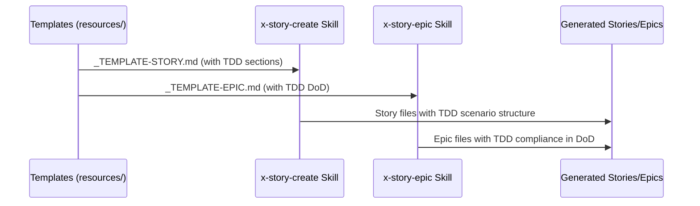

# História: Templates — Seções TDD em _TEMPLATE-STORY.md e _TEMPLATE-EPIC.md

**ID:** story-0003-0005

## 1. Dependências

| Blocked By | Blocks |
| :--- | :--- |
| story-0003-0003, story-0003-0004 | story-0003-0009, story-0003-0010 |

## 2. Regras Transversais Aplicáveis

| ID | Título |
| :--- | :--- |
| RULE-002 | Source of Truth é resources/ |
| RULE-003 | Backward Compatibility |
| RULE-005 | Red-Green-Refactor Cycle |
| RULE-007 | Double-Loop TDD |
| RULE-010 | Gherkin Completeness |
| RULE-012 | Generated Content Language |

## 3. Descrição

Como **Product Owner**, eu quero que os templates de Story e Epic incluam seções
explícitas de TDD, garantindo que toda story gerada pelo sistema já venha com
estrutura para cenários TDD e que todo epic inclua critérios TDD no DoD.

Os templates em `resources/templates/` são a fonte estrutural de todo output gerado
pelas skills x-story-create e x-story-epic. Modificar os templates garante que
TODAS as stories e epics futuros nasçam com DNA TDD.

### 3.1 _TEMPLATE-STORY.md — Seção TDD Scenarios

Adicionar nova seção (após seção 7 - Gherkin, ou como sub-seção):
- **Scenario Ordering**: Nota indicando que cenários Gherkin devem seguir TPP
  (degenerate → unconditional → conditions → iterations → edge cases)
- **Mandatory Scenario Categories**: Checklist de categorias obrigatórias
  - `[ ] Degenerate cases (null, empty, zero)`
  - `[ ] Happy path (basic success)`
  - `[ ] Error paths (each error type)`
  - `[ ] Boundary values (at-min, at-max, past-max)`
- **TDD Implementation Notes**: Sub-seção indicando que o primeiro cenário Gherkin
  se torna o acceptance test (loop externo) e os demais guiam unit tests (loop interno)

### 3.2 _TEMPLATE-EPIC.md — TDD no DoD Global

Adicionar ao DoD global do template:
- **TDD Compliance**: Commits mostram padrão test-first. Existe refactoring explícito
  após green. Testes são incrementais (do simples ao complexo via TPP).
- **Double-Loop TDD**: Acceptance tests derivados do Gherkin. Unit tests guiados pela TPP.

## 4. Definições de Qualidade Locais

### DoR Local (Definition of Ready)

- [ ] Rules 03 e 05 com seções TDD já implementadas (story-0003-0003)
- [ ] Rule 13 com Gherkin enriquecido já implementada (story-0003-0004)
- [ ] Templates atuais lidos e compreendidos
- [ ] Estrutura de seções existente dos templates identificada

### DoD Local (Definition of Done)

- [ ] _TEMPLATE-STORY.md contém seção/sub-seção de TDD scenarios
- [ ] _TEMPLATE-STORY.md contém checklist de categorias obrigatórias
- [ ] _TEMPLATE-EPIC.md contém TDD Compliance no DoD global
- [ ] Templates existentes preservam todas as seções atuais (RULE-003)
- [ ] Testes de golden file atualizados

### Global Definition of Done (DoD)

- **Cobertura:** ≥ 95% Line, ≥ 90% Branch
- **Testes Automatizados:** Golden file tests validando templates contêm seções TDD
- **TDD Compliance:** Commits test-first
- **Documentação:** Templates atualizados
- **Backward Compatibility:** Seções existentes preservadas, novas seções aditivas
- **Paralelismo:** N/A

## 5. Contratos de Dados (Data Contract)

**_TEMPLATE-STORY.md (seções adicionadas):**

| Campo | Formato | Request | Response | Origem / Regra |
| :--- | :--- | :--- | :--- | :--- |
| Scenario Ordering Note | Markdown note/callout | — | M | Nota sobre TPP ordering |
| Mandatory Scenario Categories | Checklist (4 items) | — | M | Degenerate, happy, error, boundary |
| TDD Implementation Notes | Markdown sub-section | — | O | Link entre Gherkin e Double-Loop TDD |

**_TEMPLATE-EPIC.md (seções adicionadas):**

| Campo | Formato | Request | Response | Origem / Regra |
| :--- | :--- | :--- | :--- | :--- |
| `TDD Compliance` | DoD item | — | M | Critérios TDD no DoD global |
| `Double-Loop TDD` | DoD item | — | M | Acceptance + Unit loops |

## 6. Diagramas

### 6.1 Template → Generated Output Flow



## 7. Critérios de Aceite (Gherkin)

```gherkin
Cenario: Story template contém checklist de categorias TDD obrigatórias
  DADO que o arquivo _TEMPLATE-STORY.md em resources/templates/ foi atualizado
  QUANDO o conteúdo é inspecionado
  ENTÃO deve conter um checklist com "Degenerate cases"
  E deve conter "Happy path"
  E deve conter "Error paths"
  E deve conter "Boundary values (at-min, at-max, past-max)"

Cenario: Story template contém nota sobre TPP ordering
  DADO que o arquivo _TEMPLATE-STORY.md foi atualizado
  QUANDO a seção de Gherkin/cenários é inspecionada
  ENTÃO deve conter referência à Transformation Priority Premise
  E deve indicar que cenários devem ser ordenados do simples ao complexo

Cenario: Story template contém TDD Implementation Notes
  DADO que o arquivo _TEMPLATE-STORY.md foi atualizado
  QUANDO o conteúdo é inspecionado
  ENTÃO deve conter notas sobre Double-Loop TDD
  E deve indicar que o primeiro cenário se torna o acceptance test

Cenario: Epic template contém TDD Compliance no DoD
  DADO que o arquivo _TEMPLATE-EPIC.md em resources/templates/ foi atualizado
  QUANDO o DoD global é inspecionado
  ENTÃO deve conter item "TDD Compliance" com critérios de commits test-first
  E deve conter item "Double-Loop TDD" com definição dos loops

Cenario: Seções existentes dos templates preservadas
  DADO que _TEMPLATE-STORY.md original contém 8 seções (Dependencies a Sub-tasks)
  E _TEMPLATE-EPIC.md original contém 5 seções (Overview a Story Index)
  QUANDO as seções TDD são adicionadas
  ENTÃO todas as seções originais devem permanecer intactas
  E a numeração original das seções deve ser preservada

Cenario: Template com seção TDD vazia é válido
  DADO que o template contém as novas seções TDD
  QUANDO uma story é gerada para um projeto que não adota TDD explicitamente
  ENTÃO as seções TDD podem estar vazias ou com valores default
  E o template gerado permanece válido e parseável
```

## 8. Sub-tarefas

- [ ] [Dev] Ler conteúdo atual de `resources/templates/_TEMPLATE-STORY.md`
- [ ] [Dev] Adicionar seção de TDD scenarios com checklist de categorias obrigatórias
- [ ] [Dev] Adicionar nota sobre TPP ordering nos cenários Gherkin
- [ ] [Dev] Adicionar TDD Implementation Notes (Double-Loop)
- [ ] [Dev] Ler conteúdo atual de `resources/templates/_TEMPLATE-EPIC.md`
- [ ] [Dev] Adicionar "TDD Compliance" e "Double-Loop TDD" ao DoD global
- [ ] [Test] Golden file: atualizar para refletir mudanças nos templates
- [ ] [Test] Integração: validar que ia-dev-env produz stories/epics com seções TDD
