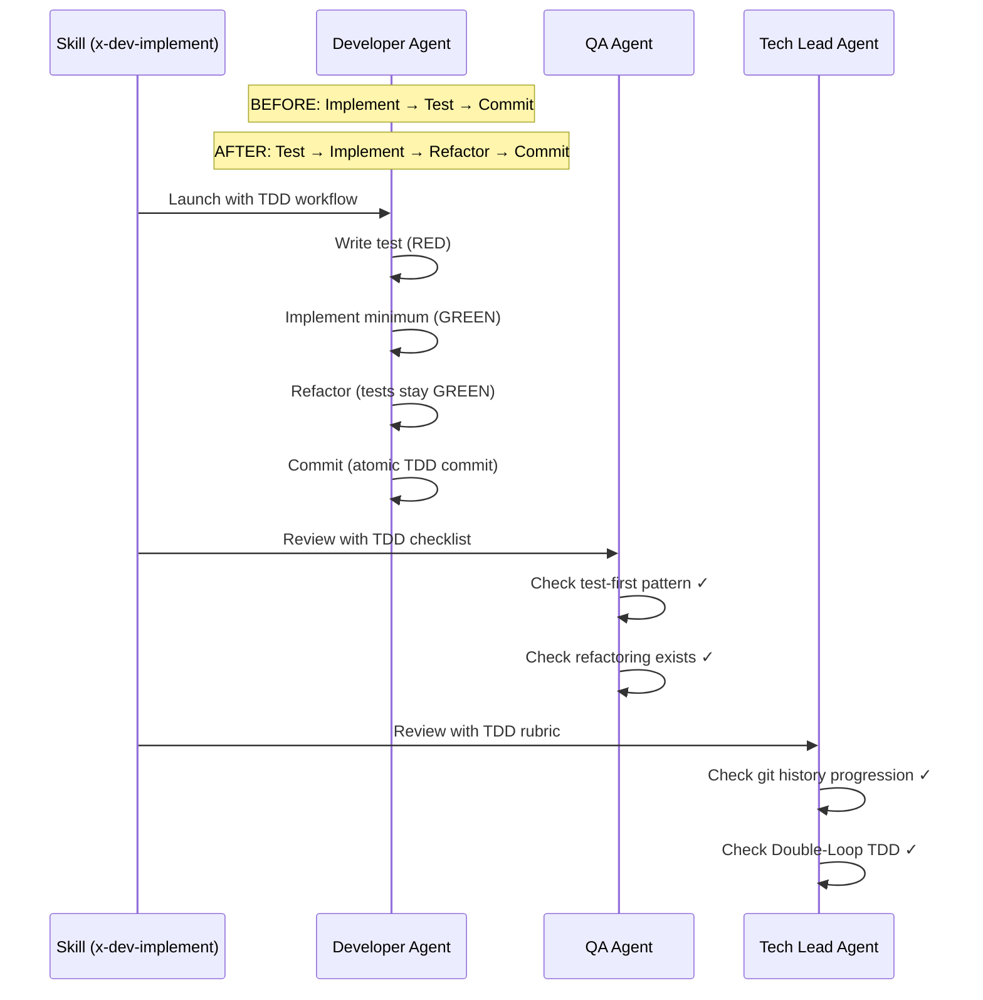

# História: Agents — TDD Workflows para Developer, QA e Tech Lead

**ID:** story-0003-0006

## 1. Dependências

| Blocked By | Blocks |
| :--- | :--- |
| story-0003-0001, story-0003-0002 | story-0003-0012, story-0003-0015, story-0003-0016 |

## 2. Regras Transversais Aplicáveis

| ID | Título |
| :--- | :--- |
| RULE-001 | Dual Copy Consistency |
| RULE-002 | Source of Truth é resources/ |
| RULE-003 | Backward Compatibility |
| RULE-005 | Red-Green-Refactor Cycle |
| RULE-007 | Double-Loop TDD |
| RULE-008 | Atomic TDD Commits |

## 3. Descrição

Como **Architect**, eu quero que os agents de Developer (typescript-developer), QA
(qa-engineer) e Tech Lead (tech-lead) incorporem TDD nos seus workflows e critérios
de avaliação, garantindo que os subagents lançados pelas skills operem com mentalidade
TDD.

Os agents são system prompts que definem personas especializadas. Eles não são invocados
diretamente — são usados pelas skills (via Task tool) para delegar trabalho. Cada agent
precisa ter seu prompt ajustado para incorporar TDD:

- **typescript-developer**: Mudar workflow de "implement then test" para "test then implement"
  (Red-Green-Refactor). Cada implementação começa escrevendo o teste.
- **qa-engineer**: Adicionar critérios de validação TDD ao checklist de 24 pontos.
  Verificar se commits são test-first, se existe refactoring explícito.
- **tech-lead**: Adicionar critérios TDD ao checklist de 40 pontos. Verificar se a
  progressão de commits segue TPP, se Double-Loop TDD foi aplicado.

### 3.1 typescript-developer Agent

- Adicionar seção "TDD Workflow" à persona:
  - "You ALWAYS write the test FIRST, then implement the minimum code to make it pass"
  - "After each GREEN, you evaluate refactoring opportunities"
  - "You commit after each complete Red-Green-Refactor cycle"
- Reordenar responsabilidades: "Write test → Run test (RED) → Implement → Run test (GREEN) → Refactor → Commit"

### 3.2 qa-engineer Agent

- Adicionar categoria "TDD Compliance" ao checklist de 24 pontos (4 novos items):
  - Commits show test-first pattern (test file modified before production code)
  - Explicit refactoring commits after green
  - Tests are incremental (simple to complex)
  - Acceptance tests exist for end-to-end scenarios

### 3.3 tech-lead Agent

- Adicionar categoria "TDD Process" ao rubric de 40 pontos (4-6 novos items):
  - Git history shows Red-Green-Refactor progression
  - Double-Loop TDD: acceptance test precedes unit tests
  - TPP ordering visible in test progression
  - Refactoring phases don't add behavior
  - Atomic commits (one behavior per commit)

## 4. Definições de Qualidade Locais

### DoR Local (Definition of Ready)

- [ ] KP Testing com TDD já implementado (story-0003-0001)
- [ ] KP Coding Standards com refactoring já implementado (story-0003-0002)
- [ ] Agent files atuais lidos e compreendidos (3 agents)
- [ ] Checklists existentes dos agents identificados

### DoD Local (Definition of Done)

- [ ] typescript-developer contém seção "TDD Workflow" com Red-Green-Refactor
- [ ] qa-engineer contém 4+ items TDD no checklist
- [ ] tech-lead contém 4+ items TDD no rubric
- [ ] Ambas as cópias atualizadas (resources/ github-agents-templates + skills-templates) (RULE-001)
- [ ] Conteúdo existente dos agents preservado (RULE-003)
- [ ] Testes de golden file atualizados

### Global Definition of Done (DoD)

- **Cobertura:** ≥ 95% Line, ≥ 90% Branch
- **Testes Automatizados:** Golden file tests validando agents contêm seções TDD
- **TDD Compliance:** Commits test-first
- **Documentação:** Agents atualizados em ambas as cópias
- **Backward Compatibility:** Checklists existentes preservados, items TDD adicionais
- **Paralelismo:** N/A

## 5. Contratos de Dados (Data Contract)

**typescript-developer.md (seções adicionadas):**

| Campo | Formato | Request | Response | Origem / Regra |
| :--- | :--- | :--- | :--- | :--- |
| `## TDD Workflow` | Agent section | — | M | Red-Green-Refactor como workflow padrão |
| Responsibility reorder | Ordered list | — | M | Test → Implement → Refactor → Commit |

**qa-engineer.md (seções adicionadas):**

| Campo | Formato | Request | Response | Origem / Regra |
| :--- | :--- | :--- | :--- | :--- |
| `TDD Compliance` category | 4 checklist items | — | M | Test-first, refactoring, incremental, acceptance |

**tech-lead.md (seções adicionadas):**

| Campo | Formato | Request | Response | Origem / Regra |
| :--- | :--- | :--- | :--- | :--- |
| `TDD Process` category | 4-6 rubric items | — | M | History, double-loop, TPP, refactoring, atomicity |

## 6. Diagramas

### 6.1 Agent Workflow Before/After TDD



## 7. Critérios de Aceite (Gherkin)

```gherkin
Cenario: Developer agent contém TDD Workflow
  DADO que o arquivo typescript-developer.md foi gerado pelo ia-dev-env
  QUANDO o conteúdo é inspecionado
  ENTÃO deve conter uma seção sobre TDD Workflow
  E deve especificar "write the test FIRST"
  E deve listar a ordem: Test → Implement → Refactor → Commit

Cenario: Developer agent reordena responsabilidades
  DADO que o developer agent define responsabilidades
  QUANDO a lista de responsabilidades é inspecionada
  ENTÃO escrever teste deve aparecer ANTES de implementar código
  E refactoring deve aparecer APÓS testes verdes

Cenario: QA agent contém categoria TDD Compliance
  DADO que o arquivo qa-engineer.md foi gerado pelo ia-dev-env
  QUANDO o checklist é inspecionado
  ENTÃO deve conter 4+ items na categoria "TDD Compliance"
  E deve incluir "test-first pattern"
  E deve incluir "explicit refactoring"

Cenario: Tech Lead agent contém categoria TDD Process
  DADO que o arquivo tech-lead.md foi gerado pelo ia-dev-env
  QUANDO o rubric é inspecionado
  ENTÃO deve conter 4+ items na categoria "TDD Process"
  E deve incluir "Red-Green-Refactor progression"
  E deve incluir "Double-Loop TDD"
  E deve incluir "TPP ordering"

Cenario: Checklists existentes dos agents preservados
  DADO que qa-engineer original tem 24 pontos e tech-lead tem 40 pontos
  QUANDO os items TDD são adicionados
  ENTÃO todos os items originais devem permanecer intactos
  E os novos items devem ser adicionais (total > 24 para QA, > 40 para TL)

Cenario: Dual copy consistency para os 3 agents
  DADO que os agents existem em resources/github-agents-templates/
  QUANDO comparados com a versão em resources/skills-templates/ ou .claude/agents/
  ENTÃO as seções TDD devem estar presentes em ambas as cópias
```

## 8. Sub-tarefas

- [ ] [Dev] Ler conteúdo atual de `resources/github-agents-templates/developers/typescript-developer.md`
- [ ] [Dev] Adicionar seção TDD Workflow ao typescript-developer
- [ ] [Dev] Reordenar responsabilidades do developer para test-first
- [ ] [Dev] Ler conteúdo atual de `resources/github-agents-templates/core/qa-engineer.md`
- [ ] [Dev] Adicionar categoria "TDD Compliance" (4 items) ao qa-engineer
- [ ] [Dev] Ler conteúdo atual de `resources/github-agents-templates/core/tech-lead.md`
- [ ] [Dev] Adicionar categoria "TDD Process" (4-6 items) ao tech-lead
- [ ] [Dev] Replicar mudanças em todas as cópias necessárias (RULE-001)
- [ ] [Test] Golden file: atualizar para refletir mudanças nos 3 agents
- [ ] [Test] Integração: validar que ia-dev-env gera agents com seções TDD
