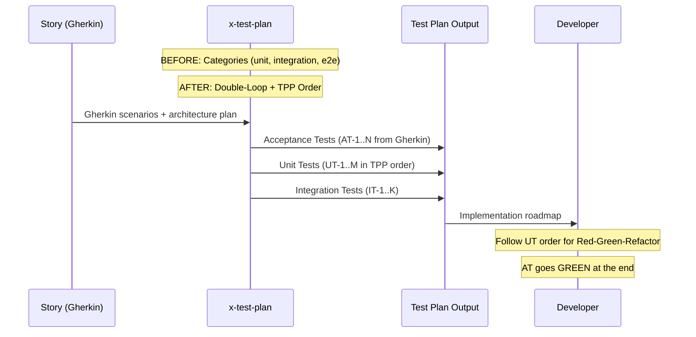

# História: x-test-plan — Promoção a Driver de Implementação com TPP

**ID:** story-0003-0007

## 1. Dependências

| Blocked By | Blocks |
| :--- | :--- |
| story-0003-0001 | story-0003-0008, story-0003-0012, story-0003-0014 |

## 2. Regras Transversais Aplicáveis

| ID | Título |
| :--- | :--- |
| RULE-001 | Dual Copy Consistency |
| RULE-002 | Source of Truth é resources/ |
| RULE-003 | Backward Compatibility |
| RULE-005 | Red-Green-Refactor Cycle |
| RULE-006 | Transformation Priority Premise (TPP) |
| RULE-007 | Double-Loop TDD |
| RULE-009 | Parallel Subagent Preservation |
| RULE-010 | Gherkin Completeness |

## 3. Descrição

Como **Architect**, eu quero que o skill x-test-plan seja promovido de "documentação
de testes" para "driver de implementação", garantindo que o test plan gere cenários
na ordem de implementação (TPP), sirva como roadmap para o TDD, e estruture a saída
em formato Double-Loop TDD.

Esta é a story mais importante do Layer 1 (Core). O x-test-plan é a peça central
do TDD: ele transforma os cenários Gherkin da story em um plano de testes concreto
que guia TODA a implementação. Sem esta mudança, o TDD é apenas documentação, não
metodologia.

### 3.1 Promoção a Driver

Mudar a postura do skill de "generate test documentation" para "generate implementation
roadmap driven by tests":
- Output organizado por ORDEM DE IMPLEMENTAÇÃO (TPP), não por categorias de teste
- Cada cenário de teste inclui: (1) o que testar, (2) o que implementar para passar,
  (3) qual transformação TPP aplicar
- Indicação explícita de qual cenário é o acceptance test (loop externo)

### 3.2 Estrutura Double-Loop

O output do test plan deve separar claramente:
- **Acceptance Tests** (loop externo): Derivados diretamente do Gherkin da story.
  Escritos primeiro. Ficam vermelhos até o final.
- **Unit Tests** (loop interno): Cenários incrementais ordenados por TPP.
  Cada um representa um ciclo Red-Green-Refactor.
- **Integration Tests**: Testes que validam interação entre componentes.
  Posicionados após os unit tests dos componentes envolvidos.

### 3.3 TPP Ordering

O skill deve ordenar cenários de teste seguindo TPP:
1. Degenerate: null input → return default/error
2. Constant: fixed input → fixed output
3. Variable: parameterized input → computed output
4. Conditional: branching logic
5. Collection: list/array processing
6. Iteration: loops, recursion
7. Mutation: complex state transformations

### 3.4 Dependency Markers

Cada cenário de teste deve indicar:
- Quais componentes (classes/módulos) são necessários
- Quais cenários anteriores são pré-requisito
- Se pode ser executado em paralelo com outros cenários (para paralelismo de subagents)

### 3.5 Formato de Saída Atualizado

```markdown
## Acceptance Tests (Outer Loop)

### AT-1: [Gherkin scenario name]
- **Gherkin**: [reference to story scenario]
- **Status**: RED until all unit tests complete
- **Components**: [list of components under test]

## Unit Tests (Inner Loop — TPP Order)

### UT-1: [degenerate case] — TPP Level 1
- **Test**: [what to test]
- **Implementation**: [minimum code to pass]
- **Transform**: {}→nil
- **Parallel**: yes/no
- **Depends on**: —

### UT-2: [next case] — TPP Level 2
...
```

## 4. Definições de Qualidade Locais

### DoR Local (Definition of Ready)

- [ ] KP Testing com TDD/TPP já implementado (story-0003-0001)
- [ ] Skill x-test-plan atual lido e compreendido (resources/skills-templates/core/x-test-plan/)
- [ ] Formato de saída atual do test plan compreendido
- [ ] Dual copy locations identificadas

### DoD Local (Definition of Done)

- [ ] x-test-plan gera cenários em ordem TPP (não por categoria)
- [ ] Output separado em Acceptance Tests e Unit Tests (Double-Loop)
- [ ] Cada cenário inclui dependency markers e parallelism indicators
- [ ] Formato de saída atualizado com seções AT e UT
- [ ] Ambas as cópias atualizadas (RULE-001)
- [ ] Subagent pattern preservado (RULE-009)
- [ ] Testes de golden file atualizados

### Global Definition of Done (DoD)

- **Cobertura:** ≥ 95% Line, ≥ 90% Branch
- **Testes Automatizados:** Golden file tests validando output com TPP ordering
- **TDD Compliance:** Commits test-first
- **Documentação:** Skill atualizado em ambas as cópias
- **Backward Compatibility:** Formato anterior de output suportado ou migrado
- **Paralelismo:** Subagent de context gathering preservado

## 5. Contratos de Dados (Data Contract)

**x-test-plan SKILL.md (seções modificadas):**

| Campo | Formato | Request | Response | Origem / Regra |
| :--- | :--- | :--- | :--- | :--- |
| TPP Ordering instruction | Skill instruction | — | M | Cenários ordenados por TPP, não por categoria |
| Double-Loop structure | Output format | — | M | Seções AT (acceptance) e UT (unit) separadas |
| Dependency markers | Per-scenario metadata | — | M | Components, depends-on, parallel flag |
| Implementation hints | Per-scenario | — | O | Minimum code to pass, transform type |

**Test plan output format (updated):**

| Campo | Formato | Request | Response | Origem / Regra |
| :--- | :--- | :--- | :--- | :--- |
| `## Acceptance Tests` | H2 section | — | M | Outer loop tests from Gherkin |
| `### AT-N` | H3 per test | — | M | Gherkin ref, status RED, components |
| `## Unit Tests` | H2 section | — | M | Inner loop tests in TPP order |
| `### UT-N` | H3 per test | — | M | Test, implementation hint, TPP level, parallel, depends |
| `## Integration Tests` | H2 section | — | O | Cross-component tests |

## 6. Diagramas

### 6.1 x-test-plan Before vs After



## 7. Critérios de Aceite (Gherkin)

```gherkin
Cenario: Test plan gera acceptance tests derivados do Gherkin
  DADO que uma story com 4 cenários Gherkin é processada pelo x-test-plan
  QUANDO o test plan é gerado
  ENTÃO deve conter uma seção "Acceptance Tests"
  E deve listar pelo menos 1 acceptance test por cenário Gherkin
  E cada AT deve referenciar o cenário Gherkin original

Cenario: Test plan gera unit tests em ordem TPP
  DADO que uma story é processada pelo x-test-plan
  QUANDO a seção "Unit Tests" é inspecionada
  ENTÃO o primeiro UT deve ser um degenerate case (TPP Level 1)
  E os UTs subsequentes devem seguir complexidade crescente
  E cada UT deve indicar seu TPP Level

Cenario: Cada cenário inclui dependency markers
  DADO que o test plan foi gerado
  QUANDO qualquer cenário (AT ou UT) é inspecionado
  ENTÃO deve conter "Components" listando classes/módulos necessários
  E deve conter "Depends on" indicando cenários pré-requisito
  E deve conter "Parallel" indicando se pode rodar em paralelo

Cenario: Degenerate case é sempre o primeiro unit test
  DADO que uma story tem lógica de negócio com condições
  QUANDO o test plan é gerado
  ENTÃO UT-1 deve testar o caso degenerado (null, empty, zero)
  E a transformação TPP deve ser "{}→nil" ou "nil→constant"

Cenario: Test plan preserva subagent pattern
  DADO que o x-test-plan atual usa subagent para context gathering
  QUANDO o skill atualizado é analisado
  ENTÃO o subagent de context gathering deve permanecer
  E o subagent deve ser lançado com as mesmas tools

Cenario: Test plan output compatível com x-lib-task-decomposer
  DADO que o test plan foi gerado com o novo formato
  QUANDO o output é consumido pelo x-lib-task-decomposer
  ENTÃO os cenários de teste devem ser mapeáveis para tasks
  E cada UT deve corresponder a uma task de implementação

Cenario: Test plan com story sem lógica condicional
  DADO que uma story descreve uma operação puramente CRUD (sem branches)
  QUANDO o test plan é gerado
  ENTÃO os UTs devem cobrir: degenerate → constant → variable
  E não deve haver UTs de nível conditional ou superior desnecessariamente
```

## 8. Sub-tarefas

- [ ] [Dev] Ler conteúdo atual de `resources/skills-templates/core/x-test-plan/SKILL.md`
- [ ] [Dev] Reestruturar o output format para Double-Loop (AT + UT sections)
- [ ] [Dev] Adicionar instrução de TPP ordering para cenários de teste
- [ ] [Dev] Adicionar dependency markers (components, depends-on, parallel) a cada cenário
- [ ] [Dev] Adicionar implementation hints (minimum code, transform type) opcionais
- [ ] [Dev] Preservar subagent pattern de context gathering (RULE-009)
- [ ] [Dev] Replicar mudanças em `resources/github-skills-templates/` (RULE-001)
- [ ] [Test] Golden file: atualizar para refletir novo formato de output
- [ ] [Test] Integração: validar que ia-dev-env gera x-test-plan com Double-Loop + TPP
