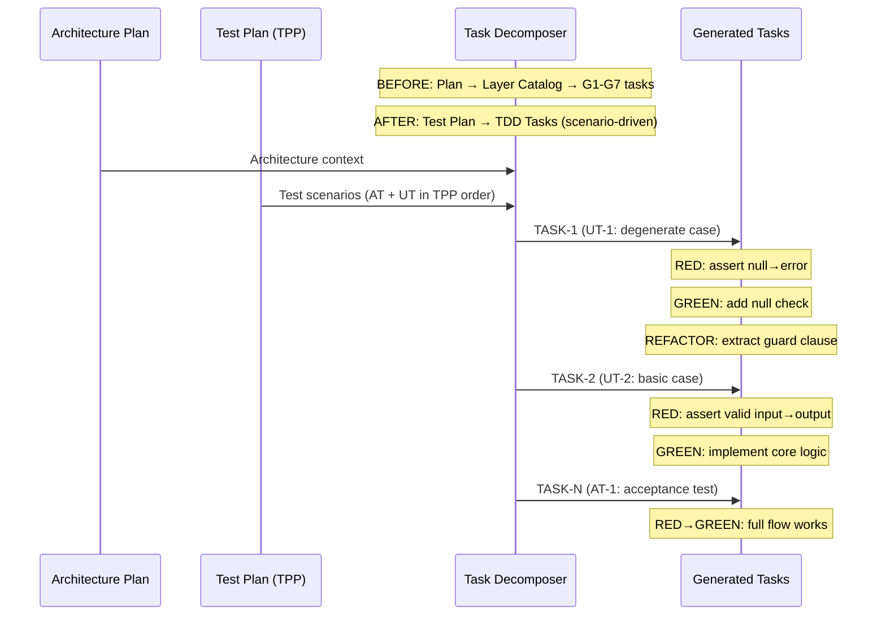

# História: x-lib-task-decomposer — Derivação de Tasks a partir de Cenários de Teste

**ID:** story-0003-0008

## 1. Dependências

| Blocked By | Blocks |
| :--- | :--- |
| story-0003-0007 | story-0003-0012, story-0003-0014 |

## 2. Regras Transversais Aplicáveis

| ID | Título |
| :--- | :--- |
| RULE-001 | Dual Copy Consistency |
| RULE-002 | Source of Truth é resources/ |
| RULE-003 | Backward Compatibility |
| RULE-005 | Red-Green-Refactor Cycle |
| RULE-006 | Transformation Priority Premise (TPP) |
| RULE-008 | Atomic TDD Commits |
| RULE-009 | Parallel Subagent Preservation |

## 3. Descrição

Como **Architect**, eu quero que o x-lib-task-decomposer derive tasks A PARTIR dos
cenários de teste (gerados pelo x-test-plan), e não apenas das layers da arquitetura,
garantindo que cada task corresponda a um ciclo Red-Green-Refactor completo.

Atualmente o task decomposer usa um Layer Task Catalog com 20+ tipos de task organizados
em grupos G1-G7 (por layer: domain, ports, adapters, application, inbound, tests). A
mudança inverte a lógica: ao invés de "quais tasks preciso por layer?", a pergunta
passa a ser "quais tasks preciso para cada cenário de teste?".

### 3.1 Inversão da Lógica de Decomposição

- **Antes**: Layer-first → tasks por layer (G1-G7)
- **Depois**: Test-first → tasks por cenário de teste, com layers como implementação

Cada task agora é:
- 1 cenário de teste (UT ou AT do test plan) + implementação necessária
- O cenário puxa os componentes necessários de cada layer
- Mantém a progressão inner→outer (domain primeiro, adapters depois) DENTRO de cada task

### 3.2 Task Structure (TDD)

Cada task gerada deve conter:
- **Test Scenario**: Referência ao UT/AT do test plan
- **RED**: O que o teste verifica (assertion)
- **GREEN**: O mínimo a implementar (classes, métodos, configurações)
- **REFACTOR**: Oportunidades de refactoring após o green
- **Layer Components**: Quais componentes de cada layer são tocados
- **Dependencies**: Quais tasks anteriores são pré-requisito

### 3.3 Preservação de Paralelismo

- Tasks que operam em layers independentes E cenários independentes podem rodar em paralelo
- O decomposer deve indicar quais tasks são paralelizáveis
- A decisão de paralelismo depende de: (1) independência de cenários, (2) independência de layers,
  (3) ausência de estado compartilhado
- Manter grupos de tasks paralelas (similar a G1-G7 mas derivados de test scenarios)

### 3.4 Compatibilidade com x-dev-lifecycle

O output deve ser consumível pelo x-dev-lifecycle Phase 2 (TDD Implementation):
- Cada task tem um TPP level para ordenação
- Tasks de acceptance test são marcadas separadamente
- Tasks indicam se são paralelizáveis

## 4. Definições de Qualidade Locais

### DoR Local (Definition of Ready)

- [ ] x-test-plan com TPP ordering já implementado (story-0003-0007)
- [ ] Skill x-lib-task-decomposer atual lido e compreendido
- [ ] Layer Task Catalog atual compreendido (G1-G7)
- [ ] Formato de output do test plan (Double-Loop) compreendido

### DoD Local (Definition of Done)

- [ ] Tasks derivadas de cenários de teste (não de layers)
- [ ] Cada task contém: test scenario, RED, GREEN, REFACTOR, layer components
- [ ] Paralelismo preservado para tasks independentes
- [ ] Output consumível pelo x-dev-lifecycle
- [ ] Ambas as cópias atualizadas (RULE-001)
- [ ] Testes de golden file atualizados

### Global Definition of Done (DoD)

- **Cobertura:** ≥ 95% Line, ≥ 90% Branch
- **Testes Automatizados:** Golden file tests validando tasks derivadas de cenários
- **TDD Compliance:** Commits test-first
- **Documentação:** Skill atualizado em ambas as cópias
- **Backward Compatibility:** G1-G7 pode ser mantido como fallback ou removido
- **Paralelismo:** Tasks independentes marcadas como paralelizáveis

## 5. Contratos de Dados (Data Contract)

**x-lib-task-decomposer SKILL.md (seções modificadas):**

| Campo | Formato | Request | Response | Origem / Regra |
| :--- | :--- | :--- | :--- | :--- |
| Test-driven decomposition | Skill instruction | — | M | Derive from test scenarios, not layers |
| TDD Task structure | Task format | — | M | Scenario ref, RED, GREEN, REFACTOR, components |
| Parallelism markers | Per-task metadata | — | M | Parallel flag, dependency list |
| TPP level | Per-task | — | M | 1-7 from TPP ordering |

**Task output format (updated):**

| Campo | Formato | Request | Response | Origem / Regra |
| :--- | :--- | :--- | :--- | :--- |
| `## TDD Tasks` | H2 section | — | M | Replaces or supplements G1-G7 |
| `### TASK-N: [scenario name]` | H3 per task | — | M | Linked to UT-N or AT-N |
| `RED` | Sub-section | — | M | Test assertion description |
| `GREEN` | Sub-section | — | M | Minimum implementation steps |
| `REFACTOR` | Sub-section | — | O | Refactoring opportunities |
| `Layer Components` | List | — | M | Which layers/classes touched |
| `Parallel` | Boolean | — | M | Can run in parallel with others |
| `Depends On` | Task list | — | M | Prerequisite tasks |

## 6. Diagramas

### 6.1 Task Decomposition Before vs After



## 7. Critérios de Aceite (Gherkin)

```gherkin
Cenario: Tasks derivadas de cenários de teste
  DADO que um test plan com 5 UTs e 2 ATs foi gerado pelo x-test-plan
  QUANDO o x-lib-task-decomposer processa o test plan
  ENTÃO deve gerar pelo menos 7 tasks (uma por cenário)
  E cada task deve referenciar seu cenário de teste (UT-N ou AT-N)

Cenario: Cada task contém estrutura RED-GREEN-REFACTOR
  DADO que uma task foi gerada pelo decomposer
  QUANDO a task é inspecionada
  ENTÃO deve conter seção "RED" com assertion do teste
  E deve conter seção "GREEN" com implementação mínima
  E pode conter seção "REFACTOR" com oportunidades

Cenario: Tasks preservam ordem TPP
  DADO que o test plan ordena cenários por TPP
  QUANDO as tasks são geradas
  ENTÃO TASK-1 deve corresponder ao cenário TPP Level 1 (degenerate)
  E as tasks subsequentes devem seguir a ordem TPP

Cenario: Tasks independentes marcadas como paralelizáveis
  DADO que dois cenários de teste operam em layers diferentes e sem estado compartilhado
  QUANDO as tasks correspondentes são geradas
  ENTÃO ambas devem ter "Parallel: yes"
  E não devem ter dependência mútua

Cenario: Tasks com dependência marcam corretamente
  DADO que um cenário de teste UT-3 depende de componentes criados no UT-1
  QUANDO a task para UT-3 é gerada
  ENTÃO deve ter "Depends On: TASK-1"
  E "Parallel" deve ser "no" (em relação a TASK-1)

Cenario: Acceptance test tasks separadas de unit test tasks
  DADO que o test plan contém ATs e UTs
  QUANDO as tasks são geradas
  ENTÃO tasks de AT devem ser claramente identificadas
  E tasks de AT devem depender de TODAS as tasks de UT relacionadas

Cenario: Task decomposer sem test plan cai em fallback
  DADO que o x-lib-task-decomposer é invocado sem test plan (backward compatibility)
  QUANDO o cenário de fallback é ativado
  ENTÃO deve usar o Layer Task Catalog (G1-G7) como fallback
  E deve emitir warning sobre ausência de test plan
```

## 8. Sub-tarefas

- [ ] [Dev] Ler conteúdo atual de `resources/skills-templates/core/lib/x-lib-task-decomposer/SKILL.md`
- [ ] [Dev] Implementar lógica de derivação de tasks a partir de cenários de teste
- [ ] [Dev] Definir estrutura de task TDD (RED/GREEN/REFACTOR/Components)
- [ ] [Dev] Implementar paralelism detection para tasks independentes
- [ ] [Dev] Implementar fallback para G1-G7 quando test plan ausente (RULE-003)
- [ ] [Dev] Preservar compatibilidade de output com x-dev-lifecycle (RULE-009)
- [ ] [Dev] Replicar mudanças em `resources/github-skills-templates/` (RULE-001)
- [ ] [Test] Golden file: atualizar para refletir novo formato de tasks
- [ ] [Test] Integração: validar que tasks são derivadas de cenários de teste
- [ ] [Test] Integração: validar fallback G1-G7 sem test plan
