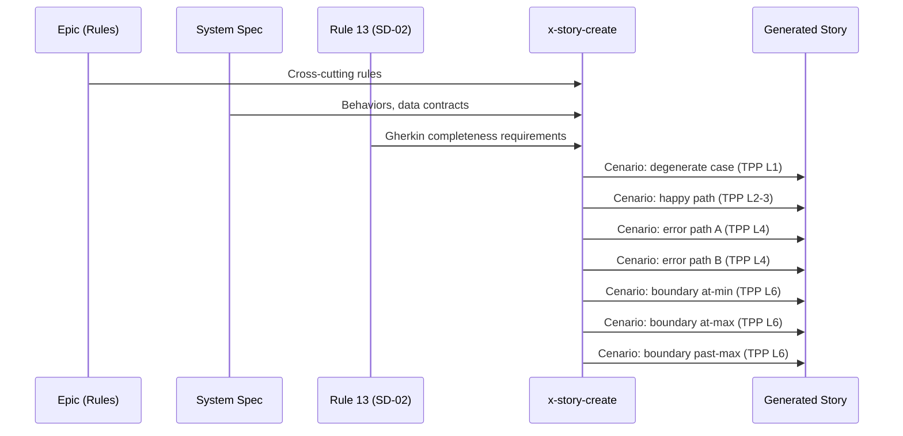

# História: x-story-create — Gherkin Enriquecido com Degenerate & Boundary Cases

**ID:** story-0003-0009

## 1. Dependências

| Blocked By | Blocks |
| :--- | :--- |
| story-0003-0004, story-0003-0005 | story-0003-0011 |

## 2. Regras Transversais Aplicáveis

| ID | Título |
| :--- | :--- |
| RULE-001 | Dual Copy Consistency |
| RULE-002 | Source of Truth é resources/ |
| RULE-003 | Backward Compatibility |
| RULE-006 | Transformation Priority Premise (TPP) |
| RULE-010 | Gherkin Completeness |
| RULE-012 | Generated Content Language |

## 3. Descrição

Como **Product Owner**, eu quero que o skill x-story-create gere cenários Gherkin
enriquecidos com degenerate cases, boundary values (triplet) e error paths completos,
garantindo que toda story produzida tenha cobertura suficiente para guiar TDD.

O x-story-create é o skill que gera os arquivos de story individuais a partir de um
Epic e um spec. Atualmente gera Gherkin com "happy + errors + edge cases", mas sem
critérios quantitativos nem categorias obrigatórias. Esta story adiciona as categorias
obrigatórias definidas na Rule 13 atualizada e no template atualizado.

### 3.1 Categorias Obrigatórias de Cenários

O skill deve gerar (no mínimo) cenários para cada uma destas categorias:
1. **Degenerate cases**: null, empty, zero — ao menos 1 cenário
2. **Happy path**: sucesso básico — ao menos 1 cenário
3. **Error paths**: cada tipo de erro no spec — ao menos 1 cenário por tipo
4. **Boundary values**: triplet (at-min, at-max, past-max) — ao menos 1 triplet

### 3.2 Ordenação por TPP

Os cenários Gherkin na story gerada devem seguir a ordem TPP:
- Degenerate cases primeiro
- Happy path
- Error paths
- Boundary values
- Edge cases complexos (se aplicável)

### 3.3 Instruções ao Skill

Adicionar ao SKILL.md instruções explícitas para:
- Ler a Rule 13 (SD-02) para requisitos de Gherkin completeness
- Ler o template _TEMPLATE-STORY.md para checklist de categorias
- Gerar cenários na ordem TPP
- Validar que o mínimo de 4 cenários é atingido
- Incluir nota de TPP ordering no output

## 4. Definições de Qualidade Locais

### DoR Local (Definition of Ready)

- [ ] Rule 13 com Gherkin enriquecido já implementada (story-0003-0004)
- [ ] Templates com seções TDD já implementados (story-0003-0005)
- [ ] Skill x-story-create atual lido e compreendido
- [ ] Formato de output atual compreendido

### DoD Local (Definition of Done)

- [ ] x-story-create gera cenários nas 4 categorias obrigatórias
- [ ] Cenários ordenados por TPP
- [ ] Mínimo de 4 cenários validado
- [ ] Boundary values usam padrão triplet
- [ ] Ambas as cópias atualizadas (RULE-001)
- [ ] Testes de golden file atualizados

### Global Definition of Done (DoD)

- **Cobertura:** ≥ 95% Line, ≥ 90% Branch
- **Testes Automatizados:** Golden file tests validando stories com Gherkin enriquecido
- **TDD Compliance:** Commits test-first
- **Documentação:** Skill atualizado em ambas as cópias
- **Backward Compatibility:** Stories geradas anteriormente permanecem válidas
- **Paralelismo:** N/A

## 5. Contratos de Dados (Data Contract)

**x-story-create SKILL.md (seções modificadas):**

| Campo | Formato | Request | Response | Origem / Regra |
| :--- | :--- | :--- | :--- | :--- |
| Gherkin completeness instruction | Skill instruction | — | M | Referência a Rule 13 SD-02 |
| TPP ordering instruction | Skill instruction | — | M | Ordenar cenários por complexidade |
| Minimum scenarios validation | Skill instruction | — | M | Validar mínimo de 4 cenários |
| Mandatory categories | Checklist | — | M | Degenerate, happy, error, boundary |

**Generated story output (Gherkin section updated):**

| Campo | Formato | Request | Response | Origem / Regra |
| :--- | :--- | :--- | :--- | :--- |
| Degenerate case scenario | Gherkin cenário | — | M | Pelo menos 1 |
| Happy path scenario | Gherkin cenário | — | M | Pelo menos 1 |
| Error path scenarios | Gherkin cenários | — | M | 1 por tipo de erro |
| Boundary value scenario | Gherkin cenário | — | M | Triplet: at-min, at-max, past-max |
| TPP ordering note | Markdown note | — | O | Indica ordem TPP |

## 6. Diagramas

### 6.1 Gherkin Generation Flow



## 7. Critérios de Aceite (Gherkin)

```gherkin
Cenario: Story gerada contém cenário de degenerate case
  DADO que o x-story-create processa uma story com input parameters
  QUANDO a story é gerada
  ENTÃO a seção Gherkin deve conter pelo menos 1 cenário de degenerate case
  E o cenário deve testar null, empty ou zero input

Cenario: Story gerada contém cenário de happy path
  DADO que o x-story-create processa uma story
  QUANDO a story é gerada
  ENTÃO a seção Gherkin deve conter pelo menos 1 cenário de happy path
  E o cenário deve descrever o fluxo de sucesso completo

Cenario: Story gerada contém cenários de error paths
  DADO que o spec define 3 tipos de erro para uma operação
  QUANDO a story é gerada pelo x-story-create
  ENTÃO a seção Gherkin deve conter pelo menos 3 cenários de error path
  E cada cenário deve testar um tipo de erro distinto

Cenario: Story gerada contém boundary values como triplet
  DADO que a operação tem um parâmetro com range válido [1, 100]
  QUANDO a story é gerada pelo x-story-create
  ENTÃO deve conter cenário para at-min (valor 1)
  E deve conter cenário para at-max (valor 100)
  E deve conter cenário para past-max (valor 101)

Cenario: Cenários Gherkin ordenados por TPP
  DADO que a story contém 6+ cenários Gherkin
  QUANDO a ordem dos cenários é analisada
  ENTÃO degenerate cases devem aparecer primeiro
  E happy path deve aparecer antes de error paths
  E boundary values devem aparecer após error paths

Cenario: Mínimo de 4 cenários validado
  DADO que o x-story-create gera uma story
  QUANDO o total de cenários Gherkin é contado
  ENTÃO deve haver pelo menos 4 cenários
  E se houver menos, o skill deve emitir warning

Cenario: Story sem boundary values naturais omite triplet
  DADO que uma operação não tem parâmetros numéricos com range
  QUANDO a story é gerada
  ENTÃO cenários de boundary value podem ser omitidos
  MAS o mínimo de 4 cenários ainda deve ser atingido com degenerate + happy + errors
```

## 8. Sub-tarefas

- [ ] [Dev] Ler conteúdo atual de `resources/skills-templates/core/x-story-create/SKILL.md`
- [ ] [Dev] Adicionar instrução de categorias obrigatórias de Gherkin
- [ ] [Dev] Adicionar instrução de TPP ordering para cenários
- [ ] [Dev] Adicionar validação de mínimo de 4 cenários
- [ ] [Dev] Adicionar instrução de boundary value triplet pattern
- [ ] [Dev] Replicar mudanças em `resources/github-skills-templates/` (RULE-001)
- [ ] [Test] Golden file: atualizar para refletir Gherkin enriquecido
- [ ] [Test] Integração: validar stories geradas com categorias obrigatórias
