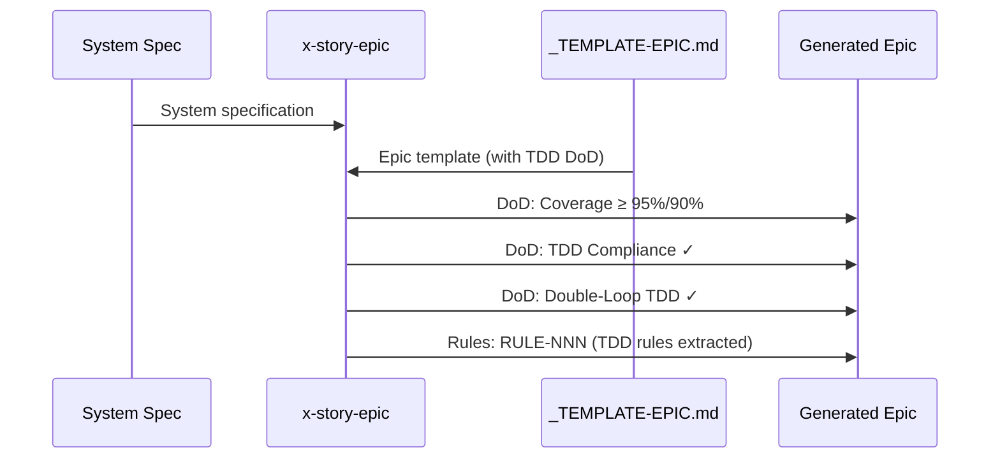

# História: x-story-epic — DoD com Critérios TDD

**ID:** story-0003-0010

## 1. Dependências

| Blocked By | Blocks |
| :--- | :--- |
| story-0003-0005 | story-0003-0011 |

## 2. Regras Transversais Aplicáveis

| ID | Título |
| :--- | :--- |
| RULE-001 | Dual Copy Consistency |
| RULE-002 | Source of Truth é resources/ |
| RULE-003 | Backward Compatibility |
| RULE-004 | Coverage Thresholds Mantidos |
| RULE-005 | Red-Green-Refactor Cycle |
| RULE-007 | Double-Loop TDD |
| RULE-012 | Generated Content Language |

## 3. Descrição

Como **Product Owner**, eu quero que o skill x-story-epic gere epics com critérios
TDD no DoD global, garantindo que todo epic produzido pelo sistema inclua
automaticamente as práticas TDD como requisitos de qualidade.

O x-story-epic gera o documento Epic a partir de um spec. A seção de DoD global
do epic é copiada para todas as stories como referência. Adicionar TDD ao DoD do
epic garante propagação automática para todas as stories do projeto.

### 3.1 DoD Global — TDD Items

Adicionar ao skill instrução para incluir no DoD global gerado:
- **TDD Compliance**: Commits mostram padrão test-first (teste precede implementação
  no git log). Existe refactoring explícito após green. Testes são incrementais
  (do simples ao complexo via TPP).
- **Double-Loop TDD**: Acceptance tests derivados do Gherkin. Unit tests guiados
  pela Transformation Priority Premise.

### 3.2 Regras Transversais — TDD Rules

Adicionar ao skill instrução para extrair regras TDD transversais quando aplicável:
- Red-Green-Refactor como regra transversal
- Atomic TDD commits como regra transversal
- Gherkin completeness como regra transversal

## 4. Definições de Qualidade Locais

### DoR Local (Definition of Ready)

- [ ] Templates com seções TDD já implementados (story-0003-0005)
- [ ] Skill x-story-epic atual lido e compreendido
- [ ] Formato de DoD global atual compreendido

### DoD Local (Definition of Done)

- [ ] x-story-epic gera DoD global com TDD Compliance
- [ ] x-story-epic gera DoD global com Double-Loop TDD
- [ ] x-story-epic extrai regras TDD transversais quando aplicável
- [ ] Ambas as cópias atualizadas (RULE-001)
- [ ] Testes de golden file atualizados

### Global Definition of Done (DoD)

- **Cobertura:** ≥ 95% Line, ≥ 90% Branch
- **Testes Automatizados:** Golden file tests validando epic com DoD TDD
- **TDD Compliance:** Commits test-first
- **Documentação:** Skill atualizado em ambas as cópias
- **Backward Compatibility:** DoD existente preservado, items TDD adicionais
- **Paralelismo:** N/A

## 5. Contratos de Dados (Data Contract)

**x-story-epic SKILL.md (seções modificadas):**

| Campo | Formato | Request | Response | Origem / Regra |
| :--- | :--- | :--- | :--- | :--- |
| TDD DoD instruction | Skill instruction | — | M | Include TDD items in generated DoD |
| TDD rules extraction | Skill instruction | — | M | Extract TDD cross-cutting rules |

**Generated Epic output (DoD section updated):**

| Campo | Formato | Request | Response | Origem / Regra |
| :--- | :--- | :--- | :--- | :--- |
| `TDD Compliance` | DoD item | — | M | Test-first commits, refactoring, TPP |
| `Double-Loop TDD` | DoD item | — | M | Acceptance + Unit loops |

## 6. Diagramas

### 6.1 Epic Generation with TDD DoD



## 7. Critérios de Aceite (Gherkin)

```gherkin
Cenario: Epic gerado contém TDD Compliance no DoD
  DADO que o x-story-epic processa um spec
  QUANDO o epic é gerado
  ENTÃO o DoD global deve conter item "TDD Compliance"
  E deve mencionar "test-first commits"
  E deve mencionar "refactoring explícito"
  E deve mencionar "TPP"

Cenario: Epic gerado contém Double-Loop TDD no DoD
  DADO que o x-story-epic processa um spec
  QUANDO o epic é gerado
  ENTÃO o DoD global deve conter item "Double-Loop TDD"
  E deve mencionar "acceptance tests" e "unit tests"

Cenario: Epic extrai regras TDD como regras transversais
  DADO que o spec descreve um sistema que adota TDD
  QUANDO o epic é gerado
  ENTÃO a tabela de regras deve conter regras sobre TDD
  E deve incluir Red-Green-Refactor, atomic commits, ou Gherkin completeness

Cenario: Coverage thresholds mantidos no DoD
  DADO que o epic é gerado pelo x-story-epic
  QUANDO o DoD global é inspecionado
  ENTÃO deve manter "≥ 95% Line, ≥ 90% Branch"
  E os items TDD devem ser ADICIONAIS aos items existentes

Cenario: DoD existente preservado
  DADO que o template _TEMPLATE-EPIC.md contém items de DoD existentes
  QUANDO o epic é gerado
  ENTÃO todos os items de DoD originais devem permanecer
  E os items TDD devem ser adicionados sem substituir
```

## 8. Sub-tarefas

- [ ] [Dev] Ler conteúdo atual de `resources/skills-templates/core/x-story-epic/SKILL.md`
- [ ] [Dev] Adicionar instrução para incluir TDD Compliance e Double-Loop TDD no DoD gerado
- [ ] [Dev] Adicionar instrução para extrair regras TDD transversais
- [ ] [Dev] Replicar mudanças em `resources/github-skills-templates/` (RULE-001)
- [ ] [Test] Golden file: atualizar para refletir epic com DoD TDD
- [ ] [Test] Integração: validar que ia-dev-env gera epics com DoD TDD
