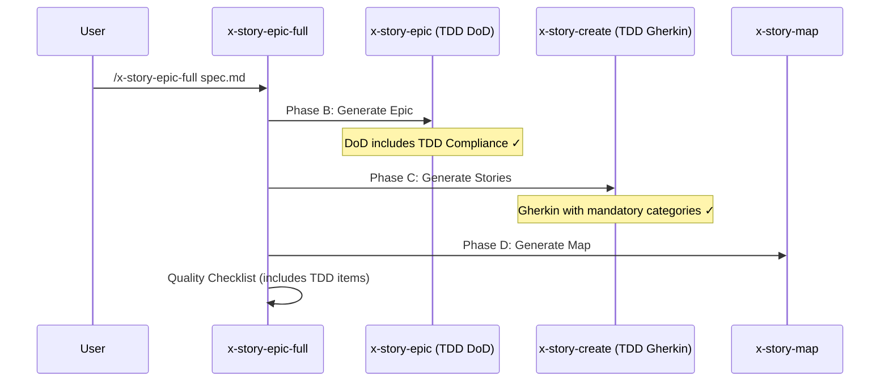

# História: x-story-epic-full — Propagação de Mudanças TDD

**ID:** story-0003-0011

## 1. Dependências

| Blocked By | Blocks |
| :--- | :--- |
| story-0003-0009, story-0003-0010 | — |

## 2. Regras Transversais Aplicáveis

| ID | Título |
| :--- | :--- |
| RULE-001 | Dual Copy Consistency |
| RULE-002 | Source of Truth é resources/ |
| RULE-003 | Backward Compatibility |
| RULE-010 | Gherkin Completeness |
| RULE-012 | Generated Content Language |

## 3. Descrição

Como **Product Owner**, eu quero que o skill x-story-epic-full propague corretamente
todas as mudanças TDD dos skills x-story-create e x-story-epic, garantindo que a
decomposição completa (epic + stories + map) produza artefatos com DNA TDD.

O x-story-epic-full é o orquestrador que coordena os 3 skills de decomposição
(x-story-epic, x-story-create, x-story-map). Como os sub-skills foram atualizados
nas stories anteriores, o orquestrador precisa:
- Referenciar as novas seções TDD na documentação do skill
- Incluir TDD no quality checklist final
- Garantir que a validação de cenários Gherkin inclui as categorias obrigatórias

### 3.1 Quality Checklist Update

Adicionar ao quality checklist do skill:
- `[ ] Each story has at least 4 Gherkin scenarios with mandatory categories`
- `[ ] Gherkin scenarios are ordered by TPP (degenerate → edge cases)`
- `[ ] Epic DoD includes TDD Compliance and Double-Loop TDD`
- `[ ] Boundary values use triplet pattern (at-min, at-max, past-max)`

### 3.2 Workflow Update

Atualizar a descrição das fases para refletir que:
- Phase C (Generate Stories) agora produz Gherkin enriquecido com categorias obrigatórias
- Phase B (Generate Epic) agora inclui TDD no DoD

## 4. Definições de Qualidade Locais

### DoR Local (Definition of Ready)

- [ ] x-story-create com Gherkin enriquecido já implementado (story-0003-0009)
- [ ] x-story-epic com DoD TDD já implementado (story-0003-0010)
- [ ] Skill x-story-epic-full atual lido e compreendido

### DoD Local (Definition of Done)

- [ ] Quality checklist inclui 4+ items TDD
- [ ] Descrição de fases B e C atualizada para refletir TDD
- [ ] Ambas as cópias atualizadas (RULE-001)
- [ ] Testes de golden file atualizados

### Global Definition of Done (DoD)

- **Cobertura:** ≥ 95% Line, ≥ 90% Branch
- **Testes Automatizados:** Golden file tests validando skill com checklist TDD
- **TDD Compliance:** Commits test-first
- **Documentação:** Skill atualizado em ambas as cópias
- **Backward Compatibility:** Workflow existente preservado, items TDD adicionais
- **Paralelismo:** N/A

## 5. Contratos de Dados (Data Contract)

**x-story-epic-full SKILL.md (seções modificadas):**

| Campo | Formato | Request | Response | Origem / Regra |
| :--- | :--- | :--- | :--- | :--- |
| TDD quality checklist items | Checklist items | — | M | 4+ items TDD no quality checklist |
| Phase B description update | Prose | — | M | Mencionar TDD no DoD |
| Phase C description update | Prose | — | M | Mencionar Gherkin enriquecido |

## 6. Diagramas

### 6.1 Epic-Full Orchestration with TDD



## 7. Critérios de Aceite (Gherkin)

```gherkin
Cenario: Quality checklist inclui validação TDD
  DADO que o skill x-story-epic-full foi atualizado
  QUANDO o quality checklist é inspecionado
  ENTÃO deve conter "Each story has at least 4 Gherkin scenarios"
  E deve conter "Gherkin scenarios ordered by TPP"
  E deve conter "Epic DoD includes TDD Compliance"

Cenario: Phase B menciona TDD no DoD
  DADO que o skill x-story-epic-full foi atualizado
  QUANDO a descrição da Phase B é inspecionada
  ENTÃO deve mencionar que o epic gerado inclui TDD Compliance no DoD

Cenario: Phase C menciona Gherkin enriquecido
  DADO que o skill x-story-epic-full foi atualizado
  QUANDO a descrição da Phase C é inspecionada
  ENTÃO deve mencionar categorias obrigatórias de cenários
  E deve mencionar TPP ordering

Cenario: Workflow existente preservado
  DADO que o skill original tem 4 fases (Analysis, Epic, Stories, Map)
  QUANDO as mudanças TDD são aplicadas
  ENTÃO todas as 4 fases devem permanecer
  E nenhuma fase deve ser removida ou renomeada

Cenario: Dual copy consistency
  DADO que a versão em resources/skills-templates/core/ foi atualizada
  QUANDO comparada com resources/github-skills-templates/
  ENTÃO ambas devem conter os items TDD no quality checklist
```

## 8. Sub-tarefas

- [ ] [Dev] Ler conteúdo atual de `resources/skills-templates/core/x-story-epic-full/SKILL.md`
- [ ] [Dev] Adicionar 4+ items TDD ao quality checklist
- [ ] [Dev] Atualizar descrição da Phase B para refletir TDD no DoD
- [ ] [Dev] Atualizar descrição da Phase C para refletir Gherkin enriquecido
- [ ] [Dev] Replicar mudanças em `resources/github-skills-templates/` (RULE-001)
- [ ] [Test] Golden file: atualizar para refletir skill com checklist TDD
