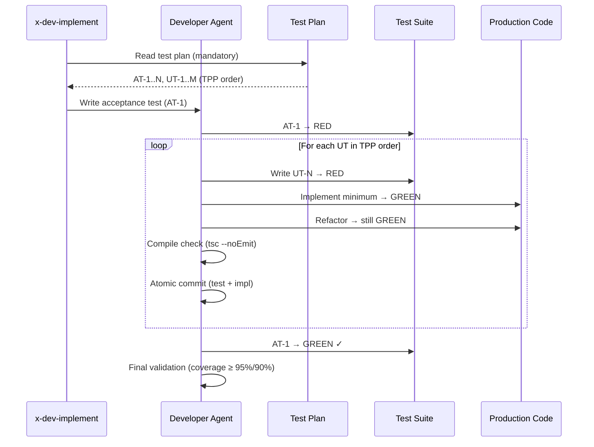

# História: x-dev-implement — Red-Green-Refactor Implementation

**ID:** story-0003-0012

## 1. Dependências

| Blocked By | Blocks |
| :--- | :--- |
| story-0003-0006, story-0003-0007, story-0003-0008 | story-0003-0014 |

## 2. Regras Transversais Aplicáveis

| ID | Título |
| :--- | :--- |
| RULE-001 | Dual Copy Consistency |
| RULE-002 | Source of Truth é resources/ |
| RULE-003 | Backward Compatibility |
| RULE-005 | Red-Green-Refactor Cycle |
| RULE-006 | Transformation Priority Premise (TPP) |
| RULE-007 | Double-Loop TDD |
| RULE-008 | Atomic TDD Commits |
| RULE-009 | Parallel Subagent Preservation |

## 3. Descrição

Como **Developer**, eu quero que o skill x-dev-implement siga o workflow TDD
(Red-Green-Refactor) durante a implementação, garantindo que cada unidade de código
seja escrita test-first e que o developer agent opere com o ciclo TDD como padrão.

O x-dev-implement é o skill de implementação standalone (alternativa mais rápida ao
x-dev-lifecycle). Atualmente segue 4 steps: Prepare→Understand, Implement, Test→Validate,
Commit. A mudança reestrutura para:

1. **Prepare**: Ler story, architecture plan, test plan (agora obrigatório)
2. **TDD Loop**: Para cada cenário de teste (TPP order):
   - RED: Escrever teste
   - GREEN: Implementar mínimo
   - REFACTOR: Melhorar design
   - Compile check após cada ciclo
3. **Validate**: Coverage, acceptance tests GREEN
4. **Commit**: Atomic commits (um por ciclo TDD)

### 3.1 Step 1 — Prepare (Updated)

- Ler test plan como artefato OBRIGATÓRIO (não mais opcional)
- Identificar acceptance tests (loop externo)
- Identificar unit tests em ordem TPP (loop interno)
- Se test plan não existe, emitir warning e sugerir rodar x-test-plan primeiro

### 3.2 Step 2 — TDD Loop (New)

Para cada cenário do test plan (ordem TPP):
1. **Escrever o acceptance test primeiro** (se for o primeiro ciclo)
2. **Escrever o unit test** (RED) — deve falhar
3. **Implementar o mínimo** (GREEN) — respeitando layer order (domain→ports→adapters)
4. **Refactor** — extract method, DRY, naming
5. **Compile check** — `npx tsc --noEmit` após cada ciclo
6. **Run tests** — verificar que teste atual passa e anteriores continuam verdes
7. **Commit** — atomic commit com teste + implementação

### 3.3 Subagent Usage (Updated)

- O developer subagent (typescript-developer) já atualizado com TDD workflow (story-0003-0006)
- Manter subagent pattern: orquestrador lança developer agent com contexto
- Layer order preservado DENTRO de cada ciclo TDD
- Cenários independentes podem ter seus ciclos em paralelo (RULE-009)

### 3.4 Definition of Done Check

Ao final de todos os ciclos:
- Acceptance tests devem estar GREEN
- Coverage thresholds (95%/90%) devem ser atingidos
- Todos os testes devem passar
- Nenhum compile warning

## 4. Definições de Qualidade Locais

### DoR Local (Definition of Ready)

- [ ] Agents com TDD workflow já implementados (story-0003-0006)
- [ ] x-test-plan com TPP já implementado (story-0003-0007)
- [ ] x-lib-task-decomposer com tasks TDD já implementado (story-0003-0008)
- [ ] Skill x-dev-implement atual lido e compreendido

### DoD Local (Definition of Done)

- [ ] Step 2 reestruturado para TDD Loop (Red-Green-Refactor)
- [ ] Test plan é input obrigatório (com fallback warning)
- [ ] Acceptance test escrito primeiro (Double-Loop)
- [ ] Layer order preservado dentro de cada ciclo
- [ ] Compile check após cada ciclo
- [ ] Atomic commits por ciclo
- [ ] Ambas as cópias atualizadas (RULE-001)
- [ ] Testes de golden file atualizados

### Global Definition of Done (DoD)

- **Cobertura:** ≥ 95% Line, ≥ 90% Branch
- **Testes Automatizados:** Golden file tests validando skill com TDD loop
- **TDD Compliance:** Commits test-first, refactoring explícito
- **Documentação:** Skill atualizado em ambas as cópias
- **Backward Compatibility:** Fallback para workflow antigo se test plan ausente
- **Paralelismo:** Subagent pattern preservado (RULE-009)

## 5. Contratos de Dados (Data Contract)

**x-dev-implement SKILL.md (seções reestruturadas):**

| Campo | Formato | Request | Response | Origem / Regra |
| :--- | :--- | :--- | :--- | :--- |
| Step 1: Prepare | Skill step | — | M | Test plan como input obrigatório |
| Step 2: TDD Loop | Skill step (new) | — | M | Red-Green-Refactor para cada cenário |
| Step 3: Validate | Skill step | — | M | Coverage + acceptance tests |
| Step 4: Commit | Skill step | — | M | Atomic TDD commits |
| Test plan dependency | Input requirement | M | — | Link to x-test-plan output |
| Acceptance test first | Loop instruction | — | M | Write AT before first UT |

## 6. Diagramas

### 6.1 x-dev-implement TDD Workflow



## 7. Critérios de Aceite (Gherkin)

```gherkin
Cenario: Skill exige test plan como input
  DADO que o x-dev-implement é invocado para uma story
  QUANDO nenhum test plan existe para a story
  ENTÃO deve emitir warning sugerindo rodar x-test-plan primeiro
  E deve oferecer fallback para workflow sem test plan

Cenario: Acceptance test escrito antes de unit tests
  DADO que o test plan contém ATs e UTs
  QUANDO o TDD loop inicia
  ENTÃO o acceptance test deve ser escrito PRIMEIRO
  E deve estar RED antes de qualquer unit test ser escrito

Cenario: Unit tests executados em ordem TPP
  DADO que o test plan contém UTs ordenados por TPP
  QUANDO o TDD loop executa
  ENTÃO UT-1 (degenerate) deve ser o primeiro ciclo
  E cada ciclo deve seguir a ordem TPP do test plan

Cenario: Cada ciclo Red-Green-Refactor completo
  DADO que um ciclo TDD está em execução para UT-N
  QUANDO o ciclo completa
  ENTÃO o teste deve ter sido escrito ANTES da implementação
  E a implementação deve ser o MÍNIMO para passar
  E refactoring deve ter sido avaliado (pode ser noop)
  E compile check deve ter passado

Cenario: Compile check após cada ciclo
  DADO que um ciclo TDD completou (Red→Green→Refactor)
  QUANDO a validação do ciclo executa
  ENTÃO `npx tsc --noEmit` deve ser executado
  E nenhum erro de compilação deve existir

Cenario: Atomic commit por ciclo TDD
  DADO que um ciclo TDD completou e passou no compile check
  QUANDO o commit é feito
  ENTÃO deve conter o teste E a implementação no mesmo commit
  E o formato deve seguir Conventional Commits
  E deve ser atômico (um comportamento por commit)

Cenario: Coverage validada ao final
  DADO que todos os ciclos TDD completaram
  QUANDO a validação final executa
  ENTÃO coverage deve ser ≥ 95% line e ≥ 90% branch
  E todos os acceptance tests devem estar GREEN
```

## 8. Sub-tarefas

- [ ] [Dev] Ler conteúdo atual de `resources/skills-templates/core/x-dev-implement/SKILL.md`
- [ ] [Dev] Reestruturar Step 1 para exigir test plan como input
- [ ] [Dev] Criar Step 2 "TDD Loop" com Red-Green-Refactor por cenário
- [ ] [Dev] Incluir acceptance test first (Double-Loop) no Step 2
- [ ] [Dev] Incluir compile check após cada ciclo no Step 2
- [ ] [Dev] Atualizar Step 4 para atomic TDD commits
- [ ] [Dev] Preservar subagent pattern e layer order (RULE-009)
- [ ] [Dev] Implementar fallback warning quando test plan ausente (RULE-003)
- [ ] [Dev] Replicar mudanças em `resources/github-skills-templates/` (RULE-001)
- [ ] [Test] Golden file: atualizar para refletir skill com TDD loop
- [ ] [Test] Integração: validar que ia-dev-env gera x-dev-implement com TDD
