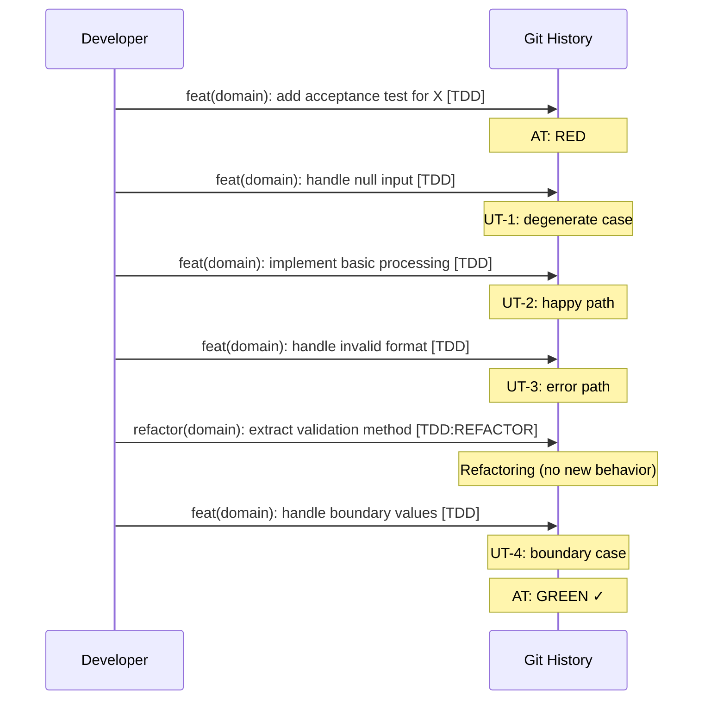

# História: x-git-push — Commits Atômicos por Ciclo TDD

**ID:** story-0003-0013

## 1. Dependências

| Blocked By | Blocks |
| :--- | :--- |
| story-0003-0003 | story-0003-0014 |

## 2. Regras Transversais Aplicáveis

| ID | Título |
| :--- | :--- |
| RULE-001 | Dual Copy Consistency |
| RULE-002 | Source of Truth é resources/ |
| RULE-003 | Backward Compatibility |
| RULE-008 | Atomic TDD Commits |
| RULE-012 | Generated Content Language |

## 3. Descrição

Como **Developer**, eu quero que o skill x-git-push suporte commits atômicos por ciclo
TDD, garantindo que cada commit represente UM ciclo Red-Green-Refactor completo e que
a história do git mostre a progressão incremental de TDD.

O x-git-push atualmente define estratégia de branch, formato de Conventional Commits,
regras de atomicidade e workflow de PR. A mudança adiciona suporte específico para
TDD commits.

### 3.1 TDD Commit Format

Adicionar ao skill os formatos de commit TDD:
- `test(scope): add test for [behavior] [TDD:RED]`
- `feat(scope): implement [behavior] [TDD:GREEN]`
- `refactor(scope): [improvement] [TDD:REFACTOR]`
- Ou formato combinado: `feat(scope): implement [behavior] [TDD]` (quando teste + impl em um commit)

### 3.2 Atomic TDD Commit Rules

- Um commit por ciclo Red-Green-Refactor completo
- Teste e implementação no MESMO commit (evitar commits de teste separados)
- Refactoring pode ser commit separado (imediatamente após o green)
- Cada commit adiciona UM comportamento testável
- Commits devem ser pequenos: máximo ~50 lines changed por commit

### 3.3 Git History Storytelling

Adicionar guideline de que a sequência de commits deve contar a história do TDD:
- Primeiro commit: acceptance test + test infrastructure
- Commits seguintes: unit tests incrementais (TPP order)
- Últimos commits: refactoring e polish
- A história do git deve ser legível como "progressão do simples ao complexo"

## 4. Definições de Qualidade Locais

### DoR Local (Definition of Ready)

- [ ] Rules 03 e 05 com TDD já implementadas (story-0003-0003)
- [ ] Skill x-git-push atual lido e compreendido
- [ ] Conventional Commits format atual compreendido

### DoD Local (Definition of Done)

- [ ] TDD commit formats adicionados ao skill
- [ ] Atomic TDD commit rules documentadas
- [ ] Git history storytelling guideline adicionada
- [ ] Ambas as cópias atualizadas (RULE-001)
- [ ] Testes de golden file atualizados

### Global Definition of Done (DoD)

- **Cobertura:** ≥ 95% Line, ≥ 90% Branch
- **Testes Automatizados:** Golden file tests validando skill com TDD commit formats
- **TDD Compliance:** Commits test-first
- **Documentação:** Skill atualizado em ambas as cópias
- **Backward Compatibility:** Conventional Commits existentes preservados, TDD tags adicionais
- **Paralelismo:** N/A

## 5. Contratos de Dados (Data Contract)

**x-git-push SKILL.md (seções adicionadas):**

| Campo | Formato | Request | Response | Origem / Regra |
| :--- | :--- | :--- | :--- | :--- |
| TDD Commit Formats | Markdown table/list | — | M | 4 formatos: RED, GREEN, REFACTOR, combined |
| Atomic TDD Rules | Markdown list | — | M | 5 regras de atomicidade TDD |
| Git History Storytelling | Markdown section | — | M | Guideline de progressão TPP nos commits |

## 6. Diagramas

### 6.1 TDD Commit History



## 7. Critérios de Aceite (Gherkin)

```gherkin
Cenario: Skill documenta formatos de commit TDD
  DADO que o x-git-push foi atualizado
  QUANDO a seção de commit formats é inspecionada
  ENTÃO deve conter formato para TDD:RED
  E deve conter formato para TDD:GREEN
  E deve conter formato para TDD:REFACTOR
  E deve conter formato combinado [TDD]

Cenario: Skill documenta regras de atomicidade TDD
  DADO que o x-git-push foi atualizado
  QUANDO as regras de atomicidade são inspecionadas
  ENTÃO deve conter "um commit por ciclo Red-Green-Refactor"
  E deve conter "teste e implementação no mesmo commit"
  E deve conter "cada commit adiciona UM comportamento"

Cenario: Skill documenta git history storytelling
  DADO que o x-git-push foi atualizado
  QUANDO a seção de storytelling é inspecionada
  ENTÃO deve indicar que primeiro commit é acceptance test
  E deve indicar progressão TPP nos commits seguintes
  E deve indicar que últimos commits são refactoring

Cenario: Conventional Commits existentes preservados
  DADO que o x-git-push original define tipos: feat, test, fix, refactor, etc.
  QUANDO os formatos TDD são adicionados
  ENTÃO todos os tipos existentes devem permanecer
  E as tags [TDD] devem ser ADICIONAIS (não substituem o tipo)

Cenario: Formato combinado como padrão recomendado
  DADO que o skill documenta 4 formatos TDD
  QUANDO a recomendação é lida
  ENTÃO o formato combinado `feat(scope): description [TDD]` deve ser o recomendado
  E os formatos separados (RED/GREEN/REFACTOR) devem ser opcionais

Cenario: Limite de tamanho por commit
  DADO que o skill documenta regras de atomicidade
  QUANDO os limites são inspecionados
  ENTÃO deve recomendar máximo de ~50 lines changed por commit
  E commits maiores devem gerar warning para considerar split
```

## 8. Sub-tarefas

- [ ] [Dev] Ler conteúdo atual de `resources/skills-templates/core/x-git-push/SKILL.md`
- [ ] [Dev] Adicionar seção de TDD Commit Formats (4 formatos)
- [ ] [Dev] Adicionar regras de atomicidade TDD (5 regras)
- [ ] [Dev] Adicionar guideline de Git History Storytelling
- [ ] [Dev] Preservar Conventional Commits existentes (RULE-003)
- [ ] [Dev] Replicar mudanças em `resources/github-skills-templates/` (RULE-001)
- [ ] [Test] Golden file: atualizar para refletir skill com TDD commits
- [ ] [Test] Integração: validar que ia-dev-env gera x-git-push com formatos TDD
