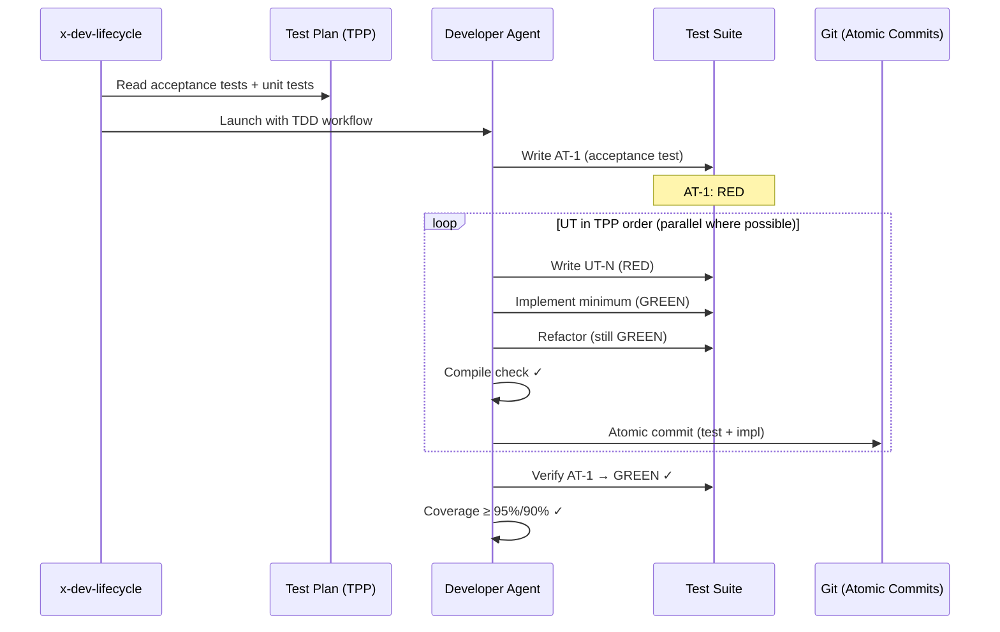
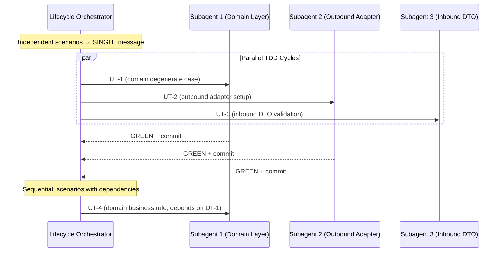

# História: x-dev-lifecycle — Reestruturação das Fases para TDD

**ID:** story-0003-0014

## 1. Dependências

| Blocked By | Blocks |
| :--- | :--- |
| story-0003-0007, story-0003-0008, story-0003-0012, story-0003-0013 | story-0003-0015, story-0003-0016 |

## 2. Regras Transversais Aplicáveis

| ID | Título |
| :--- | :--- |
| RULE-001 | Dual Copy Consistency |
| RULE-002 | Source of Truth é resources/ |
| RULE-003 | Backward Compatibility |
| RULE-005 | Red-Green-Refactor Cycle |
| RULE-006 | Transformation Priority Premise (TPP) |
| RULE-007 | Double-Loop TDD |
| RULE-008 | Atomic TDD Commits |
| RULE-009 | Parallel Subagent Preservation |

## 3. Descrição

Como **Architect**, eu quero que o skill x-dev-lifecycle reestruture todas as 8 fases
para incorporar TDD como metodologia central, garantindo que a Phase 2 (Implementation)
siga ciclos Red-Green-Refactor, que o test plan seja o driver, e que o paralelismo
de subagents seja preservado.

Esta é a story mais complexa e central do épico — ela é o gargalo principal porque
bloqueia as stories de review (0015 e 0016). O x-dev-lifecycle orquestra TODO o
ciclo de desenvolvimento e precisa coordenar todas as mudanças TDD feitas nos skills
anteriores (test plan, task decomposer, dev implement, git push).

### 3.1 Phase 0 — Preparation (Minor Update)

- Sem mudanças significativas. Continua: branch creation, story read, epic ID extraction.
- Adicionar: verificar se test plan existe; se não, Phase 1B é obrigatória.

### 3.2 Phase 1 — Architecture Planning (No Change)

- Mantida: Architect subagent → plan.md

### 3.3 Phase 1B — Test Planning (PROMOTED)

- **Antes**: Gera test documentation
- **Depois**: Gera IMPLEMENTATION ROADMAP (driver do TDD)
- Usa x-test-plan atualizado (story-0003-0007) com TPP ordering e Double-Loop structure
- Output é OBRIGATÓRIO para Phase 2 (se falhar, Phase 2 não pode iniciar)
- Output inclui: acceptance tests, unit tests em TPP order, dependency markers

### 3.4 Phase 1C — Task Decomposition (CHANGED INPUT)

- **Antes**: Deriva tasks do architecture plan (G1-G7 por layer)
- **Depois**: Deriva tasks do TEST PLAN (scenario-driven)
- Usa x-lib-task-decomposer atualizado (story-0003-0008)
- Output inclui: TDD tasks com RED/GREEN/REFACTOR, parallelism markers

### 3.5 Phase 1D-1E — Event/Compliance (No Change)

- Mantidas como condicionais

### 3.6 Phase 2 — TDD Implementation (MAJOR RESTRUCTURE)

**Antes**: Developer subagent implementa por Layer Groups G1-G7
**Depois**: Developer subagent executa ciclos Red-Green-Refactor por cenário de teste

Novo flow da Phase 2:
1. Escrever acceptance test (AT-1 do test plan) → RED
2. Para cada unit test scenario (TPP order):
   a. RED: Escrever unit test
   b. GREEN: Implementar mínimo (respeitando layer order)
   c. REFACTOR: Melhorar design (sem novo comportamento)
   d. Compile check (npx tsc --noEmit)
   e. COMMIT: Atomic TDD commit
3. Verificar acceptance test → GREEN
4. Final validation: coverage, all tests passing

**Paralelismo na Phase 2**:
- Cenários de teste independentes (sem dependência de dados/estado) PODEM ter seus
  ciclos em paralelo por subagents distintos
- Subagents que operam em layers independentes DEVEM ser lançados em single message
- A decisão de paralelismo usa os dependency markers do test plan
- Exemplo: UT para outbound adapter pode rodar em paralelo com UT para inbound DTO
  se não compartilham estado

### 3.7 Phase 3 — Review (Updated Reference)

- Usa x-review com checklist TDD (story-0003-0015) — se disponível
- Se story-0003-0015 não implementada ainda, usa x-review atual (backward compatible)

### 3.8 Phase 4-5 — Fixes + PR (Minor Update)

- Fixes seguem TDD: test first para cada fix
- PR description menciona TDD compliance

### 3.9 Phase 6 — Tech Lead Review (Updated Reference)

- Usa x-review-pr com critérios TDD (story-0003-0016) — se disponível

### 3.10 Phase 7 — Verification + Cleanup (No Change)

- Mantida

## 4. Definições de Qualidade Locais

### DoR Local (Definition of Ready)

- [ ] x-test-plan com TPP já implementado (story-0003-0007)
- [ ] x-lib-task-decomposer com tasks TDD já implementado (story-0003-0008)
- [ ] x-dev-implement com TDD loop já implementado (story-0003-0012)
- [ ] x-git-push com TDD commits já implementado (story-0003-0013)
- [ ] Skill x-dev-lifecycle atual lido e compreendido (8 fases)
- [ ] Subagent parallelism pattern compreendido

### DoD Local (Definition of Done)

- [ ] Phase 1B promovida a driver (output obrigatório para Phase 2)
- [ ] Phase 1C derivando de test plan (não de architecture plan sozinho)
- [ ] Phase 2 reestruturada para TDD (Red-Green-Refactor loops)
- [ ] Paralelismo preservado na Phase 2 (RULE-009)
- [ ] Acceptance test first (Double-Loop) na Phase 2
- [ ] Atomic commits na Phase 2
- [ ] Phases 3, 6 com referências atualizadas (backward compatible)
- [ ] Ambas as cópias atualizadas (RULE-001)
- [ ] Testes de golden file atualizados

### Global Definition of Done (DoD)

- **Cobertura:** ≥ 95% Line, ≥ 90% Branch
- **Testes Automatizados:** Golden file tests validando lifecycle com TDD phases
- **TDD Compliance:** Commits test-first, TDD loop na Phase 2
- **Documentação:** Skill atualizado em ambas as cópias
- **Backward Compatibility:** Phases não-TDD preservadas, TDD aditivo
- **Paralelismo:** Subagents em layers independentes lançados em single message

## 5. Contratos de Dados (Data Contract)

**x-dev-lifecycle SKILL.md (seções reestruturadas):**

| Campo | Formato | Request | Response | Origem / Regra |
| :--- | :--- | :--- | :--- | :--- |
| Phase 1B description | Skill phase | — | M | Promoted to driver, TPP ordering |
| Phase 1C input source | Skill phase | — | M | Derived from test plan, not just arch plan |
| Phase 2 TDD loop | Skill phase (major) | — | M | Red-Green-Refactor per scenario |
| Phase 2 parallelism | Skill instructions | — | M | Dependency markers for parallel decisions |
| Phase 2 acceptance test | Skill instructions | — | M | AT-1 written first, stays RED |
| Phase 2 compile check | Skill instructions | — | M | tsc --noEmit after each cycle |
| Phase 2 atomic commits | Skill instructions | — | M | One commit per TDD cycle |
| Phase 3 TDD reference | Skill phase | — | O | Reference to updated x-review |
| Phase 6 TDD reference | Skill phase | — | O | Reference to updated x-review-pr |

## 6. Diagramas

### 6.1 x-dev-lifecycle Phase 2 — TDD Flow



### 6.2 Parallelism in Phase 2



## 7. Critérios de Aceite (Gherkin)

```gherkin
Cenario: Phase 1B promovida a driver obrigatório
  DADO que o x-dev-lifecycle é executado
  QUANDO Phase 1B (Test Planning) completa
  ENTÃO o output (test plan com TPP ordering) deve ser marcado como obrigatório
  E Phase 2 não deve iniciar se Phase 1B falhar

Cenario: Phase 1C deriva tasks do test plan
  DADO que Phase 1B produziu um test plan com Double-Loop structure
  QUANDO Phase 1C (Task Decomposition) executa
  ENTÃO as tasks devem ser derivadas dos cenários de teste
  E cada task deve conter RED/GREEN/REFACTOR structure

Cenario: Phase 2 executa Red-Green-Refactor por cenário
  DADO que Phase 1C produziu TDD tasks
  QUANDO Phase 2 (Implementation) executa
  ENTÃO para cada cenário: teste é escrito ANTES da implementação
  E implementação é o MÍNIMO para passar
  E refactoring é avaliado após cada green

Cenario: Acceptance test escrito primeiro na Phase 2
  DADO que Phase 2 inicia
  QUANDO o primeiro artefato é produzido
  ENTÃO deve ser o acceptance test (AT-1)
  E AT-1 deve estar RED

Cenario: Paralelismo preservado na Phase 2
  DADO que o test plan marca cenários independentes como paralelizáveis
  QUANDO Phase 2 executa cenários paralelos
  ENTÃO subagents devem ser lançados em SINGLE message
  E cada subagent executa seu próprio ciclo TDD
  E cenários com dependências rodam sequencialmente

Cenario: Compile check após cada ciclo na Phase 2
  DADO que um ciclo TDD completa na Phase 2
  QUANDO a validação do ciclo executa
  ENTÃO npx tsc --noEmit deve ser executado
  E erro de compilação bloqueia o próximo ciclo

Cenario: Atomic commit por ciclo na Phase 2
  DADO que um ciclo TDD completa e passa compile check
  QUANDO o commit é feito
  ENTÃO deve ser atômico (teste + implementação)
  E deve seguir formato TDD do x-git-push

Cenario: Backward compatibility sem test plan
  DADO que o x-dev-lifecycle é executado para um projeto sem test plan
  QUANDO Phase 1B falha ou é pulada
  ENTÃO deve emitir warning
  E deve oferecer fallback para workflow G1-G7 (Phase 2 legacy)
```

## 8. Sub-tarefas

- [ ] [Dev] Ler conteúdo atual de `resources/skills-templates/core/x-dev-lifecycle/SKILL.md`
- [ ] [Dev] Atualizar Phase 0 para verificar existência de test plan
- [ ] [Dev] Atualizar Phase 1B description (promoted to driver)
- [ ] [Dev] Atualizar Phase 1C input source (test plan, not just arch plan)
- [ ] [Dev] Reestruturar Phase 2 para TDD loop (Red-Green-Refactor)
- [ ] [Dev] Implementar Double-Loop TDD na Phase 2 (AT first)
- [ ] [Dev] Implementar paralelismo baseado em dependency markers na Phase 2
- [ ] [Dev] Adicionar compile check após cada ciclo na Phase 2
- [ ] [Dev] Adicionar atomic commits por ciclo na Phase 2
- [ ] [Dev] Atualizar Phase 3 e Phase 6 com referências TDD (backward compatible)
- [ ] [Dev] Implementar fallback para G1-G7 sem test plan (RULE-003)
- [ ] [Dev] Replicar mudanças em `resources/github-skills-templates/` (RULE-001)
- [ ] [Test] Golden file: atualizar para refletir lifecycle com TDD phases
- [ ] [Test] Integração: validar que ia-dev-env gera x-dev-lifecycle com TDD
