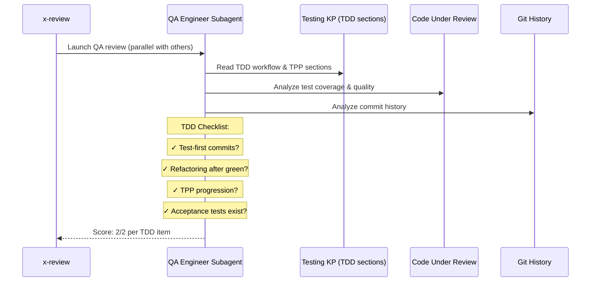

# História: x-review — Checklist TDD para Review de QA

**ID:** story-0003-0015

## 1. Dependências

| Blocked By | Blocks |
| :--- | :--- |
| story-0003-0006, story-0003-0014 | — |

## 2. Regras Transversais Aplicáveis

| ID | Título |
| :--- | :--- |
| RULE-001 | Dual Copy Consistency |
| RULE-002 | Source of Truth é resources/ |
| RULE-003 | Backward Compatibility |
| RULE-005 | Red-Green-Refactor Cycle |
| RULE-007 | Double-Loop TDD |
| RULE-008 | Atomic TDD Commits |

## 3. Descrição

Como **QA Engineer**, eu quero que o skill x-review inclua um checklist TDD no review
do QA Engineer specialist, garantindo que toda review valide se o código foi
desenvolvido seguindo TDD (test-first, refactoring explícito, progressão TPP).

O x-review é o skill de review paralelo com 8 especialistas (Security, QA, Performance,
Database, Observability, DevOps, API, Event). Cada especialista tem seu próprio
checklist e knowledge pack. A mudança adiciona items TDD ao checklist do QA Engineer.

### 3.1 QA Engineer Checklist — TDD Items

Adicionar ao checklist do QA Engineer no skill:
- `[ ] Commits show test-first pattern (test precedes implementation in git log)`
- `[ ] Explicit refactoring exists after green (no behavior change)`
- `[ ] Tests are incremental (simple to complex, following TPP)`
- `[ ] No test was written AFTER implementation`
- `[ ] Acceptance tests exist and validate end-to-end behavior`
- `[ ] Coverage ≥ 95% line / ≥ 90% branch (maintained)`

### 3.2 QA Engineer KP Reference

O QA engineer já referencia o KP de testing. Com a story-0003-0001, o KP contém
seções de TDD. O QA engineer deve ser instruído a ler essas seções antes da review.

### 3.3 Scoring Update

Os items TDD devem seguir o mesmo scoring rubric (0/1/2 per item). Items TDD devem
ter score 2/2 para aprovação, assim como os items existentes.

## 4. Definições de Qualidade Locais

### DoR Local (Definition of Ready)

- [ ] Agents com TDD workflow já implementados (story-0003-0006)
- [ ] x-dev-lifecycle com TDD phases já implementado (story-0003-0014)
- [ ] Skill x-review atual lido e compreendido
- [ ] QA Engineer checklist atual compreendido (24 pontos)

### DoD Local (Definition of Done)

- [ ] QA Engineer checklist contém 6+ items TDD
- [ ] Items TDD seguem scoring rubric (0/1/2)
- [ ] QA Engineer instrução referencia KP testing TDD sections
- [ ] Ambas as cópias atualizadas (RULE-001)
- [ ] Testes de golden file atualizados

### Global Definition of Done (DoD)

- **Cobertura:** ≥ 95% Line, ≥ 90% Branch
- **Testes Automatizados:** Golden file tests validando x-review com TDD checklist
- **TDD Compliance:** Commits test-first
- **Documentação:** Skill atualizado em ambas as cópias
- **Backward Compatibility:** Checklist existente preservado, items TDD adicionais
- **Paralelismo:** Parallel review pattern preservado (8 specialists)

## 5. Contratos de Dados (Data Contract)

**x-review SKILL.md (seções modificadas):**

| Campo | Formato | Request | Response | Origem / Regra |
| :--- | :--- | :--- | :--- | :--- |
| QA Engineer TDD checklist | Checklist items | — | M | 6 items TDD no checklist do QA |
| QA Engineer KP instruction | Skill instruction | — | M | Referência a TDD sections do KP |
| TDD scoring rubric | Scoring format | — | M | 0/1/2 per TDD item |

## 6. Diagramas

### 6.1 QA Review with TDD Checklist



## 7. Critérios de Aceite (Gherkin)

```gherkin
Cenario: QA checklist contém items TDD
  DADO que o x-review foi atualizado
  QUANDO o checklist do QA Engineer é inspecionado
  ENTÃO deve conter "test-first pattern"
  E deve conter "explicit refactoring"
  E deve conter "incremental tests (TPP)"
  E deve conter "no test after implementation"
  E deve conter "acceptance tests exist"
  E deve conter "coverage thresholds"

Cenario: Items TDD seguem scoring rubric
  DADO que o QA checklist contém items TDD
  QUANDO o scoring é aplicado
  ENTÃO cada item TDD deve ser avaliado como 0, 1, ou 2
  E score 2/2 é necessário para aprovação
  E items TDD têm o mesmo peso que items existentes

Cenario: QA engineer referencia KP testing TDD
  DADO que o x-review instrui o QA engineer
  QUANDO as instruções do QA engineer são inspecionadas
  ENTÃO deve conter referência às seções TDD do KP testing
  E deve instruir a ler TDD workflow antes da review

Cenario: Checklist existente do QA preservado
  DADO que o QA engineer original tem 24 pontos (Coverage, Test Quality, etc.)
  QUANDO os items TDD são adicionados
  ENTÃO todos os 24 pontos originais devem permanecer
  E o total deve ser 24 + 6 = 30 pontos

Cenario: Review paralelo preservado
  DADO que o x-review lança 8 especialistas em paralelo
  QUANDO a review TDD é executada
  ENTÃO o QA engineer deve ser lançado em parallel com os outros 7
  E os items TDD não devem impedir o paralelismo
```

## 8. Sub-tarefas

- [ ] [Dev] Ler conteúdo atual de `resources/skills-templates/core/x-review/SKILL.md`
- [ ] [Dev] Identificar seção do QA Engineer no skill
- [ ] [Dev] Adicionar 6 items TDD ao checklist do QA Engineer
- [ ] [Dev] Adicionar instrução de referência ao KP testing TDD sections
- [ ] [Dev] Garantir scoring rubric (0/1/2) para items TDD
- [ ] [Dev] Preservar parallel review pattern (RULE-009)
- [ ] [Dev] Replicar mudanças em `resources/github-skills-templates/` (RULE-001)
- [ ] [Test] Golden file: atualizar para refletir x-review com TDD checklist
- [ ] [Test] Integração: validar que ia-dev-env gera x-review com TDD items
