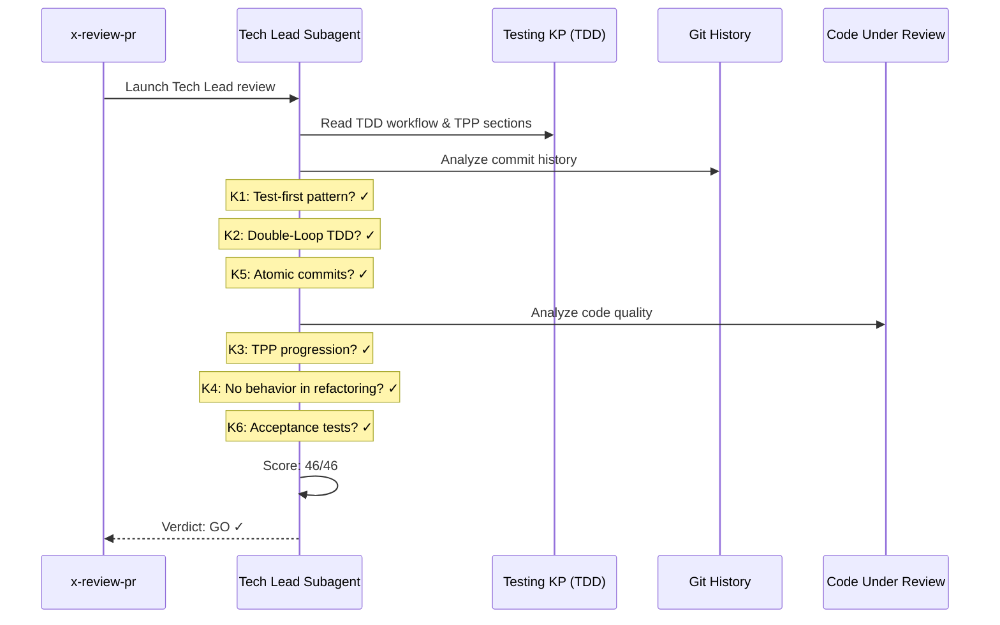

# História: x-review-pr — Critérios TDD no Rubric do Tech Lead

**ID:** story-0003-0016

## 1. Dependências

| Blocked By | Blocks |
| :--- | :--- |
| story-0003-0006, story-0003-0014 | — |

## 2. Regras Transversais Aplicáveis

| ID | Título |
| :--- | :--- |
| RULE-001 | Dual Copy Consistency |
| RULE-002 | Source of Truth é resources/ |
| RULE-003 | Backward Compatibility |
| RULE-005 | Red-Green-Refactor Cycle |
| RULE-007 | Double-Loop TDD |
| RULE-008 | Atomic TDD Commits |

## 3. Descrição

Como **Tech Lead**, eu quero que o skill x-review-pr inclua critérios TDD no rubric
de 40 pontos, garantindo que a review final antes do merge valide se o código
seguiu TDD corretamente (git history test-first, Double-Loop, TPP, refactoring).

O x-review-pr é o skill de review holística do Tech Lead com um rubric de 40 pontos
em 10 categorias (A-J). A mudança adiciona uma nova categoria ou expande categorias
existentes com critérios TDD.

### 3.1 Nova Categoria K — TDD Process (ou expansão de I — Tests)

Opção A — Nova categoria K:
- K1: Git history shows test-first pattern (commits)
- K2: Double-Loop TDD applied (acceptance test precedes unit tests)
- K3: TPP progression visible in test ordering
- K4: Refactoring phases don't add behavior
- K5: Atomic commits (one behavior per commit)
- K6: Acceptance tests validate end-to-end behavior

Opção B — Expandir categoria I (Tests) de 3 para 9 pontos:
- I4: Test-first commits
- I5: Double-Loop TDD
- I6: TPP ordering
- I7: Refactoring without behavior change
- I8: Atomic TDD commits
- I9: Acceptance tests

### 3.2 GO/NO-GO Update

A decisão GO/NO-GO deve considerar os novos critérios TDD:
- Se algum critério TDD tem score 0, resultado é NO-GO
- Critérios TDD têm o mesmo peso que critérios existentes

### 3.3 Tech Lead KP Reference

O Tech Lead já referencia múltiplos KPs. Adicionar instrução para ler seções TDD
do KP testing antes da review.

## 4. Definições de Qualidade Locais

### DoR Local (Definition of Ready)

- [ ] Agents com TDD workflow já implementados (story-0003-0006)
- [ ] x-dev-lifecycle com TDD phases já implementado (story-0003-0014)
- [ ] Skill x-review-pr atual lido e compreendido
- [ ] Tech Lead rubric de 40 pontos compreendido (categorias A-J)

### DoD Local (Definition of Done)

- [ ] Rubric contém 5-6 critérios TDD (nova categoria ou expansão)
- [ ] GO/NO-GO logic atualizada para incluir critérios TDD
- [ ] Tech Lead instrução referencia KP testing TDD sections
- [ ] Ambas as cópias atualizadas (RULE-001)
- [ ] Testes de golden file atualizados

### Global Definition of Done (DoD)

- **Cobertura:** ≥ 95% Line, ≥ 90% Branch
- **Testes Automatizados:** Golden file tests validando x-review-pr com TDD rubric
- **TDD Compliance:** Commits test-first
- **Documentação:** Skill atualizado em ambas as cópias
- **Backward Compatibility:** Rubric existente preservado, critérios TDD adicionais
- **Paralelismo:** N/A (single Tech Lead review)

## 5. Contratos de Dados (Data Contract)

**x-review-pr SKILL.md (seções modificadas):**

| Campo | Formato | Request | Response | Origem / Regra |
| :--- | :--- | :--- | :--- | :--- |
| TDD rubric items | Rubric items (5-6) | — | M | Test-first, Double-Loop, TPP, refactoring, atomicity |
| GO/NO-GO update | Decision logic | — | M | TDD items included in GO/NO-GO |
| KP reference instruction | Skill instruction | — | M | Read testing KP TDD sections |

**Updated rubric (example with new category K):**

| Campo | Formato | Request | Response | Origem / Regra |
| :--- | :--- | :--- | :--- | :--- |
| K. TDD Process (6 pts) | Rubric category | — | M | New category with 6 items |
| Total rubric | Points | — | M | 40 + 6 = 46 points |

## 6. Diagramas

### 6.1 Tech Lead Review with TDD Rubric



## 7. Critérios de Aceite (Gherkin)

```gherkin
Cenario: Rubric contém critérios TDD
  DADO que o x-review-pr foi atualizado
  QUANDO o rubric é inspecionado
  ENTÃO deve conter critérios sobre "test-first commits"
  E deve conter critérios sobre "Double-Loop TDD"
  E deve conter critérios sobre "TPP progression"
  E deve conter critérios sobre "refactoring without behavior"
  E deve conter critérios sobre "atomic TDD commits"

Cenario: GO/NO-GO considera critérios TDD
  DADO que o rubric contém critérios TDD
  QUANDO um critério TDD tem score 0
  ENTÃO o resultado deve ser NO-GO
  E o feedback deve indicar quais critérios TDD falharam

Cenario: Total de pontos atualizado
  DADO que o rubric original tem 40 pontos em 10 categorias
  QUANDO os critérios TDD são adicionados
  ENTÃO o total deve ser > 40 pontos
  E uma nova categoria TDD deve existir (ou categoria I expandida)

Cenario: Tech Lead referencia KP testing TDD
  DADO que o x-review-pr instrui o Tech Lead
  QUANDO as instruções são inspecionadas
  ENTÃO deve conter referência às seções TDD do KP testing
  E deve instruir a analisar git history para TDD compliance

Cenario: Rubric existente preservado
  DADO que o rubric original tem categorias A-J com 40 pontos
  QUANDO os critérios TDD são adicionados
  ENTÃO todas as 10 categorias originais devem permanecer
  E todos os 40 pontos originais devem permanecer
  E os critérios TDD devem ser adicionais

Cenario: Score TDD perfeito resulta em GO
  DADO que todos os critérios (originais + TDD) têm score máximo
  E não há issues pendentes
  QUANDO a decisão GO/NO-GO é computada
  ENTÃO o resultado deve ser GO
```

## 8. Sub-tarefas

- [ ] [Dev] Ler conteúdo atual de `resources/skills-templates/core/x-review-pr/SKILL.md`
- [ ] [Dev] Decidir entre nova categoria K ou expansão de I (Tests)
- [ ] [Dev] Adicionar 5-6 critérios TDD ao rubric
- [ ] [Dev] Atualizar GO/NO-GO logic para incluir critérios TDD
- [ ] [Dev] Adicionar instrução de referência ao KP testing TDD sections
- [ ] [Dev] Atualizar total de pontos na documentação
- [ ] [Dev] Replicar mudanças em `resources/github-skills-templates/` (RULE-001)
- [ ] [Test] Golden file: atualizar para refletir x-review-pr com TDD rubric
- [ ] [Test] Integração: validar que ia-dev-env gera x-review-pr com TDD critérios
