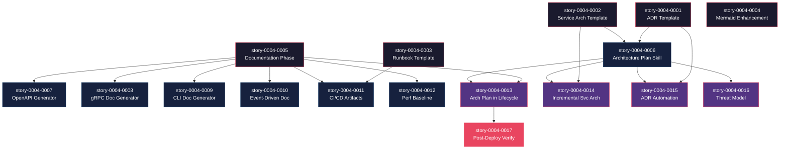

# Mapa de Implementação — Evolução do Feature Lifecycle

**Gerado a partir das dependências BlockedBy/Blocks de cada história do EPIC-0004.**

---

## 1. Matriz de Dependências

| Story | Título | Blocked By | Blocks | Status |
| :--- | :--- | :--- | :--- | :--- |
| story-0004-0001 | ADR Template & Estrutura `docs/adr/` | — | story-0004-0006, story-0004-0015 | Pendente |
| story-0004-0002 | Template de Documentação de Arquitetura de Serviço | — | story-0004-0006, story-0004-0014 | Pendente |
| story-0004-0003 | Template de Runbook de Deploy | — | story-0004-0011 | Pendente |
| story-0004-0004 | `x-story-create` — Diagramas Mermaid Obrigatórios | — | — | Pendente |
| story-0004-0005 | Fase de Documentação no `x-dev-lifecycle` | — | story-0004-0007, story-0004-0008, story-0004-0009, story-0004-0010, story-0004-0011, story-0004-0012, story-0004-0013 | Pendente |
| story-0004-0006 | Nova Skill `x-dev-architecture-plan` | story-0004-0001, story-0004-0002 | story-0004-0013, story-0004-0014, story-0004-0015, story-0004-0016 | Pendente |
| story-0004-0007 | Gerador de Documentação OpenAPI/Swagger (REST) | story-0004-0005 | — | Pendente |
| story-0004-0008 | Gerador de Documentação gRPC/Proto | story-0004-0005 | — | Pendente |
| story-0004-0009 | Gerador de Documentação CLI | story-0004-0005 | — | Pendente |
| story-0004-0010 | Gerador de Documentação Event-Driven/WebSocket | story-0004-0005 | — | Pendente |
| story-0004-0011 | Geração de Artefatos CI/CD no Lifecycle | story-0004-0003, story-0004-0005 | — | Pendente |
| story-0004-0012 | Performance Baseline Tracking | story-0004-0005 | — | Pendente |
| story-0004-0013 | Integração do Architecture Plan no Lifecycle Completo | story-0004-0005, story-0004-0006 | story-0004-0017 | Pendente |
| story-0004-0014 | Atualização Incremental do Service Architecture Doc | story-0004-0002, story-0004-0006 | — | Pendente |
| story-0004-0015 | ADR Automation — Geração e Indexação Automática | story-0004-0001, story-0004-0006 | — | Pendente |
| story-0004-0016 | Documentação de Security Threat Model | story-0004-0006 | — | Pendente |
| story-0004-0017 | Post-Deploy Verification Step | story-0004-0013 | — | Pendente |

> **Nota:** story-0004-0004 (Mermaid Enhancement) e story-0004-0012 (Performance Baseline) são histórias folha — não bloqueiam nenhuma outra. story-0004-0005 (Documentation Phase) é o maior fan-out node, bloqueando 7 histórias. story-0004-0006 (Architecture Plan) é o segundo maior, bloqueando 4 histórias.

---

## 2. Fases de Implementação

> As histórias são agrupadas em fases. Dentro de cada fase, as histórias podem ser implementadas **em paralelo**. Uma fase só pode iniciar quando todas as dependências das fases anteriores estiverem concluídas.

```
╔══════════════════════════════════════════════════════════════════════════════════════╗
║                         FASE 0 — Foundation (5 paralelas)                          ║
║                                                                                    ║
║  ┌──────────────┐  ┌──────────────┐  ┌──────────────┐  ┌──────────────┐  ┌───────┐║
║  │ story-0004   │  │ story-0004   │  │ story-0004   │  │ story-0004   │  │ 0004  │║
║  │ -0001        │  │ -0002        │  │ -0003        │  │ -0005        │  │ -0004 │║
║  │ ADR Template │  │ Service Arch │  │ Runbook Tmpl │  │ Doc Phase    │  │ Mermaid║
║  └──────┬───────┘  └──────┬───────┘  └──────┬───────┘  └──────┬───────┘  └───────┘║
╚═════════╪══════════════════╪══════════════════╪══════════════════╪═════════════════╝
          │                  │                  │                  │
          ▼                  ▼                  ▼                  ▼
╔══════════════════════════════════════════════════════════════════════════════════════╗
║                         FASE 1 — Core + Extensions (7 paralelas)                   ║
║                                                                                    ║
║  ┌──────────────────┐  ┌──────────┐  ┌──────────┐  ┌──────────┐  ┌──────────┐    ║
║  │ story-0004-0006  │  │ 0004     │  │ 0004     │  │ 0004     │  │ 0004     │    ║
║  │ Architecture     │  │ -0007    │  │ -0008    │  │ -0009    │  │ -0010    │    ║
║  │ Plan Skill       │  │ OpenAPI  │  │ gRPC Doc │  │ CLI Doc  │  │ Event Doc│    ║
║  │ (←0001,0002)     │  │ (←0005)  │  │ (←0005)  │  │ (←0005)  │  │ (←0005)  │    ║
║  └────────┬─────────┘  └──────────┘  └──────────┘  └──────────┘  └──────────┘    ║
║           │                                                                        ║
║  ┌──────────────────┐  ┌──────────────────┐                                       ║
║  │ story-0004-0011  │  │ story-0004-0012  │                                       ║
║  │ CI/CD Artifacts  │  │ Perf Baseline    │                                       ║
║  │ (←0003,0005)     │  │ (←0005)          │                                       ║
║  └──────────────────┘  └──────────────────┘                                       ║
╚═════════════════════════════════════════════════════════════════════════════════════╝
          │
          ▼
╔══════════════════════════════════════════════════════════════════════════════════════╗
║                      FASE 2 — Compositions + Cross-cutting (4 paralelas)           ║
║                                                                                    ║
║  ┌──────────────────┐  ┌──────────────────┐  ┌──────────────────┐  ┌────────────┐ ║
║  │ story-0004-0013  │  │ story-0004-0014  │  │ story-0004-0015  │  │ story-0004 │ ║
║  │ Arch Plan in     │  │ Incremental      │  │ ADR Automation   │  │ -0016      │ ║
║  │ Lifecycle        │  │ Service Arch     │  │ (←0001,0006)     │  │ Threat     │ ║
║  │ (←0005,0006)     │  │ (←0002,0006)     │  │                  │  │ Model      │ ║
║  └────────┬─────────┘  └──────────────────┘  └──────────────────┘  │ (←0006)    │ ║
║           │                                                         └────────────┘ ║
╚═══════════╪════════════════════════════════════════════════════════════════════════╝
            │
            ▼
╔══════════════════════════════════════════════════════════════════════════════════════╗
║                         FASE 3 — Final (1 história)                                ║
║                                                                                    ║
║  ┌──────────────────────────────────────────────────────────────┐                   ║
║  │ story-0004-0017  Post-Deploy Verification Step              │                   ║
║  │ (← story-0004-0013)                                        │                   ║
║  └──────────────────────────────────────────────────────────────┘                   ║
╚══════════════════════════════════════════════════════════════════════════════════════╝
```

---

## 3. Caminho Crítico

> O caminho crítico (a sequência mais longa de dependências) determina o tempo mínimo de implementação do projeto.

```
story-0004-0001 ─┐
                  ├──→ story-0004-0006 ──→ story-0004-0013 ──→ story-0004-0017
story-0004-0002 ─┘                         ↑
                        story-0004-0005 ───┘
     Fase 0                  Fase 1             Fase 2             Fase 3
```

**4 fases no caminho crítico, 4 histórias na cadeia mais longa (0001/0002 → 0006 → 0013 → 0017).**

Atraso em qualquer história do caminho crítico impacta diretamente o prazo final. A convergência
em story-0004-0013 (que depende tanto de 0005 quanto de 0006) é o ponto de maior risco — ambas
as dependências devem estar concluídas para iniciar a composição do lifecycle completo.

---

## 4. Grafo de Dependências (Mermaid)



---

## 5. Resumo por Fase

| Fase | Histórias | Camada | Paralelismo | Pré-requisito |
| :--- | :--- | :--- | :--- | :--- |
| 0 | 0001, 0002, 0003, 0004, 0005 | Foundation | 5 paralelas | — |
| 1 | 0006, 0007, 0008, 0009, 0010, 0011, 0012 | Core + Extensions | 7 paralelas | Fase 0 concluída |
| 2 | 0013, 0014, 0015, 0016 | Compositions + Cross-cutting | 4 paralelas | Fase 1 concluída |
| 3 | 0017 | Cross-cutting | 1 | Fase 2 (story-0004-0013) concluída |

**Total: 17 histórias em 4 fases.**

> **Nota:** Fase 1 tem o máximo de paralelismo (7 histórias) e é onde o investimento em equipe paralela traz maior retorno. story-0004-0004 (Mermaid Enhancement) na Fase 0 é uma história folha — pode ser implementada a qualquer momento sem impacto no caminho crítico.

---

## 6. Detalhamento por Fase

### Fase 0 — Foundation

| Story | Escopo Principal | Artefatos Chave |
| :--- | :--- | :--- |
| story-0004-0001 | Template ADR e estrutura `docs/adr/` | `_TEMPLATE-ADR.md`, `docs/adr/README.md` |
| story-0004-0002 | Template de documentação de arquitetura de serviço | `_TEMPLATE-SERVICE-ARCHITECTURE.md` |
| story-0004-0003 | Template de runbook de deploy | `_TEMPLATE-DEPLOY-RUNBOOK.md` |
| story-0004-0004 | Diagramas Mermaid obrigatórios no x-story-create | SKILL.md atualizado com matriz de obrigatoriedade |
| story-0004-0005 | Fase de documentação no x-dev-lifecycle | Nova Phase 3 no lifecycle, dispatch por interface |

**Entregas da Fase 0:**

- 3 novos templates em `resources/templates/`
- Skill `x-story-create` com regras de diagramas Mermaid
- Lifecycle expandido de 8 para 9 fases (0-8)
- Mecanismo de dispatch por interface no lifecycle

### Fase 1 — Core + Extensions

| Story | Escopo Principal | Artefatos Chave |
| :--- | :--- | :--- |
| story-0004-0006 | Nova skill `x-dev-architecture-plan` | SKILL.md com decision tree, KP list, subagent prompt |
| story-0004-0007 | Gerador OpenAPI/Swagger | Template/prompt para REST API docs |
| story-0004-0008 | Gerador gRPC/Proto | Template/prompt para gRPC docs |
| story-0004-0009 | Gerador CLI | Template/prompt para CLI docs |
| story-0004-0010 | Gerador Event-Driven/WebSocket | Template/prompt para event catalog |
| story-0004-0011 | Artefatos CI/CD | Templates de GitHub Actions, Dockerfile, K8s, smoke tests |
| story-0004-0012 | Performance baseline tracking | `_TEMPLATE-PERFORMANCE-BASELINE.md` |

**Entregas da Fase 1:**

- Nova skill invocável `/x-dev-architecture-plan`
- 4 geradores de documentação por interface (REST, gRPC, CLI, Event-Driven)
- Templates de CI/CD por stack
- Template de performance baseline

### Fase 2 — Compositions + Cross-cutting

| Story | Escopo Principal | Artefatos Chave |
| :--- | :--- | :--- |
| story-0004-0013 | Architecture plan integrado no lifecycle | Phase 1 do lifecycle modificada |
| story-0004-0014 | Atualização incremental do service architecture doc | Prompt de update incremental |
| story-0004-0015 | ADR automation (geração + indexação) | Conversão mini-ADR → ADR completo |
| story-0004-0016 | Threat model documentation | `_TEMPLATE-THREAT-MODEL.md`, STRIDE analysis |

**Entregas da Fase 2:**

- Lifecycle completo com architecture plan integrado
- Mecanismo de atualização incremental de docs de arquitetura
- Automação de ADRs com numeração e indexação
- Template e geração de threat model STRIDE-based

### Fase 3 — Final

| Story | Escopo Principal | Artefatos Chave |
| :--- | :--- | :--- |
| story-0004-0017 | Post-deploy verification step | Sub-passo de smoke tests na fase final |

**Entregas da Fase 3:**

- Lifecycle completo do planejamento à verificação pós-deploy
- Health check, critical path e SLO validation automatizados

---

## 7. Observações Estratégicas

### Gargalo Principal

**story-0004-0006 (Nova Skill `x-dev-architecture-plan`)** é o maior gargalo do projeto — bloqueia
4 histórias downstream (0013, 0014, 0015, 0016). Investir tempo extra na qualidade desta skill
compensa diretamente, pois um architecture plan robusto alimenta todas as automações subsequentes
(incremental updates, ADR automation, threat model). Recomendação: alocar o developer mais
experiente para esta story e fazer review intensivo antes de liberá-la.

**story-0004-0005 (Fase de Documentação)** é o segundo gargalo, bloqueando 7 histórias. Porém,
as 7 histórias que bloqueia são majoritariamente independentes entre si (geradores de interface),
então a Fase 1 tem alto paralelismo que absorve bem o risco.

### Histórias Folha (sem dependentes)

As seguintes histórias não bloqueiam nenhuma outra e podem absorver atrasos sem impacto no
caminho crítico:

- **story-0004-0004** — Mermaid Enhancement (independente, Fase 0)
- **story-0004-0007** — OpenAPI Generator (leaf, Fase 1)
- **story-0004-0008** — gRPC Doc Generator (leaf, Fase 1)
- **story-0004-0009** — CLI Doc Generator (leaf, Fase 1)
- **story-0004-0010** — Event-Driven Doc Generator (leaf, Fase 1)
- **story-0004-0011** — CI/CD Artifacts (leaf, Fase 1)
- **story-0004-0012** — Performance Baseline (leaf, Fase 1)
- **story-0004-0014** — Incremental Service Arch (leaf, Fase 2)
- **story-0004-0015** — ADR Automation (leaf, Fase 2)
- **story-0004-0016** — Threat Model (leaf, Fase 2)

**10 de 17 histórias são folhas** — excelente para paralelismo e absorção de risco.

### Otimização de Tempo

- **Fase 0**: Máximo paralelismo de 5, mas story-0004-0005 (Documentation Phase) é a mais complexa
  e deve começar primeiro. As 3 stories de template (0001-0003) são simples e podem ser concluídas
  rapidamente.
- **Fase 1**: Máximo paralelismo de 7 — ideal para equipes de 3-4 developers. Stories 0007-0010
  (geradores) seguem o mesmo padrão e podem ser distribuídas como "1 gerador por developer".
- **Fase 2**: 4 histórias paralelas, mas story-0004-0013 é a única no caminho crítico. As outras
  3 podem ser postergadas sem impacto.
- **Fase 3**: Única história, mas depende apenas de 0013. Pode começar imediatamente após.

### Dependências Cruzadas

**Ponto de convergência em story-0004-0013**: Esta história depende de dois ramos independentes
do grafo: story-0004-0005 (Documentation Phase, ramo do lifecycle) e story-0004-0006 (Architecture
Plan, ramo de templates). Ambos os ramos devem convergir antes de 0013 poder iniciar. Se um ramo
atrasa, o outro não compensa — é um ponto de sincronização obrigatório.

**story-0004-0006 como hub**: Depende de 2 stories de Fase 0 (0001, 0002) e bloqueia 4 de Fase 2
(0013-0016). Qualquer atraso em 0001 ou 0002 propaga diretamente para 4 stories downstream.

### Marco de Validação Arquitetural

**story-0004-0006 (`x-dev-architecture-plan`)** deve servir como checkpoint de validação. Ao
concluí-la, o time valida:

- **Patterns**: A skill lê KPs corretamente e gera output seguindo o template
- **Pipeline**: A integração skill → output → docs funciona end-to-end
- **Escalabilidade**: O padrão de skill + template + golden file test é replicável para novos tipos

Se story-0004-0006 funciona bem, as stories de Fase 2 (que estendem o mesmo padrão) terão
implementação significativamente mais rápida por reuso de patterns.
