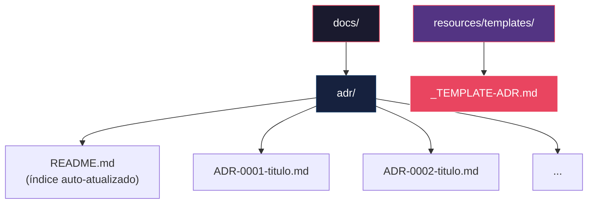

# História: ADR Template & Estrutura `docs/adr/`

**ID:** story-0004-0001

## 1. Dependências

| Blocked By | Blocks |
| :--- | :--- |
| — | story-0004-0006, story-0004-0015 |

## 2. Regras Transversais Aplicáveis

| ID | Título |
| :--- | :--- |
| RULE-001 | Dual Copy Consistency |
| RULE-002 | Source of Truth é resources/ |
| RULE-003 | Backward Compatibility |
| RULE-005 | Template-Based Artifacts |
| RULE-006 | ADR Sequential Numbering |
| RULE-009 | Documentation Output Convention |
| RULE-012 | Generated Content Language |

## 3. Descrição

Como **Architect**, eu quero um template padronizado de ADR (Architecture Decision Record) e uma
estrutura de diretórios `docs/adr/` gerada automaticamente pelo `ia-dev-env`, garantindo que
decisões arquiteturais sejam documentadas de forma consistente em todos os projetos.

Esta é uma story de fundação que estabelece a infraestrutura documental para ADRs. O template
segue o formato Nygard clássico (Status, Context, Decision, Consequences) adaptado com campos
adicionais para referência cruzada com stories e épicos. O `ia-dev-env` gerará a estrutura
`docs/adr/` com um `README.md` servindo como índice auto-atualizado de todos os ADRs.

A numeração sequencial `ADR-NNNN-titulo.md` a partir de 0001 garante unicidade e rastreabilidade.
O template inclui campos para status (Proposed, Accepted, Deprecated, Superseded), contexto,
decisão, consequências positivas/negativas, e referências cruzadas.

### 3.1 Template de ADR

- Formato: Markdown com frontmatter YAML (status, date, deciders, story-ref)
- Seções obrigatórias: Status, Context, Decision, Consequences (Positive, Negative, Neutral)
- Seção opcional: Related ADRs (links para ADRs superseded/related)
- Seção opcional: Story Reference (link para a story que motivou a decisão)
- Placeholder `{{PROJECT_NAME}}` para nome do projeto

### 3.2 Estrutura de Diretórios

- `docs/adr/README.md` — Índice de ADRs com tabela (ID, Título, Status, Data)
- `docs/adr/ADR-NNNN-titulo.md` — ADRs individuais
- O `ia-dev-env` gera a estrutura vazia com README template na inicialização do projeto

### 3.3 Convenção de Nomenclatura

- Formato: `ADR-NNNN-titulo-em-kebab-case.md`
- Numeração: sequencial a partir de 0001, sem pular números
- Título: descritivo em inglês (kebab-case no filename, title case no conteúdo)

## 4. Definições de Qualidade Locais

### DoR Local (Definition of Ready)

- [ ] Formato Nygard de ADR pesquisado e compreendido
- [ ] Estrutura de `resources/templates/` existente identificada
- [ ] Dual copy locations identificadas

### DoD Local (Definition of Done)

- [ ] Template `_TEMPLATE-ADR.md` criado em `resources/templates/`
- [ ] Geração de `docs/adr/README.md` implementada no pipeline do `ia-dev-env`
- [ ] Numeração sequencial funcional
- [ ] Ambas as cópias atualizadas (RULE-001)
- [ ] Golden file tests validando output

### Global Definition of Done (DoD)

- **Cobertura:** ≥ 95% Line, ≥ 90% Branch
- **Testes Automatizados:** Golden file tests validando geração de ADR template e README
- **TDD Compliance:** Commits test-first, refactoring explícito
- **Documentação:** Template e skill atualizados em ambas as cópias
- **Backward Compatibility:** Projetos existentes sem `docs/adr/` continuam funcionando

## 5. Contratos de Dados (Data Contract)

**_TEMPLATE-ADR.md (estrutura do template):**

| Campo | Formato | Request | Response | Origem / Regra |
| :--- | :--- | :--- | :--- | :--- |
| `status` | YAML frontmatter string | — | M | Enum: Proposed, Accepted, Deprecated, Superseded |
| `date` | YAML frontmatter ISO date | — | M | Data de criação do ADR |
| `deciders` | YAML frontmatter string list | — | M | Lista de responsáveis pela decisão |
| `story-ref` | YAML frontmatter string | — | O | ID da story relacionada (ex: story-0004-0006) |
| `## Status` | Markdown H2 section | — | M | Status atual com data de última mudança |
| `## Context` | Markdown H2 section | — | M | Contexto do problema e forças em jogo |
| `## Decision` | Markdown H2 section | — | M | Decisão tomada em formato assertivo |
| `## Consequences` | Markdown H2 section | — | M | Sub-seções: Positive, Negative, Neutral |
| `## Related ADRs` | Markdown H2 section | — | O | Links para ADRs relacionados |

**docs/adr/README.md (índice):**

| Campo | Formato | Request | Response | Origem / Regra |
| :--- | :--- | :--- | :--- | :--- |
| `# Architecture Decision Records` | Markdown H1 | — | M | Título fixo |
| Tabela de ADRs | Markdown table | — | M | Colunas: ID, Title, Status, Date |

## 6. Diagramas

### 6.1 Estrutura de Diretórios Gerada



## 7. Critérios de Aceite (Gherkin)

```gherkin
Cenario: Template ADR vazio gerado corretamente
  DADO que o ia-dev-env é executado para um novo projeto
  QUANDO a geração de templates é concluída
  ENTÃO o arquivo resources/templates/_TEMPLATE-ADR.md deve existir
  E deve conter as seções Status, Context, Decision, Consequences
  E deve conter frontmatter YAML com campos status, date, deciders

Cenario: Estrutura docs/adr/ gerada na inicialização
  DADO que o ia-dev-env é executado para um novo projeto
  QUANDO a geração de estrutura de diretórios é concluída
  ENTÃO o diretório docs/adr/ deve existir
  E o arquivo docs/adr/README.md deve existir
  E o README deve conter uma tabela vazia de ADRs com headers ID, Title, Status, Date

Cenario: Template ADR contém placeholder de projeto
  DADO que o template _TEMPLATE-ADR.md foi gerado
  QUANDO o conteúdo é inspecionado
  ENTÃO deve conter o placeholder {{PROJECT_NAME}}
  E deve conter seções para Related ADRs e Story Reference

Cenario: Numeração sequencial de ADRs
  DADO que existem ADRs ADR-0001 e ADR-0002 no diretório docs/adr/
  QUANDO um novo ADR é criado
  ENTÃO deve receber o número ADR-0003
  E nunca deve reutilizar os números 0001 ou 0002

Cenario: Template sem seções obrigatórias é rejeitado
  DADO que o template _TEMPLATE-ADR.md foi modificado removendo a seção "## Decision"
  QUANDO o golden file test é executado
  ENTÃO o teste deve falhar
  E a mensagem deve indicar a seção obrigatória ausente

Cenario: Backward compatibility com projetos sem ADR
  DADO que um projeto existente não possui o diretório docs/adr/
  QUANDO o ia-dev-env é re-executado nesse projeto
  ENTÃO o diretório docs/adr/ deve ser criado sem erros
  E nenhum artefato existente deve ser modificado ou removido
```

### 7.1 Scenario Ordering (TPP)

> Scenarios follow TPP order: degenerate (empty template) → unconditional (structure generation)
> → conditions (placeholders) → iterations (sequential numbering) → edge cases (missing sections, backward compat).

### 7.2 Mandatory Scenario Categories

- [x] Degenerate cases (empty template generation)
- [x] Happy path (structure generation, numbering)
- [x] Error paths (missing sections rejected)
- [x] Boundary values (backward compatibility)

## 8. Sub-tarefas

- [ ] [Dev] Criar template `resources/templates/_TEMPLATE-ADR.md` com frontmatter e seções obrigatórias
- [ ] [Dev] Implementar geração de `docs/adr/README.md` como índice de ADRs
- [ ] [Dev] Implementar lógica de numeração sequencial para novos ADRs
- [ ] [Dev] Replicar template em dual copy locations (RULE-001)
- [ ] [Test] Unitário: validar estrutura do template ADR (seções obrigatórias, frontmatter)
- [ ] [Test] Integração: golden file test para output de `docs/adr/` completo
- [ ] [Test] Integração: backward compatibility com projetos sem `docs/adr/`
- [ ] [Doc] Atualizar CHANGELOG com entrada para ADR support
